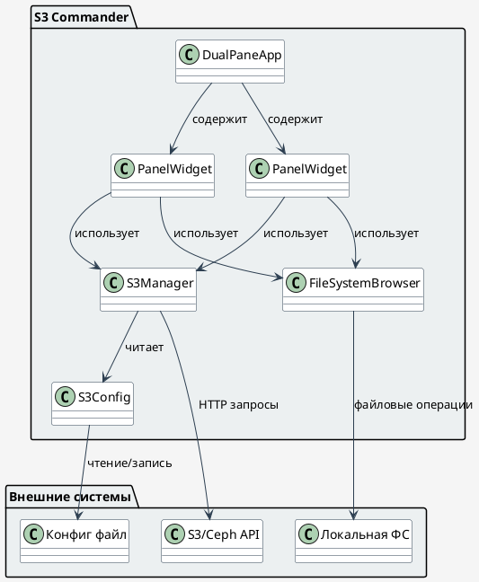
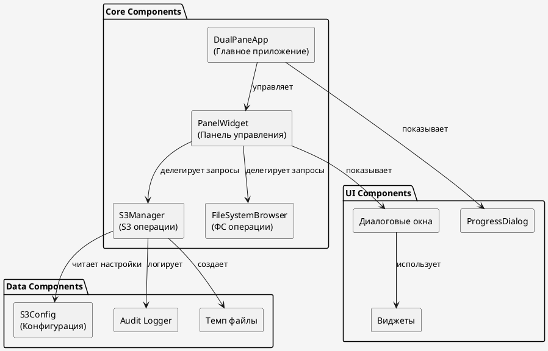
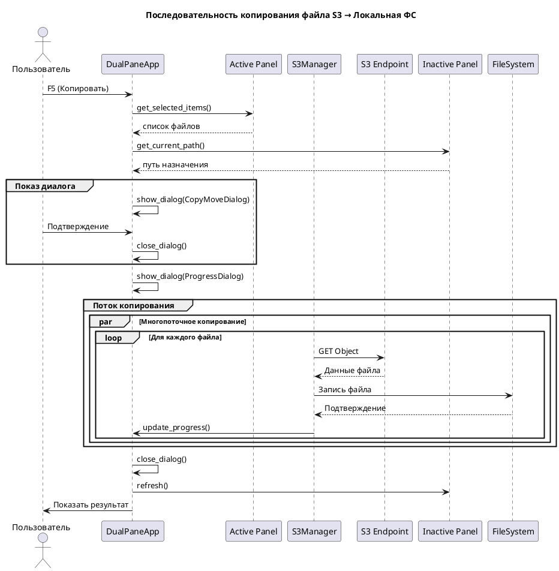

# 📁 S3 Commander - Документация

## 📋 Оглавление
1. [Общее описание](#общее-описание)
2. [Архитектура](#архитектура)
3. [Быстрый старт](#быстрый-старт)
4. [Конфигурация](#конфигурация)
5. [Управление](#управление)
6. [Разработка](#разработка)
7. [API Reference](#api-reference)
8. [Безопасность](#безопасность)

## 🚀 Общее описание

**S3 Commander** - двухпанельный файловый менеджер с поддержкой S3/Ceph хранилищ и локальной файловой системы. Аналог Midnight Commander для облачных хранилищ.

### ✨ Основные возможности

- **Двухпанельный интерфейс** - классический файловый менеджер
- **Поддержка множественных S3 endpoints** - работа с несколькими Ceph/RadosGW
- **Кросс-платформенность** - работает на Linux, Windows, macOS
- **TUI интерфейс** - текстовый UI на основе urwid
- **Полный набор операций**:
  - Копирование/перемещение между FS ↔ S3 ↔ S3
  - Удаление файлов и директорий
  - Создание бакетов и директорий
  - Просмотр файлов
  - Версионирование S3 объектов
  - Пакетные операции

### 📦 Технологический стек

- **Python 3.8+**
- **boto3** - работа с S3 API
- **urwid** - текстовый пользовательский интерфейс
- **JSON** - конфигурация

## 🏗️ Архитектура



### Компонентная диаграмма



### Диаграмма последовательностей (Копирование файла)



## 🚀 Быстрый старт

### Установка зависимостей

```bash
# Клонирование репозитория
git clone <repository-url>
cd s3-commander

# Установка зависимостей
pip install -r requirements.txt
# или
pip install boto3 urwid
```

### Базовый конфигурационный файл

Создайте файл `s3_config.json`:

```json
{
  "endpoints": [
    {
      "name": "Local Ceph",
      "url": "http://localhost:7480",
      "access_key": "your_access_key",
      "secret_key": "your_secret_key"
    },
    {
      "name": "Production Ceph",
      "url": "http://ceph-prod.example.com:7480",
      "access_key": "prod_access",
      "secret_key": "prod_secret"
    }
  ]
}
```

### Запуск приложения

```bash
# Запуск с дефолтным конфигом
python s3-commander.py

# Запуск с указанием конфига
python s3-commander.py --config /path/to/config.json

# Показать версию
python s3-commander.py --version
```

## ⚙️ Конфигурация

### Структура конфигурационного файла

```json
{
  "endpoints": [
    {
      "name": "Название подключения",
      "url": "http://hostname:port",
      "access_key": "S3_ACCESS_KEY",
      "secret_key": "S3_SECRET_KEY",
      "verify_ssl": false,        // опционально
      "region": "us-east-1",      // опционально
      "timeout": 30               // опционально
    }
  ],
  "ui": {                        // опционально
    "theme": "dark",            // light/dark
    "show_hidden": false,
    "sort_by": "name",
    "default_left": "fs",
    "default_right": "s3"
  }
}
```

### Переменные окружения

```bash
# Переопределение конфиг файла
export S3_COMMANDER_CONFIG=/path/to/config.json

# Отладка
export S3_COMMANDER_DEBUG=true
export S3_COMMANDER_LOG_LEVEL=DEBUG

# Прокси (если нужно)
export HTTPS_PROXY=http://proxy:8080
```

## 🎮 Управление

### Основные клавиши

| Клавиша | Действие | Описание |
|---------|----------|----------|
| **Tab** | Переключение панелей | Смена активной панели |
| **F3** | Просмотр файла | Открыть файл в просмотрщике |
| **F5** | Копировать | Копирование выделенного |
| **F6** | Переместить | Перемещение выделенного |
| **F7** | Создать директорию | Создать папку/бакет |
| **F8** | Удалить | Удалить выделенное |
| **F9** | Удалить старые версии | Удалить все кроме последней версии |
| **F10** | Сортировка | Изменить режим сортировки |
| **F11** | Версионирование | Включить/выключить версионирование |
| **Insert** | Выделить файл | Выделить/снять выделение файла |
| **+** | Выделить по шаблону | Выделить файлы по маске |
| **-** | Снять выделение | Снять выделение по маске |
| __*__ | Инвертировать выделение | Инвертировать текущее выделение |
| **Enter** | Открыть | Открыть папку/файл |
| **q** | Выход | Завершить работу |

### Навигация по интерфейсу

```
┌─────────────────────────────────────┐ ┌─────────────────────────────────────┐
│ [FS Mode] Sort: name                │ │ [S3 Mode - Local Ceph] Sort: name   │
│ FS: /home/user/documents           │ │ S3: /Local Ceph/photos/            │
├─────────────────────────────────────┤ ├─────────────────────────────────────┤
│  /..                               │ │  [..] Back to buckets              │
│  /projects                         │ │  /vacation2024                     │
│   report.pdf               1.2 MB  │ │   beach.jpg                4.5 MB  │
│   data.csv                15.7 KB  │ │   mountains.png           12.3 MB  │
│  /backups                          │ │  /work                            │
│                                    │ │   presentation.pptx       8.4 MB   │
│                                    │ │                                    │
└─────────────────────────────────────┘ └─────────────────────────────────────┘
F3:view | F5:copy | F6:move | F7:mkdir | F8:del | F9:del_old_ver | F10:sort | ...
Files copied: 5 | Total: 125 MB | Speed: 15.4 MB/s
```

### Режимы работы панелей

1. **Root Menu** - выбор источника данных
   ```
   [FS] Local File System
   [S3] Local Ceph          http://localhost:7480
   [S3] Production Ceph     http://ceph-prod:7480
   ```

2. **FS Mode** - локальная файловая система
   - Навигация по директориям
   - Операции с файлами

3. **S3 Mode** - работа с S3/Ceph
   - **Endpoint List** - выбор endpoint
   - **Bucket List** - список бакетов
   - **Bucket View** - содержимое бакета

### Особенности S3

- **Версионирование** - поддерживается просмотр и управление версиями
- **Префиксы** - аналогично директориям в S3
- **Метаданные** - отображение размера и даты изменения

## 🔧 Разработка

### Структура проекта

```
s3-commander/
├── s3-commander.py          # Основной файл
├── s3_config.json           # Конфигурация
├── README.md                # Документация
├── requirements.txt         # Зависимости
└── tests/                   # Тесты
    ├── test_s3_manager.py
    ├── test_fs_browser.py
    └── test_ui.py
```

### Ключевые классы

#### 1. **DualPaneApp** - главный класс приложения
```python
class DualPaneApp:
    """Основной класс приложения, управляет интерфейсом и панелями"""
    
    def run(self): ...              # Запуск главного цикла
    def handle_input(self, key): ... # Обработка клавиш
    def show_dialog(self, dialog): ... # Показ диалогов
```

#### 2. **PanelWidget** - панель управления
```python
class PanelWidget:
    """Представляет одну панель (левую/правую)"""
    
    def refresh(self): ...          # Обновление содержимого
    def on_item_activated(self): ... # Обработка выбора элемента
    def view_item(self): ...        # Просмотр файла
```

#### 3. **S3Manager** - работа с S3
```python
class S3Manager:
    """Управление соединением и операциями S3"""
    
    def list_buckets(self): ...     # Список бакетов
    def list_objects(self): ...     # Список объектов
    def upload_file(self): ...      # Загрузка файла
    def download_object(self): ...  # Скачивание объекта
```

#### 4. **FileSystemBrowser** - работа с локальной ФС
```python
class FileSystemBrowser:
    """Навигация по локальной файловой системе"""
    
    def list_directory(self): ...   # Список содержимого директории
    def list_all_files(self): ...   # Рекурсивный список файлов
```

### Добавление нового endpoint

1. Редактируем `s3_config.json`:
```json
{
  "endpoints": [
    {
      "name": "New Cluster",
      "url": "http://new-cluster:7480",
      "access_key": "new_key",
      "secret_key": "new_secret"
    }
  ]
}
```

2. Или программно:
```python
config = S3Config('s3_config.json')
config.endpoints.append({
    'name': 'New Cluster',
    'url': 'http://new-cluster:7480',
    'access_key': 'new_key',
    'secret_key': 'new_secret'
})
config.save_config()
```

### Создание нового диалога

```python
class CustomDialog(urwid.WidgetWrap):
    """Шаблон для создания диалогов"""
    
    def __init__(self, title, callback):
        self.callback = callback
        
        # Создание виджетов
        text = urwid.Text("Пример диалога")
        ok_button = urwid.Button("[ OK ]")
        cancel_button = urwid.Button("[ Cancel ]")
        
        urwid.connect_signal(ok_button, 'click', self.on_ok)
        urwid.connect_signal(cancel_button, 'click', self.on_cancel)
        
        # Компоновка
        pile = urwid.Pile([
            ('pack', text),
            ('pack', urwid.Divider()),
            ('pack', urwid.Columns([
                urwid.AttrMap(ok_button, 'button'),
                urwid.AttrMap(cancel_button, 'button')
            ]))
        ])
        
        super().__init__(urwid.LineBox(pile, title))
    
    def on_ok(self, button):
        self.callback(True)
    
    def on_cancel(self, button):
        self.callback(False)

# Использование
def my_callback(result):
    if result:
        print("Пользователь подтвердил")

dialog = CustomDialog("Мой диалог", my_callback)
app.show_dialog(dialog)
```

### Тестирование

```python
# Пример unit-теста
import unittest
from unittest.mock import Mock, patch

class TestS3Manager(unittest.TestCase):
    
    def setUp(self):
        self.config = {
            'name': 'test',
            'url': 'http://localhost:7480',
            'access_key': 'test',
            'secret_key': 'test'
        }
        self.manager = S3Manager(self.config)
    
    @patch('boto3.client')
    def test_list_buckets(self, mock_client):
        # Мокируем ответ S3
        mock_response = {'Buckets': [{'Name': 'test-bucket'}]}
        mock_client.return_value.list_buckets.return_value = mock_response
        
        buckets = self.manager.list_buckets()
        self.assertEqual(len(buckets), 1)
        self.assertEqual(buckets[0]['Name'], 'test-bucket')

# Запуск тестов
python -m pytest tests/
```

## 📚 API Reference

### S3Manager API

#### Подключение
```python
s3 = S3Manager(endpoint_config)
# endpoint_config = {
#   'name': '...',
#   'url': '...',
#   'access_key': '...',
#   'secret_key': '...'
# }
```

#### Основные методы

| Метод | Параметры | Возвращает | Описание |
|-------|-----------|------------|----------|
| `list_buckets()` | - | `List[Dict]` | Список бакетов |
| `create_bucket(name)` | `name: str` | `bool` | Создание бакета |
| `delete_bucket(name)` | `name: str` | `bool` | Удаление бакета |
| `list_objects(bucket, prefix)` | `bucket: str`, `prefix: str=''` | `(folders, files)` | Список объектов |
| `upload_file(local_path, bucket, key)` | `local_path`, `bucket`, `key` | `bool` | Загрузка файла |
| `download_object(bucket, key, local_path, version_id)` | `bucket`, `key`, `local_path`, `version_id=None` | `bool` | Скачивание объекта |
| `copy_object(src_bucket, src_key, dst_bucket, dst_key)` | `src_bucket`, `src_key`, `dst_bucket`, `dst_key` | `bool` | Копирование в S3 |
| `delete_object(bucket, key, version_id)` | `bucket`, `key`, `version_id=None` | `bool` | Удаление объекта |
| `list_object_versions(bucket, key)` | `bucket`, `key` | `List[Dict]` | Список версий |
| `delete_old_versions(bucket, key)` | `bucket`, `key` | `int` | Удалить старые версии |
| `enable_versioning(bucket)` | `bucket` | `bool` | Включить версионирование |
| `disable_versioning(bucket)` | `bucket` | `bool` | Выключить версионирование |
| `get_versioning_status(bucket)` | `bucket` | `str` | Статус версионирования |

### FileSystemBrowser API

```python
fs = FileSystemBrowser()
fs.current_path = "/home/user"  # Текущий путь
```

| Метод | Параметры | Возвращает | Описание |
|-------|-----------|------------|----------|
| `list_directory()` | - | `List[Dict]` | Содержимое текущей директории |
| `list_all_files(path)` | `path: str` | `List[Dict]` | Рекурсивный список файлов |
| `create_directory(name)` | `name: str` | `bool` | Создание директории |
| `file_exists(path)` | `path: str` | `Dict` or `None` | Проверка существования файла |

### PanelWidget API

| Метод | Описание |
|-------|----------|
| `refresh()` | Обновить содержимое панели |
| `get_selected_items()` | Получить выделенные элементы |
| `get_focused_item()` | Получить элемент в фокусе |
| `view_item()` | Просмотреть выделенный файл |
| `select_by_pattern(pattern, select=True)` | Выделить элементы по маске |
| `invert_selection()` | Инвертировать выделение |
| `show_sort_dialog()` | Показать диалог сортировки |

### Dialogs

| Диалог | Назначение | Параметры |
|--------|------------|-----------|
| `InputDialog` | Ввод текста | `title`, `prompt`, `callback` |
| `ConfirmDialog` | Подтверждение действия | `message`, `items_info`, `callback` |
| `CopyMoveDialog` | Копирование/перемещение | `title`, `source_desc`, `dest_path`, `callback` |
| `ProgressDialog` | Прогресс операции | `title`, `callback` |
| `OverwriteDialog` | Перезапись файла | `filename`, `source_info`, `dest_info`, `callback` |
| `SortDialog` | Выбор сортировки | `current_mode`, `callback` |
| `VersionSelectDialog` | Выбор версии | `file_data`, `versions`, `callback` |
| `FileViewerDialog` | Просмотр файла | `title`, `content`, `callback` |

## 🔐 Безопасность

### Меры безопасности

1. **Проверка путей** - защита от path traversal
2. **Таймауты соединений** - предотвращение зависаний
3. **Ограниченные права** - использование пользовательских ключей

### Рекомендации по безопасному использованию

1. **Хранение секретов**:
   ```bash
   # Используйте переменные окружения
   export S3_ACCESS_KEY="xxx"
   export S3_SECRET_KEY="yyy"
   
   # Или менеджеры паролей
   ```

2. **Минимальные права**:
   ```json
   // Используйте ключи с ограниченными правами
   {
     "Policy": {
       "Version": "2012-10-17",
       "Statement": [
         {
           "Effect": "Allow",
           "Action": [
             "s3:ListBucket",
             "s3:GetObject",
             "s3:PutObject"
           ],
           "Resource": [
             "arn:aws:s3:::specific-bucket/*"
           ]
         }
       ]
     }
   }
   ```

3. **Аудит**:
   ```bash
   # Включите логирование операций
   python s3-commander.py 2>&1 | tee operations.log
   ```

### Ограничения

- **Нет шифрования конфигурации** - ключи хранятся в plain text
- **Нет многофакторной аутентификации**
- **Нет контроля сессий**

## 🐛 Отладка и устранение неполадок

### Распространенные проблемы

1. **Не удается подключиться к S3**:
   ```bash
   # Проверьте доступность endpoint
   curl http://localhost:7480
   
   # Проверьте ключи доступа
   aws s3 ls --endpoint-url http://localhost:7480
   ```

2. **Медленная работа**:
   ```python
   # Увеличьте таймауты в конфиге
   {
     "timeout": 60,
     "max_retries": 3
   }
   ```

3. **Проблемы с кодировкой**:
   ```python
   # Установите кодировку UTF-8
   export PYTHONUTF8=1
   export LANG=en_US.UTF-8
   ```

### Логирование

```python
# Включение отладки
import logging
logging.basicConfig(level=logging.DEBUG)

# Логирование boto3
import boto3
boto3.set_stream_logger('', logging.DEBUG)
```

## 📈 Производительность

### Оптимизация для больших наборов данных

1. **Пагинация** - автоматическая загрузка по страницам
2. **Кэширование** - кэш списков файлов
3. **Потоковая передача** - работа с большими файлами
4. **Параллельные операции** - многопоточное копирование

### Лимиты

- **Максимальный размер файла**: ограничения S3/ФС
- **Количество объектов**: поддерживает пагинацию
- **Память**: зависит от размера метаданных

## 🤝 Вклад в развитие

### Code Style

```python
# PEP 8 с некоторыми исключениями
class S3Manager:
    """Документация класса"""
    
    def method_name(self, param_name):
        """Документация метода"""
        # Комментарии на русском
        # Отступы: 4 пробела
        # Максимальная длина строки: 100 символов
        pass
```

### Процесс разработки

1. **Fork репозитория**
2. **Создание ветки**:
   ```bash
   git checkout -b feature/new-feature
   ```
3. **Тестирование**:
   ```bash
   python -m pytest tests/
   python s3-commander.py  # Ручное тестирование
   ```
4. **Коммит**:
   ```bash
   git commit -m "feat: добавить новую функцию"
   ```
5. **Pull Request**

### Принципы разработки

- **Обратная совместимость** - не ломать существующий функционал
- **Модульность** - разделение ответственности
- **Тестируемость** - покрытие тестами критического функционала
- **Документация** - обновление документации вместе с кодом

## 📄 Лицензия

Проект распространяется под лицензией MIT.

## 📞 Поддержка

### Каналы связи

- **Issues**: GitHub Issues
- **Документация**: Этот файл
- **Примеры**: Папка `examples/`

### Сообщество

- Делитесь конфигурациями
- Сообщайте о багах
- Предлагайте новые функции

---

*Последнее обновление: {дата}*  
*Версия: {версия}*  
*Автор: {автор}*