# Документация S3 Commander

## Содержание

1. [Пользовательская документация](#user-docs)
   - Введение и возможности
   - Установка и настройка
   - Интерфейс и навигация
   - Основные операции
   - Сценарии использования
   - FAQ и решение проблем

2. [Документация для разработчиков](#dev-docs)
   - Архитектура приложения
   - Структура кода
   - Ключевые компоненты
   - Расширение функционала
   - API и интеграции

---

<a name="user-docs"></a>
# ЧАСТЬ 1: Документация для пользователей

## 1. Введение

**S3 Commander** — это двухпанельный файловый менеджер в стиле Midnight Commander для работы с локальной файловой системой и S3-совместимыми хранилищами (Ceph, MinIO, AWS S3).

### Ключевые возможности

- ✅ **Двухпанельный интерфейс** — одновременная работа с двумя источниками
- ✅ **Поддержка множественных S3 endpoints** — работа с несколькими кластерами Ceph/MinIO
- ✅ **Управление версиями объектов** — просмотр, копирование, удаление версий
- ✅ **Быстрая навигация** — поддержка горячих клавиш в стиле MC
- ✅ **Пакетные операции** — выделение и обработка множества файлов
- ✅ **Прогресс операций** — визуализация копирования/перемещения/удаления
- ✅ **Гибкая сортировка** — по имени, размеру, времени, расширению
- ✅ **Ленивая загрузка** — работа с большими каталогами (>10000 объектов)
- ✅ **Детальная информация** — полные метаданные файлов и бакетов

---

## 2. Установка и настройка

### Системные требования

- Python 3.7+
- Библиотеки: `urwid`, `boto3`
- Terminal с поддержкой 256 цветов и UTF-8

### Установка

```bash
# Установка зависимостей
pip install urwid boto3

# Запуск приложения
python s3-commander.py
```

### Конфигурация S3 endpoints

При первом запуске создается файл `s3_config.json`:

```json
{
  "endpoints": [
    {
      "name": "Local Ceph",
      "url": "http://localhost:7480",
      "access_key": "s3access",
      "secret_key": "s3secret"
    },
    {
      "name": "Production MinIO",
      "url": "https://minio.company.com:9000",
      "access_key": "admin",
      "secret_key": "password123"
    }
  ]
}
```

**Параметры:**
- `name` — отображаемое имя endpoint
- `url` — адрес S3-сервиса
- `access_key` — ключ доступа
- `secret_key` — секретный ключ

---

## 3. Интерфейс и навигация

### Mind Map: Структура интерфейса

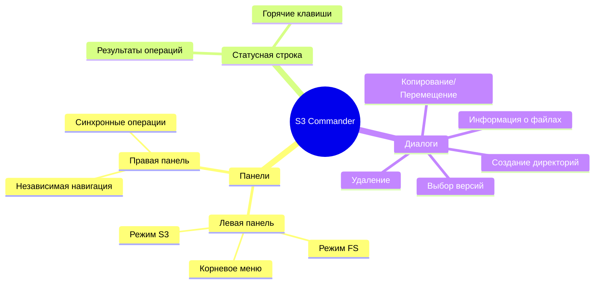

### Основные элементы

```
┌─────────────────────────────────────────────────────────────────────────┐
│                         [Left Panel]                                     │
│  FS: /home/user/documents                     [150 dirs, 342 files]     │
├─────────────────────────────────────────────────────────────────────────┤
│  /..                                                                     │
│  /Projects                                 2024-01-15 10:30             │
│   report.pdf              2.5 MB          2024-01-15 14:22             │
│   data.csv                145 KB          2024-01-14 09:15             │
│                                                                          │
└─────────────────────────────────────────────────────────────────────────┘

┌─────────────────────────────────────────────────────────────────────────┐
│                        [Right Panel]                                     │
│  S3: /Production/backup-bucket/              [23 folders, 1205 files]   │
├─────────────────────────────────────────────────────────────────────────┤
│  [..] Back to buckets                                                   │
│  /logs                                     2024-01-15 08:00             │
│   backup_20240115.tar.gz  5.2 GB          2024-01-15 23:00 [3]        │
│   config.json             2.1 KB          2024-01-14 18:45             │
│                                                                          │
└─────────────────────────────────────────────────────────────────────────┘

 Result: Loaded: 23 folders, 1205 files (sorted by name)
 F3:view│F5:copy│F6:move│F7:mkdir│F8:del│F9:del_old_ver│F10:sort│F11:versioning│INS:sel│q:quit
```

### Индикаторы и обозначения

| Символ | Значение |
|--------|----------|
| `/filename` | Директория/папка |
| `filename` | Обычный файл |
| `*filename` | Выделенный элемент |
| `[3]` | Количество версий (только для файлов с версионированием) |
| `[V]` | Бакет с включенным версионированием |
| `[S]` | Бакет с приостановленным версионированием |

---

## 4. Горячие клавиши

### Навигация

| Клавиша | Действие |
|---------|----------|
| `↑` `↓` | Перемещение по списку |
| `Enter` | Открыть директорию/бакет/просмотр файла |
| `Tab` | Переключение между панелями |
| `Backspace` | Вернуться на уровень вверх |

### Операции с файлами

| Клавиша | Действие |
|---------|----------|
| `F3` | Просмотр файла |
| `F4` | Детальная информация |
| `F5` | Копировать в другую панель |
| `F6` | Переместить в другую панель |
| `F7` | Создать директорию/бакет |
| `F8` | Удалить выделенные элементы |
| `F9` | Удалить старые версии |
| `F10` | Настройка сортировки |
| `F11` | Включить/отключить версионирование |

### Выделение файлов

| Клавиша | Действие |
|---------|----------|
| `Insert` или `Space` | Выделить текущий файл |
| `+` | Выделить по маске (glob pattern) |
| `-` | Снять выделение по маске |
| `*` | Инвертировать выделение |

### Общие

| Клавиша | Действие |
|---------|----------|
| `q` или `Q` | Выход из приложения |
| `Esc` | Закрыть диалог/отменить операцию |

---

## 5. Основные операции

### 5.1 Навигация по источникам

#### Диаграмма: Иерархия навигации

```mermaid
graph TD
    A[Корневое меню] --> B[Локальная ФС]
    A --> C[S3 Endpoint 1]
    A --> D[S3 Endpoint 2]
    
    B --> E[/home/user]
    E --> F[Файлы и папки]
    
    C --> G[Список бакетов]
    G --> H[backup-bucket]
    H --> I[Префиксы и объекты]
    
    D --> J[Список бакетов]
    
    style A fill:#e1f5ff
    style B fill:#fff4e1
    style C fill:#e8f5e9
    style D fill:#e8f5e9
```

**Шаги:**

1. **Запуск приложения** → Корневое меню с выбором источника
2. **Выбор [FS]** → Навигация по локальной файловой системе
3. **Выбор [S3] Endpoint** → Список бакетов выбранного кластера
4. **Вход в бакет** → Просмотр объектов и префиксов

### 5.2 Копирование файлов

#### Сценарий: FS → S3

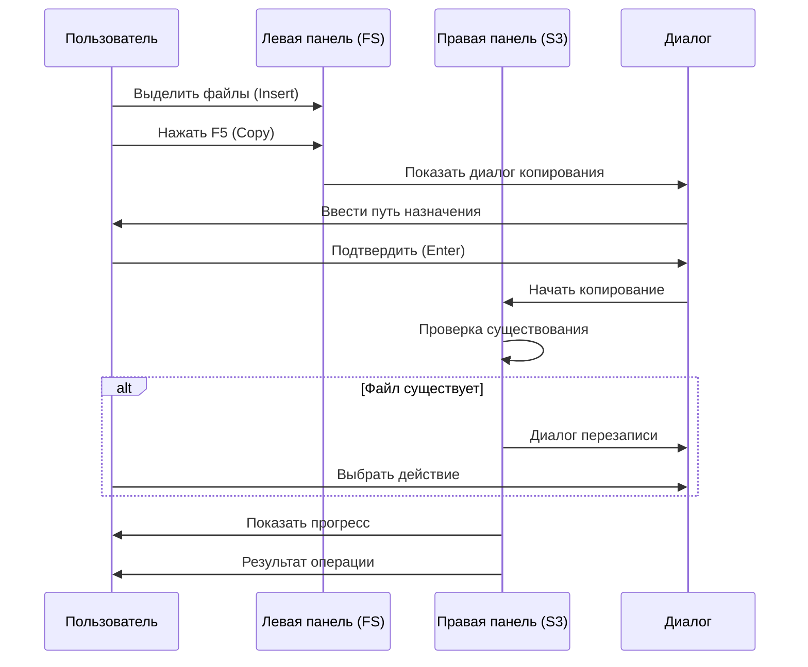

**Пошаговая инструкция:**

1. В левой панели выберите локальную директорию
2. Выделите файлы клавишей `Insert` или `+` (по маске)
3. В правой панели перейдите в нужный S3 бакет
4. Нажмите `F5` для копирования
5. В диалоге отредактируйте путь назначения (опционально)
6. Нажмите `Enter` для начала копирования
7. При конфликтах выберите действие:
   - **Overwrite** — перезаписать текущий файл
   - **All** — перезаписать все конфликтующие файлы
   - **New Version** — создать новую версию (если версионирование включено)
   - **Version All** — создавать версии для всех конфликтов
   - **Skip** — пропустить файл
   - **Skip All** — пропустить все конфликты

### 5.3 Работа с версиями

#### Диаграмма: Управление версиями

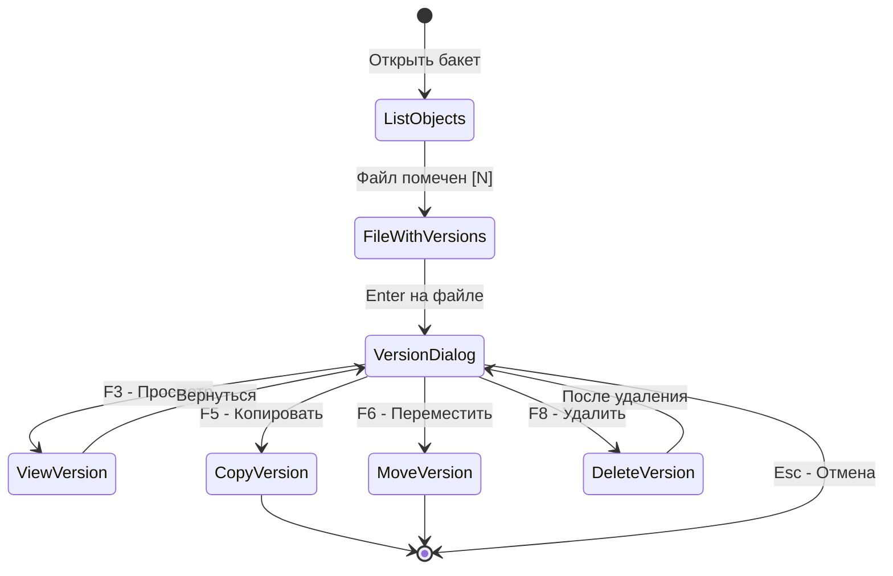

**Действия:**

1. **Просмотр версий:**
   - Файлы с несколькими версиями помечены `[N]` (где N — количество)
   - Нажмите `Enter` на таком файле
   - Откроется диалог со списком версий

2. **Операции с версией:**
   - Выберите версию стрелками
   - `F3` — просмотр содержимого конкретной версии
   - `F5` — копировать эту версию
   - `F6` — переместить эту версию
   - `F8` — удалить конкретную версию

3. **Массовое удаление старых версий:**
   - Выделите файлы с версиями
   - Нажмите `F9`
   - Подтвердите удаление
   - Останется только последняя (Latest) версия каждого файла

### 5.4 Управление версионированием бакета

**Включение версионирования:**

1. Перейдите в список бакетов (S3 panel)
2. Выделите нужный бакет
3. Нажмите `F11`
4. Подтвердите включение
5. Бакет будет помечен `[V]`

**Отключение (приостановка):**

1. На бакете с `[V]` нажмите `F11`
2. Подтвердите приостановку
3. Статус изменится на `[S]` (Suspended)
4. Существующие версии сохраняются, новые не создаются

---

## 6. Сценарии использования (Use Cases)

### Use Case 1: Резервное копирование рабочих файлов

**Цель:** Ежедневное копирование документов с рабочей станции в S3 для резервного хранения

**Участники:**
- Системный администратор
- S3 Ceph кластер

**Предусловия:**
- Настроен endpoint S3 в конфигурации
- Создан бакет `daily-backups` с версионированием

**Основной сценарий:**

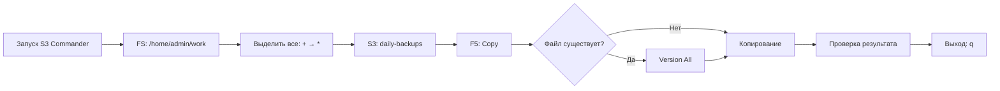

**Шаги:**

1. Запустить `python s3-commander.py`
2. Левая панель: выбрать `[FS] Local File System`
3. Перейти в `/home/admin/work`
4. Нажать `+`, ввести `*`, Enter (выделить все)
5. Tab → правая панель
6. Выбрать `[S3] Production Ceph`
7. Войти в бакет `daily-backups`
8. Нажать `F5` (Copy)
9. В диалоге выбрать **Version All** для автоматического создания версий
10. Дождаться завершения (прогресс отображается в диалоге)
11. Проверить статусную строку: `Copied: 150 files, Speed: 25.3 MB/s`

**Результат:** Все файлы скопированы в S3 с сохранением версий для существующих объектов

---

### Use Case 2: Восстановление случайно удаленного файла

**Цель:** Восстановить предыдущую версию файла, который был случайно перезаписан

**Участники:**
- Пользователь
- S3 бакет с версионированием

**Предусловия:**
- Версионирование включено на бакете
- Файл имеет несколько версий

**Основной сценарий:**

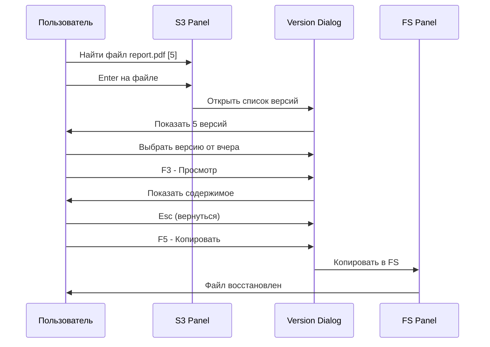

**Шаги:**

1. Правая панель: перейти в S3 бакет с файлом
2. Найти файл `report.pdf` (помечен `[5]` — 5 версий)
3. Нажать `Enter` на файле
4. В диалоге версий выбрать нужную (по дате/времени)
5. Нажать `F3` для предварительного просмотра
6. Если версия правильная, нажать `F5`
7. Левая панель переключается на FS
8. Ввести путь: `/home/user/restored/report.pdf`
9. Enter — файл восстановлен

---

### Use Case 3: Миграция данных между S3 кластерами

**Цель:** Перенести большой бакет (>10000 объектов) с тестового Ceph на production MinIO

**Участники:**
- DevOps инженер
- Два S3 endpoint (source и target)

**Предусловия:**
- Оба endpoint настроены в конфигурации
- Достаточно места на целевом кластере

**Основной сценарий:**

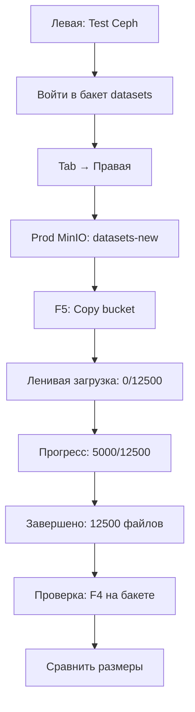

**Шаги:**

1. Левая панель: выбрать `[S3] Test Ceph`
2. Войти в бакет `datasets` (будет показано `Loading...`)
3. Дождаться загрузки списка (ленивая загрузка по 1000 объектов)
4. Tab → правая панель
5. Выбрать `[S3] Production MinIO`
6. Войти в бакет `datasets-new`
7. Tab → вернуться в левую панель
8. Выделить весь бакет (Enter на `[..]` → выделить бакет в списке)
9. F5 → Copy
10. Ввести целевой путь: `` (пустой для корня)
11. Дождаться завершения (статус обновляется в реальном времени)
12. Проверить: нажать `F4` на исходном и целевом бакетах
13. Сравнить количество объектов и общий размер

**Особенности:**
- Ленивая загрузка позволяет работать с большими каталогами без задержек
- Прогресс показывает скорость передачи и ETA
- При ошибках операция продолжается, неудачные файлы считаются отдельно

---

### Use Case 4: Очистка старых резервных копий

**Цель:** Удалить старые версии всех файлов в бакете для освобождения места

**Участники:**
- Администратор хранилища
- S3 бакет с множественными версиями

**Основной сценарий:**

1. Перейти в бакет `backups`
2. Нажать `+`, ввести `*.tar.gz` (выделить все архивы)
3. Нажать `F9` (Delete Old Versions)
4. Подтвердить операцию в диалоге
5. Дождаться завершения
6. Проверить: маркеры версий `[N]` должны исчезнуть

**Результат:** 
- Освобождено место за счет удаления старых версий
- Актуальные (Latest) версии сохранены
- Статус: `Deleted old versions: 347, Failed: 2`

---

### Use Case 5: Настройка сортировки для анализа

**Цель:** Найти самые большие файлы в бакете для оптимизации хранения

**Шаги:**

1. Войти в нужный бакет
2. Нажать `F10` (Sort)
3. Выбрать `Size` + `Reverse order` ☑
4. OK → файлы отсортированы по убыванию размера
5. Анализировать верхние строки (самые большие файлы)
6. По необходимости: `F4` для детальной информации о файле

---

## 7. Детальная информация (F4)

### Для файлов S3

При нажатии `F4` на S3-объекте отображается:

```
┌─ Object Info: backup.tar.gz ────────────────────────────────────┐
│                                                                   │
│ Name:        backup.tar.gz                                       │
│ Bucket:      daily-backups                                       │
│ Key:         2024/01/backup.tar.gz                              │
│ S3 URI:      s3://daily-backups/2024/01/backup.tar.gz          │
│ Size:        5.2 GB (5589934592)                                │
│ Last Mod:    2024-01-15 23:00:15                                │
│ MIME Type:   application/x-tar                                   │
│ Storage:     STANDARD                                            │
│ ETag:        d41d8cd98f00b204e9800998ecf8427e                    │
│                                                                   │
│ ─────────── Web Headers ────────────                            │
│ Cache-Control:    max-age=3600                                   │
│                                                                   │
│ ─────────── Security ────────────                               │
│ Encryption:  AES256                                              │
│                                                                   │
│ ─────────── Versions ────────────                               │
│ Count:       3                                                   │
│ v1:          a1b2c3d4   01-15 23:00  5.2 GB *                   │
│ v2:          e5f6g7h8   01-14 23:00  5.1 GB                     │
│ v3:          i9j0k1l2   01-13 23:00  4.9 GB                     │
│                                                                   │
│ ─────────── Permissions ────────────                            │
│ Owner:       admin (12345...)                                    │
│ ACL:         AllUsers:READ, Owner:FULL_CONTROL                  │
│                                                                   │
│ Presigned URL (1h):                                             │
│ https://ceph.local/daily-backups/2024/01/backup.tar.gz?...      │
│                                                                   │
│                        [ OK ]                                    │
└──────────────────────────────────────────────────────────────────┘
```

### Для бакетов

```
┌─ Bucket Info: daily-backups ─────────────────────────────────────┐
│                                                                    │
│ Name:           daily-backups                                     │
│ Region:         us-east-1                                         │
│ Versioning:     Enabled                                           │
│ Default Enc:    AES256                                            │
│ Lifecycle:      2 rule(s) configured                             │
│ CORS:           None                                              │
│                                                                    │
│ ─────────── Access ────────────                                  │
│ Owner:          admin                                             │
│ Payer:          BucketOwner                                       │
│                                                                    │
│                        [ OK ]                                     │
└───────────────────────────────────────────────────────────────────┘
```

---

## 8. FAQ и решение проблем

### Q: Почему S3 панель показывает "Connection failed"?

**A:** Возможные причины:

1. **Неправильные учетные данные**
   - Проверьте `s3_config.json`
   - Убедитесь, что `access_key` и `secret_key` верны

2. **Недоступен endpoint**
   - Проверьте URL (протокол http/https, порт)
   - Проверьте сетевую доступность: `ping <host>`
   - Проверьте firewall/iptables

3. **Истекший таймаут**
   - В коде установлены короткие таймауты (3 сек)
   - Если сеть медленная, может потребоваться увеличение в `S3Manager.__init__`

### Q: Как работать с бакетами >10000 объектов?

**A:** S3 Commander автоматически использует ленивую загрузку:

- При входе в большой бакет показывается `Loading...`
- Объекты загружаются порциями по 1000
- Интерфейс обновляется в реальном времени
- Для бакетов >1000 объектов сортировка автоматически отключается (режим `none`)
- Вы можете включить сортировку вручную (`F10`), но это замедлит загрузку

### Q: Файлы копируются медленно, как ускорить?

**A:** Несколько советов:

1. **Проверьте сеть** — bandwidth между машиной и S3
2. **Множественные мелкие файлы** — медленнее из-за overhead (HTTP запросы)
3. **Версионирование** — при включенном версионировании проверяется существование файлов (дополнительные запросы)
4. **Используйте локальную сеть** — если возможно, копируйте внутри локальной сети
5. **Не используйте VPN** — VPN замедляет трафик

### Q: Как восстановить файл, если версионирование не было включено?

**A:** К сожалению, без версионирования восстановление невозможно:

- S3 не хранит историю без явного включения версионирования
- Версионирование нужно включать **до** возникновения проблемы
- **Рекомендация:** включите версионирование на всех критичных бакетах

### Q: Можно ли редактировать файлы прямо в S3 Commander?

**A:** Нет, S3 Commander — это файловый менеджер, а не редактор:

- `F3` — только просмотр содержимого (read-only)
- Для редактирования: скопируйте файл в FS (`F5`), отредактируйте, загрузите обратно

### Q: Как удалить бакет полностью?

**A:** Шаги:

1. Войти в бакет
2. Выделить все объекты: `+` → `*` → Enter
3. `F8` — удалить все объекты
4. Вернуться в список бакетов: `Backspace`
5. Выделить бакет
6. `F8` — удалить пустой бакет

**Внимание:** Ceph/S3 не позволяет удалить непустой бакет!

### Q: Почему некоторые файлы помечены `[3]`, а другие нет?

**A:** Маркер `[N]` показывается только для файлов с **множественными версиями** (N > 1):

- Если файл имеет 1 версию — маркер не отображается
- `[3]` означает 3 версии (Latest + 2 старые)
- Это сделано для уменьшения визуального шума

### Q: Можно ли работать с AWS S3?

**A:** Да, S3 Commander совместим с AWS S3:

1. Добавьте endpoint в `s3_config.json`:
```json
{
  "name": "AWS S3 US-East",
  "url": "https://s3.us-east-1.amazonaws.com",
  "access_key": "AKIA...",
  "secret_key": "..."
}
```

2. **Важно:** AWS S3 тарифицирует запросы (LIST, GET, PUT)
3. Ленивая загрузка минимизирует запросы, но всё равно учитывайте стоимость

---

## 9. Mind Map: Полная структура функционала

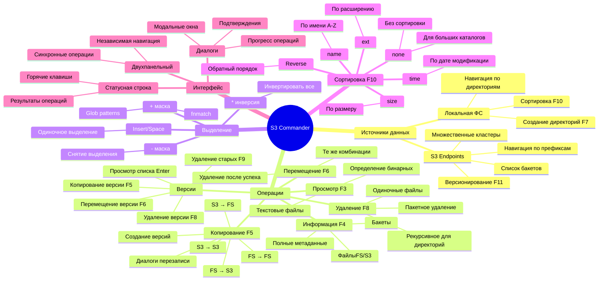

---

## 10. Лучшие практики

### ✅ DO (Рекомендуется)

1. **Включайте версионирование** на критичных бакетах **до** начала работы
2. **Используйте маски** (`+` → `*.log`) для выделения групп файлов
3. **Проверяйте детали** (`F4`) перед удалением важных объектов
4. **Сортируйте по размеру** для поиска больших файлов перед очисткой
5. **Используйте "Version All"** при регулярном копировании для истории изменений
6. **Проверяйте статусную строку** после операций для подтверждения успеха
7. **Настраивайте множественные endpoints** для быстрого переключения между средами

### ❌ DON'T (Не рекомендуется)

1. **Не удаляйте файлы** без проверки версий (`Enter` → список версий)
2. **Не используйте "Overwrite All"** бездумно — можно потерять данные
3. **Не держите терминал слишком узким** (<80 символов) — интерфейс сломается
4. **Не запускайте длительные операции** без мониторинга — проверяйте прогресс
5. **Не копируйте миллионы мелких файлов** одной операцией — разбейте на части
6. **Не храните секреты** в `s3_config.json` на общих машинах — используйте права доступа `chmod 600`

---

## 11. Диаграмма: Полный workflow типичной сессии

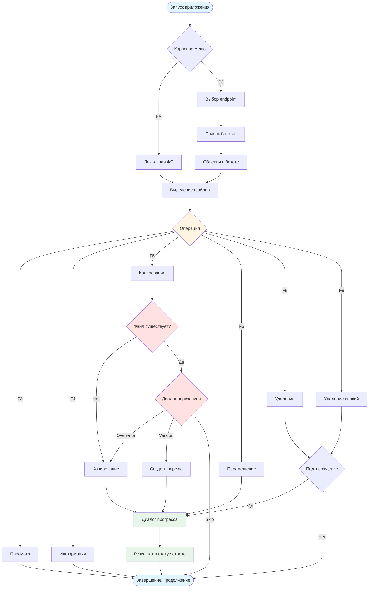

---

<a name="dev-docs"></a>
# ЧАСТЬ 2: Документация для разработчиков

## 1. Архитектура приложения

### High-Level Architecture

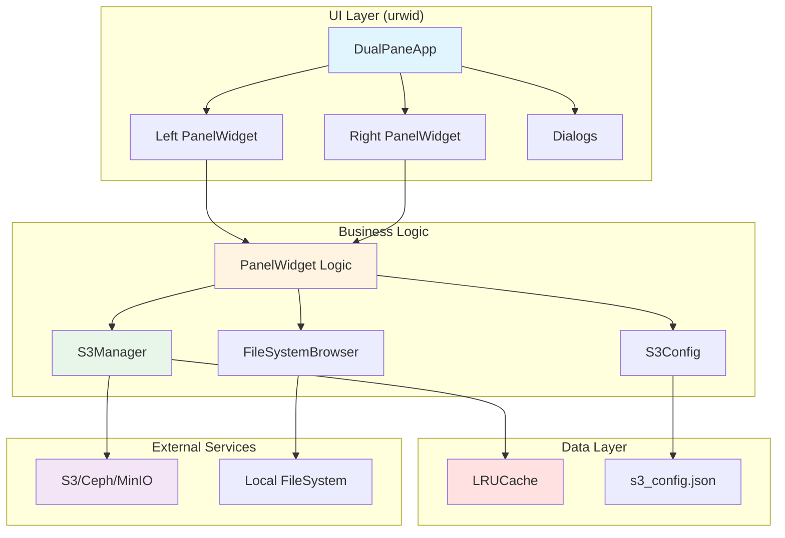

### Основные компоненты

| Компонент | Ответственность | Файл |
|-----------|----------------|------|
| `DualPaneApp` | Главный контроллер приложения, управление циклом событий | `s3-commander.py` |
| `PanelWidget` | Логика одной панели (навигация, отображение) | `s3-commander.py` |
| `S3Manager` | Взаимодействие с S3 API (boto3) | `s3-commander.py` |
| `FileSystemBrowser` | Работа с локальной ФС | `s3-commander.py` |
| `S3Config` | Управление конфигурацией endpoints | `s3-commander.py` |
| `LRUCache` | Кеширование результатов запросов | `s3-commander.py` |
| `Dialogs` | Модальные окна (InputDialog, ConfirmDialog, ProgressDialog, и т.д.) | `s3-commander.py` |

---

## 2. Структура классов

### Mind Map: Класс-диаграмма

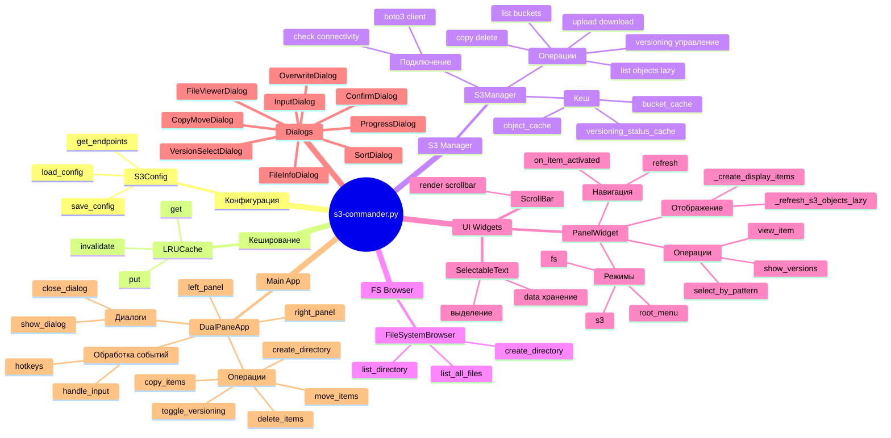

---

## 3. Диаграмма последовательности: Копирование файла FS → S3

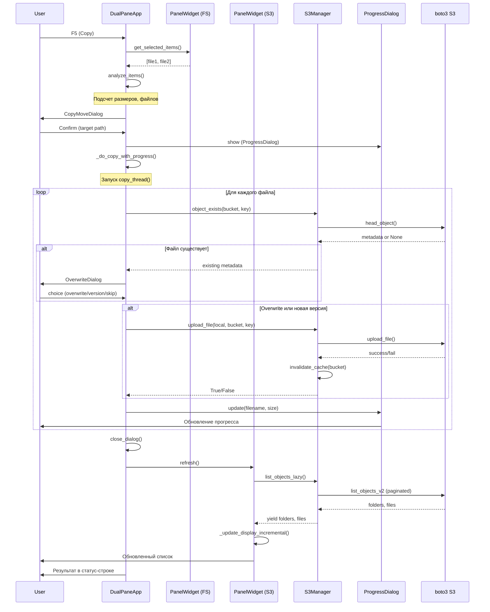

---

## 4. Детальное описание ключевых компонентов

### 4.1 S3Manager

**Назначение:** Абстракция над boto3 для работы с S3

**Ключевые методы:**

```python
class S3Manager:
    def __init__(self, endpoint_config):
        """
        Инициализация клиента boto3 с проверкой доступности endpoint
        - Быстрая TCP проверка (check_s3_endpoint_connectivity)
        - Настройка таймаутов (connect_timeout=3s, read_timeout=10s)
        """
    
    def list_objects_lazy(self, bucket_name, prefix='', page_size=1000, use_versioning=False):
        """
        Ленивая загрузка объектов через генератор
        - yield folders, files порциями
        - use_versioning=True -> использует list_object_versions для подсчета версий
        - Агрегация версий по ключу для отображения
        """
    
    def invalidate_cache(self, bucket_name=None, prefix=None):
        """
        Инвалидация LRU кеша после операций изменения
        - Очищает object_cache, bucket_cache
        - Сбрасывает versioning_status_cache для bucket
        """
    
    def get_versioning_status_cached(self, bucket_name):
        """
        Кеширование статуса версионирования бакета
        - Запрос к S3 выполняется только 1 раз за сессию
        - Результат: 'Enabled', 'Suspended', 'Disabled', None
        """
```

**Оптимизации:**

1. **LRU Cache:**
   - `object_cache` (100 элементов) — кеш списков объектов
   - `bucket_cache` (10 элементов) — кеш списков бакетов
   - Инвалидация по паттерну: `bucket_name:prefix`

2. **Таймауты:**
   - `connect_timeout=3` — быстрый fail при недоступности
   - `read_timeout=10` — разумное ожидание ответа
   - `retries={'max_attempts': 1}` — не ждать повторов

3. **Ленивая загрузка:**
   - Генератор `list_objects_lazy` возвращает порции по 1000
   - UI обновляется инкрементально (`_update_display_incremental`)
   - Пользователь видит прогресс: `Loading... 5000 items`

---

### 4.2 PanelWidget

**Назначение:** Управление одной панелью файлового менеджера

**Режимы работы (`mode`):**

```python
mode = 'root_menu'  # Корневое меню выбора источника
mode = 'fs'         # Локальная файловая система
mode = 's3'         # S3 endpoint
```

**Навигация:**

```python
# S3 навигация
current_endpoint = 'Production Ceph'  # None = список endpoints
current_bucket = 'backups'            # None = список бакетов
current_prefix = 'logs/2024/'         # '' = корень бакета

# FS навигация
fs_browser.current_path = '/home/user/work'
```

**Ключевые методы:**

```python
def refresh(self, focus_on=None):
    """
    Обновление содержимого панели
    - Вызывает _refresh_root_menu / _refresh_fs / _refresh_s3
    - focus_on: имя элемента для установки фокуса после обновления
    """

def _refresh_s3_objects_lazy(self):
    """
    Запуск ленивой загрузки в фоновом потоке
    - Добавляет индикатор [Loading...]
    - Запускает load_s3_objects_background()
    - Обновления через self.app.loop.set_alarm_in()
    """

def _create_display_items(self, folders, files, do_sort=True):
    """
    Создание urwid виджетов для отображения
    - Сортировка по self.sort_mode
    - Добавление маркеров версий [N]
    - Возврат списка SelectableText в AttrMap
    """

def sort_items(self, items):
    """
    Сортировка элементов с учетом mode и reverse
    - Папки всегда сверху
    - Файлы сортируются по ключу (name/size/time/ext)
    """
```

**Взаимодействие с потоками:**

```python
# Запуск фонового потока
self.loading_thread = threading.Thread(
    target=self.load_s3_objects_background,
    args=(bucket, prefix),
    daemon=True
)
self.loading_thread.start()

# Обновление UI из потока
self.app.loop.set_alarm_in(0, lambda l, u: self._update_display_incremental(folders, files))
self.app.wakeup()  # Пробуждение event loop через pipe
```

---

### 4.3 DualPaneApp

**Назначение:** Главный контроллер приложения

**Структура:**

```python
class DualPaneApp:
    def __init__(self, s3_config):
        self.left_panel = PanelWidget(...)
        self.right_panel = PanelWidget(...)
        self.columns = urwid.Columns([left, right])
        self.frame = urwid.Frame(columns, footer=status)
        
        # Флаги для операций
        self.overwrite_all = False
        self.version_all = False
        self.skip_all = False
        
        # Pipe для пробуждения event loop из потоков
        self.pipe_r, self.pipe_w = os.pipe()
```

**Event Loop и потоки:**

```python
def run(self):
    self.loop = urwid.MainLoop(...)
    self.loop.watch_file(self.pipe_r, self.loop_wakeup_callback)
    self.loop.run()

def wakeup(self):
    """Вызывается из фоновых потоков"""
    os.write(self.pipe_w, b'!')

def loop_wakeup_callback(self):
    """Callback для разбуженного event loop"""
    os.read(self.pipe_r, 1)
```

**Обработка операций:**

```python
def copy_items(self):
    """
    1. Получить selected_items из активной панели
    2. analyze_items() — подсчет размеров, подготовка структуры
    3. _show_copy_dialog() — диалог с путем назначения
    4. _do_copy_with_progress() — запуск фонового потока
    """

def _do_copy_with_progress(self, analyzed, source_panel, dest_panel, ...):
    """
    1. Создать ProgressDialog
    2. Запустить copy_thread()
    3. В потоке:
       - Для каждого файла:
         - Проверить существование (если не overwrite_all)
         - Показать OverwriteDialog (через loop.set_alarm_in)
         - Выполнить операцию (upload/download/copy)
         - Обновить прогресс
    4. После завершения:
       - Удалить исходные файлы (если move)
       - Обновить панели (refresh)
       - Показать результат в статусной строке
    """
```

---

## 5. Паттерны и best practices

### 5.1 Управление состоянием

**Проблема:** urwid работает в одном потоке, но операции S3 — долгие

**Решение:** Фоновые потоки + пробуждение event loop

```python
# В фоновом потоке
def background_task():
    # Долгая операция
    result = slow_s3_operation()
    
    # Обновление UI через alarm
    self.app.loop.set_alarm_in(0, lambda l, u: update_ui(result))
    
    # Пробуждение event loop
    self.app.wakeup()

# В основном потоке
def update_ui(result):
    # Безопасное изменение UI
    self.text_widget.set_text(result)
```

### 5.2 Кеширование

**Стратегия:**

1. **LRU для частых запросов:**
   - Списки объектов (при навигации туда-обратно)
   - Статусы версионирования (один раз за сессию)

2. **Инвалидация после изменений:**
   - После upload/delete/copy → `invalidate_cache(bucket, prefix)`
   - Очистка по паттерну: `bucket_name:prefix*`

3. **Ленивая загрузка:**
   - Не загружать всё сразу для больших каталогов
   - Yield по 1000 объектов
   - Инкрементальное обновление UI

### 5.3 Обработка ошибок

**Принципы:**

1. **Graceful degradation:**
   ```python
   try:
       buckets = self.s3_manager.list_buckets()
   except ClientError as e:
       self.show_result(f'Error: {str(e)}')
       buckets = []  # Продолжаем работу с пустым списком
   ```

2. **Информативные сообщения:**
   ```python
   if not success:
       self.show_result(f'Failed to copy {filename}: {error_message}')
   ```

3. **Подсчет успехов/неудач:**
   ```python
   progress.success_count += 1
   progress.fail_count += 1
   # Итоговый результат: Copied: 150 files, Failed: 3 files
   ```

---

## 6. Расширение функционала

### 6.1 Добавление новой операции

**Пример:** Добавить функцию "Rename" (F2)

**Шаги:**

1. **Добавить обработчик клавиши:**

```python
# В DualPaneApp.handle_input()
elif key == 'f2':
    self.rename_item()
```

2. **Реализовать метод операции:**

```python
def rename_item(self):
    active_panel = self.get_active_panel()
    focused = active_panel.get_focused_item()
    
    if not focused:
        self.show_result('No item selected')
        return
    
    def callback(confirmed, new_name):
        self.close_dialog()
        if confirmed:
            # Логика переименования
            if active_panel.mode == 'fs':
                old_path = os.path.join(active_panel.fs_browser.current_path, focused['name'])
                new_path = os.path.join(active_panel.fs_browser.current_path, new_name)
                os.rename(old_path, new_path)
            elif active_panel.mode == 's3':
                # S3: копировать с новым именем + удалить старый
                self._rename_s3_object(active_panel, focused['key'], new_name)
            
            active_panel.refresh(focus_on=new_name)
    
    dialog = InputDialog('Rename', 'New name: ', callback, default_text=focused['name'])
    self.show_dialog(dialog)
```

3. **Обновить статусную строку:**

```python
self.hotkey_text = urwid.Text(
    'F2:rename | F3:view | F5:copy | ...'
)
```

---

### 6.2 Добавление нового типа источника

**Пример:** Поддержка SFTP

**Шаги:**

1. **Создать класс SFTPBrowser:**

```python
import paramiko

class SFTPBrowser:
    def __init__(self, host, port, username, password):
        self.client = paramiko.SSHClient()
        self.client.connect(host, port, username, password)
        self.sftp = self.client.open_sftp()
        self.current_path = '/'
    
    def list_directory(self):
        items = []
        for attr in self.sftp.listdir_attr(self.current_path):
            items.append({
                'name': attr.filename,
                'is_dir': stat.S_ISDIR(attr.st_mode),
                'size': attr.st_size,
                'mtime': datetime.fromtimestamp(attr.st_mtime)
            })
        return items
```

2. **Добавить конфигурацию:**

```json
{
  "sftp_servers": [
    {
      "name": "Production Server",
      "host": "sftp.example.com",
      "port": 22,
      "username": "user",
      "password": "pass"
    }
  ]
}
```

3. **Интегрировать в PanelWidget:**

```python
# В PanelWidget.__init__()
self.sftp_browser = None

# В _refresh_root_menu()
for server in sftp_config.get_servers():
    label = f'[SFTP] {server["name"]}'
    data = {'type': 'root_sftp', 'config': server, 'can_select': False}
    ...

# В on_item_activated()
elif item_type == 'root_sftp':
    self.mode = 'sftp'
    self.sftp_browser = SFTPBrowser(config['host'], config['port'], ...)
    self.refresh()
```

4. **Добавить операции копирования:**

```python
# В _do_copy_with_progress()
elif item_type == 'sftp_file' and dest_panel.mode == 'fs':
    # SFTP → FS
    self.sftp_browser.sftp.get(remote_path, local_path)
```

---

### 6.3 Добавление нового диалога

**Пример:** Диалог "Search" для поиска файлов по имени

**Шаги:**

1. **Создать класс SearchDialog:**

```python
class SearchDialog(urwid.WidgetWrap):
    def __init__(self, callback):
        self.callback = callback
        self.edit = urwid.Edit('Search: ', '')
        self.results_walker = urwid.SimpleFocusListWalker([])
        self.results_listbox = urwid.ListBox(self.results_walker)
        
        search_button = urwid.Button('[ Search ]')
        urwid.connect_signal(search_button, 'click', self.on_search)
        
        # Layout...
        super().__init__(...)
    
    def on_search(self, button):
        pattern = self.edit.get_edit_text()
        # Вызвать callback для поиска
        self.callback('search', pattern)
    
    def update_results(self, results):
        self.results_walker.clear()
        for item in results:
            text = SelectableText(item['name'], item, None)
            self.results_walker.append(text)
```

2. **Добавить обработчик:**

```python
# В DualPaneApp.handle_input()
elif key == 'ctrl s':
    self.show_search_dialog()

def show_search_dialog(self):
    active_panel = self.get_active_panel()
    
    def callback(action, data):
        if action == 'search':
            results = active_panel.search_items(data)
            dialog.update_results(results)
        elif action == 'select':
            self.close_dialog()
            active_panel.set_focus_on_item(data['name'])
    
    dialog = SearchDialog(callback)
    self.show_dialog(dialog, height=('relative', 60))
```

3. **Реализовать поиск в PanelWidget:**

```python
def search_items(self, pattern):
    results = []
    regex = re.compile(fnmatch.translate(pattern), re.IGNORECASE)
    
    if self.mode == 'fs':
        for item in self.fs_browser.list_all_files(self.fs_browser.current_path):
            if regex.match(item['name']):
                results.append(item)
    
    elif self.mode == 's3':
        objects = self.s3_manager.list_all_objects(self.current_bucket, self.current_prefix)
        for obj in objects:
            if regex.match(obj['Key']):
                results.append({'name': obj['Key'], 'size': obj['Size']})
    
    return results
```

---

## 7. Тестирование

### 7.1 Unit тесты

**Пример:** Тестирование LRUCache

```python
import unittest

class TestLRUCache(unittest.TestCase):
    def test_get_put(self):
        cache = LRUCache(maxsize=2)
        cache.put('key1', 'value1')
        self.assertEqual(cache.get('key1'), 'value1')
    
    def test_maxsize(self):
        cache = LRUCache(maxsize=2)
        cache.put('key1', 'value1')
        cache.put('key2', 'value2')
        cache.put('key3', 'value3')  # key1 должен быть вытеснен
        self.assertIsNone(cache.get('key1'))
        self.assertEqual(cache.get('key3'), 'value3')
    
    def test_invalidate(self):
        cache = LRUCache(maxsize=10)
        cache.put('bucket1:file1', 'data1')
        cache.put('bucket1:file2', 'data2')
        cache.put('bucket2:file1', 'data3')
        
        cache.invalidate('bucket1')
        self.assertIsNone(cache.get('bucket1:file1'))
        self.assertEqual(cache.get('bucket2:file1'), 'data3')
```

### 7.2 Интеграционные тесты

**Пример:** Тестирование S3Manager с локальным MinIO

```python
import unittest
from minio import Minio

class TestS3Manager(unittest.TestCase):
    @classmethod
    def setUpClass(cls):
        # Запустить локальный MinIO через Docker
        os.system('docker run -d -p 9000:9000 minio/minio server /data')
        time.sleep(5)
        
        cls.endpoint_config = {
            'name': 'Test MinIO',
            'url': 'http://localhost:9000',
            'access_key': 'minioadmin',
            'secret_key': 'minioadmin'
        }
        cls.manager = S3Manager(cls.endpoint_config)
    
    def test_list_buckets(self):
        buckets = self.manager.list_buckets()
        self.assertIsInstance(buckets, list)
    
    def test_create_bucket(self):
        success = self.manager.create_bucket('test-bucket')
        self.assertTrue(success)
        
        buckets = self.manager.list_buckets()
        names = [b['Name'] for b in buckets]
        self.assertIn('test-bucket', names)
    
    def test_upload_download(self):
        # Создать тестовый файл
        with open('/tmp/test.txt', 'w') as f:
            f.write('test content')
        
        # Загрузить в S3
        success = self.manager.upload_file('/tmp/test.txt', 'test-bucket', 'test.txt')
        self.assertTrue(success)
        
        # Скачать обратно
        success = self.manager.download_object('test-bucket', 'test.txt', '/tmp/test_downloaded.txt')
        self.assertTrue(success)
        
        # Проверить содержимое
        with open('/tmp/test_downloaded.txt', 'r') as f:
            content = f.read()
        self.assertEqual(content, 'test content')
    
    @classmethod
    def tearDownClass(cls):
        # Остановить MinIO
        os.system('docker stop $(docker ps -q --filter ancestor=minio/minio)')
```

---

## 8. Performance оптимизации

### 8.1 Профилирование

**Использование cProfile:**

```python
import cProfile
import pstats

def profile_app():
    profiler = cProfile.Profile()
    profiler.enable()
    
    # Запуск приложения
    s3_config = S3Config('s3_config.json')
    app = DualPaneApp(s3_config)
    # Эмуляция пользовательских действий
    
    profiler.disable()
    
    stats = pstats.Stats(profiler)
    stats.sort_stats('cumulative')
    stats.print_stats(20)  # Top 20 функций

if __name__ == '__main__':
    profile_app()
```

### 8.2 Узкие места

**Типичные проблемы:**

1. **Медленные list_objects для больших бакетов**
   - **Решение:** Ленивая загрузка (`list_objects_lazy`)
   - **Оптимизация:** Кеширование результатов, отключение сортировки

2. **Блокировка UI при долгих операциях**
   - **Решение:** Фоновые потоки + `wakeup()`
   - **Оптимизация:** Прогресс-диалоги, отмена операций

3. **Множественные запросы list_object_versions**
   - **Решение:** Кеширование `versioning_status_cache`
   - **Оптимизация:** Использовать `list_object_versions` только при необходимости

4. **Рендеринг больших списков**
   - **Решение:** urwid ListBox с ленивым рендерингом
   - **Оптимизация:** Инкрементальное обновление (`_update_display_incremental`)

---

## 9. Архитектурные диаграммы

### 9.1 Component Diagram

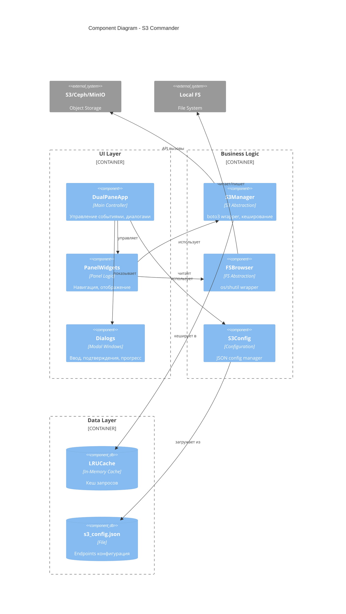

### 9.2 Deployment Diagram

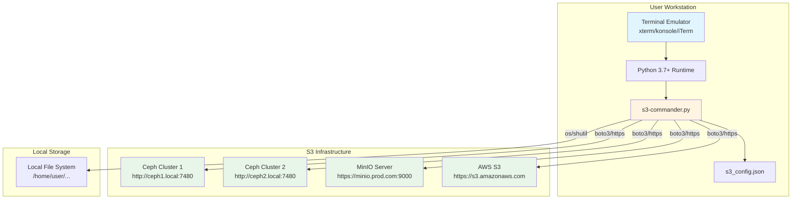

---

## 10. Roadmap для дальнейшего развития

### 10.1 Краткосрочные улучшения (v1.1)

- [ ] **Поддержка S3 Select** — SQL-запросы к CSV/JSON файлам в S3
- [ ] **Пресеты путей** — быстрое переключение между избранными директориями
- [ ] **Bookmarks** — сохранение закладок для S3 путей
- [ ] **История операций** — журнал копирований/удалений с возможностью отмены
- [ ] **Поиск файлов** — Ctrl+S для поиска по имени/размеру/дате
- [ ] **Сравнение директорий** — highlight различий между панелями

### 10.2 Среднесрочные улучшения (v1.5)

- [ ] **Плагинная архитектура** — API для кастомных источников данных
- [ ] **Поддержка SFTP/FTP** — работа с удаленными серверами
- [ ] **Интеграция с Git** — отображение статуса файлов, коммиты
- [ ] **Batch скрипты** — возможность записи и воспроизведения операций
- [ ] **Синхронизация** — автоматическое зеркалирование FS ↔ S3
- [ ] **Метки и теги** — пользовательские метаданные для файлов

### 10.3 Долгосрочные улучшения (v2.0)

- [ ] **Web UI** — интерфейс через браузер (Flask/FastAPI backend)
- [ ] **Multi-user support** — разделение доступа, аудит
- [ ] **Notifications** — оповещения о завершении длительных операций
- [ ] **Планировщик** — cron-подобное расписание для задач
- [ ] **Monitoring dashboard** — метрики использования S3, статистика операций
- [ ] **AI-powered search** — семантический поиск по содержимому файлов

---

## 11. Contributing Guidelines

### Для контрибьюторов

1. **Fork репозитория**
2. **Создайте feature branch:** `git checkout -b feature/amazing-feature`
3. **Следуйте стилю кода:**
   - PEP 8 для Python
   - Docstrings для всех публичных методов
   - Type hints где возможно

4. **Добавьте тесты:** Unit tests для новой функциональности
5. **Обновите документацию:** Обновите README и эту документацию
6. **Commit:** `git commit -m 'Add amazing feature'`
7. **Push:** `git push origin feature/amazing-feature`
8. **Создайте Pull Request**

### Code Style

```python
# ✅ Good
def upload_file(self, local_path: str, bucket_name: str, key: str) -> bool:
    """
    Upload local file to S3 bucket.
    
    Args:
        local_path: Path to local file
        bucket_name: Target S3 bucket
        key: Object key in S3
    
    Returns:
        True if upload successful, False otherwise
    """
    try:
        self.s3_client.upload_file(local_path, bucket_name, key)
        self.invalidate_cache(bucket_name)
        return True
    except (ClientError, Exception) as e:
        self.connection_error = f"Upload error: {str(e)}"
        return False

# ❌ Bad
def upload_file(self, local_path, bucket_name, key):
    self.s3_client.upload_file(local_path, bucket_name, key)
    return True
```

---

## 12. API Reference

### S3Manager API

```python
class S3Manager:
    """S3 operations manager with caching and error handling"""
    
    def list_buckets() -> List[Dict]:
        """Returns list of buckets: [{'Name': str, 'CreationDate': datetime}]"""
    
    def list_objects_lazy(bucket: str, prefix: str = '', page_size: int = 1000, 
                         use_versioning: bool = False) -> Generator[Tuple[List, List], None, None]:
        """
        Lazy load objects in batches.
        Yields: (folders, files) tuples
        """
    
    def upload_file(local_path: str, bucket: str, key: str) -> bool:
        """Upload file to S3. Returns success status."""
    
    def download_object(bucket: str, key: str, local_path: str, 
                       version_id: Optional[str] = None) -> bool:
        """Download S3 object. Optional version_id for versioned objects."""
    
    def copy_object(src_bucket: str, src_key: str, dst_bucket: str, dst_key: str,
                   version_id: Optional[str] = None) -> bool:
        """Copy object within or between buckets."""
    
    def delete_object(bucket: str, key: str, version_id: Optional[str] = None) -> bool:
        """Delete object or specific version."""
    
    def list_object_versions(bucket: str, key: str) -> List[Dict]:
        """Get all versions of an object."""
    
    def enable_versioning(bucket: str) -> bool:
        """Enable versioning on bucket."""
    
    def get_versioning_status(bucket: str) -> Optional[str]:
        """Returns: 'Enabled', 'Suspended', 'Disabled', or None"""
```

### PanelWidget API

```python
class PanelWidget:
    """File manager panel widget"""
    
    def refresh(focus_on: Optional[str] = None) -> None:
        """Refresh panel contents. Optionally focus on item by name."""
    
    def get_focused_item() -> Optional[Dict]:
        """Returns currently focused item data."""
    
    def get_selected_items() -> List[Dict]:
        """Returns list of selected items."""
    
    def select_by_pattern(pattern: str, select: bool = True) -> None:
        """Select/unselect items matching glob pattern."""
    
    def view_item() -> None:
        """View focused item (F3 handler)."""
    
    def show_versions(file_data: Dict) -> None:
        """Show version selection dialog for versioned file."""
```

---

## 13. Troubleshooting для разработчиков

### Проблема: UI не обновляется из фонового потока

**Причина:** urwid event loop не знает об изменениях из других потоков

**Решение:**

```python
# ❌ Неправильно
def background_thread():
    result = expensive_operation()
    self.text_widget.set_text(result)  # UI изменяется из другого потока!

# ✅ Правильно
def background_thread():
    result = expensive_operation()
    # Планируем обновление в event loop
    self.app.loop.set_alarm_in(0, lambda l, u: self.text_widget.set_text(result))
    # Будим event loop
    self.app.wakeup()
```

### Проблема: Медленная загрузка больших каталогов

**Причина:** Запрос всех объектов за один раз

**Решение:** Используйте `list_objects_lazy`

```python
# ❌ Медленно для >10000 объектов
folders, files = self.s3_manager.list_objects(bucket, prefix)
# Ждем загрузки всех объектов

# ✅ Быстро - показываем постепенно
for folders_batch, files_batch in self.s3_manager.list_objects_lazy(bucket, prefix):
    all_folders.extend(folders_batch)
    all_files.extend(files_batch)
    self._update_display_incremental(all_folders, all_files)
    self.app.wakeup()
```

### Проблема: Memory leak при частых операциях

**Причина:** Не удаляются временные файлы или кеш растет бесконечно

**Решение:**

1. **Очистка temp файлов:**
```python
tmppath = tempfile.mktemp()
try:
    # Работа с файлом
    process_file(tmppath)
finally:
    if os.path.exists(tmppath):
        os.unlink(tmppath)
```

2. **Ограничение размера кеша:**
```python
self.object_cache = LRUCache(maxsize=100)  # Не растет больше 100 элементов
```

---

## 14. Заключение

Данная документация покрывает:

- **Для пользователей:** установку, интерфейс, операции, сценарии использования
- **Для разработчиков:** архитектуру, компоненты, паттерны, расширение функционала

**Ключевые принципы проекта:**

1. ✅ **Производительность** — ленивая загрузка, кеширование, фоновые операции
2. ✅ **Надежность** — обработка ошибок, подтверждения, отмена операций
3. ✅ **Расширяемость** — модульная архитектура, плагины (в планах)
4. ✅ **Удобство** — горячие клавиши, прогресс операций, детальная информация

**Контакты:**

- Автор: Тарасов Дмитрий
- Версия: 1.0.1
- GitHub: [ссылка на репозиторий]

**Лицензия:** [указать лицензию, например MIT]

---

*Документация обновлена: 2024-01-15*
