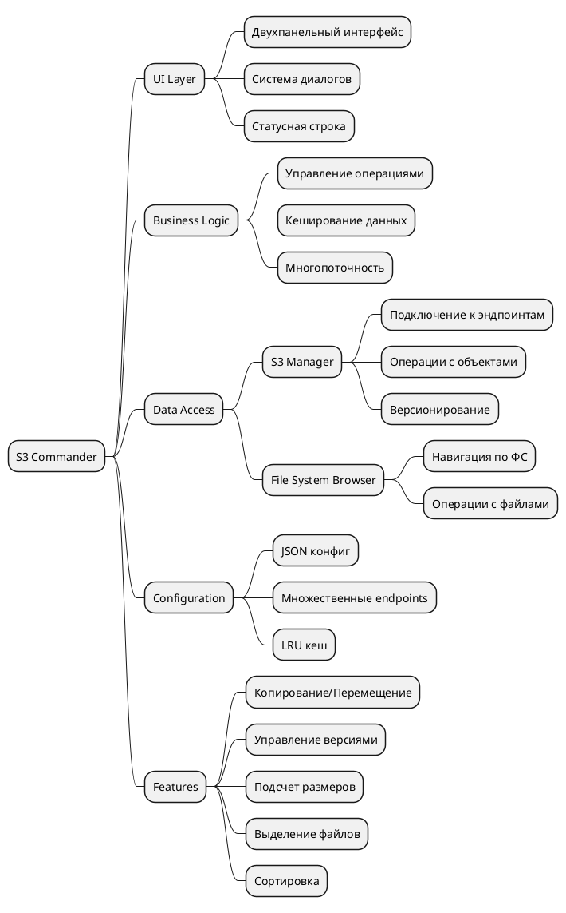
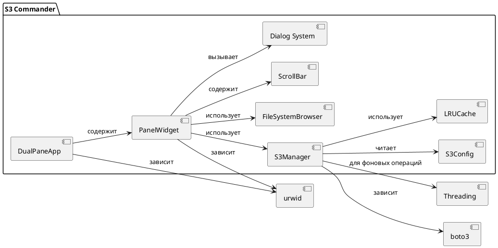

# S3 Commander - Документация

## Оглавление
1. [Обзор](#обзор)
2. [Быстрый старт](#быстрый-старт)
3. [Архитектура](#архитектура)
4. [Компоненты системы](#компоненты-системы)
5. [Горячие клавиши](#горячие-клавиши)
6. [Настройка конфигурации](#настройка-конфигурации)
7. [Разработка и сопровождение](#разработка-и-сопровождение)

## Обзор

**S3 Commander** - двухпанельный файловый менеджер с поддержкой множественных S3-совместимых хранилищ (Ceph, MinIO, AWS S3 и др.). Приложение предоставляет единый интерфейс для управления локальной файловой системой и S3-хранилищами.

**Основные возможности:**
- Двухпанельный интерфейс в стиле Midnight Commander
- Поддержка множественных S3-эндпоинтов
- Просмотр версий объектов S3
- Копирование/перемещение между локальной ФС и S3
- Управление версионированием бакетов
- Ленивая загрузка больших директорий
- Подсчет размеров директорий и бакетов
- Гибкая система выделения файлов
- Просмотр содержимого файлов

## Быстрый старт

### Установка зависимостей
```bash
pip install urwid boto3
```

### Запуск приложения
```bash
python s3-commander.py
```

### Начальная настройка
1. При первом запуске создается файл `s3_config.json`
2. Отредактируйте его для добавления ваших S3-эндпоинтов:
```json
{
  "endpoints": [
    {
      "name": "Local Ceph",
      "url": "http://localhost:7480",
      "access_key": "your_access_key",
      "secret_key": "your_secret_key"
    }
  ]
}
```

## Архитектура

```plantuml
@startuml
!include https://raw.githubusercontent.com/plantuml-stdlib/C4-PlantUML/master/C4_Container.puml

LAYOUT_WITH_LEGEND()

Person(user, "Пользователь", "Администратор хранилищ")

System_Boundary(app, "S3 Commander") {
    Container(ui, "TUI Интерфейс", "Urwid", "Двухпанельный интерфейс, диалоги")
    Container(logic, "Бизнес-логика", "Python", "Управление операциями")
    Container(s3_mgr, "S3 Менеджер", "boto3", "Работа с S3 API")
    Container(fs_mgr, "Файловый менеджер", "Python", "Работа с локальной ФС")
    Container(config, "Конфигурация", "JSON", "Хранение настроек endpoints")
    
    Rel(ui, logic, "Вызывает операции")
    Rel(logic, s3_mgr, "Использует")
    Rel(logic, fs_mgr, "Использует")
    Rel(logic, config, "Читает/записывает")
}

System_Ext(s3_storage, "S3 Хранилище", "Ceph/MinIO/AWS S3")
System_Ext(local_fs, "Локальная ФС", "Файловая система")

Rel(user, ui, "Взаимодействует через TUI")
Rel(s3_mgr, s3_storage, "REST API")
Rel(fs_mgr, local_fs, "Файловые операции")

@enduml
```

### MindMap архитектуры



## Компоненты системы

### 1. Интерфейс пользователя (`DualPaneApp`)
- Двухпанельная компоновка
- Система горячих клавиш
- Контекстные диалоги
- Информационная панель

### 2. Панели (`PanelWidget`)
- Адаптивные панели (ФС/S3/Корневое меню)
- Ленивая загрузка содержимого
- Система сортировки
- Выделение элементов

### 3. S3 Менеджер (`S3Manager`)
- Подключение к S3-эндпоинтам
- Операции CRUD с объектами
- Управление версиями
- Кеширование результатов

### 4. Файловый менеджер (`FileSystemBrowser`)
- Навигация по локальной ФС
- Рекурсивные операции
- Проверка прав доступа

### 5. Диалоговые окна
- `InputDialog` - ввод текста
- `ConfirmDialog` - подтверждение действий
- `ProgressDialog` - отображение прогресса
- `VersionSelectDialog` - выбор версий
- `FileInfoDialog` - информация о файлах

### 6. Конфигурация (`S3Config`)
- Хранение настроек endpoints
- Поддержка множественных подключений
- Автосоздание дефолтной конфигурации

## Горячие клавиши

### Основные
| Клавиша | Действие |
|---------|----------|
| **Tab** | Переключение между панелями |
| **F3**  | Просмотр файла |
| **F4**  | Информация о файле |
| **F5**  | Копирование |
| **F6**  | Перемещение |
| **F7**  | Создание директории/бакета |
| **F8**  | Удаление |
| **F9**  | Удаление старых версий |
| **F10** | Сортировка |
| **F11** | Управление версионированием |
| **Insert** | Выделить/снять выделение |
| **+** | Выделить по шаблону |
| **-** | Снять выделение по шаблону |
| ***** | Инвертировать выделение |
| **q** | Выход |

### Навигация
- **Enter** - открыть директорию/файл
- **..** (на родительской директории) - переход на уровень выше

### Работа с версиями
- В диалоге версий:
  - **F3** - просмотр выбранной версии
  - **F5** - копирование версии
  - **F6** - перемещение версии
  - **F8** - удаление версии

## Настройка конфигурации

### Формат конфигурационного файла
```json
{
  "endpoints": [
    {
      "name": "Human Readable Name",
      "url": "http://host:port",
      "access_key": "your_access_key",
      "secret_key": "your_secret_key"
    }
  ]
}
```

### Поддерживаемые S3-совместимые хранилища
1. **Ceph RADOS Gateway**
2. **MinIO**
3. **AWS S3**
4. **DigitalOcean Spaces**
5. **Google Cloud Storage**
6. **Любой S3-совместимый сервис**

## Разработка и сопровождение

### Структура проекта



### Основные классы

#### `S3Manager` - ключевые методы:
- `list_buckets()` - список бакетов
- `list_objects_lazy()` - ленивая загрузка объектов
- `copy_object()` - копирование между S3
- `get_versioning_status()` - статус версионирования

#### `PanelWidget` - состояния:
1. **root_menu** - выбор источника (ФС/S3)
2. **s3** с `current_endpoint=None` - список эндпоинтов
3. **s3** с `current_bucket=None` - список бакетов
4. **s3** с бакетом - содержимое бакета
5. **fs** - локальная файловая система

### Расширение функциональности

#### Добавление нового типа операции:
1. Создать обработчик в `DualPaneApp.handle_input()`
2. Реализовать логику в соответствующем классе
3. Добавить диалоги при необходимости
4. Обновить справку по горячим клавишам

#### Пример добавления команды:
```python
def handle_input(self, key):
    if key == 'f12':  # Новая команда
        self.new_operation()
        
def new_operation(self):
    active_panel = self.get_active_panel()
    # Реализация операции
```

### Тестирование
Приложение использует:
1. **Многопоточность** для фоновых операций
2. **Кеширование** для повышения производительности
3. **Обработку ошибок** при сетевых сбоях

### Известные ограничения
1. Не поддерживается рекурсивное удаление версий
2. Ограниченный размер просматриваемых файлов (50KB)
3. Таймауты подключения к S3 жестко заданы

### Советы по отладке
1. Включите логирование boto3 при проблемах с подключением
2. Используйте `app.show_result()` для отладки сообщений
3. Проверьте доступность эндпоинта через `check_s3_endpoint_connectivity()`

## Лицензия и авторство

- **Версия:** 1.0.1
- **Автор:** Тарасов Дмитрий
- **Архитектура:** Модульная, расширяемая
- **Зависимости:** urwid, boto3, Python 3.6+

---

*Документация обновлена для версии 1.0.1. Для получения дополнительной помощи создайте issue в репозитории проекта.*
