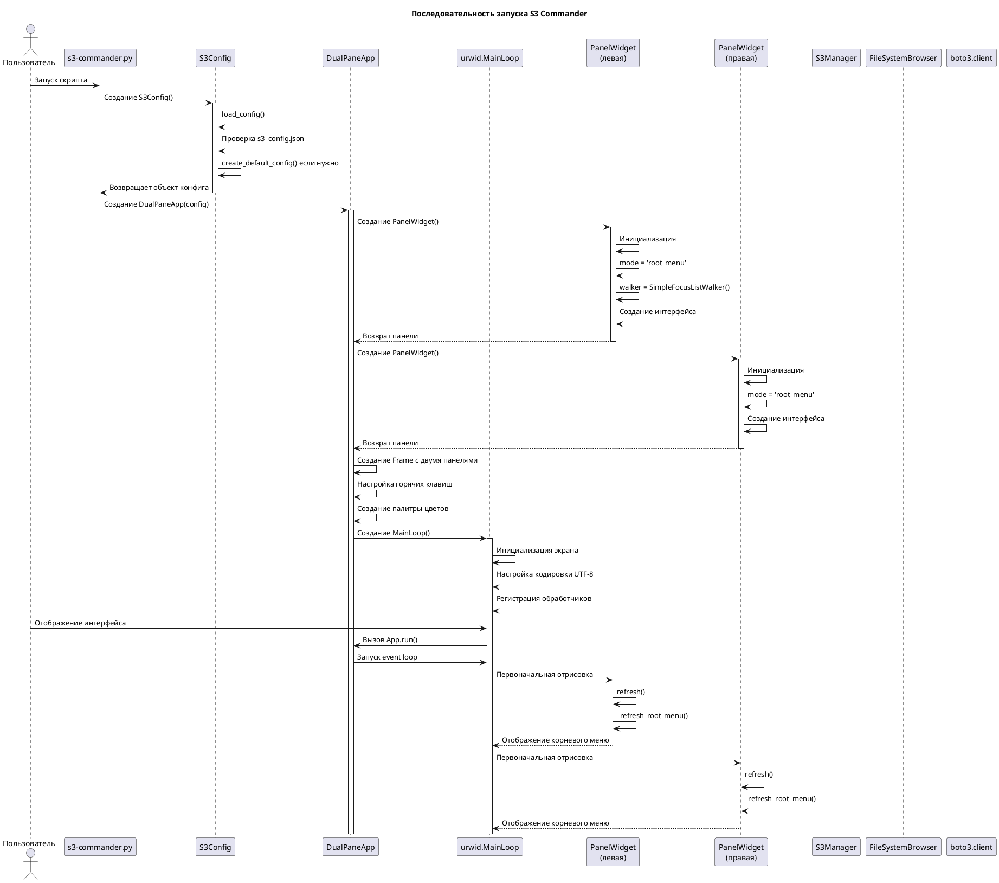
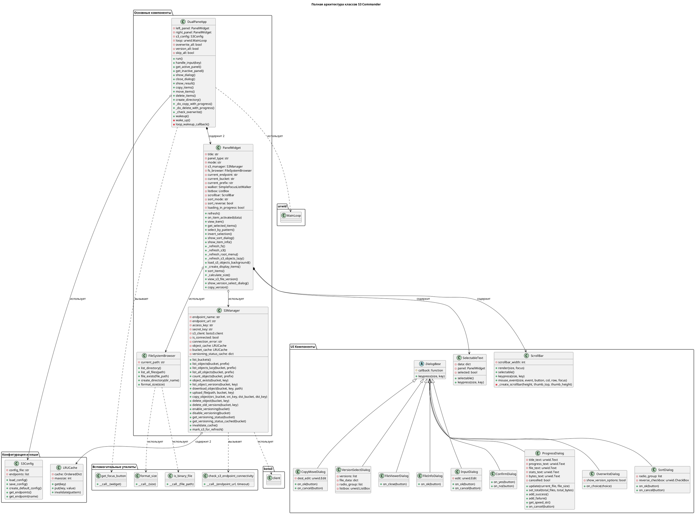
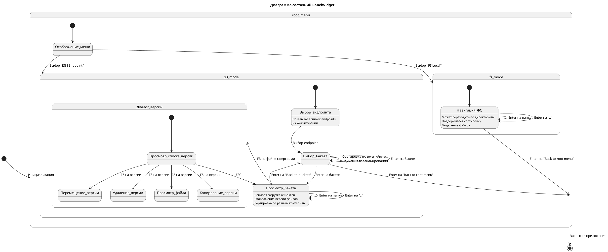
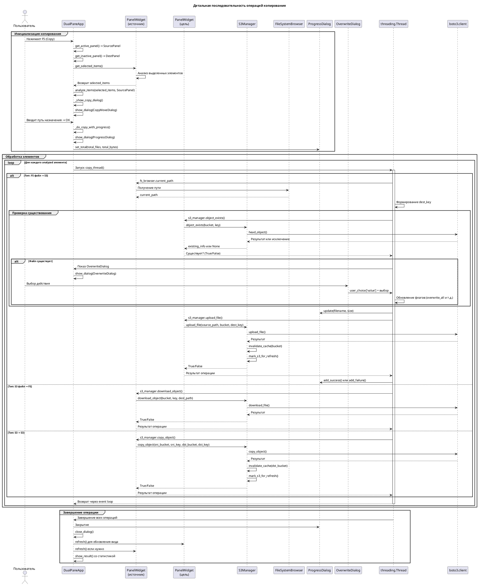
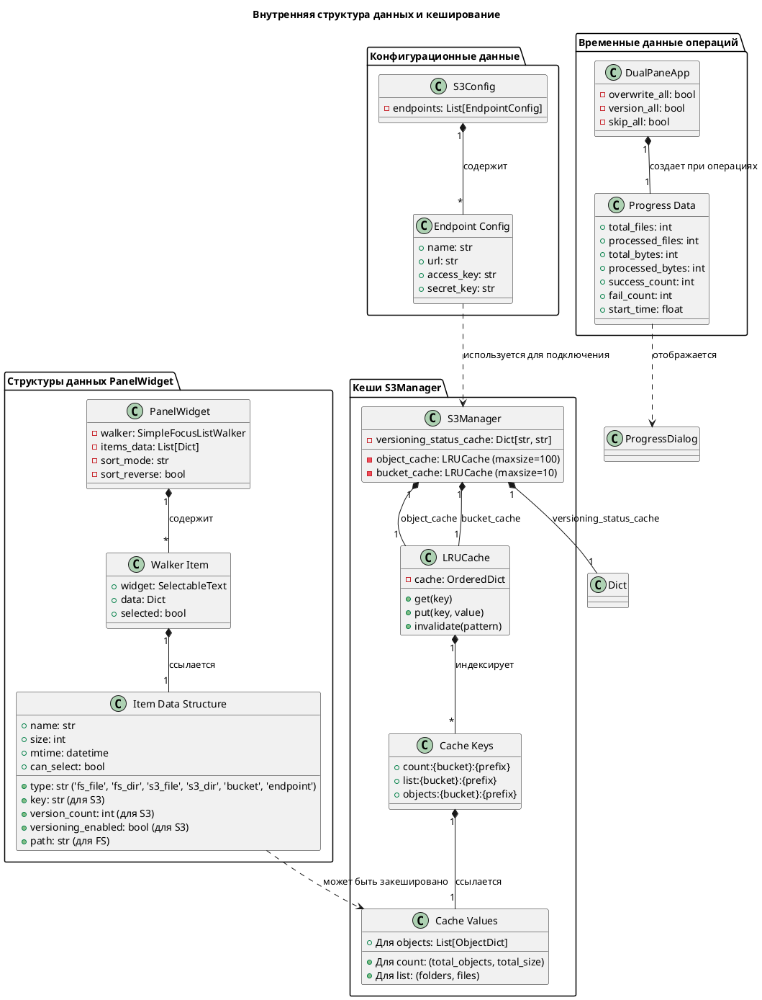
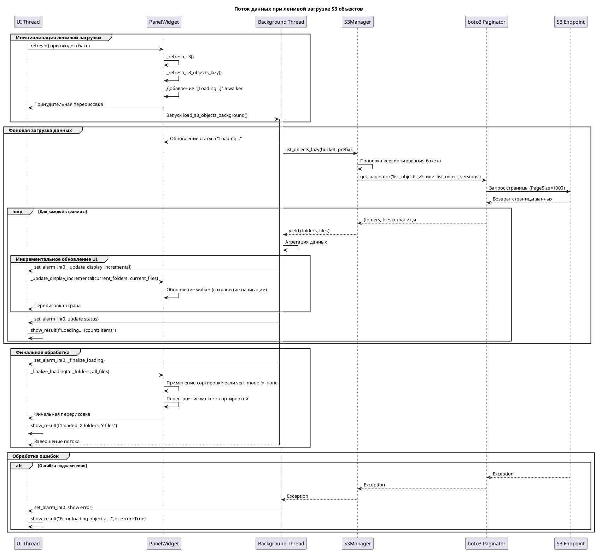

# S3 Commander - Детальная архитектурная документация

## Комплексные диаграммы архитектуры

### 1. Полная диаграмма последовательности запуска



### 2. Полная архитектурная диаграмма классов



### 3. Диаграмма состояний панели



### 4. Диаграмма последовательности операций копирования



### 5. Диаграмма внутренней структуры данных



### 6. Диаграмма потока данных для ленивой загрузки



### 7. Диаграмма системы кеширования

```plantuml
@startuml
title Система кеширования и инвалидации

package "Уровни кеширования" {
  database "S3 Endpoint" as S3 {
    folder "Бакеты"
    folder "Объекты"
    folder "Версии"
  }
  
  component "LRU Cache\n(памяти)" as MemoryCache {
    folder "object_cache\n(maxsize=100)"
    folder "bucket_cache\n(maxsize=10)"
    folder "versioning_status_cache"
  }
  
  component "Кеш UI\n(walker)" as UICache {
    folder "Текущее состояние"
    folder "Выделенные элементы"
    folder "Сортировка"
  }
  
  component "Кеш сортировки" as SortCache {
    folder "Сортированные списки"
    folder "Индексы"
  }
}

package "Операции чтения" {
  actor "PanelWidget" as Panel
  actor "S3Manager" as S3Mgr
  
  Panel -> S3Mgr: list_objects(bucket, prefix)
  S3Mgr -> MemoryCache: get("list:{bucket}:{prefix}")
  
  alt Кеш попадание
    MemoryCache --> S3Mgr: Возврат кешированных данных
    S3Mgr --> Panel: Быстрый возврат
  else Кеш промах
    S3Mgr -> S3: list_objects_v2 API call
    S3 --> S3Mgr: Данные
    S3Mgr -> MemoryCache: put("list:{bucket}:{prefix}", data)
    S3Mgr -> MemoryCache: put("count:{bucket}:{prefix}", (count, size))
    S3Mgr --> Panel: Возврат данных
  end
  
  Panel -> UICache: Обновление walker
  Panel -> SortCache: Применение сортировки если нужно
}

package "Операции записи" {
  actor "Операции записи" as WriteOps {
    + upload_file()
    + copy_object()
    + delete_object()
    + create_bucket()
    + delete_bucket()
  }
  
  WriteOps -> S3: API вызов
  S3 --> WriteOps: Подтверждение
  
  WriteOps -> MemoryCache: invalidate(pattern)
  
  alt Изменение в бакете
    WriteOps -> MemoryCache: invalidate("{bucket}:*")
    WriteOps -> MemoryCache: Удаление versioning_status_cache[bucket]
  else Изменение в префиксе
    WriteOps -> MemoryCache: invalidate("{bucket}:{prefix}*")
  end
  
  WriteOps -> Panel: mark_s3_for_refresh()
  Panel -> UICache: Сброс состояния
  Panel -> SortCache: Сброс сортировки
}

package "Стратегии инвалидации" {
  note top of MemoryCache
    Инвалидация по паттерну:
    - bucket:* - все объекты бакета
    - bucket:prefix* - объекты префикса
    - count:bucket:* - счетчики бакета
    Полная инвалидация при:
    - Смене endpoint
    - Ошибках подключения
  end note
  
  note top of UICache
    Инвалидация при:
    - refresh() вызове
    - Смене режима панели
    - Ошибках отображения
    Ручная инвалидация:
    - После операций записи
    - При явном обновлении
  end note
}

S3 -[hidden]-> MemoryCache
MemoryCache -[hidden]-> UICache
UICache -[hidden]-> SortCache

@enduml
```

### 8. Диаграмма системы диалогов

```plantuml
@startuml
title Иерархия и взаимодействие диалоговых окон

package "Базовый класс" {
  abstract class DialogBase {
    {abstract} + keypress(size, key)
    {abstract} + render(size, focus)
    # callback: Callable
    # on_confirm()
    # on_cancel()
  }
  
  DialogBase <|-- CommonDialog
}

package "Информационные диалоги" {
  class CommonDialog {
    + buttons: List[urwid.Button]
    + title: str
    + message: str
    + keypress() : Обработка ESC/Enter
  }
  
  class FileInfoDialog {
    - info_dict: OrderedDict
    + _format_info()
    + _create_info_widgets()
  }
  
  class FileViewerDialog {
    - content: str
    - title: str
    + _wrap_text()
  }
  
  class VersionSelectDialog {
    - versions: List[Dict]
    - file_data: Dict
    - radio_group: List
    + _create_version_list()
    + _on_version_action()
  }
}

package "Диалоги ввода" {
  class InputDialog {
    - edit: urwid.Edit
    - prompt: str
    + on_ok()
    + on_cancel()
  }
  
  class CopyMoveDialog {
    - dest_edit: urwid.Edit
    - source_desc: str
    + _validate_path()
  }
  
  class SortDialog {
    - radio_group: List
    - reverse_checkbox: urwid.CheckBox
    + _get_current_sort()
    + _apply_sort()
  }
}

package "Диалоги действий" {
  class ConfirmDialog {
    - items_info: List[str]
    + _format_items()
  }
  
  class OverwriteDialog {
    - show_version_options: bool
    - source_info: Dict
    - dest_info: Dict
    + _create_comparison()
  }
  
  class ProgressDialog {
    - progress_data: ProgressData
    - cancelled: bool
    + update()
    + set_total()
    + get_speed_str()
    + on_cancel()
  }
}

package "Управление диалогами" {
  class DualPaneApp {
    - loop: urwid.MainLoop
    + show_dialog(dialog, width, height)
    + close_dialog()
    - _create_overlay()
  }
  
  class "Overlay System" as OverlaySys {
    + create_overlay()
    + center_dialog()
    + handle_focus()
    + esc_to_close()
  }
}

' Взаимодействия
DualPaneApp *--> OverlaySys : использует
OverlaySys *--> DialogBase : управляет

CommonDialog <|-- InputDialog
CommonDialog <|-- ConfirmDialog
CommonDialog <|-- FileViewerDialog
CommonDialog <|-- FileInfoDialog
CommonDialog <|-- VersionSelectDialog
CommonDialog <|-- OverwriteDialog
CommonDialog <|-- SortDialog
CommonDialog <|-- CopyMoveDialog
CommonDialog <|-- ProgressDialog

' Поток вызова диалогов
DualPaneApp -> ConfirmDialog : Для подтверждения удаления
DualPaneApp -> InputDialog : Для ввода имени/паттерна
DualPaneApp -> ProgressDialog : Для длительных операций
DualPaneApp -> OverwriteDialog : Для конфликтов копирования
PanelWidget -> SortDialog : Для изменения сортировки
PanelWidget -> VersionSelectDialog : Для выбора версий файла
PanelWidget -> FileInfoDialog : Для информации F4

' События
ConfirmDialog -> DualPaneApp : callback(confirmed)
InputDialog -> DualPaneApp : callback(confirmed, text)
ProgressDialog -> DualPaneApp : callback() при отмене
OverwriteDialog -> DualPaneApp : callback(choice)
SortDialog -> PanelWidget : callback(confirmed, mode, reverse)

@enduml
```



### 9. Диаграмма многопоточной архитектуры

```plantuml
@startuml
title Многопоточная архитектура и синхронизация

package "Основной поток (UI)" {
  component "urwid.MainLoop" as MainLoop {
    - event_queue
    - screen_updates
    - input_handling
  }
  
  component "DualPaneApp" as App {
    - left_panel
    - right_panel
    - dialog_stack
    - pipe_r / pipe_w (wakeup)
  }
  
  component "PanelWidget UI" as PanelUI {
    - walker updates
    - focus management
    - redraw requests
  }
}

package "Фоновые потоки" {
  component "Ленивая загрузка" as LazyLoad {
    - loading_thread
    - page_iterator
    - data_aggregator
  }
  
  component "Операции файлов" as FileOps {
    - copy_thread
    - move_thread
    - delete_thread
  }
  
  component "Подсчет размеров" as SizeCalc {
    - size_thread
    - recursive_walker
    - size_aggregator
  }
  
  component "S3 API вызовы" as S3Calls {
    - boto3 clients
    - paginators
    - retry logic
  }
}

package "Механизмы синхронизации" {
  database "Thread-safe данные" as ThreadSafe {
    + ProgressData (atomic updates)
    + LRU Cache (thread-safe OrderedDict)
    + Status flags (atomic)
  }
  
  component "Event Loop интеграция" as Events {
    + set_alarm_in()
    + draw_screen()
    + wakeup() через pipe
  }
  
  component "Callback система" as Callbacks {
    + UI обновления
    + Диалог завершения
    + Ошибки обработки
  }
}

' Потоки и связи
MainLoop -> App : Обработка ввода
App -> PanelUI : Обновление интерфейса

LazyLoad -[#blue]-> S3Calls : Асинхронные запросы
FileOps -[#blue]-> S3Calls : Операции записи
SizeCalc -[#blue]-> S3Calls : Запросы метаданных

LazyLoad -> Events : set_alarm_in() для UI updates
FileOps -> Events : Прогресс операций
SizeCalc -> Events : Результаты подсчета

LazyLoad -> ThreadSafe : Агрегация данных
FileOps -> ThreadSafe : Прогресс операций

Events -> Callbacks : Вызов колбэков в UI потоке
Callbacks -> PanelUI : Обновление интерфейса
Callbacks -> App : Закрытие диалогов

' Критические секции
note right of ThreadSafe
  Атомарные операции:
  - progress.success_count += 1
  - cache.put(key, value)
  - loading_in_progress = False
  
  Синхронизация через:
  - threading.Event
  - set_alarm_in()
  - Главный цикл urwid
end note

' Пробуждение главного цикла
App -> Events : wakeup() из фонового потока
Events -> MainLoop : Чтение из pipe
MainLoop -> App : Вызов обработчиков

' Обработка ошибок в потоках
S3Calls -> Callbacks : Исключения S3
LazyLoad -> Callbacks : Ошибки загрузки
