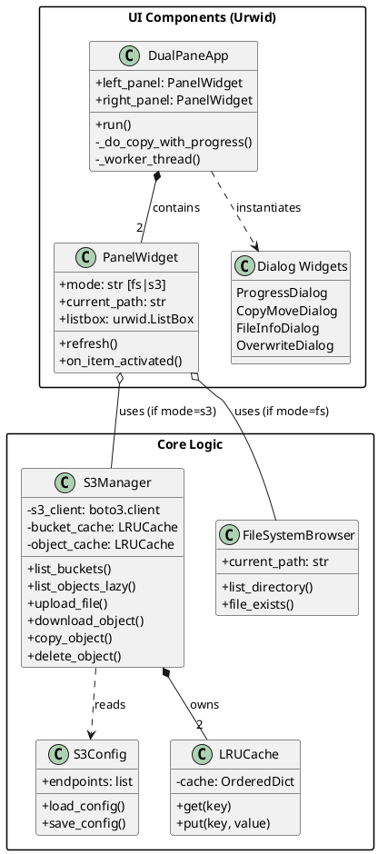
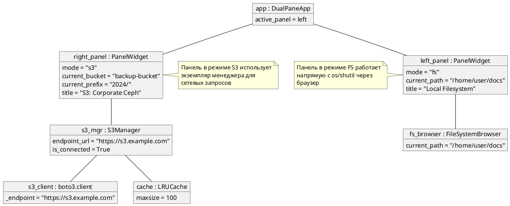
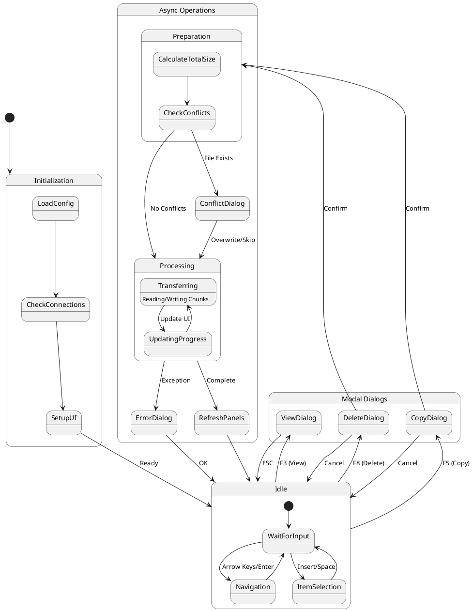
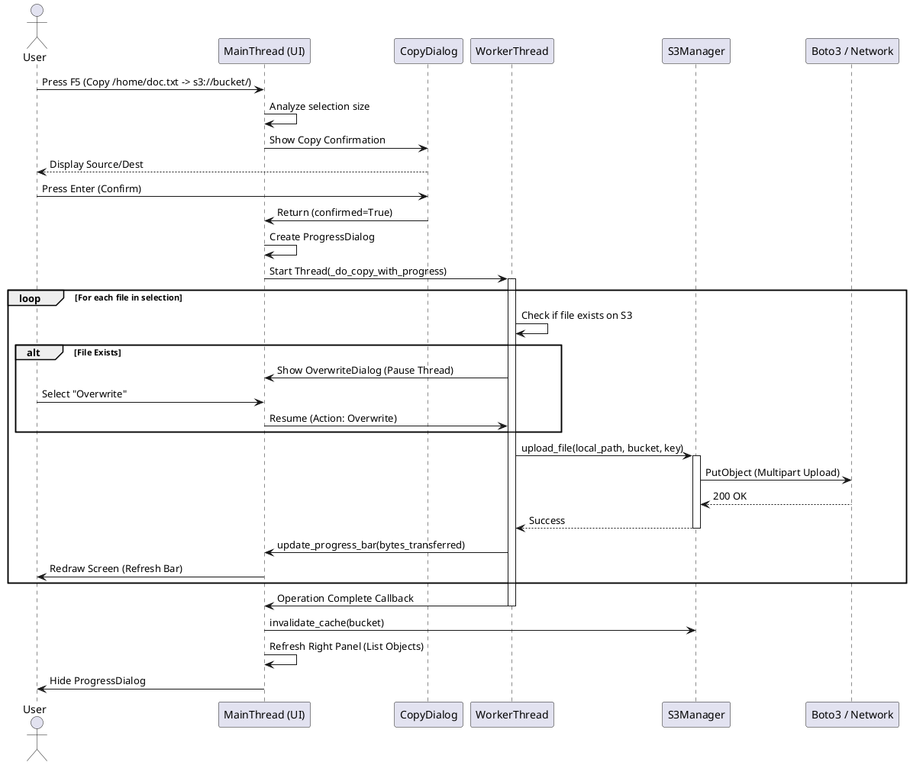

Я подготовил для вас 4 диаграммы в формате PlantUML, покрывающие структуру, взаимодействие объектов, состояния и последовательность операций.

Ниже приведен код для каждой диаграммы. Вы можете сохранить их в файлы с расширением `.puml` и открыть в любой IDE с плагином PlantUML или онлайн-редакторе.

### 1. Классовая структура (Class Diagram)
Этот файл описывает статическую структуру кода: классы, их методы и отношения наследования/композиции.

**Файл:** `class_structure.puml`

***

### 2. Объектная модель (Object Diagram)
Показывает, как экземпляры классов связаны друг с другом во время выполнения программы (runtime). Здесь рассмотрен сценарий: Слева — локальная ФС, Справа — S3 бакет.

**Файл:** `object_model.puml`

***

### 3. Диаграмма состояний (State Diagram)
Описывает жизненный цикл приложения и переходы между режимами (просмотр, диалоги, выполнение операций).

**Файл:** `system_states.puml`

***

### 4. Диаграмма последовательности (Sequence Diagram)
Детализирует процесс копирования файла из локальной системы в S3, включая взаимодействие с пользователем и потоками.

**Файл:** `operation_sequence.puml`

[1](https://ppl-ai-file-upload.s3.amazonaws.com/web/direct-files/attachments/154680809/6f1554b1-70ce-4327-9eed-66531dd8ed9e/s3-commander.py)
[2](https://ppl-ai-file-upload.s3.amazonaws.com/web/direct-files/attachments/154680809/2d2b8b11-8660-480b-b510-f72b95bde830/s3-commander.py)