Сделал для вас максимально полную **Class Diagram** (диаграмму классов).

В эту схему включены **все** обнаруженные в коде классы (включая вспомогательные UI-виджеты), **все** методы и атрибуты с указанием их типов и назначения.

### Ссылка на скачивание
Вы можете сохранить код ниже в файл с именем `full_class_structure.puml`.

```plantuml
@startuml
scale 0.8
skinparam classAttributeIconSize 0
skinparam linetype ortho

package "Core Logic & Configuration" {

    class S3Config {
        +config_file : str = 's3_config.json'
        +endpoints : list <dict> {Список настроенных S3 подключений}
        __init__(config_file)
        +load_config() : void {Загрузка из JSON}
        +create_default_config() : void {Создание дефолтного конфига}
        +save_config() : void {Сохранение на диск}
        +get_endpoints() : list
        +get_endpoint(name) : dict
    }

    class LRUCache {
        +cache : OrderedDict {Хранилище ключ-значение}
        +maxsize : int {Лимит элементов}
        __init__(maxsize=100)
        +get(key) : any
        +put(key, value) : void
        +invalidate(pattern=None) : void {Очистка всего кеша или по паттерну}
    }

    class S3Manager {
        +endpoint_name : str
        +endpoint_url : str
        +access_key : str
        +secret_key : str
        +is_connected : bool {Статус подключения}
        +connection_error : str {Текст ошибки если есть}
        +s3_client : boto3.client {Клиент AWS SDK}
        +versioning_status_cache : dict {Кеш статусов версионирования бакетов}
        +object_cache : LRUCache {Кеш списков объектов (list_objects)}
        +bucket_cache : LRUCache {Кеш списка бакетов}
        __init__(endpoint_config)
        +list_buckets() : list
        +create_bucket(bucket_name) : bool
        +delete_bucket(bucket_name) : bool
        +on_panel_focus() : void
        +list_objects(bucket_name, prefix) : tuple
        +list_all_objects(bucket_name, prefix) : list
        +count_objects(bucket_name, prefix) : tuple
        +list_objects_lazy(bucket_name, prefix, page_size, use_versioning) : generator
        +invalidate_cache(bucket_name, prefix) : void
        +object_exists(bucket_name, key) : dict
        +list_object_versions(bucket_name, key) : list
        +download_object(bucket_name, key, local_path, version_id, callback) : bool
        +mark_s3_for_refresh() : void
        +upload_file(local_path, bucket_name, key) : bool
        +copy_object(src_bucket, src_key, dst_bucket, dst_key, version_id) : bool
        +delete_object(bucket_name, key, version_id) : bool
        +delete_old_versions(bucket_name, key) : int
        +enable_versioning(bucket_name) : bool
        +disable_versioning(bucket_name) : bool
        +get_versioning_status_cached(bucket_name) : str
        +get_versioning_status(bucket_name) : str
    }

    class FileSystemBrowser {
        +current_path : str {Текущая локальная директория}
        __init__()
        +list_directory() : list {Список файлов в текущей папке}
        +list_all_files(path) : list {Рекурсивный обход}
        +file_exists(file_path) : dict
        +create_directory(dir_name) : bool
    }
}

package "UI Custom Widgets" {

    class ScrollBar {
        +scrollbar_width : int = 1
        __init__(widget)
        +render(size, focus) : canvas {Отрисовка скроллбара}
        -_create_scrollbar(height, thumb_top, thumb_height) : canvas
        +selectable() : bool
        +keypress(size, key)
        +mouse_event(...)
    }

    class SelectableText {
        +data : dict {Метаданные файла/папки}
        +panel : PanelWidget {Ссылка на родительскую панель}
        +selected : bool {Выделен ли файл (Insert)}
        __init__(text, data, panel)
        +selectable() : bool
        +keypress(size, key) {Обработка Enter, Insert, Space}
    }
}

package "UI Panels & Controller" {

    class PanelWidget {
        +title : str
        +panel_type : str {'fs' или 's3'}
        +mode : str
        +s3_config : S3Config
        +s3_manager : S3Manager {Только для режима S3}
        +fs_browser : FileSystemBrowser {Только для режима FS}
        +app : DualPaneApp
        +current_endpoint : str
        +current_bucket : str
        +current_prefix : str
        +sort_mode : str {'name', 'size', 'time', 'ext'}
        +sort_reverse : bool
        +walker : urwid.SimpleFocusListWalker {Список виджетов строк}
        +listbox : urwid.ListBox
        +header_text : urwid.Text
        +path_text : urwid.Text
        +s3_needs_refresh : bool
        +loading_in_progress : bool
        __init__(title, panel_type, s3_config, app)
        +refresh() : void {Перезагрузка списка файлов}
        +show_item_info() : void {Обработка F3}
        -_get_fs_info(path) : dict
        -_get_s3_bucket_info(bucket_name) : dict
        -_get_s3_object_info(bucket, key, itype) : dict
        +copy_version(file_data, version_data, move) : void
        +on_confirm(confirmed, target_path) : void
        +show_sort_dialog() : void
        -_resort_current_view() : void {Сортировка без перезагрузки сети}
        +mark_s3_for_refresh() : void
        +sort_items(items) : list
        -_create_display_items(folders, files, do_sort) : list
        +update_header(text) : void
        +navigate_up() : void {Обработка '..'}
        +change_dir(item_data) : void
        +on_item_activated(item_data) : void {Enter на элементе}
        +update_item_display(widget) : void {Обновление цвета при выделении}
        +get_selected_items() : list
        +get_focused_item() : dict
    }

    class DualPaneApp {
        +config : S3Config
        +left_panel : PanelWidget
        +right_panel : PanelWidget
        +active_panel_idx : int {0 или 1}
        +loop : urwid.MainLoop
        +overlay : urwid.Overlay
        +clipboard : list
        +overwrite_all : bool
        +skip_all : bool
        +version_all : bool
        +copy_buffer_size : int
        __init__()
        +setup_palette() : void
        +build_ui() : void
        +get_active_panel() : PanelWidget
        +get_inactive_panel() : PanelWidget
        +on_tab() : void
        +show_menu() : void {F2 - выбор эндпоинта}
        +show_result(text) : void {Показ сообщения в футере}
        +show_dialog(widget, width, height) : void
        +close_dialog() : void
        +run() : void {Запуск MainLoop}
        +request_copy_move(is_move) : void {Обработка F5/F6}
        -_show_copy_dialog(...) : void
        -_do_copy_with_progress(...) : void {Логика копирования}
        +analyze_items(panel, items) : list {Рекурсивный подсчет размера}
        -_worker_thread(...) : void {Поток выполнения операций}
        +update_progress_ui(...) : void {Callback обновления прогресса}
        +request_delete() : void {Обработка F8}
        -_do_delete_with_progress(...) : void
        +request_mkdir() : void {Обработка F7}
    }
}

package "Dialogs" {
    class FileViewerDialog {
        +callback : func
        __init__(title, content, callback)
        +on_close(button)
    }

    class VersionSelectDialog {
        +callback : func
        +versions : list
        +file_data : dict
        +radio_group : list
        +listbox : urwid.ListBox
        __init__(file_data, versions, callback)
        +keypress(size, key) {F3, F5, F6, F8 hotkeys}
    }

    class OverwriteDialog {
        +callback : func
        __init__(filename, src_info, dst_info, callback, show_ver_opts)
        +on_choice(choice)
    }

    class ProgressDialog {
        +callback : func
        +total_files : int
        +processed_files : int
        +total_bytes : int
        +processed_bytes : int
        +start_time : float
        +cancelled : bool
        __init__(title, callback)
        +on_cancel(button)
        +get_speed_str() : str
        +update(current_file, file_size)
        +set_total(files, bytes)
        +add_success()
        +add_failure()
    }

    class SortDialog {
        +callback : func
        +current_mode : str
        +current_reverse : bool
        +reverse_checkbox : urwid.CheckBox
        __init__(current_mode, current_reverse, callback)
        +on_ok(button)
    }

    class CopyMoveDialog {
        +callback : func
        +dest_edit : urwid.Edit
        __init__(title, source_desc, dest_path, callback)
        +on_ok(button)
    }

    class FileInfoDialog {
        +info : OrderedDict
        __init__(title, info, callback)
    }
}

' Relationships
S3Manager o-- LRUCache : uses
S3Manager ..> S3Config : reads
PanelWidget *-- FileSystemBrowser : contains (fs mode)
PanelWidget *-- S3Manager : contains (s3 mode)
DualPaneApp *-- "2" PanelWidget : contains
DualPaneApp ..> S3Config : initializes
DualPaneApp ..> ProgressDialog : creates
DualPaneApp ..> OverwriteDialog : creates
PanelWidget ..> VersionSelectDialog : creates
PanelWidget ..> FileInfoDialog : creates
PanelWidget ..> SortDialog : creates
PanelWidget o-- SelectableText : manages list of
ScrollBar o-- urwid.Widget : decorates
SelectableText --|> urwid.Text : inherits
FileViewerDialog --|> urwid.WidgetWrap : inherits
PanelWidget --|> urwid.WidgetWrap : inherits

@enduml
```

### Пояснения к диаграмме
1.  **Core Logic**: Здесь сосредоточена бизнес-логика. `S3Manager` — самый массивный класс, отвечающий за всю работу с API AWS/Ceph.
2.  **UI Panels**: `PanelWidget` — это "умный" контроллер одной панели. Он решает, откуда брать данные (FS или S3) и как их отображать.
3.  **App Controller**: `DualPaneApp` связывает всё воедино. Он управляет глобальным состоянием (буфер обмена, активная панель) и запускает тяжелые операции (копирование, удаление) в отдельных потоках (`_worker_thread`).
4.  **Dialogs**: Все модальные окна вынесены в отдельный пакет. Они наследуются от `urwid.WidgetWrap`.

[1](https://ppl-ai-file-upload.s3.amazonaws.com/web/direct-files/attachments/154680809/6f1554b1-70ce-4327-9eed-66531dd8ed9e/s3-commander.py)
[2](https://ppl-ai-file-upload.s3.amazonaws.com/web/direct-files/attachments/154680809/2d2b8b11-8660-480b-b510-f72b95bde830/s3-commander.py)
