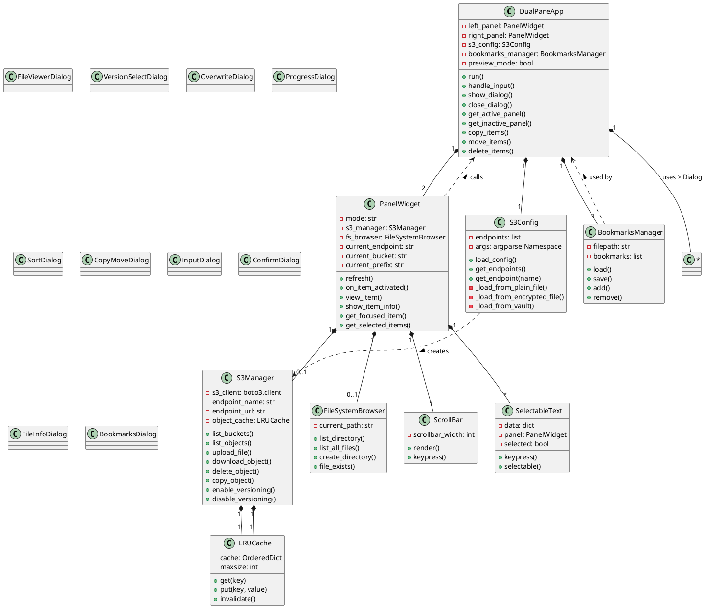
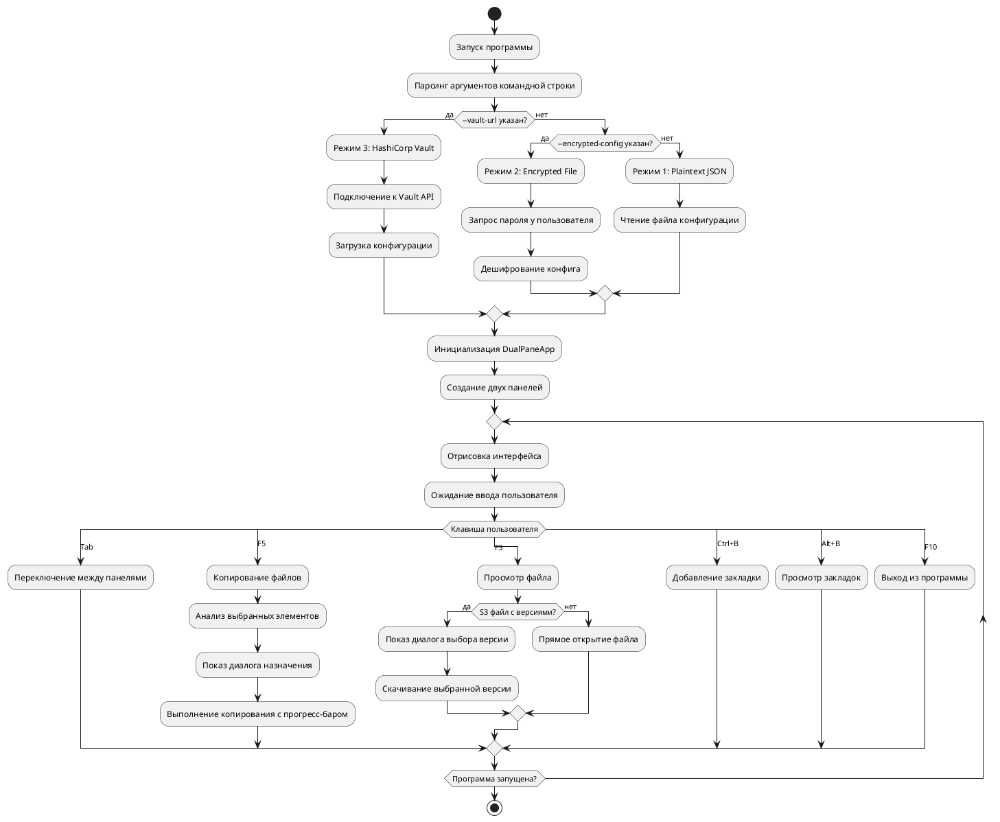

# S3 Commander v1.7.0 - Документация

## 🎯 Назначение программы

**S3 Commander** — это двухпанельный файловый менеджер с текстовым интерфейсом (TUI), предназначенный для работы с:
- **Локальной файловой системой** (FS)
- **Объектными хранилищами S3**, включая Ceph RADOS Gateway

Программа реализует концепцию классического файлового менеджера (в стиле Midnight Commander) с поддержкой современных функций облачных хранилищ, включая управление версиями объектов, шифрование конфигураций и интеграцию с HashiCorp Vault.

## 📋 Основные возможности

### 📁 **Управление файлами**
- Двухпанельный интерфейс с навигацией по Tab
- Копирование, перемещение, удаление файлов/папок (F5, F6, F8)
- Просмотр содержимого файлов (F3)
- Поддержка бинарных файлов (hex-просмотр)
- Создание директорий (F7)
- Подсчет размера директорий/бакетов

### ☁️ **Работа с S3**
- Поддержка множественных S3 endpoint'ов
- Управление бакетами (создание, удаление)
- Навигация по префиксам (виртуальные папки)
- Управление версионированием объектов (F11)
- Удаление старых версий (F9)
- Server-side копирование объектов
- Просмотр метаданных объектов (F4)

### 🔐 **Безопасность и конфигурация**
- Три режима хранения конфигурации:
  1. **Plaintext JSON** (простой файл)
  2. **Encrypted config** (шифрование AES)
  3. **HashiCorp Vault** (централизованное хранение)
- Быстрая проверка доступности endpoint'ов
- Автоматическое кеширование списков объектов

### 🎛 **Дополнительные функции**
- **Quick View Mode** (Ctrl+V) - предпросмотр файлов
- **Управление закладками** (Ctrl+B - добавить, Alt+B - просмотреть)
- **Фильтрация** по имени (/)
- **Сортировка** (F2) по имени, расширению, размеру, времени
- **Выбор файлов** по паттерну (+, -, * для инвертирования)
- **Пакетные операции** с прогресс-баром
- **Поддержка Windows/Linux/macOS**

## 🏗 Архитектура

### Диаграмма классов (PlantUML)



### Объектная диаграмма (PlantUML)

```plantuml
@startuml S3Commander_Object_Diagram

object app : DualPaneApp {
  left_panel = PanelWidget1
  right_panel = PanelWidget2
  s3_config = S3Config1
  bookmarks_manager = BookmarksManager1
  preview_mode = false
}

object PanelWidget1 : PanelWidget {
  mode = "fs"
  current_path = "/home/user"
  fs_browser = FileSystemBrowser1
}

object PanelWidget2 : PanelWidget {
  mode = "s3"
  current_endpoint = "ceph-primary"
  current_bucket = "my-bucket"
  current_prefix = "documents/"
  s3_manager = S3Manager1
}

object S3Config1 : S3Config {
  endpoints = [
    {name: "ceph-primary", url: "http://10.0.0.1:7480"},
    {name: "ceph-backup", url: "http://10.0.1.1:7480"}
  ]
}

object S3Manager1 : S3Manager {
  endpoint_name = "ceph-primary"
  endpoint_url = "http://10.0.0.1:7480"
  object_cache = LRUCache1
  bucket_cache = LRUCache2
}

object FileSystemBrowser1 : FileSystemBrowser {
  current_path = "/home/user"
}

object BookmarksManager1 : BookmarksManager {
  filepath = "bookmarks.json"
  bookmarks = [
    {name: "Home", type: "fs", path: "/home/user"},
    {name: "Work Bucket", type: "s3", endpoint: "ceph-primary", bucket: "work", prefix: ""}
  ]
}

object LRUCache1 : LRUCache {
  maxsize = 1000
  cache = {"bucket:my-bucket:documents/": [{name: "file1.txt", size: 1024}]}
}

object LRUCache2 : LRUCache {
  maxsize = 10
  cache = {"buckets:ceph-primary": ["my-bucket", "backup-bucket"]}
}

' Связи между объектами
app --> PanelWidget1
app --> PanelWidget2
app --> S3Config1
app --> BookmarksManager1

PanelWidget1 --> FileSystemBrowser1
PanelWidget2 --> S3Manager1

S3Manager1 --> LRUCache1
S3Manager1 --> LRUCache2

S3Config1 ..> S3Manager1 : creates
BookmarksManager1 ..> app : used by

@enduml
```

### Диаграмма потока данных



## ⌨️ Горячие клавиши (Hotkeys)

### Основная навигация
- **Tab** - Переключение между панелями
- **F10** - Выход из программы (с подтверждением)
- **Enter** - Открыть файл/папку/бакет
- **Esc** - Закрыть диалог/выйти из режима

### Операции с файлами
- **F3** - Просмотр файла
- **F4** - Информация о файле/бакете
- **F5** - Копирование
- **F6** - Перемещение
- **F7** - Создать директорию/бакет
- **F8** - Удалить
- **F9** - Удалить старые версии (S3)
- **F11** - Включить/выключить версионирование (S3)

### Выбор файлов
- **Insert** - Выбрать/снять выбор текущего файла
- **+** - Выбрать файлы по шаблону
- **-** - Снять выбор по шаблону
- ***** - Инвертировать выбор
- **Пробел** - Выбрать/снять выбор (альтернатива Insert)

### Дополнительные функции
- **F2** - Сортировка
- **/** - Фильтр по имени
- **Ctrl+V** - Режим предпросмотра (Quick View)
- **Ctrl+B** - Добавить закладку
- **Alt+B** - Просмотр закладок

### В диалогах
- **Enter** - Подтвердить/OK
- **Esc** - Отмена
- **F3** в диалоге версий - Просмотр версии
- **F5** в диалоге версий - Копирование версии
- **F6** в диалоге версий - Перемещение версии
- **F8** в диалоге версий - Удаление версии

## ⚙️ Конфигурационные файлы

### Режим 1: Plaintext JSON (по умолчанию)

Файл: `s3_config.json`
```json
{
  "endpoints": [
    {
      "name": "ceph-primary",
      "url": "http://10.0.0.1:7480",
      "access_key": "your_access_key",
      "secret_key": "your_secret_key"
    },
    {
      "name": "ceph-backup",
      "url": "http://10.0.1.1:7480",
      "access_key": "backup_access_key",
      "secret_key": "backup_secret_key"
    }
  ]
}
```

**Запуск:**
```bash
python s3-commander-v1.7.0.py
# или с явным указанием файла
python s3-commander-v1.7.0.py --config my_config.json
```

### Режим 2: Encrypted Config

Для создания зашифрованного конфига используйте отдельный скрипт (например, `encryptor.py`), который должен:
1. Запросить пароль
2. Зашифровать JSON конфиг с использованием PBKDF2 + Fernet
3. Сохранить соль и зашифрованные данные в файл

**Структура зашифрованного файла:**
```
[16 байт соли][зашифрованные данные JSON]
```

**Запуск:**
```bash
python s3-commander-v1.7.0.py --encrypted-config config.enc
```

### Режим 3: HashiCorp Vault

**Структура секрета в Vault:**
```json
{
  "data": {
    "endpoints": [
      {
        "name": "ceph-primary",
        "url": "http://10.0.0.1:7480",
        "access_key": "...",
        "secret_key": "..."
      }
    ]
  }
}
```

**Запуск:**
```bash
python s3-commander-v1.7.0.py \
  --vault-url http://127.0.0.1:8200 \
  --vault-path secret/data/s3commander \
  --vault-user myuser
```

### Файл закладок

Файл: `bookmarks.json` (автоматически создается)
```json
[
  {
    "name": "Home Directory",
    "type": "fs",
    "path": "/home/user"
  },
  {
    "name": "Production Bucket",
    "type": "s3",
    "endpoint": "ceph-primary",
    "bucket": "prod-data",
    "prefix": "logs/"
  }
]
```

## 🔧 Требования и установка

### Зависимости
```bash
pip install urwid boto3 cryptography requests
```

### Минимальные требования
- Python 3.7+
- Доступ к S3 endpoint (Ceph, MinIO, AWS S3)
- Для режима Vault: работающий сервер HashiCorp Vault
- Терминал с поддержкой UTF-8 и цветов

### Установка
1. Скачайте скрипт `s3-commander-v1.7.0.py`
2. Установите зависимости
3. Настройте конфигурационный файл
4. Запустите: `python s3-commander-v1.7.0.py`

## 📊 Особенности реализации

### Кеширование
- **LRU кеш** для списков объектов S3 (до 1000 записей)
- Кеш статуса версионирования бакетов
- Инвалидация кеша при операциях записи

### Многопоточность
- Фоновая загрузка объектов S3 (ленивая загрузка)
- Прогресс-бары для длительных операций
- Проверка доступности endpoint'ов без блокировки UI

### Обработка ошибок
- Градуированные сообщения об ошибках (info/warning/error)
- Проверка подключения перед созданием клиента S3
- Восстановление фокуса после операций

### Поддержка версионирования
- Отображение количества версий у файлов
- Диалог выбора конкретной версии
- Управление версионированием на уровне бакета
- Удаление старых версий

## 🚀 Быстрый старт

1. **Создайте базовый конфиг:**
```bash
cat > s3_config.json << EOF
{
  "endpoints": [
    {
      "name": "my-ceph",
      "url": "http://localhost:7480",
      "access_key": "access_key",
      "secret_key": "secret_key"
    }
  ]
}
EOF
```

2. **Запустите программу:**
```bash
python s3-commander-v1.7.0.py
```

3. **Основные действия:**
   - Нажмите Enter на `[FS] Local File System` для локальной панели
   - Нажмите Enter на `[S3] my-ceph` для S3 панели
   - Используйте Tab для переключения между панелями
   - Копируйте файлы между панелями с помощью F5

## 🔍 Отладка и логирование

Программа использует встроенные механизмы отладки через вывод в строку состояния. Для дополнительной отладки можно:

1. **Проверить подключение S3:**
```bash
curl http://localhost:7480
```

2. **Проверить конфигурацию:**
```python
python -c "import json; data=json.load(open('s3_config.json')); print('Endpoints:', len(data['endpoints']))"
```

3. **Включить отладку boto3 (при необходимости):**
```python
import boto3
boto3.set_stream_logger('')
```

## 📝 Примечания

### Ограничения
- Максимальный размер файла для предпросмотра: 100KB
- Кеш объектов: 1000 записей
- Поддержка только Userpass auth для Vault
- Для Windows требуется периодическое обновление UI (heartbeat)

### Рекомендации по производительности
- Для бакетов с >1000 объектов отключайте сортировку
- Используйте фильтрацию вместо полной загрузки
- Для массовых операций используйте пакетный режим

### Безопасность
- Не храните пароли Vault в аргументах командной строки
- Регулярно обновляйте криптографические ключи
- Используйте минимально необходимые права доступа S3
- Шифруйте конфигурационные файлы в production-средах

## 📄 Лицензия и автор

**Версия:** 1.7.0  
**Автор:** Тарасов Дмитрий

Программа распространяется по принципу "как есть". Для коммерческого использования рекомендуется проведение security-аудита.

---

*Документация обновлена для версии 1.7.0. Актуальную информацию смотрите в комментариях кода и help сообщениях программы.*
