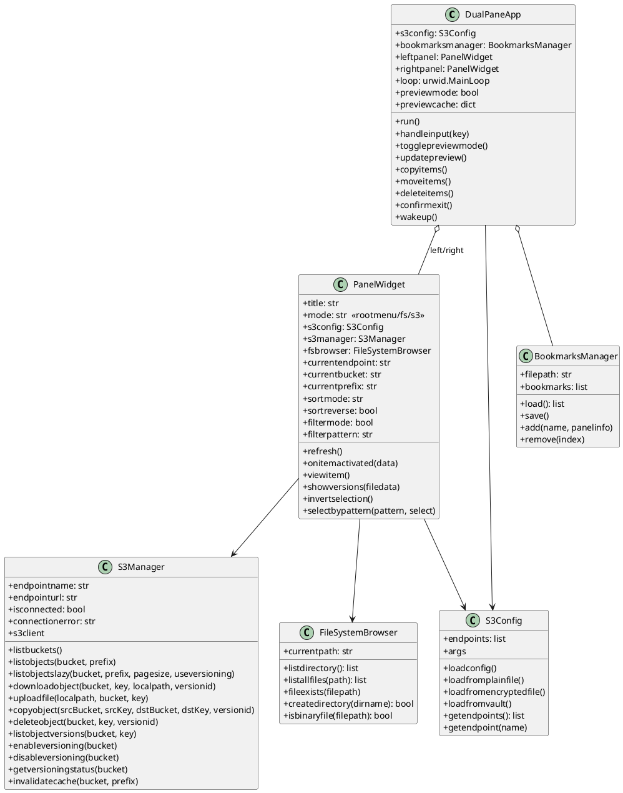
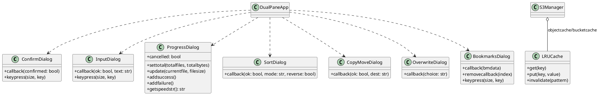
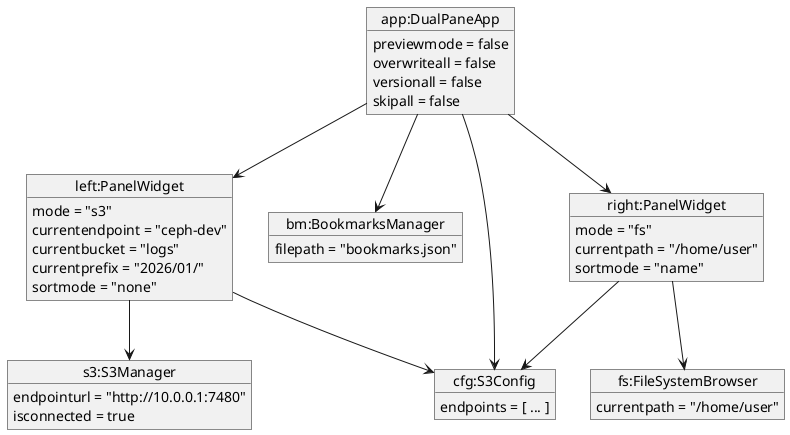

Ниже — заготовка подробного `README.md` для **S3 Commander v1.7.0** (один Python‑файл), а также развернутые UML‑диаграммы (PlantUML) по фактическим классам/связям, которые есть в коде. Программа — TUI двухпанельный файловый менеджер для локальной ФС и S3/Ceph (boto3), с копированием/перемещением/удалением, просмотром, быстрым превью, версиями и закладками.[1]

***

## README.md (готовый текст)

```markdown
# S3 Commander (v1.7.0)

**S3 Commander** — двухпанельный TUI‑файловый менеджер (как Midnight Commander), который позволяет работать с локальной файловой системой (FS) и S3‑совместимыми хранилищами (включая Ceph RGW) через `boto3`. Программа написана на Python и использует `urwid` для интерфейса. [file:1]

## Назначение

- Быстрая навигация по локальной ФС и S3 бакетам/префиксам в двух панелях. [file:1]
- Копирование/перемещение между панелями (FS↔S3, S3↔S3, FS↔FS), с прогрессом, подтверждениями перезаписи и опциями версионирования. [file:1]
- Просмотр файлов и информации об объектах/файлах; генерация presigned URL (в окне информации). [file:1]
- Работа с версионированием бакетов и версиями объектов S3 (просмотр/копирование/удаление версий, “purge old versions”). [file:1]
- Закладки (bookmarks) на FS пути и S3 локации для быстрого перехода. [file:1]

## Установка и зависимости

Минимально требуется:
- Python 3
- `urwid`
- `boto3` + `botocore` [file:1]

Опционально:
- `cryptography` — для режима зашифрованного конфига (Fernet + PBKDF2). [file:1]
- `requests` — для режима загрузки конфигурации из HashiCorp Vault по HTTP API. [file:1]

Пример установки зависимостей:
```bash
pip install urwid boto3 botocore requests cryptography
```
(Пакеты `requests`/`cryptography` нужны только для соответствующих режимов.) [file:1]

## Запуск

Основной сценарий:
```bash
python3 s3-commander-v1.7.0.py
```

### CLI параметры и режимы конфигурации

Программа поддерживает 3 режима загрузки S3 endpoints, выбирается параметрами запуска: [file:1]

1) **Plaintext JSON** (по умолчанию)
- `-c/--config` (default: `s3config.json`) — путь к обычному JSON конфигу. [file:1]

2) **Encrypted config** (Fernet)
- `-e/--encrypted-config` — путь к зашифрованному файлу конфига.
- При запуске будет запрошен пароль для расшифровки.
- Требует установленного `cryptography`. [file:1]

3) **HashiCorp Vault**
- `--vault-url` — URL Vault, например `http://127.0.0.1:8200`. Включает Vault‑режим. [file:1]
- `--vault-path` — путь к secret, например `secret/data/s3commander` (KV v2) или другой путь (KV v1). [file:1]
- `--vault-user` — username (если не задан, будет запрос в интерактиве). [file:1]
- `--vault-pass` — password (если не задан, будет запрос). [file:1]

## Конфигурационные файлы

### s3config.json (plaintext)

Файл должен содержать ключ `endpoints` со списком endpoints. В коде ожидаются как минимум поля `name`, `url`, `accesskey`, `secretkey` для каждого endpoint. [file:1]

Пример (шаблон):
```json
{
  "endpoints": [
    {
      "name": "ceph-dev",
      "url": "http://10.0.0.1:7480",
      "accesskey": "ACCESS_KEY",
      "secretkey": "SECRET_KEY"
    }
  ]
}
```

### Encrypted config

Зашифрованный файл содержит соль + encrypted blob; при чтении используется PBKDF2HMAC(SHA256) и Fernet. [file:1]

### Bookmarks (bookmarks.json)

Закладки хранятся в `bookmarks.json` (по умолчанию). Каждая закладка сохраняет `name` и `panelinfo`, где `panelinfo.type` ∈ `{fs, s3}` и дополнительно хранит путь/endpoint/bucket/prefix. [file:1]

## Режимы работы интерфейса (Panel modes)

Каждая панель (`PanelWidget`) может находиться в одном из режимов: [file:1]
- `rootmenu` — выбор источника (FS или S3). [file:1]
- `fs` — локальная файловая система (навигация по директориям/файлам). [file:1]
- `s3` — S3 навигация: endpoints → buckets → prefixes/objects. [file:1]

Контекст (endpoint/bucket/prefix) хранится в полях `currentendpoint`, `currentbucket`, `currentprefix`. [file:1]

## Возможности

### Навигация
- Две панели: активная/неактивная; большинство операций берут источник из активной панели, а назначение — из неактивной. [file:1]
- S3 уровни: список endpoints → список buckets → “директории” (prefix) и объекты. [file:1]
- Поддержка “..” (возврат на уровень вверх) как в FS, так и в S3 (back/parent). [file:1]

### Операции с файлами/объектами
- Copy/Move с прогресс‑диалогом, подсчетом файлов/байт, скоростью и возможностью отмены. [file:1]
- Delete (для файлов/директорий/объектов/префиксов, бакетов) с подтверждением и прогрессом. [file:1]
- Перезапись: диалог Overwrite/All/Skip/Skip All и (для S3 назначения) опции “New Version / Version All”. [file:1]

### Версии и версионирование
- Включение/отключение (Suspend) versioning для бакета. [file:1]
- Просмотр версий объекта и действия над выбранной версией (View/Copy/Move/Delete через диалоги/горячие клавиши). [file:1]
- Purge: удаление старых версий объекта (оставляя последнюю). [file:1]

### Просмотр и информация
- Просмотр файлов (FS) и S3 объектов (включая просмотр конкретной версии). [file:1]
- “File Info” диалог (в т.ч. с presigned URL на 1h — поле `URLFULL`). [file:1]
- Quick View (превью) в неактивной панели; ограничение по размеру (очень большие файлы не показываются). [file:1]

### Выбор файлов и фильтрация
- Выбор/снятие выбора, инверсия выбора. [file:1]
- Выбор по маске (glob/regex через `fnmatch.translate`), case‑insensitive. [file:1]
- Режим фильтра (pattern) для отображения/отбора. [file:1]

### Закладки
- Сохранение позиции панели в bookmarks и быстрый переход к закладке; удаление закладки. [file:1]

## Горячие клавиши (hotkeys)

Строка подсказок отображается в статус‑баре приложения и включает ключевые операции:  
`F2 sort  F3 view  F4 info  F5 copy  F6 move  F7 mkdir  F8 del  F9 purge  F10 quit  F11 versioning  filter  INS sel  select -unsel invert  CtrlV Quick View  CtrlB save bm  AltB load bm` [file:1]

Подробно (основные):
- `F2` — сортировка (SortDialog: none/name/ext/size/time + reverse). [file:1]
- `F3` — просмотр (View). [file:1]
- `F4` — информация (Info). [file:1]
- `F5` — копирование. [file:1]
- `F6` — перемещение. [file:1]
- `F7` — создать директорию (mkdir) / возможно create bucket (в зависимости от контекста панели). [file:1]
- `F8` — удаление. [file:1]
- `F9` — purge (для версий/старых версий). [file:1]
- `F10` — выход (с подтверждением). [file:1]
- `F11` — управление versioning для бакета (enable/suspend). [file:1]
- `Ctrl+V` — Quick View (preview mode on/off). [file:1]
- `Ctrl+B` — сохранить закладку (bookmark). [file:1]
- `Alt+B` — загрузить/перейти к закладке. [file:1]
- `Ins` — выбор/снятие выбора. [file:1]
- `invert` — инверсия выбора (в коде есть отдельная операция invertselection). [file:1]
- В диалогах почти везде: `Enter` подтверждает, `Esc` отменяет. [file:1]

Примечание: точная раскладка некоторых команд (например, “filter”, “invert” как отдельные клавиши) зависит от `handle_input` и текущего фокуса; общая подсказка берется из статус‑строки приложения. [file:1]

## Архитектура (внутри одного файла)

### Основные компоненты

- `DualPaneApp` — корневое приложение: две панели, главный `urwid.MainLoop`, обработка hotkeys, показ диалогов, режим preview, операции copy/move/delete/versioning. [file:1]
- `PanelWidget` — логика одной панели: режимы `rootmenu/fs/s3`, список элементов, сортировка, фильтр/selection, навигация, просмотр/инфо. [file:1]
- `S3Config` — загрузка списка endpoints из plaintext JSON / encrypted / Vault. [file:1]
- `S3Manager` — тонкая обертка над boto3 client: list buckets/objects, download/upload/copy/delete, versioning API, кеши (LRU) и invalidation. [file:1]
- `FileSystemBrowser` — операции по локальной ФС: listdir, рекурсивные списки, mkdir, бинарность файла. [file:1]
- Набор UI‑диалогов на `urwid`: `ConfirmDialog`, `InputDialog`, `ProgressDialog`, `SortDialog`, `CopyMoveDialog`, `OverwriteDialog`, диалог версий и др. [file:1]
- `BookmarksManager`/`BookmarksDialog` — хранение и UI управления закладками. [file:1]

### Потоки выполнения (concurrency)

- Длительные операции (copy/move/delete/size calculation/ленивая загрузка списков) выполняются в отдельных потоках `threading.Thread`. [file:1]
- UI обновляется через `urwid.MainLoop.set_alarm_in(...)` + механизм `wakeup()` (pipe на Unix) для безопасного обновления экрана. [file:1]

## Диагностика и ошибки

- Ошибки S3 соединения и API сохраняются в `S3Manager.connectionerror` и показываются пользователю через строку результата. [file:1]
- Для Vault режима реализован login по userpass и чтение secret с поддержкой KV v1/v2 структур. [file:1]
```

***

## PlantUML: диаграммы классов

### 1) Основная архитектура (Core classes)



### 2) UI диалоги и утилиты (Dialogs & helpers)



***

## PlantUML: объектная диаграмма (runtime snapshot)

Ниже — “снимок” типичного состояния: приложение запущено, левая панель в S3 (выбран endpoint+bucket+prefix), правая панель в FS, preview выключен, закладки подключены. (Имена/значения примерные, структура — как в коде.)[1]



***

Если нужно, можно дополнить README секцией “Сценарии использования” (например, “скачать каталог из S3 на FS”, “залить дерево на S3”, “очистить старые версии”), но для этого стоит уточнить, какие пользовательские workflow важнее: бэкапы, миграции, админка Ceph RGW, обслуживание логов и т.п.

[1](https://ppl-ai-file-upload.s3.amazonaws.com/web/direct-files/attachments/154680809/7a21fe6a-be5d-43af-a31e-736cb4835b58/s3-commander-v1.7.0.py)
