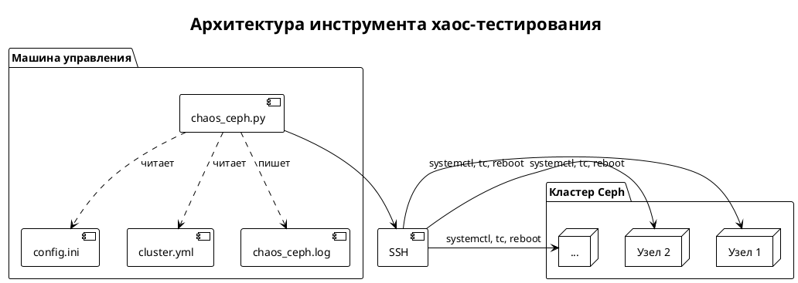
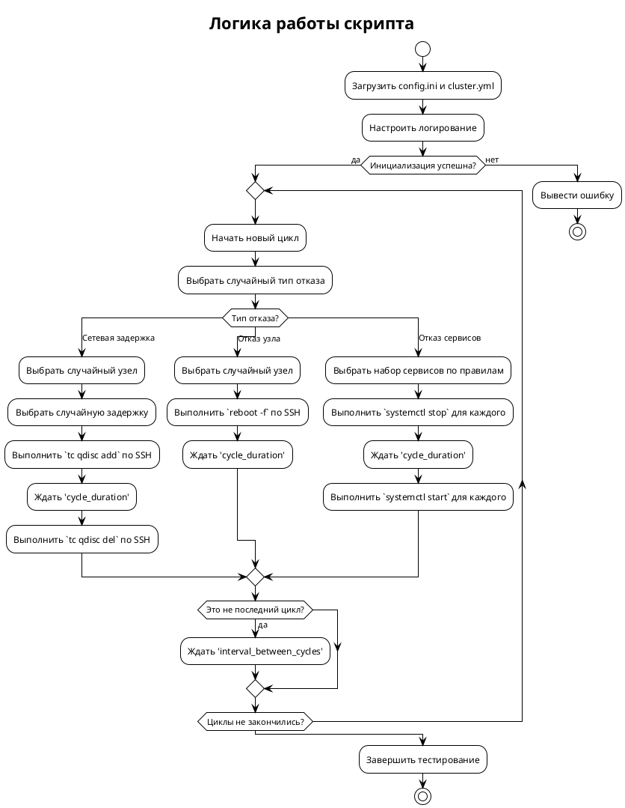

Отлично, коллега! Задача интересная и крайне актуальная. Создание надежного инструмента для хаос-тестирования Ceph — это ключ к построению отказоустойчивых хранилищ.

Ниже представлено комплексное решение, включающее:
1.  **Основной скрипт на Python (`chaos_ceph.py`)** — ядро нашего инструмента.
2.  **Пример конфигурационного файла (`config.ini`)** — для управления параметрами тестов.
3.  **Пример файла с описанием кластера (`cluster.yml`)** — для инвентаризации узлов и сервисов.
4.  **Диаграммы PlantUML** — для визуализации архитектуры и логики работы.

### Прежде чем мы начнем: Предварительные требования

1.  **Python 3.6+**: Установлен на машине, с которой будет запускаться скрипт.
2.  **Библиотека PyYAML**: Установите её командой `pip install pyyaml`.
3.  **Беспарольный доступ по SSH**: С машины, где запускается скрипт, должен быть настроен беспарольный доступ по SSH с правами `sudo` ко всем узлам кластера Ceph. Это стандартная практика для систем автоматизации. Например, через `ssh-copy-id user@ceph-node`.
4.  **Утилита `tc`**: Должна быть установлена на всех узлах кластера (обычно входит в пакет `iproute2`).
5.  **`sudo` без пароля**: Пользователь, под которым осуществляется SSH-подключение, должен иметь право выполнять команды `systemctl`, `reboot`, `tc` через `sudo` без ввода пароля. Это настраивается в файле `/etc/sudoers.d/`.

---

### 1. Файл описания кластера (`cluster.yml`)

Этот YAML-файл описывает топологию вашего кластера. Он гибкий и позволяет легко добавлять или изменять узлы и их роли.

```yaml
# cluster.yml
# Описание топологии кластера Ceph.
# hostname: Имя хоста, как оно известно в сети и для SSH.
# roles: Список сервисов, работающих на данном узле.
# osd_ids: (Только для OSD-узлов) Список числовых идентификаторов OSD, запущенных на этом узле.
nodes:
  # 4 узла с RGW, Haproxy, Keepalived
  - hostname: ceph-rgw-01.domain.local
    roles: [rgw, haproxy, keepalived]
  - hostname: ceph-rgw-02.domain.local
    roles: [rgw, haproxy, keepalived]
  - hostname: ceph-rgw-03.domain.local
    roles: [rgw, haproxy, keepalived]
  - hostname: ceph-rgw-04.domain.local
    roles: [rgw, haproxy, keepalived]

  # 2 узла с MDS, Haproxy, Keepalived
  - hostname: ceph-mds-01.domain.local
    roles: [mds, haproxy, keepalived]
  - hostname: ceph-mds-02.domain.local
    roles: [mds, haproxy, keepalived]

  # 5 узлов с MGR, MON, Haproxy
  - hostname: ceph-mon-01.domain.local
    roles: [mgr, mon, haproxy]
  - hostname: ceph-mon-02.domain.local
    roles: [mgr, mon, haproxy]
  - hostname: ceph-mon-03.domain.local
    roles: [mgr, mon, haproxy]
  - hostname: ceph-mon-04.domain.local
    roles: [mgr, mon, haproxy]
  - hostname: ceph-mon-05.domain.local
    roles: [mgr, mon, haproxy]

  # 6 OSD-узлов
  - hostname: ceph-osd-01.domain.local
    roles: [osd]
    osd_ids: [0, 1, 2, 3, 4]
  - hostname: ceph-osd-02.domain.local
    roles: [osd]
    osd_ids: [5, 6, 7, 8]
  - hostname: ceph-osd-03.domain.local
    roles: [osd]
    osd_ids: [9, 10, 11, 12, 13, 14]
  - hostname: ceph-osd-04.domain.local
    roles: [osd]
    osd_ids: [15, 16, 17, 18]
  - hostname: ceph-osd-05.domain.local
    roles: [osd]
    osd_ids: [19, 20, 21, 22, 23]
  - hostname: ceph-osd-06.domain.local
    roles: [osd]
    osd_ids: [24, 25, 26, 27]
```

### 2. Конфигурационный файл (`config.ini`)

Здесь задаются все параметры хаос-тестирования.

```ini
# config.ini
[main]
# Пользователь для SSH-подключений
ssh_user = ceph-admin
# Путь к лог-файлу
log_file = chaos_ceph.log
# Общее количество циклов хаос-тестирования
cycles = 10
# Длительность одного цикла (влияния отказа) в секундах
cycle_duration_seconds = 300
# Интервал между циклами в секундах
interval_between_cycles_seconds = 60

[network_latency]
# Варианты сетевой задержки в миллисекундах.
# В каждом цикле будет выбран случайный вариант из этого списка.
# Формат: <задержка>ms, <задержка>ms, ...
latency_options_ms = 50, 100, 200
# Сетевой интерфейс, на котором будет вводиться задержка.
# Убедитесь, что этот интерфейс используется для Ceph Public/Cluster сети.
network_interface = eth0

[service_failure]
# Имена системных сервисов (systemd units).
# Важно: для OSD используется шаблон, т.к. имя зависит от ID.
# '%i' будет заменено на конкретный ID OSD.
rgw_service_name = ceph-radosgw@rgw.%i.service
mds_service_name = ceph-mds@%i.service
mgr_service_name = ceph-mgr@%i.service
mon_service_name = ceph-mon@%i.service
osd_service_name = ceph-osd@%i.service
haproxy_service_name = haproxy.service
keepalived_service_name = keepalived.service
```
**Примечание:** Имена сервисов (особенно для `rgw`, `mds`, `mgr`, `mon`) могут отличаться в зависимости от вашей конфигурации. `ceph-radosgw@rgw.<hostname>.service` или просто `ceph-radosgw.service`. Уточните имена с помощью `systemctl status`. В примере используется `systemd template units`, где `%i` заменяется на ID/имя инстанса. Я оставил это гибким, но для простоты можно использовать конкретные имена, если они статичны.

### 3. Основной скрипт (`chaos_ceph.py`)

Это сердце нашего инструмента. Скрипт хорошо структурирован и прокомментирован.

```python
# chaos_ceph.py

import argparse
import configparser
import logging
import random
import subprocess
import sys
import time
from typing import List, Dict, Any, Tuple

import yaml


class ChaosCeph:
    """
    Класс для проведения хаос-тестирования кластера Ceph.
    Инкапсулирует всю логику по взаимодействию с кластером,
    конфигурацией и выполнением хаос-сценариев.
    """

    def __init__(self, config_path: str, cluster_path: str):
        """
        Инициализирует экземпляр ChaosCeph.

        :param config_path: Путь к файлу конфигурации (.ini).
        :param cluster_path: Путь к файлу с описанием кластера (.yml).
        """
        self.config = self._load_config(config_path)
        self.cluster_info = self._load_cluster_info(cluster_path)
        self.logger = self._setup_logging()

        # Параметры из конфигурации
        self.ssh_user = self.config.get('main', 'ssh_user')
        self.cycles = self.config.getint('main', 'cycles')
        self.cycle_duration = self.config.getint('main', 'cycle_duration_seconds')
        self.interval = self.config.getint('main', 'interval_between_cycles_seconds')

        self.logger.info("=" * 50)
        self.logger.info("Инициализация Chaos-инженера для Ceph завершена.")
        self.logger.info(f"Запланировано циклов: {self.cycles}")
        self.logger.info(f"Длительность цикла: {self.cycle_duration} сек.")
        self.logger.info(f"Интервал между циклами: {self.interval} сек.")
        self.logger.info("=" * 50)

    def _load_config(self, path: str) -> configparser.ConfigParser:
        """Загружает конфигурацию из INI-файла."""
        try:
            config = configparser.ConfigParser()
            if not config.read(path):
                raise FileNotFoundError(f"Файл конфигурации не найден: {path}")
            return config
        except Exception as e:
            print(f"Ошибка при чтении файла конфигурации {path}: {e}")
            sys.exit(1)

    def _load_cluster_info(self, path: str) -> Dict[str, Any]:
        """Загружает информацию о кластере из YAML-файла."""
        try:
            with open(path, 'r', encoding='utf-8') as f:
                return yaml.safe_load(f)
        except FileNotFoundError:
            print(f"Файл описания кластера не найден: {path}")
            sys.exit(1)
        except yaml.YAMLError as e:
            print(f"Ошибка при парсинге YAML-файла {path}: {e}")
            sys.exit(1)

    def _setup_logging(self) -> logging.Logger:
        """Настраивает систему логирования."""
        log_file = self.config.get('main', 'log_file')
        logger = logging.getLogger('ChaosCeph')
        logger.setLevel(logging.INFO)

        # Обработчик для записи в файл
        fh = logging.FileHandler(log_file, encoding='utf-8')
        fh.setLevel(logging.INFO)

        # Обработчик для вывода в консоль
        ch = logging.StreamHandler(sys.stdout)
        ch.setLevel(logging.INFO)

        # Форматтер
        formatter = logging.Formatter('%(asctime)s - %(levelname)s - %(message)s')
        fh.setFormatter(formatter)
        ch.setFormatter(formatter)

        logger.addHandler(fh)
        logger.addHandler(ch)

        return logger

    def _execute_ssh_command(self, hostname: str, command: str) -> Tuple[bool, str, str]:
        """
        Выполняет команду на удаленном узле по SSH.

        :param hostname: Имя хоста для подключения.
        :param command: Команда для выполнения.
        :return: Кортеж (успех: bool, stdout: str, stderr: str).
        """
        ssh_command = [
            'ssh',
            '-o', 'StrictHostKeyChecking=no',  # Для автоматизации
            '-o', 'BatchMode=yes',            # Не запрашивать пароль
            f'{self.ssh_user}@{hostname}',
            command
        ]
        self.logger.debug(f"Выполнение на {hostname}: {' '.join(ssh_command)}")
        try:
            process = subprocess.run(
                ssh_command,
                capture_output=True,
                text=True,
                check=False,  # Не выбрасывать исключение при ненулевом коде возврата
                encoding='utf-8'
            )
            if process.returncode != 0:
                self.logger.warning(
                    f"Команда на {hostname} завершилась с ошибкой (код {process.returncode}):\n"
                    f"STDOUT: {process.stdout.strip()}\n"
                    f"STDERR: {process.stderr.strip()}"
                )
                return False, process.stdout, process.stderr
            return True, process.stdout, process.stderr
        except Exception as e:
            self.logger.error(f"Критическая ошибка при выполнении SSH-команды на {hostname}: {e}")
            return False, "", str(e)

    def _get_nodes_by_role(self, role: str) -> List[Dict[str, Any]]:
        """Возвращает список узлов с заданной ролью."""
        return [node for node in self.cluster_info['nodes'] if role in node['roles']]

    def _get_all_nodes(self) -> List[Dict[str, Any]]:
        """Возвращает список всех узлов в кластере."""
        return self.cluster_info['nodes']

    def inject_network_latency(self):
        """
        Сценарий: введение сетевой задержки на случайном узле.
        Использует утилиту `tc` (traffic control).
        """
        self.logger.info("--- СЦЕНАРИЙ: СЕТЕВАЯ ЗАДЕРЖКА ---")
        target_node = random.choice(self._get_all_nodes())
        hostname = target_node['hostname']
        interface = self.config.get('network_latency', 'network_interface')
        latency_options = self.config.get('network_latency', 'latency_options_ms').split(',')
        latency = random.choice(latency_options).strip()

        add_latency_cmd = (
            f"sudo tc qdisc add dev {interface} root netem delay {latency}ms"
        )
        del_latency_cmd = (
            f"sudo tc qdisc del dev {interface} root netem"
        )

        self.logger.info(f"Вводим задержку {latency}ms на узле {hostname} (интерфейс {interface})")
        success, _, _ = self._execute_ssh_command(hostname, add_latency_cmd)

        if not success:
            self.logger.error(f"Не удалось ввести задержку на {hostname}. Пропускаем цикл.")
            # Попытка очистить, если правило было добавлено частично
            self._execute_ssh_command(hostname, del_latency_cmd)
            return

        try:
            self.logger.info(f"Задержка активна. Ожидаем {self.cycle_duration} секунд...")
            time.sleep(self.cycle_duration)
        finally:
            self.logger.info(f"Устраняем задержку на узле {hostname}")
            self._execute_ssh_command(hostname, del_latency_cmd)

    def inject_node_failure(self):
        """
        Сценарий: симуляция отказа целого узла (перезагрузка).
        """
        self.logger.info("--- СЦЕНАРИЙ: ОТКАЗ УЗЛА ---")
        # Выбираем случайный узел из всего кластера
        target_node = random.choice(self._get_all_nodes())
        hostname = target_node['hostname']
        
        self.logger.info(f"Симулируем отказ узла {hostname} (выполняется принудительная перезагрузка)")
        # Команда reboot немедленно обрывает соединение, поэтому мы не ждем ответа
        # Используем 'nohup' и '&', чтобы команда гарантированно запустилась в фоне
        reboot_cmd = "sudo nohup reboot -f &"
        self._execute_ssh_command(hostname, reboot_cmd)
        
        self.logger.info(f"Команда на перезагрузку отправлена. Ожидаем {self.cycle_duration} секунд...")
        self.logger.info("Узел должен восстановиться самостоятельно после перезагрузки.")
        time.sleep(self.cycle_duration)

    def _get_service_name(self, role: str, hostname: str, entity_id: Any = None) -> str:
        """Формирует имя systemd-сервиса на основе роли и конфигурации."""
        template = self.config.get('service_failure', f'{role}_service_name')
        
        # Подстановка ID для шаблонных сервисов
        if '%i' in template:
            # Для OSD id - это число. Для других - имя хоста (часто).
            instance_id = entity_id if entity_id is not None else hostname
            return template.replace('%i', str(instance_id))
        return template

    def inject_service_failure(self):
        """
        Сценарий: отказ набора случайных сервисов на разных узлах.
        """
        self.logger.info("--- СЦЕНАРИЙ: ОТКАЗ СЕРВИСОВ ---")
        services_to_kill = []
        
        # Собираем цели для атаки согласно заданным правилам
        service_map = {
            'rgw': 1, 'mds': 1, 'mgr': 1, 'osd': 2, 'haproxy': 1, 'keepalived': 1
        }

        for role, count in service_map.items():
            candidate_nodes = self._get_nodes_by_role(role)
            if not candidate_nodes:
                self.logger.warning(f"Не найдены узлы с ролью '{role}'. Пропускаем.")
                continue

            if role == 'osd':
                # Для OSD логика сложнее: нужно выбрать `count` OSD с разных узлов
                osd_pool = []
                for node in candidate_nodes:
                    for osd_id in node.get('osd_ids', []):
                        osd_pool.append({'hostname': node['hostname'], 'osd_id': osd_id})
                
                if len(osd_pool) < count:
                    self.logger.warning(f"Недостаточно OSD ({len(osd_pool)}) для выбора {count}. Пропускаем OSD.")
                    continue
                
                chosen_osds = random.sample(osd_pool, count)
                for osd in chosen_osds:
                    service_name = self._get_service_name('osd', osd['hostname'], osd['osd_id'])
                    services_to_kill.append({'hostname': osd['hostname'], 'service': service_name})
            else:
                # Для остальных сервисов выбираем `count` случайных узлов
                if len(candidate_nodes) < count:
                    self.logger.warning(f"Недостаточно узлов с ролью '{role}' ({len(candidate_nodes)}) для выбора {count}. Пропускаем.")
                    continue
                
                chosen_nodes = random.sample(candidate_nodes, count)
                for node in chosen_nodes:
                    hostname = node['hostname']
                    service_name = self._get_service_name(role, hostname, hostname) # Используем hostname как ID для rgw, mds и т.д.
                    services_to_kill.append({'hostname': hostname, 'service': service_name})

        if not services_to_kill:
            self.logger.error("Не удалось выбрать ни одного сервиса для остановки. Пропускаем цикл.")
            return

        self.logger.info("Останавливаем следующие сервисы:")
        for target in services_to_kill:
            self.logger.info(f"  - Сервис: {target['service']} на узле: {target['hostname']}")
            stop_cmd = f"sudo systemctl stop {target['service']}"
            self._execute_ssh_command(target['hostname'], stop_cmd)

        try:
            self.logger.info(f"Сервисы остановлены. Ожидаем {self.cycle_duration} секунд...")
            time.sleep(self.cycle_duration)
        finally:
            self.logger.info("Восстанавливаем остановленные сервисы:")
            for target in services_to_kill:
                self.logger.info(f"  - Запускаем сервис: {target['service']} на узле: {target['hostname']}")
                start_cmd = f"sudo systemctl start {target['service']}"
                self._execute_ssh_command(target['hostname'], start_cmd)

    def run_chaos_cycles(self):
        """
        Основной цикл выполнения хаос-тестирования.
        """
        self.logger.info("Начинаем хаос-тестирование...")
        
        # Список доступных "обезьян хаоса"
        chaos_monkeys = [
            self.inject_network_latency,
            self.inject_node_failure,
            self.inject_service_failure
        ]

        for i in range(1, self.cycles + 1):
            self.logger.info(f"\n{'='*20} ЦИКЛ {i}/{self.cycles} {'='*20}")
            
            # Выбираем случайный тип отказа
            chosen_monkey = random.choice(chaos_monkeys)
            
            try:
                chosen_monkey()
                self.logger.info(f"Цикл {i} завершен успешно.")
            except Exception as e:
                self.logger.error(f"В цикле {i} произошла непредвиденная ошибка: {e}", exc_info=True)

            if i < self.cycles:
                self.logger.info(f"Пауза перед следующим циклом: {self.interval} секунд.")
                time.sleep(self.interval)

        self.logger.info("\n" + "=" * 50)
        self.logger.info("Все циклы хаос-тестирования завершены.")
        self.logger.info("=" * 50)


if __name__ == '__main__':
    parser = argparse.ArgumentParser(description="Инструмент для хаос-тестирования кластера Ceph.")
    parser.add_argument(
        '-c', '--config',
        default='config.ini',
        help='Путь к файлу конфигурации (по умолчанию: config.ini)'
    )
    parser.add_argument(
        '-i', '--inventory',
        default='cluster.yml',
        help='Путь к файлу с описанием кластера (по умолчанию: cluster.yml)'
    )
    args = parser.parse_args()

    try:
        chaos_runner = ChaosCeph(config_path=args.config, cluster_path=args.inventory)
        chaos_runner.run_chaos_cycles()
    except Exception as main_exc:
        print(f"Критическая ошибка при запуске скрипта: {main_exc}")
        sys.exit(1)

```

### Как запустить скрипт

1.  Сохраните все три файла (`chaos_ceph.py`, `config.ini`, `cluster.yml`) в одной директории.
2.  Отредактируйте `cluster.yml` и `config.ini` в соответствии с параметрами вашего реального кластера и SSH-доступа.
3.  Убедитесь, что выполнены все предварительные требования (Python, PyYAML, SSH-доступ).
4.  Запустите скрипт из командной строки:
    ```bash
    python chaos_ceph.py
    ```
    Или с явным указанием путей:
    ```bash
    python chaos_ceph.py --config /path/to/my_config.ini --inventory /path/to/my_cluster.yml
    ```
5.  Наблюдайте за выводом в консоли и в лог-файле `chaos_ceph.log`.

---

### 4. Диаграммы PlantUML

#### Диаграмма компонентов (Component Diagram)

Эта диаграмма показывает архитектуру решения: как скрипт взаимодействует с файлами и целевым кластером.




#### Диаграмма деятельности (Activity Diagram)

Эта диаграмма иллюстрирует логику работы основного цикла скрипта `run_chaos_cycles`.




Это решение представляет собой прочную основу для хаос-тестирования Ceph. Его можно и нужно расширять, добавляя новые типы отказов (например, порча данных, ошибки I/O, симуляция заполнения дисков), а также интеграцию с системами мониторинга для автоматической оценки влияния каждого отказа.
