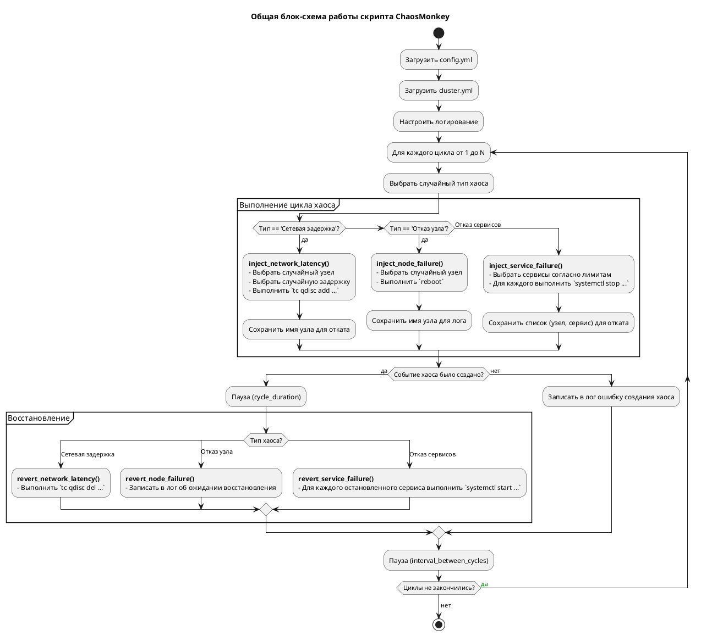
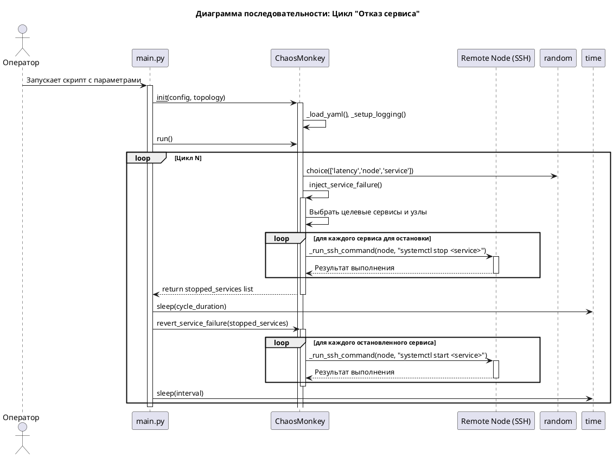

Отлично! Как опытный Python-разработчик с фокусом на хаос-инжиниринге, я подготовлю для вас комплексное решение. Оно будет включать в себя сам скрипт, примеры конфигурационных файлов и диаграммы, объясняющие его работу.

### Философия скрипта

Этот скрипт построен на следующих принципах:
1.  **Идемпотентность:** По возможности, повторный запуск "восстанавливающих" команд не должен вызывать ошибок. Например, запуск уже запущенного сервиса (`systemctl start`) обычно проходит без проблем.
2.  **Безопасность:** Скрипт использует SSH для удаленного выполнения команд. **Ключевым требованием является предварительная настройка беспарольного доступа по SSH ключам** от машины, где запускается скрипт, до всех узлов кластера Ceph под указанным пользователем (например, `root` или `ceph-admin`).
3.  **Конфигурируемость:** Вся логика, специфичная для окружения (имена хостов, параметры тестов), вынесена в конфигурационные файлы.
4.  **Детализированное логирование:** Логи — это основной результат хаос-тестов. Они должны четко отвечать на вопросы: "Что сломалось?", "Когда сломалось?", "Когда восстановилось?".

---

### 1. Файлы конфигурации

Сначала создадим два необходимых YAML-файла: для конфигурации самого теста и для описания топологии кластера.

#### `config.yml` (Параметры теста)
Этот файл определяет, *как* проводить тестирование.

```yaml
# ==========================================================
#         Конфигурация для скрипта хаос-тестирования
# ==========================================================

# Параметры выполнения циклов тестирования
test_parameters:
  cycles: 10                          # Общее количество циклов хаоса
  cycle_duration_seconds: 300         # Длительность одного "события хаоса" (в секундах)
  interval_between_cycles_seconds: 60 # Пауза между окончанием одного цикла и началом следующего

# Параметры для удаленного подключения к узлам
ssh_options:
  user: "root"                        # Пользователь для SSH-подключения (должен иметь права на перезагрузку и управление сервисами)
  key_path: "~/.ssh/id_rsa"           # Путь к приватному SSH ключу (опционально, если используется стандартный)
  network_interface: "eth0"           # Сетевой интерфейс на узлах для внесения задержки

# Параметры для конкретных типов хаоса
chaos_options:
  # Настройки для симуляции сетевых проблем
  network_latency:
    delays_ms: [50, 100, 150, 200]     # Список возможных значений задержки в миллисекундах для случайного выбора

  # Лимиты на одновременную остановку сервисов за один цикл
  service_failure:
    limits:
      rgw: 1
      mds: 1
      mgr: 1
      osd: 2
      haproxy: 1
      keepalived: 1

# Путь к файлу логов
log_file: "chaos_ceph.log"
```

#### `cluster.yml` (Описание топологии кластера)
Этот файл описывает, *где* проводить тестирование. Структура соответствует вашему описанию.

```yaml
# ==========================================================
#         Описание топологии кластера Ceph
# ==========================================================
# Ключевое требование: имена хостов (host) должны быть доступны
# для разрешения (resolvable) с машины, где запускается скрипт.

# Узлы с RadosGW, HAProxy и Keepalived
# На каждом узле сервис RGW называется ceph-radosgw@rgw.{hostname}.service
rgw_nodes:
  - host: rgw01.ceph.local
  - host: rgw02.ceph.local
  - host: rgw03.ceph.local
  - host: rgw04.ceph.local

# Узлы с MDS, HAProxy и Keepalived
# На каждом узле сервис MDS называется ceph-mds@{hostname}.service
mds_nodes:
  - host: mds01.ceph.local
  - host: mds02.ceph.local

# Узлы с MON, MGR и HAProxy
# Сервисы: ceph-mon@{hostname}.service и ceph-mgr@{hostname}.service
# ВАЖНО: Мы не будем намеренно останавливать MON, так как это может привести
# к потере кворума и полному отказу кластера, что выходит за рамки
# управляемого хаос-тестирования. Мы будем останавливать только MGR.
mon_mgr_nodes:
  - host: mon01.ceph.local
  - host: mon02.ceph.local
  - host: mon03.ceph.local
  - host: mon04.ceph.local
  - host: mon05.ceph.local

# Узлы с OSD
# Для каждого узла перечисляются номера OSD, которые на нем запущены.
# Сервис OSD называется ceph-osd@{id}.service
osd_nodes:
  - host: osd01.ceph.local
    osds: [0, 1, 2, 3, 4, 5]
  - host: osd02.ceph.local
    osds: [6, 7, 8, 9, 10]
  - host: osd03.ceph.local
    osds: [11, 12, 13, 14]
  - host: osd04.ceph.local
    osds: [15, 16, 17, 18, 19]
  - host: osd05.ceph.local
    osds: [20, 21, 22, 23]
  - host: osd06.ceph.local
    osds: [24, 25, 26, 27, 28, 29]

```

---

### 2. Скрипт на Python (`chaos_ceph.py`)

Этот скрипт реализует всю логику, описанную в задании.

```python
#!/usr/bin/env python3
# -*- coding: utf-8 -*-

import argparse
import logging
import random
import shlex
import subprocess
import sys
import time
from typing import List, Dict, Any, Tuple, Optional

import yaml

# Отключаем предупреждения от PyYAML о загрузке без Loader
try:
    from yaml import CLoader as Loader
except ImportError:
    from yaml import Loader


class ChaosMonkey:
    """
    Основной класс для оркестрации хаос-тестирования кластера Ceph.
    """

    def __init__(self, config_path: str, cluster_path: str):
        """
        Инициализация ChaosMonkey.
        
        :param config_path: Путь к файлу конфигурации теста.
        :param cluster_path: Путь к файлу с описанием топологии кластера.
        """
        self.config = self._load_yaml(config_path)
        self.cluster_map = self._load_yaml(cluster_path)
        self._setup_logging()
        
        # Разбор конфигурации для удобного доступа
        self.test_params = self.config['test_parameters']
        self.ssh_user = self.config['ssh_options']['user']
        self.ssh_key = self.config['ssh_options'].get('key_path') # .get для обратной совместимости
        self.net_iface = self.config['ssh_options']['network_interface']
        self.chaos_opts = self.config['chaos_options']
        
        logging.info("ChaosMonkey инициализирован. Конфигурация загружена.")
        self._validate_cluster_map()


    def _load_yaml(self, path: str) -> Dict[str, Any]:
        """Загружает и парсит YAML-файл."""
        try:
            with open(path, 'r', encoding='utf-8') as f:
                return yaml.load(f, Loader=Loader)
        except FileNotFoundError:
            logging.error(f"Файл не найден: {path}")
            sys.exit(1)
        except yaml.YAMLError as e:
            logging.error(f"Ошибка парсинга YAML файла {path}: {e}")
            sys.exit(1)

    def _setup_logging(self):
        """Настраивает систему логирования."""
        logging.basicConfig(
            level=logging.INFO,
            format='%(asctime)s - %(levelname)s - %(message)s',
            handlers=[
                logging.FileHandler(self.config['log_file']),
                logging.StreamHandler(sys.stdout)
            ]
        )

    def _validate_cluster_map(self):
        """Проверяет наличие необходимых ключей в карте кластера."""
        required_keys = ['rgw_nodes', 'mds_nodes', 'mon_mgr_nodes', 'osd_nodes']
        for key in required_keys:
            if key not in self.cluster_map or not self.cluster_map[key]:
                logging.warning(f"В файле cluster.yml отсутствует или пуст раздел '{key}'. Соответствующие тесты будут пропущены.")

    def _run_ssh_command(self, node: str, command: str) -> bool:
        """
        Выполняет команду на удаленном узле через SSH.
        
        :param node: Имя хоста или IP-адрес узла.
        :param command: Команда для выполнения.
        :return: True, если команда выполнилась успешно, иначе False.
        """
        ssh_cmd_parts = ["ssh", "-o", "StrictHostKeyChecking=no"]
        if self.ssh_key:
            ssh_cmd_parts.extend(["-i", self.ssh_key])
        
        full_command = ssh_cmd_parts + [f"{self.ssh_user}@{node}", command]
        
        logging.info(f"Выполнение на {node}: {command}")
        try:
            # Используем sudo для команд, требующих повышенных привилегий
            result = subprocess.run(shlex.split(f"ssh {self.ssh_user}@{node} 'sudo {command}'"),
                                    capture_output=True, text=True, check=True, timeout=60)
            logging.info(f"Успех на {node}. STDOUT: {result.stdout.strip()}")
            return True
        except subprocess.CalledProcessError as e:
            logging.error(f"Ошибка выполнения команды на {node}. Команда: '{command}'.")
            logging.error(f"Return code: {e.returncode}")
            logging.error(f"STDOUT: {e.stdout.strip()}")
            logging.error(f"STDERR: {e.stderr.strip()}")
            return False
        except subprocess.TimeoutExpired:
            logging.error(f"Таймаут выполнения команды на {node}: '{command}'")
            return False

    def _get_all_nodes_by_role(self, *roles) -> List[str]:
        """Возвращает список всех хостов для указанных ролей."""
        nodes = set()
        for role in roles:
            for node_info in self.cluster_map.get(role, []):
                nodes.add(node_info['host'])
        return list(nodes)

    # --- Методы для внесения хаоса ---

    def inject_network_latency(self) -> Optional[str]:
        """
        Вносит сетевую задержку на случайный узел.
        Использует `tc` (traffic control) для добавления задержки.
        """
        all_nodes = self._get_all_nodes_by_role('rgw_nodes', 'mds_nodes', 'mon_mgr_nodes', 'osd_nodes')
        if not all_nodes:
            logging.warning("Нет доступных узлов для внесения сетевой задержки.")
            return None

        target_node = random.choice(all_nodes)
        delay = random.choice(self.chaos_opts['network_latency']['delays_ms'])
        
        logging.info(f"CHAOS: Вносим сетевую задержку {delay}ms на узел {target_node} (интерфейс {self.net_iface})")
        
        # Удаляем предыдущие правила netem на всякий случай
        self._run_ssh_command(target_node, f"tc qdisc del dev {self.net_iface} root")
        
        # Добавляем новое правило
        command = f"tc qdisc add dev {self.net_iface} root netem delay {delay}ms"
        if self._run_ssh_command(target_node, command):
            return target_node
        return None

    def revert_network_latency(self, node: str):
        """Восстанавливает нормальную работу сети на узле."""
        logging.info(f"REVERT: Убираем сетевую задержку с узла {node}")
        command = f"tc qdisc del dev {self.net_iface} root"
        self._run_ssh_command(node, command)

    def inject_node_failure(self) -> Optional[str]:
        """
        Симулирует отказ случайного узла путем его перезагрузки.
        Выбирается один случайный узел из всех доступных.
        """
        # Собираем все типы узлов, чтобы выбрать один случайный
        node_types = list(self.cluster_map.keys())
        if not node_types:
            logging.warning("Нет доступных узлов для симуляции отказа.")
            return None
        
        random_node_type = random.choice(node_types)
        nodes_of_type = self.cluster_map.get(random_node_type, [])
        if not nodes_of_type:
             logging.warning(f"Нет узлов типа '{random_node_type}' для симуляции отказа.")
             return None

        target_node_info = random.choice(nodes_of_type)
        target_node = target_node_info['host']
        
        logging.info(f"CHAOS: Симулируем отказ узла {target_node} (тип: {random_node_type}) через перезагрузку.")
        
        command = "reboot"
        # Для reboot не ждем успешного завершения, т.к. соединение оборвется
        try:
            # Используем низкий таймаут, так как команда не вернет ответ
            subprocess.run(shlex.split(f"ssh {self.ssh_user}@{target_node} 'sudo {command}'"), timeout=5)
        except subprocess.TimeoutExpired:
            logging.info(f"Команда reboot отправлена на {target_node}, соединение разорвано, как и ожидалось.")
        except Exception as e:
            logging.error(f"Не удалось отправить команду reboot на {target_node}: {e}")
            return None
            
        return target_node

    def revert_node_failure(self, node: str):
        """Логирует ожидание восстановления узла."""
        # Фактическое восстановление - это загрузка ОС. Мы просто логируем этот шаг.
        logging.info(f"REVERT: Отказ узла {node} завершен. Ожидается, что узел самостоятельно вернется в строй.")

    def inject_service_failure(self) -> List[Tuple[str, str]]:
        """
        Останавливает случайные сервисы в соответствии с лимитами.
        :return: Список кортежей (узел, остановленный_сервис)
        """
        stopped_services = []
        limits = self.chaos_opts['service_failure']['limits']
        
        # 1. Останавливаем RGW
        if limits.get('rgw', 0) > 0 and self.cluster_map.get('rgw_nodes'):
            nodes = self._get_all_nodes_by_role('rgw_nodes')
            target_nodes = random.sample(nodes, min(limits['rgw'], len(nodes)))
            for node in target_nodes:
                service_name = f"ceph-radosgw@rgw.{node.split('.')[0]}.service" # rgw.hostname
                logging.info(f"CHAOS: Останавливаем сервис {service_name} на узле {node}")
                if self._run_ssh_command(node, f"systemctl stop {service_name}"):
                    stopped_services.append((node, service_name))

        # 2. Останавливаем MDS
        if limits.get('mds', 0) > 0 and self.cluster_map.get('mds_nodes'):
            nodes = self._get_all_nodes_by_role('mds_nodes')
            target_nodes = random.sample(nodes, min(limits['mds'], len(nodes)))
            for node in target_nodes:
                service_name = f"ceph-mds@{node.split('.')[0]}.service" # mds.hostname
                logging.info(f"CHAOS: Останавливаем сервис {service_name} на узле {node}")
                if self._run_ssh_command(node, f"systemctl stop {service_name}"):
                    stopped_services.append((node, service_name))

        # 3. Останавливаем MGR
        if limits.get('mgr', 0) > 0 and self.cluster_map.get('mon_mgr_nodes'):
            nodes = self._get_all_nodes_by_role('mon_mgr_nodes')
            target_nodes = random.sample(nodes, min(limits['mgr'], len(nodes)))
            for node in target_nodes:
                service_name = f"ceph-mgr@{node.split('.')[0]}.service" # mgr.hostname
                logging.info(f"CHAOS: Останавливаем сервис {service_name} на узле {node}")
                if self._run_ssh_command(node, f"systemctl stop {service_name}"):
                    stopped_services.append((node, service_name))

        # 4. Останавливаем OSD
        if limits.get('osd', 0) > 0 and self.cluster_map.get('osd_nodes'):
            all_osds = []
            for node_info in self.cluster_map['osd_nodes']:
                for osd_id in node_info['osds']:
                    all_osds.append({'host': node_info['host'], 'id': osd_id})
            
            target_osds = random.sample(all_osds, min(limits['osd'], len(all_osds)))
            for osd in target_osds:
                node, osd_id = osd['host'], osd['id']
                service_name = f"ceph-osd@{osd_id}.service"
                logging.info(f"CHAOS: Останавливаем сервис {service_name} на узле {node}")
                if self._run_ssh_command(node, f"systemctl stop {service_name}"):
                    stopped_services.append((node, service_name))

        # 5. Останавливаем HAProxy и Keepalived
        for service in ['haproxy', 'keepalived']:
            if limits.get(service, 0) > 0:
                # Эти сервисы могут быть на разных группах узлов
                nodes = self._get_all_nodes_by_role('rgw_nodes', 'mds_nodes', 'mon_mgr_nodes')
                if not nodes: continue
                target_node = random.choice(nodes)
                service_name = f"{service}.service"
                logging.info(f"CHAOS: Останавливаем сервис {service_name} на узле {target_node}")
                if self._run_ssh_command(target_node, f"systemctl stop {service_name}"):
                    stopped_services.append((target_node, service_name))

        return stopped_services

    def revert_service_failure(self, stopped_services: List[Tuple[str, str]]):
        """Запускает ранее остановленные сервисы."""
        logging.info("REVERT: Восстанавливаем остановленные сервисы...")
        for node, service in stopped_services:
            logging.info(f"REVERT: Запускаем сервис {service} на узле {node}")
            self._run_ssh_command(node, f"systemctl start {service}")

    # --- Основной цикл тестирования ---
    
    def run(self):
        """Запускает основной цикл хаос-тестирования."""
        cycles = self.test_params['cycles']
        duration = self.test_params['cycle_duration_seconds']
        interval = self.test_params['interval_between_cycles_seconds']
        
        logging.info(f"Начало хаос-тестирования. Количество циклов: {cycles}")
        
        chaos_functions = [
            self.inject_network_latency,
            self.inject_node_failure,
            self.inject_service_failure
        ]

        for i in range(1, cycles + 1):
            logging.info(f"--- Цикл {i}/{cycles} Начало ---")
            
            # Случайно выбираем один из трех типов хаоса
            chosen_chaos = random.choice(chaos_functions)
            
            revert_info = None
            revert_function = None

            if chosen_chaos == self.inject_network_latency:
                logging.info("Выбран тип хаоса: Сетевая задержка")
                revert_info = self.inject_network_latency()
                revert_function = self.revert_network_latency
            elif chosen_chaos == self.inject_node_failure:
                logging.info("Выбран тип хаоса: Отказ узла")
                revert_info = self.inject_node_failure()
                revert_function = self.revert_node_failure
            elif chosen_chaos == self.inject_service_failure:
                logging.info("Выбран тип хаоса: Отказ сервисов")
                revert_info = self.inject_service_failure()
                revert_function = self.revert_service_failure

            if revert_info is not None:
                logging.info(f"Событие хаоса активно. Ожидаем {duration} секунд...")
                time.sleep(duration)
                
                # Восстанавливаем систему
                revert_function(revert_info)
            else:
                logging.warning("Не удалось инициировать событие хаоса в этом цикле.")

            logging.info(f"--- Цикл {i}/{cycles} Завершен ---")
            
            if i < cycles:
                logging.info(f"Пауза между циклами {interval} секунд...")
                time.sleep(interval)
        
        logging.info("Все циклы хаос-тестирования завершены.")


if __name__ == '__main__':
    parser = argparse.ArgumentParser(
        description="Скрипт для хаос-тестирования кластера Ceph.",
        formatter_class=argparse.RawTextHelpFormatter
    )
    parser.add_argument(
        '-c', '--config',
        default='config.yml',
        help='Путь к файлу конфигурации (по умолчанию: config.yml)'
    )
    parser.add_argument(
        '-t', '--topology',
        default='cluster.yml',
        help='Путь к файлу топологии кластера (по умолчанию: cluster.yml)'
    )
    
    args = parser.parse_args()
    
    
    print("===========================================")
    print("=          Ceph Chaos Monkey              =")
    print("===========================================")
    print("ВНИМАНИЕ: Этот скрипт будет вносить реальные изменения в работающий кластер.")
    print("Убедитесь, что вы запускаете его в тестовом окружении и понимаете возможные последствия.")
    print("Для продолжения введите 'yes': ", end='')
    
    if input().lower() != 'yes':
        print("Запуск отменен.")
        sys.exit(0)

    monkey = ChaosMonkey(config_path=args.config, cluster_path=args.topology)
    monkey.run()

```

---

### 3. Диаграммы PlantUML

Эти диаграммы визуализируют логику работы скрипта.

#### Диаграмма 1: Общая блок-схема работы скрипта (Activity Diagram)

Эта диаграмма показывает высокоуровневую последовательность действий.



#### Диаграмма 2: Диаграмма последовательности для цикла сбоя сервиса (Sequence Diagram)

Эта диаграмма детализирует взаимодействие компонентов во время одного из циклов.



### Как использовать

1.  **Подготовка:**
    *   Установите Python 3.
    *   Установите библиотеку PyYAML: `pip install pyyaml`.
    *   **Настройте беспарольный доступ по SSH-ключам** от машины, где будет запускаться скрипт, до всех узлов кластера, указанных в `cluster.yml`. Пользователь SSH (указан в `config.yml`) должен иметь право выполнять команды `systemctl`, `tc`, `reboot` через `sudo` без запроса пароля.
2.  **Настройка:**
    *   Создайте файлы `chaos_ceph.py`, `config.yml`, `cluster.yml`.
    *   Отредактируйте `config.yml` и `cluster.yml` в соответствии с параметрами вашего кластера и желаемыми настройками теста.
3.  **Запуск:**
    *   Откройте терминал в директории с файлами.
    *   Выполните команду: `python3 chaos_ceph.py`
    *   Скрипт запросит подтверждение. Введите `yes` и нажмите Enter.
4.  **Анализ:**
    *   Наблюдайте за выводом в консоли.
    *   После завершения работы скрипта изучите файл `chaos_ceph.log` для детального анализа событий.
    *   Во время тестов активно мониторьте состояние кластера Ceph командой `ceph -s` или через дашборд.

Это решение предоставляет мощный и гибкий инструмент для проведения управляемого хаос-тестирования, который можно легко адаптировать и расширять.
