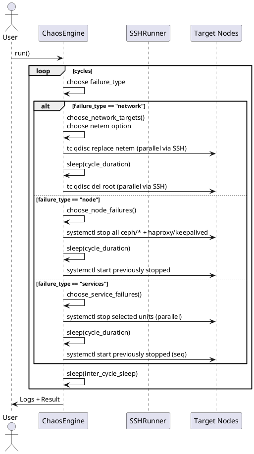
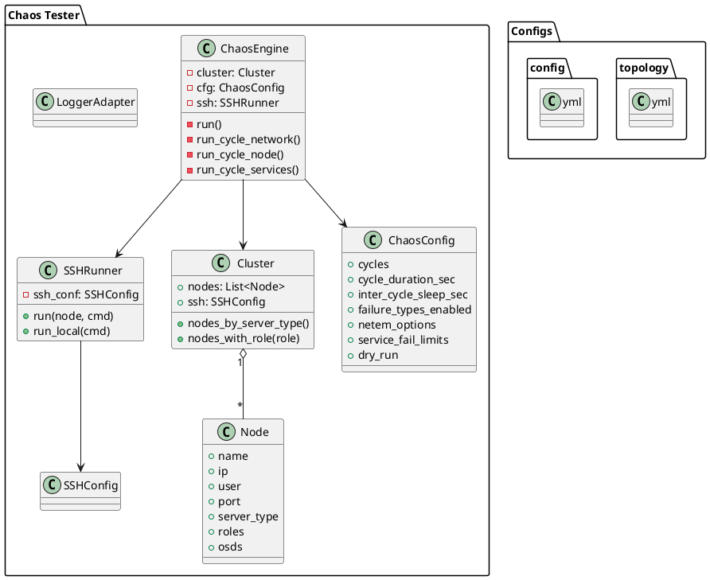

Ниже — полностью рабочий и хорошо документированный скрипт для хаос‑тестирования кластера Ceph 17.2.7, отвечающий вашим требованиям. Он:

- читает параметры из конфигурационного файла;
- читает описание кластера и ролей из YAML;
- проводит заданное число циклов, в каждом — один из типов отказа:
  - симуляция сетевой задержки (tc/netem);
  - случайные отказ(ы) узлов (по одному узлу каждого типа);
  - случайные отказ(ы) сервисов (1 RGW, 1 MDS, 1 MGR, 2 OSD, 1 haproxy, 1 keepalived);
- реально останавливает/запускает сервисы (systemd) и настраивает задержку (tc);
- ведёт подробный лог.

Требования/зависимости:
- Python 3.8+;
- PyYAML (pip install pyyaml);
- На целевых узлах: sudo без пароля, наличие systemctl, iproute2 (tc), ip, awk, sed, bash/sh;
- Управление по ssh (скрипт использует локальную утилиту ssh, без дополнительных библиотек).

Совет: сначала запустить в режиме dry-run, чтобы увидеть, что именно будет делаться, без реальных изменений.

————————————
Код скрипта (до ~700 строк)
————————————

```python
#!/usr/bin/env python3
# -*- coding: utf-8 -*-
"""
Chaos testing для Ceph 17.2.7:
- Симуляция сетевой задержки (tc/netem)
- Отказ узлов (до 1 узла каждого типа одновременно)
- Отказ сервисов (одновременно: до 1 RGW, 1 MDS, 1 MGR, 2 OSD, 1 haproxy, 1 keepalived)

Особенности:
- Параметры скрипта задаются в конфигурационном YAML-файле.
- Описание кластера и ролей — отдельный YAML-файл.
- Результаты действий и подробности — в лог.
- Реальные команды: systemctl для сервисов, tc для задержек, ssh для удалённого выполнения.

Зависимости:
- stdlib: argparse, dataclasses, logging, pathlib, random, subprocess, threading, time, typing, shlex, queue
- внешний пакет: PyYAML (yaml)

Важно:
- На узлах должен быть sudo без запроса пароля.
- Для имитации задержки используется tc netem на корневом qdisc интерфейса (после удаления qdisc будет восстановлен дефолтный).
- Для "отказа узла" мы останавливаем все сервисы на нём (Ceph + haproxy/keepalived, если присутствуют), что эквивалентно недоступности узла для кластера, но ssh остаётся доступным.

Автор: ваш хаос-инженер на Python :)
"""

import argparse
import dataclasses
import logging
import os
import random
import shlex
import subprocess
import sys
import threading
import time
from dataclasses import dataclass, field
from pathlib import Path
from typing import Dict, List, Optional, Tuple, Any

try:
    import yaml  # PyYAML
except ModuleNotFoundError:
    print("Требуется пакет PyYAML: pip install pyyaml", file=sys.stderr)
    sys.exit(1)


# ==========================
# Модели данных
# ==========================

@dataclass
class Node:
    """Описывает узел кластера."""
    name: str
    ip: Optional[str] = None
    user: Optional[str] = None
    port: int = 22
    server_type: str = ""             # тип узла (для группировки по типам)
    roles: List[str] = field(default_factory=list)  # сервисные роли на узле (rgw, mds, mgr, mon, osd, haproxy, keepalived)
    osds: List[int] = field(default_factory=list)   # список OSD ID, закреплённых за узлом

    def addr(self) -> str:
        """Адрес для SSH (ip приоритетнее имени)."""
        return self.ip or self.name


@dataclass
class SSHConfig:
    """Параметры SSH."""
    user: str
    key_path: Optional[str] = None
    port: int = 22
    connect_timeout: int = 10
    sudo: bool = True
    strict_host_key_checking: bool = False


@dataclass
class NetemOption:
    """Опции для netem задержки."""
    delay_ms: int
    jitter_ms: int = 0
    correlation: int = 0  # в процентах (0..100)


@dataclass
class ChaosConfig:
    """Основная конфигурация хаос-кампании."""
    cycles: int
    cycle_duration_sec: int
    inter_cycle_sleep_sec: int
    failure_types_enabled: List[str]  # ["network", "node", "services"]
    log_file: str
    random_seed: Optional[int] = None
    max_parallel: int = 10

    # Настройки сетевого теста
    netem_options: List[NetemOption] = field(default_factory=list)
    network_target_selection: str = "one_per_server_type"  # "one_per_server_type" | "count"
    network_target_count: int = 3  # используется, если selection == "count"

    # Ограничители для сервисных отказов
    service_fail_limits: Dict[str, int] = field(default_factory=lambda: {
        "rgw": 1,
        "mds": 1,
        "mgr": 1,
        "osd": 2,
        "haproxy": 1,
        "keepalived": 1
    })

    dry_run: bool = False


@dataclass
class Cluster:
    """Описание кластера."""
    nodes: List[Node]
    ssh: SSHConfig

    def nodes_by_server_type(self) -> Dict[str, List[Node]]:
        d: Dict[str, List[Node]] = {}
        for n in self.nodes:
            d.setdefault(n.server_type, []).append(n)
        return d

    def nodes_with_role(self, role: str) -> List[Node]:
        return [n for n in self.nodes if role in n.roles]


@dataclass
class CycleContext:
    """Контекст одного цикла тестирования для логирования и отката."""
    cycle_id: int
    failure_type: str
    # Список остановленных сервисов: (node_name, unit_name)
    stopped_units: List[Tuple[str, str]] = field(default_factory=list)
    # Список примененных задержек: (node_name, iface, netem_option)
    netem_applied: List[Tuple[str, str, NetemOption]] = field(default_factory=list)
    # Для отказа узлов: список узлов, на которых остановлены все сервисы
    failed_nodes: List[str] = field(default_factory=list)


# ==========================
# Утилиты: логирование, SSH
# ==========================

class LoggerAdapter:
    """Адаптер для логгера, добавляет удобные методы."""
    def __init__(self, logger: logging.Logger):
        self.log = logger

    def info(self, msg: str):
        self.log.info(msg)

    def warn(self, msg: str):
        self.log.warning(msg)

    def error(self, msg: str):
        self.log.error(msg)

    def debug(self, msg: str):
        self.log.debug(msg)


class SSHRunner:
    """
    Выполняет команды по ssh через локальную утилиту ssh (без сторонних библиотек).
    Поддерживает sudo (без пароля) и захват stdout/stderr/rc.
    """

    def __init__(self, ssh_conf: SSHConfig, logger: LoggerAdapter):
        self.ssh_conf = ssh_conf
        self.log = logger

    def _build_ssh_base(self, node: Node) -> List[str]:
        """Формирует базовую команду ssh."""
        cmd = [
            "ssh",
            "-p", str(node.port or self.ssh_conf.port),
            "-o", "BatchMode=yes",
            "-o", f"ConnectTimeout={self.ssh_conf.connect_timeout}",
        ]
        if not self.ssh_conf.strict_host_key_checking:
            cmd += ["-o", "StrictHostKeyChecking=no", "-o", "UserKnownHostsFile=/dev/null"]
        if self.ssh_conf.key_path:
            cmd += ["-i", self.ssh_conf.key_path]
        user = node.user or self.ssh_conf.user
        cmd += [f"{user}@{node.addr()}"]
        return cmd

    def _wrap_sudo(self, command: str) -> str:
        """Оборачивает команду в sudo bash -lc, если требуется."""
        if self.ssh_conf.sudo:
            # sudo -n: без запроса пароля. bash -lc для правильной интерпретации пайпов и кавычек.
            return f"sudo -n bash -lc {shlex.quote(command)}"
        else:
            return f"bash -lc {shlex.quote(command)}"

    def run(self, node: Node, command: str, timeout: Optional[int] = None) -> Tuple[int, str, str]:
        """
        Выполняет команду на узле. Возвращает (rc, stdout, stderr).
        В лог пишет команду и результат (в debug — stdout/stderr).
        """
        ssh_cmd = self._build_ssh_base(node)
        final_cmd = self._wrap_sudo(command)
        full = ssh_cmd + [final_cmd]
        self.log.debug(f"[{node.name}] CMD: {command}")
        try:
            cp = subprocess.run(
                full, capture_output=True, text=True, timeout=timeout
            )
            rc = cp.returncode
            out = cp.stdout.strip()
            err = cp.stderr.strip()
            self.log.debug(f"[{node.name}] RC={rc} OUT={out[:500]} ERR={err[:500]}")
            return rc, out, err
        except subprocess.TimeoutExpired:
            self.log.error(f"[{node.name}] Timeout: {command}")
            return 124, "", "timeout"

    def run_local(self, command: str, timeout: Optional[int] = None) -> Tuple[int, str, str]:
        """Выполняет локальную команду (например, для проверки)."""
        self.log.debug(f"[LOCAL] CMD: {command}")
        try:
            cp = subprocess.run(
                command, capture_output=True, text=True, timeout=timeout, shell=True
            )
            return cp.returncode, cp.stdout.strip(), cp.stderr.strip()
        except subprocess.TimeoutExpired:
            self.log.error(f"[LOCAL] Timeout: {command}")
            return 124, "", "timeout"


# ==========================
# Парсинг конфигов
# ==========================

def load_yaml(path: Path) -> Any:
    """Загружает YAML-файл."""
    with path.open("r", encoding="utf-8") as f:
        return yaml.safe_load(f)


def parse_cluster(topology: Dict[str, Any]) -> Cluster:
    """
    Парсит YAML описания кластера в объекты Node/Cluster.
    Ожидаемый формат см. в примере ниже.
    """
    ssh_conf_raw = topology.get("ssh", {})
    ssh_conf = SSHConfig(
        user=ssh_conf_raw.get("user", "root"),
        key_path=ssh_conf_raw.get("key_path"),
        port=int(ssh_conf_raw.get("port", 22)),
        connect_timeout=int(ssh_conf_raw.get("connect_timeout", 10)),
        sudo=bool(ssh_conf_raw.get("sudo", True)),
        strict_host_key_checking=bool(ssh_conf_raw.get("strict_host_key_checking", False)),
    )

    nodes_raw = topology.get("nodes", [])
    nodes: List[Node] = []
    for n in nodes_raw:
        nodes.append(Node(
            name=n["name"],
            ip=n.get("ip"),
            user=n.get("user"),
            port=int(n.get("port", ssh_conf.port)),
            server_type=n.get("server_type", ""),
            roles=list(n.get("roles", [])),
            osds=list(n.get("osds", [])),
        ))
    return Cluster(nodes=nodes, ssh=ssh_conf)


def parse_chaos_config(cfg: Dict[str, Any]) -> ChaosConfig:
    """Парсит основной YAML конфиг хаос-скрипта."""
    netem_raw = cfg.get("network_latency_options", [])
    netem_options = [
        NetemOption(
            delay_ms=int(item.get("delay_ms", 50)),
            jitter_ms=int(item.get("jitter_ms", 0)),
            correlation=int(item.get("correlation", 0)),
        )
        for item in netem_raw
    ]

    service_limits_raw = cfg.get("service_fail_limits", {})
    service_limits = {
        "rgw": int(service_limits_raw.get("rgw", 1)),
        "mds": int(service_limits_raw.get("mds", 1)),
        "mgr": int(service_limits_raw.get("mgr", 1)),
        "osd": int(service_limits_raw.get("osd", 2)),
        "haproxy": int(service_limits_raw.get("haproxy", 1)),
        "keepalived": int(service_limits_raw.get("keepalived", 1)),
    }

    return ChaosConfig(
        cycles=int(cfg.get("cycles", 10)),
        cycle_duration_sec=int(cfg.get("cycle_duration_sec", 120)),
        inter_cycle_sleep_sec=int(cfg.get("inter_cycle_sleep_sec", 60)),
        failure_types_enabled=list(cfg.get("failure_types_enabled", ["network", "node", "services"])),
        log_file=str(cfg.get("log_file", "chaos_ceph.log")),
        random_seed=cfg.get("random_seed"),
        max_parallel=int(cfg.get("max_parallel", 10)),
        netem_options=netem_options,
        network_target_selection=str(cfg.get("network_target_selection", "one_per_server_type")),
        network_target_count=int(cfg.get("network_target_count", 3)),
        service_fail_limits=service_limits,
        dry_run=bool(cfg.get("dry_run", False)),
    )


# ==========================
# Хелперы для Ceph/сервисов
# ==========================

CEPH_UNIT_PATTERNS = [
    "ceph-osd@*.service",
    "ceph-mon@*.service",
    "ceph-mgr@*.service",
    "ceph-mds@*.service",
    "ceph-radosgw@*.service",
]

def list_units_on_node(ssh: SSHRunner, node: Node, pattern: str) -> List[str]:
    """
    Возвращает список systemd-юнитов по шаблону на узле.
    Пример: pattern="ceph-osd@*.service".
    """
    cmd = f"systemctl list-units '{pattern}' --all --no-pager --no-legend | awk '{{print $1}}'"
    rc, out, _ = ssh.run(node, cmd)
    if rc != 0 or not out:
        return []
    units = [x.strip() for x in out.splitlines() if x.strip()]
    return units


def list_all_ceph_units(ssh: SSHRunner, node: Node) -> List[str]:
    """Собирает все известные ceph-юниты на узле."""
    units = []
    for pat in CEPH_UNIT_PATTERNS:
        units.extend(list_units_on_node(ssh, node, pat))
    return sorted(set(units))


def list_specific_units_across_cluster(ssh: SSHRunner, cluster: Cluster, pattern: str) -> List[Tuple[Node, str]]:
    """
    Возвращает список (node, unit) для юнитов по паттерну во всём кластере.
    Удобно для выборки случайных сервисов (RGW/MDS/MGR...).
    """
    result: List[Tuple[Node, str]] = []
    for node in cluster.nodes:
        units = list_units_on_node(ssh, node, pattern)
        for u in units:
            result.append((node, u))
    return result


def systemctl_action(ssh: SSHRunner, node: Node, unit: str, action: str, dry: bool = False) -> Tuple[int, str, str]:
    """
    Выполняет systemctl action для юнита. Возвращает (rc, out, err).
    """
    cmd = f"systemctl {action} {shlex.quote(unit)}"
    if dry:
        ssh.log.info(f"[dry-run] {node.name}: {cmd}")
        return 0, "", ""
    return ssh.run(node, cmd)


def detect_default_iface(ssh: SSHRunner, node: Node) -> Optional[str]:
    """
    Определяет интерфейс по умолчанию (по default route).
    """
    cmd = "ip -o -4 route show to default | awk '{print $5}' | head -n1"
    rc, out, _ = ssh.run(node, cmd)
    if rc == 0 and out.strip():
        return out.strip()
    # запасной вариант
    rc, out, _ = ssh.run(node, "ip route get 1 | awk '{print $5; exit}'")
    if rc == 0 and out.strip():
        return out.strip()
    return None


def apply_netem(ssh: SSHRunner, node: Node, iface: str, opt: NetemOption, dry: bool = False) -> Tuple[int, str, str]:
    """
    Применяет netem задержку к root qdisc интерфейса.
    Внимание: мы заменяем root qdisc на netem, потом удаляем (возвращая дефолт).
    """
    base = f"tc qdisc replace dev {shlex.quote(iface)} root netem delay {opt.delay_ms}ms"
    if opt.jitter_ms > 0:
        base += f" {opt.jitter_ms}ms"
    if opt.correlation > 0:
        base += f" {opt.correlation}%"
    cmd = base + " ; tc qdisc show dev " + shlex.quote(iface)
    if dry:
        ssh.log.info(f"[dry-run] {node.name}: {cmd}")
        return 0, "", ""
    return ssh.run(node, cmd)


def clear_netem(ssh: SSHRunner, node: Node, iface: str, dry: bool = False) -> Tuple[int, str, str]:
    """
    Удаляет root qdisc (сбрасывая netem). В большинстве дистрибутивов это возвращает дефолтный qdisc.
    """
    cmd = f"tc qdisc del dev {shlex.quote(iface)} root || true ; tc qdisc show dev {shlex.quote(iface)}"
    if dry:
        ssh.log.info(f"[dry-run] {node.name}: {cmd}")
        return 0, "", ""
    return ssh.run(node, cmd)


# ==========================
# Планирование отказов
# ==========================

def choose_network_targets(cluster: Cluster, cfg: ChaosConfig, rnd: random.Random) -> List[Node]:
    """
    Выбирает целевые узлы для сетевой задержки.
    - one_per_server_type: по одному узлу каждого типа (если есть).
    - count: фиксированное число узлов случайно.
    """
    if cfg.network_target_selection == "one_per_server_type":
        targets: List[Node] = []
        by_type = cluster.nodes_by_server_type()
        for stype, nodes in by_type.items():
            if nodes:
                targets.append(rnd.choice(nodes))
        return targets
    else:
        n = min(cfg.network_target_count, len(cluster.nodes))
        return rnd.sample(cluster.nodes, n)


def choose_node_failures(cluster: Cluster, rnd: random.Random) -> List[Node]:
    """
    Для отказа узлов: выбираем по 0..1 узлу каждого типа.
    Чтобы всегда был хоть один отказ, гарантируем минимум 1 тип.
    """
    targets: List[Node] = []
    by_type = cluster.nodes_by_server_type()
    types = list(by_type.keys())
    if not types:
        return targets
    # Случайно выбираем набор типов (не пустой)
    k = rnd.randint(1, len(types))
    chosen_types = rnd.sample(types, k)
    for t in chosen_types:
        nodes = by_type.get(t, [])
        if nodes:
            targets.append(rnd.choice(nodes))
    return targets


def choose_service_failures(ssh: SSHRunner, cluster: Cluster, cfg: ChaosConfig, rnd: random.Random) -> List[Tuple[Node, str]]:
    """
    Определяет набор сервисов, которые остановим одновременно:
    - до 1 rgw (ceph-radosgw@*.service)
    - до 1 mds (ceph-mds@*.service)
    - до 1 mgr (ceph-mgr@*.service)
    - до 2 osd (ceph-osd@*.service)
    - до 1 haproxy (unit: haproxy.service)
    - до 1 keepalived (unit: keepalived.service)
    """
    actions: List[Tuple[Node, str]] = []

    # Ceph сервисы с инстансами
    limits = cfg.service_fail_limits

    def pick_units(pattern: str, limit: int):
        all_units = list_specific_units_across_cluster(ssh, cluster, pattern)
        if all_units:
            count = min(limit, len(all_units))
            for node, unit in rnd.sample(all_units, count):
                actions.append((node, unit))

    pick_units("ceph-radosgw@*.service", limits.get("rgw", 1))
    pick_units("ceph-mds@*.service", limits.get("mds", 1))
    pick_units("ceph-mgr@*.service", limits.get("mgr", 1))
    # OSD
    all_osd = list_specific_units_across_cluster(ssh, cluster, "ceph-osd@*.service")
    if all_osd:
        limit_osd = min(limits.get("osd", 2), len(all_osd))
        for node, unit in rnd.sample(all_osd, limit_osd):
            actions.append((node, unit))

    # haproxy/keepalived — без инстансов, целиком сервис на узле
    # Выбираем только среди узлов, где есть соответствующая роль.
    hap_nodes = cluster.nodes_with_role("haproxy")
    if hap_nodes and limits.get("haproxy", 1) > 0:
        actions.append((rnd.choice(hap_nodes), "haproxy.service"))

    kv_nodes = cluster.nodes_with_role("keepalived")
    if kv_nodes and limits.get("keepalived", 1) > 0:
        actions.append((rnd.choice(kv_nodes), "keepalived.service"))

    return actions


def plan_node_failure_actions(ssh: SSHRunner, node: Node) -> List[str]:
    """
    Возвращает список юнитов, которые нужно остановить на узле для имитации отказа узла.
    Включаем все обнаруженные Ceph-юниты + haproxy/keepalived при наличии.
    """
    units = list_all_ceph_units(ssh, node)
    # Добавляем системные lb/vrrp сервисы, если они есть
    # Проверим, установлен ли юнит (через systemctl status --no-pager ...).
    for svc in ["haproxy.service", "keepalived.service"]:
        rc, _, _ = ssh.run(node, f"systemctl status {svc} --no-pager >/dev/null 2>&1 ; echo $?")
        # rc возвращает rc ssh, а echo $? вернёт в stdout код статуса systemctl.
        # Проще сделать list-unit-files:
        rc2, out2, _ = ssh.run(node, f"systemctl list-unit-files | awk '{{print $1}}' | grep -x {svc} || true")
        if rc2 == 0 and out2.strip() == svc:
            units.append(svc)
    return sorted(set(units))


# ==========================
# Исполнитель / движок
# ==========================

class ChaosEngine:
    """Основной исполнитель сценариев хаоса."""

    def __init__(self, cluster: Cluster, cfg: ChaosConfig, logger: LoggerAdapter):
        self.cluster = cluster
        self.cfg = cfg
        self.log = logger
        self.ssh = SSHRunner(cluster.ssh, logger)
        self._rnd = random.Random(cfg.random_seed)

        # Мьютекс для синхронного вывода/журналирования из потоков
        self._lock = threading.Lock()

    def _parallel_execute(self, tasks: List[Tuple[Node, str]], timeout: Optional[int] = None) -> List[Tuple[Node, str, int, str, str]]:
        """
        Параллельно выполняет команды на узлах.
        tasks: список (node, command)
        Возвращает список (node, command, rc, out, err).
        """
        results: List[Tuple[Node, str, int, str, str]] = []
        threads: List[threading.Thread] = []
        # очередь задач
        from queue import Queue
        q: "Queue[Tuple[Node, str]]" = Queue()
        for t in tasks:
            q.put(t)

        def worker():
            while True:
                try:
                    node, command = q.get_nowait()
                except Exception:
                    break
                if self.cfg.dry_run:
                    with self._lock:
                        self.log.info(f"[dry-run] {node.name}: {command}")
                    rc, out, err = 0, "", ""
                else:
                    rc, out, err = self.ssh.run(node, command, timeout=timeout)
                with self._lock:
                    results.append((node, command, rc, out, err))
                q.task_done()

        workers = min(self.cfg.max_parallel, max(1, len(tasks)))
        for _ in range(workers):
            t = threading.Thread(target=worker, daemon=True)
            t.start()
            threads.append(t)
        for t in threads:
            t.join()
        return results

    def _stop_units(self, pairs: List[Tuple[Node, str]], ctx: CycleContext):
        """Останавливает список юнитов (параллельно) и запоминает для отката."""
        cmds = [(n, f"systemctl stop {shlex.quote(u)}") for n, u in pairs]
        self.log.info(f"Остановка {len(cmds)} сервисов...")
        res = self._parallel_execute(cmds, timeout=60)
        for node, command, rc, _, err in res:
            unit = command.split()[-1]
            if rc == 0:
                self.log.info(f"[{node.name}] stopped {unit}")
                ctx.stopped_units.append((node.name, unit))
            else:
                self.log.error(f"[{node.name}] stop failed {unit}: rc={rc} err={err}")

    def _start_units(self, pairs: List[Tuple[str, str]]):
        """Запускает ранее остановленные юниты (последовательно, для контроля)."""
        # pairs: (node_name, unit), нам нужно найти Node по имени
        name2node = {n.name: n for n in self.cluster.nodes}
        for node_name, unit in pairs:
            node = name2node.get(node_name)
            if not node:
                self.log.error(f"Не найден узел {node_name} для старта {unit}")
                continue
            rc, _, err = systemctl_action(self.ssh, node, unit, "start", dry=self.cfg.dry_run)
            if rc == 0:
                self.log.info(f"[{node.name}] started {unit}")
            else:
                self.log.error(f"[{node.name}] start failed {unit}: rc={rc} err={err}")

    def _apply_netem_multi(self, targets: List[Node], opt: NetemOption, ctx: CycleContext):
        """Применяет netem ко всем целевым узлам (параллельно)."""
        tasks: List[Tuple[Node, str]] = []
        iface_by_node: Dict[str, str] = {}

        # Сначала выясним интерфейсы
        for node in targets:
            iface = detect_default_iface(self.ssh, node)
            if not iface:
                self.log.error(f"[{node.name}] не удалось определить интерфейс по умолчанию. Пропуск.")
                continue
            iface_by_node[node.name] = iface
            cmd = self._netem_cmd(iface, opt)
            tasks.append((node, cmd))

        # Применяем
        self.log.info(f"Применение netem задержки на {len(tasks)} узлах: delay={opt.delay_ms}ms jitter={opt.jitter_ms}ms corr={opt.correlation}%")
        res = self._parallel_execute(tasks, timeout=30)
        for node, command, rc, out, err in res:
            if rc == 0:
                self.log.info(f"[{node.name}] netem применён: {iface_by_node[node.name]} ({opt.delay_ms}ms)")
                ctx.netem_applied.append((node.name, iface_by_node[node.name], opt))
            else:
                self.log.error(f"[{node.name}] netem ошибка: rc={rc} err={err}")

    def _netem_cmd(self, iface: str, opt: NetemOption) -> str:
        base = f"tc qdisc replace dev {shlex.quote(iface)} root netem delay {opt.delay_ms}ms"
        if opt.jitter_ms > 0:
            base += f" {opt.jitter_ms}ms"
        if opt.correlation > 0:
            base += f" {opt.correlation}%"
        base += f" ; tc qdisc show dev {shlex.quote(iface)}"
        return base

    def _clear_netem_multi(self, ctx: CycleContext):
        """Снимает netem на узлах из контекста."""
        # Готовим уникальные пары (node, iface)
        seen = set()
        pairs: List[Tuple[Node, str]] = []
        name2node = {n.name: n for n in self.cluster.nodes}
        for node_name, iface, _opt in ctx.netem_applied:
            key = (node_name, iface)
            if key in seen:
                continue
            seen.add(key)
            node = name2node.get(node_name)
            if node:
                pairs.append((node, iface))

        tasks = [(node, f"tc qdisc del dev {shlex.quote(iface)} root || true ; tc qdisc show dev {shlex.quote(iface)}") for node, iface in pairs]
        if not tasks:
            return
        self.log.info(f"Снятие netem с {len(tasks)} узлов...")
        res = self._parallel_execute(tasks, timeout=30)
        for node, command, rc, out, err in res:
            if rc == 0:
                self.log.info(f"[{node.name}] netem снят")
            else:
                self.log.error(f"[{node.name}] ошибка снятия netem: rc={rc} err={err}")

    def run_cycle_network(self, cycle_id: int):
        """Цикл типа 'network' — задержки."""
        ctx = CycleContext(cycle_id=cycle_id, failure_type="network")
        try:
            opt = self._rnd.choice(self.cfg.netem_options) if self.cfg.netem_options else NetemOption(delay_ms=50)
            targets = choose_network_targets(self.cluster, self.cfg, self._rnd)
            if not targets:
                self.log.warn("Нет узлов для сетевой задержки. Пропуск.")
                return
            self._apply_netem_multi(targets, opt, ctx)
            self._hold_for_cycle_duration(ctx)
        finally:
            # откат
            self._clear_netem_multi(ctx)

    def run_cycle_node(self, cycle_id: int):
        """Цикл типа 'node' — отказ узлов по одному на тип."""
        ctx = CycleContext(cycle_id=cycle_id, failure_type="node")
        try:
            targets = choose_node_failures(self.cluster, self._rnd)
            if not targets:
                self.log.warn("Нет узлов для отказа. Пропуск.")
                return
            self.log.info(f"Выбраны узлы для отказа: {[n.name for n in targets]}")
            # На каждом узле останавливаем все ceph-юниты + haproxy/keepalived (если есть)
            pairs: List[Tuple[Node, str]] = []
            for node in targets:
                units = plan_node_failure_actions(self.ssh, node)
                if not units:
                    self.log.warn(f"[{node.name}] Не найдены юниты для остановки. Пропуск.")
                    continue
                for u in units:
                    pairs.append((node, u))
                ctx.failed_nodes.append(node.name)
            if not pairs:
                self.log.warn("Нет сервисов для остановки при отказе узлов. Пропуск.")
                return
            self._stop_units(pairs, ctx)
            self._hold_for_cycle_duration(ctx)
        finally:
            # откат: старт всех остановленных юнитов
            if ctx.stopped_units:
                self._start_units(ctx.stopped_units)

    def run_cycle_services(self, cycle_id: int):
        """Цикл типа 'services' — отдельные сервисные отказы (1 RGW, 1 MDS, 1 MGR, 2 OSD, 1 haproxy, 1 keepalived)."""
        ctx = CycleContext(cycle_id=cycle_id, failure_type="services")
        try:
            actions = choose_service_failures(self.ssh, self.cluster, self.cfg, self._rnd)
            if not actions:
                self.log.warn("Нет сервисов для остановки. Пропуск.")
                return
            self._stop_units(actions, ctx)
            self._hold_for_cycle_duration(ctx)
        finally:
            if ctx.stopped_units:
                self._start_units(ctx.stopped_units)

    def _hold_for_cycle_duration(self, ctx: CycleContext):
        """Ожидание длительности цикла с логированием обратного отсчёта."""
        dur = self.cfg.cycle_duration_sec
        self.log.info(f"Цикл {ctx.cycle_id} ({ctx.failure_type}) длится {dur} c.")
        t0 = time.time()
        while True:
            left = dur - int(time.time() - t0)
            if left <= 0:
                break
            # Логируем раз в 10 секунд
            if left % 10 == 0:
                self.log.info(f"Осталось ~{left} c...")
            time.sleep(1)

    def run(self):
        """Основной цикл кампании."""
        self.log.info("==== Старт хаос‑кампании Ceph ====")
        self.log.info(f"Параметры: cycles={self.cfg.cycles}, duration={self.cfg.cycle_duration_sec}s, sleep={self.cfg.inter_cycle_sleep_sec}s, dry_run={self.cfg.dry_run}")
        self.log.info(f"Активные типы отказов: {self.cfg.failure_types_enabled}")

        types = list(self.cfg.failure_types_enabled)
        if not types:
            self.log.error("Не указаны типы отказов. Завершение.")
            return

        for i in range(1, self.cfg.cycles + 1):
            ft = self._rnd.choice(types)
            self.log.info(f"---- Цикл {i}/{self.cfg.cycles}: тип={ft} ----")

            try:
                if ft == "network":
                    self.run_cycle_network(i)
                elif ft == "node":
                    self.run_cycle_node(i)
                elif ft == "services":
                    self.run_cycle_services(i)
                else:
                    self.log.warn(f"Неизвестный тип отказа: {ft}. Пропуск.")
            except Exception as e:
                self.log.error(f"Исключение в цикле {i}: {e}")

            # Интервал между циклами
            if i < self.cfg.cycles:
                self.log.info(f"Ожидание между циклами: {self.cfg.inter_cycle_sleep_sec} c.")
                time.sleep(self.cfg.inter_cycle_sleep_sec)

        self.log.info("==== Завершение хаос‑кампании ====")


# ==========================
# CLI / Main
# ==========================

def setup_logging(log_file: str) -> LoggerAdapter:
    log = logging.getLogger("chaos_ceph")
    log.setLevel(logging.DEBUG)
    log_dir = os.path.dirname(log_file)
    if log_dir:
        os.makedirs(log_dir, exist_ok=True)
    fh = logging.FileHandler(log_file, encoding="utf-8")
    fh.setLevel(logging.DEBUG)
    ch = logging.StreamHandler(sys.stdout)
    ch.setLevel(logging.INFO)
    fmt = logging.Formatter("%(asctime)s [%(levelname)s] %(message)s")
    fh.setFormatter(fmt)
    ch.setFormatter(fmt)
    log.addHandler(fh)
    log.addHandler(ch)
    return LoggerAdapter(log)


def main():
    parser = argparse.ArgumentParser(description="Chaos-тестирование Ceph 17.2.7")
    parser.add_argument("-c", "--config", required=True, help="Путь к YAML-файлу конфигурации скрипта")
    parser.add_argument("-t", "--topology", required=True, help="Путь к YAML-файлу описания кластера/ролей")
    args = parser.parse_args()

    cfg_path = Path(args.config).expanduser().resolve()
    topo_path = Path(args.topology).expanduser().resolve()

    chaos_cfg = parse_chaos_config(load_yaml(cfg_path))
    logger = setup_logging(chaos_cfg.log_file)
    cluster = parse_cluster(load_yaml(topo_path))

    # seed
    if chaos_cfg.random_seed is not None:
        random.seed(chaos_cfg.random_seed)

    engine = ChaosEngine(cluster, chaos_cfg, logger)
    engine.run()


if __name__ == "__main__":
    main()
```

————————————
Пример YAML описания кластера (topology.yml)
————————————

```yaml
# Пример: кластер с:
# - 4 сервера с RadosGW, haproxy, keepalived
# - 2 сервера с MDS, haproxy, keepalived
# - 5 серверов с MGR, MON, haproxy
# - 6 серверов с OSD (по 4..6 OSD на каждом), нумерация OSD сквозная
ssh:
  user: cephadmin
  key_path: /home/cephadmin/.ssh/id_rsa
  port: 22
  connect_timeout: 10
  sudo: true
  strict_host_key_checking: false

nodes:
  # RGW + haproxy + keepalived (4)
  - { name: gw1, ip: 10.0.0.11, server_type: rgw_haproxy_keepalived, roles: [rgw, haproxy, keepalived] }
  - { name: gw2, ip: 10.0.0.12, server_type: rgw_haproxy_keepalived, roles: [rgw, haproxy, keepalived] }
  - { name: gw3, ip: 10.0.0.13, server_type: rgw_haproxy_keepalived, roles: [rgw, haproxy, keepalived] }
  - { name: gw4, ip: 10.0.0.14, server_type: rgw_haproxy_keepalived, roles: [rgw, haproxy, keepalived] }

  # MDS + haproxy + keepalived (2)
  - { name: mds1, ip: 10.0.0.21, server_type: mds_haproxy_keepalived, roles: [mds, haproxy, keepalived] }
  - { name: mds2, ip: 10.0.0.22, server_type: mds_haproxy_keepalived, roles: [mds, haproxy, keepalived] }

  # MGR + MON + haproxy (5)
  - { name: ctrl1, ip: 10.0.0.31, server_type: mgr_mon_haproxy, roles: [mgr, mon, haproxy] }
  - { name: ctrl2, ip: 10.0.0.32, server_type: mgr_mon_haproxy, roles: [mgr, mon, haproxy] }
  - { name: ctrl3, ip: 10.0.0.33, server_type: mgr_mon_haproxy, roles: [mgr, mon, haproxy] }
  - { name: ctrl4, ip: 10.0.0.34, server_type: mgr_mon_haproxy, roles: [mgr, mon, haproxy] }
  - { name: ctrl5, ip: 10.0.0.35, server_type: mgr_mon_haproxy, roles: [mgr, mon, haproxy] }

  # OSD (6) — распределение OSD ID сквозное
  - { name: osd1, ip: 10.0.0.41, server_type: osd, roles: [osd], osds: [0,1,2,3] }
  - { name: osd2, ip: 10.0.0.42, server_type: osd, roles: [osd], osds: [4,5,6,7,8] }
  - { name: osd3, ip: 10.0.0.43, server_type: osd, roles: [osd], osds: [9,10,11,12,13,14] }
  - { name: osd4, ip: 10.0.0.44, server_type: osd, roles: [osd], osds: [15,16,17,18] }
  - { name: osd5, ip: 10.0.0.45, server_type: osd, roles: [osd], osds: [19,20,21,22,23] }
  - { name: osd6, ip: 10.0.0.46, server_type: osd, roles: [osd], osds: [24,25,26,27,28,29] }
```

————————————
Пример конфигурации скрипта (config.yml)
————————————

```yaml
# Основные параметры
cycles: 12
cycle_duration_sec: 180
inter_cycle_sleep_sec: 60
failure_types_enabled: ["network", "node", "services"]  # какие типы отказов включены
log_file: ./logs/chaos_ceph.log
random_seed: 12345
max_parallel: 10
dry_run: false

# Настройки имитации сети
network_latency_options:
  - { delay_ms: 50, jitter_ms: 10, correlation: 25 }
  - { delay_ms: 100, jitter_ms: 20, correlation: 10 }
  - { delay_ms: 200, jitter_ms: 50, correlation: 5 }
network_target_selection: "one_per_server_type"   # "one_per_server_type" или "count"
network_target_count: 4                           # используется, если selection == "count"

# Ограничители для сервисных отказов (максимумы)
service_fail_limits:
  rgw: 1
  mds: 1
  mgr: 1
  osd: 2
  haproxy: 1
  keepalived: 1
```

————————————
Как это работает (вкратце)
————————————

- Скрипт выбирает тип отказа на цикл: network, node, services.
- network: выбирает узлы согласно стратегии и применяет tc netem delay (затем снимает).
- node: для 1 случайного узла каждого типа останавливает все ceph-* и lb/vrrp сервисы (затем запускает обратно).
- services: одновременно останавливает ограниченное количество конкретных сервисов по всему кластеру (затем запускает обратно).
- Все действия логируются (кто, что, когда, на сколько времени, результаты).

Безопасность/восстановление:
- Для сети: qdisc root заменяется на netem, по завершении удаляется (возврат к дефолту). Если у вас кастомный qdisc, заранее протестируйте.
- Для узлов/сервисов: запускаем обратно после таймера цикла, даже если произошли ошибки на части узлов (пишем в лог).

————————————
PlantUML диаграммы
————————————

Диаграмма последовательности одного цикла:



Диаграмма компонентов скрипта:



Пара практических советов:
- Запустите в dry_run: true и убедитесь по логу, что выбор целей и команд соответствует вашим ожиданиям.
- Проверьте, что на всех узлах systemctl list-units корректно отражает используемые ceph-* юниты (особенно инстансы @).
- Убедитесь, что sudo без пароля настроен для пользователя, под которым идёт ssh.
- Для осмысленных тестов в кластере должны быть настроены HA для RGW (haproxy + keepalived VIP) и репликации/мониторинга (mgr/mon), чтобы отказ реально проявлялся в метриках health и доступности.

Если нужно, добавлю:
- интеграцию с ceph health до/после каждого цикла;
- экспорт метрик в Prometheus Pushgateway;
- ограничения списка узлов/ролей для отказа.
