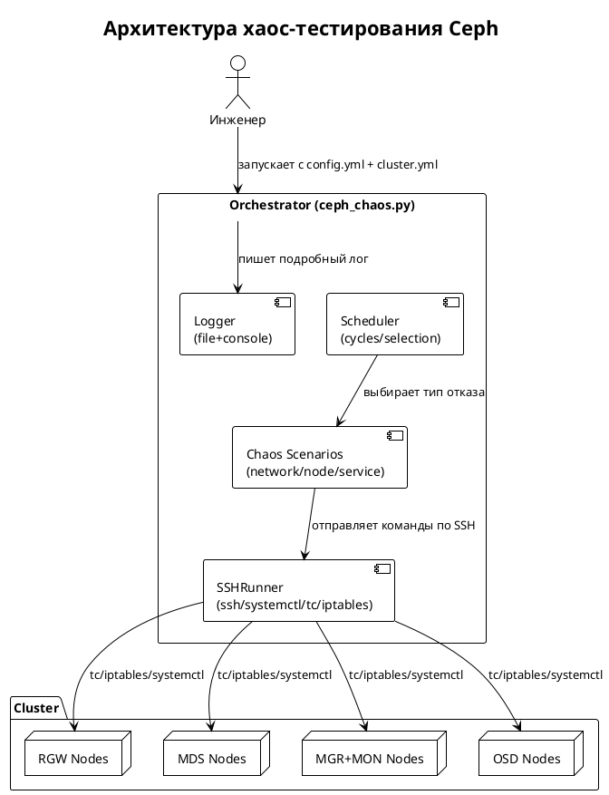
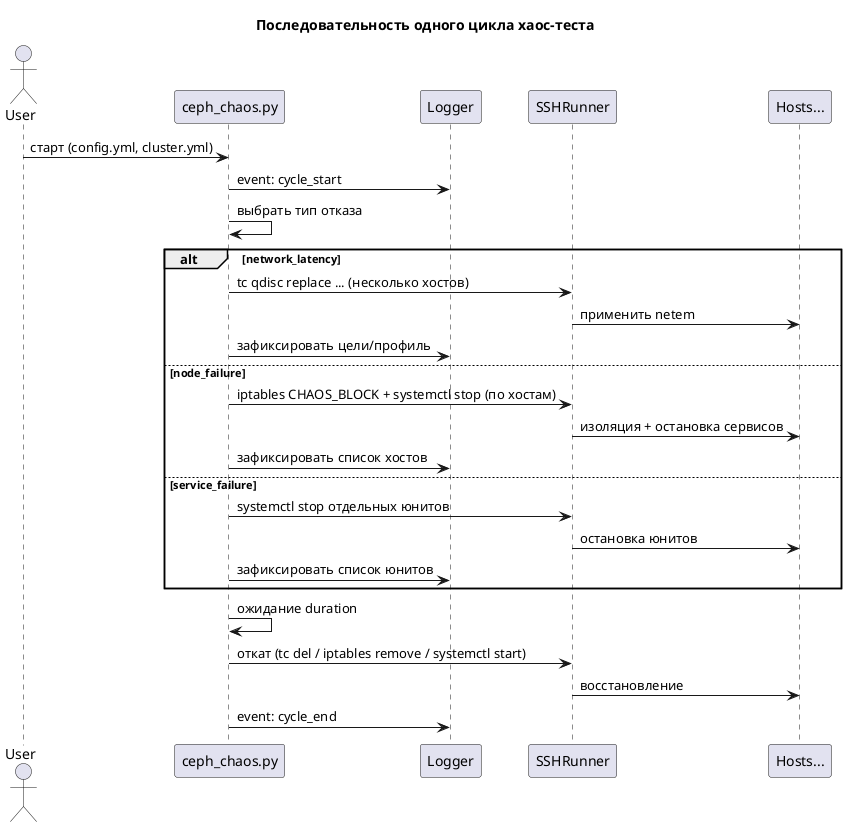

Ниже — полностью готовый Python3-скрипт для хаос-тестирования кластера Ceph 17.2.7, с подробными комментариями на русском, dry-run режимом, примерами конфигурационных файлов и PlantUML-диаграммами.  
Скрипт не требует сторонних библиотек, использует только стандартную библиотеку Python и бинарники ssh/systemctl/tc/iptables на целевых хостах.

Важно:
- Скрипт управляет узлами по SSH (без Paramiko).
- Для сетевых воздействий используется tc/netem; для изоляции узлов — iptables/ip6tables с отдельной цепочкой CHAOS_BLOCK (SSH порт сохраняется).
- Все операции выполняются с sudo -n, требуется доступ без пароля.
- Логи пишутся в файл и в консоль, по ним можно восстановить последовательность отказов и восстановлений.

------------------------------

Код: ceph_chaos.py

```python
#!/usr/bin/env python3
# -*- coding: utf-8 -*-
"""
ceph_chaos.py — Хаос-инжиниринг для Ceph 17.2.7.

Функциональность:
- 3 типа отказов (в одном цикле — только один тип):
  1) Сетевая задержка (tc/netem) с заданными профилями.
  2) Отказ узлов (серверов): одновременно не более одного сервера каждого типа (rgw, mds, mgrmon, osd).
     Реализация: изоляция по iptables (всё кроме SSH) + остановка всех сервисов этого узла.
  3) Отказ сервисов: одновременно могут быть остановлены 1 RGW, 1 MDS, 1 MGR, 2 OSD, 1 haproxy, 1 keepalived (если доступны).
     Реализация: systemctl stop/start соответствующих units.

- Циклы: N раз; каждый цикл: выбрать тип отказа, применить, подержать duration, откатить, подождать interval.
- Подробный лог.
- Режим dry-run (только лог, без реального выполнения).
- Параметры — из config.yml.
- Описание кластера и ролей — из cluster.yml.

Предпосылки / требования на целевых узлах:
- Наличие: bash, systemctl, tc (netem), iptables/ip6tables, ip (iproute2), sudo без пароля.
- Сервисные единицы ceph соответствуют вашим инстансам (пример в cluster.yml).
- SSH доступ с ключом, user с правами sudo -n.

Запуск:
  python3 ceph_chaos.py -c config.yml -i cluster.yml [--dry-run] [--type TYPE] [--cycles N] [--seed S]

Где TYPE ∈ {network_latency, node_failure, service_failure}
"""

import argparse
import concurrent.futures
import dataclasses
import datetime
import json
import logging
import os
import random
import shlex
import signal
import subprocess
import sys
import threading
import time
from dataclasses import dataclass, field
from typing import Dict, List, Optional, Tuple

try:
    import yaml  # PyYAML — де-факто стандарт для yaml. Если нельзя — замените на свой парсер или json.
except Exception as e:
    print("Для парсинга YAML требуется PyYAML (yaml.safe_load). Установите: pip install pyyaml", file=sys.stderr)
    sys.exit(1)


# ==========================
# Модели данных
# ==========================

@dataclass
class Host:
    """Описание хоста кластера."""
    name: str
    address: str
    type: str  # rgw | mds | mgrmon | osd
    interface: Optional[str] = None

    # Наличие вспомогательных сервисов:
    has_haproxy: bool = False
    has_keepalived: bool = False

    # Инстансы Ceph на узле:
    rgw_instances: List[str] = field(default_factory=list)   # ceph-radosgw@<instance>
    mds_instances: List[str] = field(default_factory=list)   # ceph-mds@<instance>
    mgr_instances: List[str] = field(default_factory=list)   # ceph-mgr@<instance>
    mon_instances: List[str] = field(default_factory=list)   # ceph-mon@<instance>
    osd_ids: List[int] = field(default_factory=list)         # ceph-osd@<id>


@dataclass
class Cluster:
    """Описание кластера и кэш производных структур."""
    name: str
    hosts: List[Host] = field(default_factory=list)

    # Производные:
    hosts_by_type: Dict[str, List[Host]] = field(default_factory=dict)
    osd_id_to_host: Dict[int, Host] = field(default_factory=dict)

    def index(self) -> None:
        """Индексирование по типам и OSD ID."""
        self.hosts_by_type = {"rgw": [], "mds": [], "mgrmon": [], "osd": []}
        self.osd_id_to_host = {}
        for h in self.hosts:
            if h.type not in self.hosts_by_type:
                self.hosts_by_type[h.type] = []
            self.hosts_by_type[h.type].append(h)
            for osd_id in h.osd_ids:
                self.osd_id_to_host[osd_id] = h


@dataclass
class SSHConfig:
    user: str
    port: int = 22
    key_path: Optional[str] = None
    strict_host_key_checking: bool = False
    sudo: bool = True
    extra_ssh_opts: List[str] = field(default_factory=list)


@dataclass
class NetemProfile:
    name: str
    delay_ms: int
    jitter_ms: int = 0
    loss_percent: float = 0.0


@dataclass
class ServiceFailureCounts:
    rgw: int = 1
    mds: int = 1
    mgr: int = 1
    osd: int = 2
    haproxy: int = 1
    keepalived: int = 1


@dataclass
class TestConfig:
    # Основные параметры:
    cycles: int
    cycle_duration_sec: int
    interval_between_cycles_sec: int

    # Типы отказов (веса вероятности выбора в случайном режиме):
    failure_types_weights: Dict[str, int] = field(default_factory=lambda: {
        "network_latency": 1,
        "node_failure": 1,
        "service_failure": 1
    })

    # Профили сетевых задержек:
    netem_profiles: List[NetemProfile] = field(default_factory=list)
    netem_scope: str = "one-per-type"  # "one-per-type" | "percentage"
    netem_percentage: float = 0.3      # если scope = percentage

    # Node failure:
    isolate_with_iptables: bool = True
    iptables_allow_ssh_port: int = 22
    also_stop_services_on_node_failure: bool = True

    # Service failure:
    service_counts: ServiceFailureCounts = field(default_factory=ServiceFailureCounts)

    # Прочее:
    concurrency_max_workers: int = 10
    random_seed: Optional[int] = None
    log_file: str = "ceph_chaos.log"
    log_level: str = "INFO"

    # Безопасность:
    require_confirmation: bool = False  # если True — перед стартом спросим подтверждение


# ==========================
# SSH helper
# ==========================

class SSHRunner:
    """Обёртка для выполнения удалённых команд по SSH (через системный ssh)."""

    def __init__(self, cfg: SSHConfig, dry_run: bool = False, logger: Optional[logging.Logger] = None):
        self.cfg = cfg
        self.dry_run = dry_run
        self.log = logger or logging.getLogger(__name__)

    def _base_ssh_cmd(self, address: str) -> List[str]:
        cmd = ["ssh"]
        if not self.cfg.strict_host_key_checking:
            cmd += ["-o", "StrictHostKeyChecking=no", "-o", "UserKnownHostsFile=/dev/null"]
        # Подсказка: для повышения устойчивости можно добавить ControlMaster/ControlPersist
        cmd += ["-o", "BatchMode=yes", "-o", "ConnectTimeout=10", "-p", str(self.cfg.port)]
        if self.cfg.key_path:
            cmd += ["-i", self.cfg.key_path]
        if self.cfg.extra_ssh_opts:
            cmd += self.cfg.extra_ssh_opts
        cmd.append(f"{self.cfg.user}@{address}")
        return cmd

    def run(self, host: Host, command: str, timeout: int = 60, sudo: Optional[bool] = None) -> Tuple[int, str, str]:
        """Выполнить команду на удалённом хосте. Возвращает: (rc, stdout, stderr)."""
        if sudo is None:
            sudo = self.cfg.sudo

        # Оборачиваем в bash -lc, чтобы переменные/пайпы корректно работали.
        remote_cmd = command
        if sudo:
            remote_cmd = f"sudo -n bash -lc {shlex.quote(command)}"
        else:
            remote_cmd = f"bash -lc {shlex.quote(command)}"

        ssh_cmd = self._base_ssh_cmd(host.address) + [remote_cmd]

        if self.dry_run:
            self.log.info(f"[DRY-RUN] Would run on {host.name} ({host.address}): {command}")
            return 0, "", ""

        self.log.debug(f"SSH run on {host.name}: {command}")
        try:
            p = subprocess.run(ssh_cmd, capture_output=True, text=True, timeout=timeout)
            return p.returncode, p.stdout.strip(), p.stderr.strip()
        except subprocess.TimeoutExpired as e:
            self.log.error(f"SSH timeout on {host.name}: {command}")
            return 124, "", f"Timeout: {e}"
        except Exception as e:
            self.log.error(f"SSH error on {host.name}: {e}")
            return 1, "", str(e)


# ==========================
# Утилиты
# ==========================

def setup_logging(log_file: str, level: str = "INFO") -> logging.Logger:
    logger = logging.getLogger("ceph_chaos")
    logger.setLevel(getattr(logging, level.upper(), logging.INFO))

    formatter = logging.Formatter(
        fmt="%(asctime)s %(levelname)s %(threadName)s %(message)s",
        datefmt="%Y-%m-%dT%H:%M:%S%z"
    )

    # Консоль
    ch = logging.StreamHandler(sys.stdout)
    ch.setLevel(getattr(logging, level.upper(), logging.INFO))
    ch.setFormatter(formatter)
    logger.addHandler(ch)

    # Файл
    fh = logging.FileHandler(log_file, mode="a", encoding="utf-8")
    fh.setLevel(getattr(logging, level.upper(), logging.INFO))
    fh.setFormatter(formatter)
    logger.addHandler(fh)
    return logger


def load_cluster(path: str) -> Cluster:
    with open(path, "r", encoding="utf-8") as f:
        data = yaml.safe_load(f)
    hosts = []
    for item in data.get("hosts", []):
        hosts.append(Host(
            name=item["name"],
            address=item["address"],
            type=item["type"],
            interface=item.get("interface"),
            has_haproxy=bool(item.get("has_haproxy", False)),
            has_keepalived=bool(item.get("has_keepalived", False)),
            rgw_instances=item.get("rgw_instances", []) or [],
            mds_instances=item.get("mds_instances", []) or [],
            mgr_instances=item.get("mgr_instances", []) or [],
            mon_instances=item.get("mon_instances", []) or [],
            osd_ids=item.get("osd_ids", []) or [],
        ))
    cluster = Cluster(name=data.get("cluster_name", "ceph"), hosts=hosts)
    cluster.index()
    return cluster


def load_config(path: str) -> Tuple[TestConfig, SSHConfig]:
    with open(path, "r", encoding="utf-8") as f:
        data = yaml.safe_load(f)

    ssh_cfg = data.get("ssh", {})
    ssh = SSHConfig(
        user=ssh_cfg.get("user", "root"),
        port=int(ssh_cfg.get("port", 22)),
        key_path=ssh_cfg.get("key_path"),
        strict_host_key_checking=bool(ssh_cfg.get("strict_host_key_checking", False)),
        sudo=bool(ssh_cfg.get("sudo", True)),
        extra_ssh_opts=ssh_cfg.get("extra_ssh_opts", []) or [],
    )

    test_cfg = data.get("test", {})
    netem_cfg = data.get("network_latency", {})
    svc_cfg = data.get("service_failure", {})
    safety_cfg = data.get("safety", {})
    concurrency_cfg = data.get("concurrency", {})
    logging_cfg = data.get("logging", {})

    profiles = []
    for p in netem_cfg.get("profiles", []) or []:
        profiles.append(NetemProfile(
            name=p.get("name", "netem"),
            delay_ms=int(p.get("delay_ms", 50)),
            jitter_ms=int(p.get("jitter_ms", 0)),
            loss_percent=float(p.get("loss_percent", 0.0)),
        ))

    svc_counts = ServiceFailureCounts(
        rgw=int(svc_cfg.get("counts", {}).get("rgw", 1)),
        mds=int(svc_cfg.get("counts", {}).get("mds", 1)),
        mgr=int(svc_cfg.get("counts", {}).get("mgr", 1)),
        osd=int(svc_cfg.get("counts", {}).get("osd", 2)),
        haproxy=int(svc_cfg.get("counts", {}).get("haproxy", 1)),
        keepalived=int(svc_cfg.get("counts", {}).get("keepalived", 1)),
    )

    failure_types_weights = test_cfg.get("failure_types_weights", {
        "network_latency": 1, "node_failure": 1, "service_failure": 1
    })

    cfg = TestConfig(
        cycles=int(test_cfg.get("cycles", 5)),
        cycle_duration_sec=int(test_cfg.get("cycle_duration_sec", 300)),
        interval_between_cycles_sec=int(test_cfg.get("interval_between_cycles_sec", 60)),
        failure_types_weights=failure_types_weights,
        netem_profiles=profiles or [NetemProfile(name="default", delay_ms=100, jitter_ms=30, loss_percent=0.0)],
        netem_scope=str(netem_cfg.get("scope", "one-per-type")),
        netem_percentage=float(netem_cfg.get("percentage", 0.3)),
        isolate_with_iptables=bool(data.get("node_failure", {}).get("isolate_with_iptables", True)),
        iptables_allow_ssh_port=int(data.get("node_failure", {}).get("iptables_allow_ssh_port", 22)),
        also_stop_services_on_node_failure=bool(data.get("node_failure", {}).get("also_stop_services", True)),
        service_counts=svc_counts,
        concurrency_max_workers=int(concurrency_cfg.get("max_workers", 10)),
        random_seed=test_cfg.get("random_seed"),
        log_file=logging_cfg.get("file", "ceph_chaos.log"),
        log_level=logging_cfg.get("level", "INFO"),
        require_confirmation=bool(safety_cfg.get("require_confirmation", False)),
    )
    return cfg, ssh


# ==========================
# Базовые действия на нодах
# ==========================

def detect_default_interface(ssh: SSHRunner, host: Host) -> Optional[str]:
    """Определение интерфейса по умолчанию (если не задан в cluster.yml)."""
    rc, out, err = ssh.run(host, "ip route show default | awk 'NR==1 {print $5}'", timeout=10)
    if rc == 0 and out:
        return out.strip()
    ssh.log.warning(f"{host.name}: не удалось определить интерфейс по умолчанию, будет использован eth0")
    return "eth0"


def apply_netem(ssh: SSHRunner, host: Host, iface: str, profile: NetemProfile) -> None:
    """Применить профиль задержки tc/netem к iface."""
    # Команда idempotent: replace root qdisc netem
    loss_part = f" loss {profile.loss_percent}%" if profile.loss_percent and profile.loss_percent > 0 else ""
    cmd = f"tc qdisc replace dev {shlex.quote(iface)} root netem delay {profile.delay_ms}ms {profile.jitter_ms}ms{loss_part} distribution normal"
    ssh.log.info(f"NETEM apply {profile.name} on {host.name}/{iface}: delay={profile.delay_ms}ms jitter={profile.jitter_ms}ms loss={profile.loss_percent}%")
    rc, out, err = ssh.run(host, cmd, timeout=20)
    if rc != 0:
        ssh.log.error(f"{host.name}: ошибка применения netem: {err or out}")


def clear_netem(ssh: SSHRunner, host: Host, iface: str) -> None:
    """Сбросить netem c iface."""
    cmd = f"tc qdisc del dev {shlex.quote(iface)} root netem || true"
    ssh.log.info(f"NETEM clear on {host.name}/{iface}")
    ssh.run(host, cmd, timeout=20)


def create_iptables_block(ssh: SSHRunner, host: Host, ssh_port: int = 22) -> None:
    """Создать цепочку CHAOS_BLOCK и повесить её на INPUT/OUTPUT (оставить только SSH)."""
    cmds = [
        # IPv4
        "iptables -N CHAOS_BLOCK || true",
        "iptables -F CHAOS_BLOCK || true",
        f"iptables -A CHAOS_BLOCK -p tcp --dport {ssh_port} -j RETURN",
        "iptables -A CHAOS_BLOCK -j DROP",
        "iptables -C INPUT -j CHAOS_BLOCK || iptables -I INPUT 1 -j CHAOS_BLOCK",
        "iptables -C OUTPUT -j CHAOS_BLOCK || iptables -I OUTPUT 1 -j CHAOS_BLOCK",
        # IPv6
        "ip6tables -N CHAOS_BLOCK || true",
        "ip6tables -F CHAOS_BLOCK || true",
        f"ip6tables -A CHAOS_BLOCK -p tcp --dport {ssh_port} -j RETURN",
        "ip6tables -A CHAOS_BLOCK -j DROP",
        "ip6tables -C INPUT -j CHAOS_BLOCK || ip6tables -I INPUT 1 -j CHAOS_BLOCK",
        "ip6tables -C OUTPUT -j CHAOS_BLOCK || ip6tables -I OUTPUT 1 -j CHAOS_BLOCK",
    ]
    ssh.log.info(f"{host.name}: включение изоляции через iptables (разрешён только SSH:{ssh_port})")
    for cmd in cmds:
        ssh.run(host, cmd, timeout=15)


def remove_iptables_block(ssh: SSHRunner, host: Host) -> None:
    """Удалить цепочку CHAOS_BLOCK и отвязать её от INPUT/OUTPUT."""
    cmds = [
        # IPv4
        "iptables -D INPUT -j CHAOS_BLOCK || true",
        "iptables -D OUTPUT -j CHAOS_BLOCK || true",
        "iptables -F CHAOS_BLOCK || true",
        "iptables -X CHAOS_BLOCK || true",
        # IPv6
        "ip6tables -D INPUT -j CHAOS_BLOCK || true",
        "ip6tables -D OUTPUT -j CHAOS_BLOCK || true",
        "ip6tables -F CHAOS_BLOCK || true",
        "ip6tables -X CHAOS_BLOCK || true",
    ]
    ssh.log.info(f"{host.name}: отключение изоляции iptables")
    for cmd in cmds:
        ssh.run(host, cmd, timeout=15)


def systemctl_units_action(ssh: SSHRunner, host: Host, units: List[str], action: str) -> None:
    """Выполнить systemctl действие (start/stop) над списком юнитов на хосте."""
    if not units:
        return
    # Используем единичные команды для ясного лога
    for u in units:
        cmd = f"systemctl {action} {shlex.quote(u)}"
        ssh.log.info(f"{host.name}: systemctl {action} {u}")
        ssh.run(host, cmd, timeout=60)


def collect_all_units_on_host(host: Host) -> List[str]:
    """Собрать список всех известных юнитов Ceph и LBs для данного хоста."""
    units = []
    units += [f"ceph-radosgw@{x}" for x in host.rgw_instances]
    units += [f"ceph-mds@{x}" for x in host.mds_instances]
    units += [f"ceph-mgr@{x}" for x in host.mgr_instances]
    units += [f"ceph-mon@{x}" for x in host.mon_instances]
    units += [f"ceph-osd@{x}" for x in host.osd_ids]
    if host.has_haproxy:
        units.append("haproxy")
    if host.has_keepalived:
        units.append("keepalived")
    return units


# ==========================
# Сценарии отказов
# ==========================

class ChaosRunner:
    """Основной исполнитель сценариев."""

    def __init__(self, cluster: Cluster, cfg: TestConfig, ssh: SSHRunner, logger: logging.Logger):
        self.cluster = cluster
        self.cfg = cfg
        self.ssh = ssh
        self.log = logger
        self._stop_event = threading.Event()
        self._active_reverters: List[Tuple[str, callable]] = []  # (desc, fn)

    def stop(self):
        self._stop_event.set()

    def _choose_failure_type(self, fixed_type: Optional[str]) -> str:
        if fixed_type:
            return fixed_type
        choices = []
        for k, w in self.cfg.failure_types_weights.items():
            choices += [k] * int(max(0, w))
        if not choices:
            choices = ["service_failure"]
        return random.choice(choices)

    def _register_reverter(self, description: str, fn) -> None:
        """Добавить шаг отката текущего цикла."""
        self._active_reverters.append((description, fn))

    def _clear_reverters(self):
        self._active_reverters.clear()

    def _revert_active(self):
        """Откат всех зарегистрированных шагов (LIFO)."""
        self.log.info("Начало отката действий текущего цикла...")
        while self._active_reverters:
            desc, fn = self._active_reverters.pop()
            try:
                self.log.info(f"Откат: {desc}")
                fn()
            except Exception as e:
                self.log.error(f"Ошибка при откате '{desc}': {e}")

    # ---------- NETWORK LATENCY ----------

    def _apply_network_latency(self):
        """Сценарий: сетевая задержка."""
        profile = random.choice(self.cfg.netem_profiles)
        self.log.info(f"[NETWORK_LATENCY] Выбран профиль: {profile.name} (delay={profile.delay_ms}ms, jitter={profile.jitter_ms}ms, loss={profile.loss_percent}%)")

        targets: List[Tuple[Host, str]] = []  # (host, iface)

        if self.cfg.netem_scope == "percentage":
            # Выбрать процент случайных хостов
            host_list = list(self.cluster.hosts)
            random.shuffle(host_list)
            k = max(1, int(len(host_list) * self.cfg.netem_percentage))
            chosen = host_list[:k]
            for h in chosen:
                iface = h.interface or detect_default_interface(self.ssh, h)
                targets.append((h, iface))
        else:
            # one-per-type (rgw/mds/mgrmon/osd, если есть)
            for t in ("rgw", "mds", "mgrmon", "osd"):
                hosts = self.cluster.hosts_by_type.get(t, [])
                if hosts:
                    h = random.choice(hosts)
                    iface = h.interface or detect_default_interface(self.ssh, h)
                    targets.append((h, iface))

        # Применение netem и регистрация отката
        for h, iface in targets:
            apply_netem(self.ssh, h, iface, profile)
            self._register_reverter(
                f"NETEM clear on {h.name}/{iface}",
                lambda host=h, i=iface: clear_netem(self.ssh, host, i)
            )

    # ---------- NODE FAILURE ----------

    def _apply_node_failure(self):
        """Сценарий: отказ узлов (не более одного сервера каждого типа одновременно)."""
        selected_hosts: List[Host] = []
        for t in ("rgw", "mds", "mgrmon", "osd"):
            hosts = self.cluster.hosts_by_type.get(t, [])
            if hosts:
                # Вероятность взять хост данного типа: 70%
                if random.random() < 0.7:
                    selected_hosts.append(random.choice(hosts))

        if not selected_hosts:
            # Гарантируем хотя бы один
            for t in ("rgw", "mds", "mgrmon", "osd"):
                hosts = self.cluster.hosts_by_type.get(t, [])
                if hosts:
                    selected_hosts.append(random.choice(hosts))
                    break

        self.log.info(f"[NODE_FAILURE] Выбраны хосты: {', '.join([h.name for h in selected_hosts])}")

        def isolate_and_stop(h: Host):
            if self.cfg.isolate_with_iptables:
                create_iptables_block(self.ssh, h, ssh_port=self.cfg.iptables_allow_ssh_port)
                self._register_reverter(
                    f"iptables unisolate on {h.name}",
                    lambda host=h: remove_iptables_block(self.ssh, host)
                )
            if self.cfg.also_stop_services_on_node_failure:
                units = collect_all_units_on_host(h)
                # Останавливаем все известные юниты
                systemctl_units_action(self.ssh, h, units, "stop")
                # Регистрируем обратный запуск
                self._register_reverter(
                    f"systemctl start all units on {h.name}",
                    lambda host=h, U=units: systemctl_units_action(self.ssh, host, U, "start")
                )

        # Параллельно для ускорения
        with concurrent.futures.ThreadPoolExecutor(max_workers=self.cfg.concurrency_max_workers) as pool:
            futs = [pool.submit(isolate_and_stop, h) for h in selected_hosts]
            concurrent.futures.wait(futs)

    # ---------- SERVICE FAILURE ----------

    def _apply_service_failure(self):
        """Сценарий: отказ отдельных сервисов (одновременно: 1 RGW, 1 MDS, 1 MGR, 2 OSD, 1 haproxy, 1 keepalived, если доступны)."""
        to_stop: List[Tuple[Host, str]] = []  # (host, unit)

        # RGW
        if self.cfg.service_counts.rgw > 0:
            hosts = [h for h in self.cluster.hosts if h.rgw_instances]
            if hosts:
                h = random.choice(hosts)
                inst = random.choice(h.rgw_instances)
                to_stop.append((h, f"ceph-radosgw@{inst}"))

        # MDS
        if self.cfg.service_counts.mds > 0:
            hosts = [h for h in self.cluster.hosts if h.mds_instances]
            if hosts:
                h = random.choice(hosts)
                inst = random.choice(h.mds_instances)
                to_stop.append((h, f"ceph-mds@{inst}"))

        # MGR
        if self.cfg.service_counts.mgr > 0:
            hosts = [h for h in self.cluster.hosts if h.mgr_instances]
            if hosts:
                h = random.choice(hosts)
                inst = random.choice(h.mgr_instances)
                to_stop.append((h, f"ceph-mgr@{inst}"))

        # OSD (2)
        if self.cfg.service_counts.osd > 0:
            all_osd_ids = list(self.cluster.osd_id_to_host.keys())
            random.shuffle(all_osd_ids)
            count = min(self.cfg.service_counts.osd, len(all_osd_ids))
            for osd_id in all_osd_ids[:count]:
                h = self.cluster.osd_id_to_host[osd_id]
                to_stop.append((h, f"ceph-osd@{osd_id}"))

        # haproxy
        if self.cfg.service_counts.haproxy > 0:
            hosts = [h for h in self.cluster.hosts if h.has_haproxy]
            if hosts:
                h = random.choice(hosts)
                to_stop.append((h, "haproxy"))

        # keepalived
        if self.cfg.service_counts.keepalived > 0:
            hosts = [h for h in self.cluster.hosts if h.has_keepalived]
            if hosts:
                h = random.choice(hosts)
                to_stop.append((h, "keepalived"))

        # Фактическая остановка
        self.log.info("[SERVICE_FAILURE] Останавливаем сервисы: " + ", ".join([f"{h.name}:{u}" for h, u in to_stop]))
        def stop_unit(h: Host, u: str):
            systemctl_units_action(self.ssh, h, [u], "stop")

        with concurrent.futures.ThreadPoolExecutor(max_workers=self.cfg.concurrency_max_workers) as pool:
            futs = [pool.submit(stop_unit, h, u) for h, u in to_stop]
            concurrent.futures.wait(futs)

        # Регистрация откатов
        for h, u in to_stop:
            self._register_reverter(
                f"systemctl start {u} on {h.name}",
                lambda host=h, unit=u: systemctl_units_action(self.ssh, host, [unit], "start")
            )

    # ---------- MAIN LOOP ----------

    def run_cycles(self, fixed_type: Optional[str] = None, cycles_override: Optional[int] = None):
        cycles = cycles_override if cycles_override is not None else self.cfg.cycles
        self.log.info(f"Начинаем хаос-тест: циклов={cycles}, длительность={self.cfg.cycle_duration_sec}s, интервал={self.cfg.interval_between_cycles_sec}s")
        self.log.info(f"Кластер: {self.cluster.name}, хостов: {len(self.cluster.hosts)}")
        self.log.info(f"Режим: {'DRY-RUN' if self.ssh.dry_run else 'REAL'}; Веса отказов: {self.cfg.failure_types_weights}")

        if self.cfg.require_confirmation and not self.ssh.dry_run:
            ans = input("ВНИМАНИЕ: тест внесёт реальные отказы. Продолжить? (yes/NO): ").strip().lower()
            if ans != "yes":
                self.log.warning("Отменено пользователем.")
                return

        for i in range(1, cycles + 1):
            if self._stop_event.is_set():
                self.log.warning("Остановлено по сигналу.")
                break

            cycle_id = f"cycle-{i:03d}"
            failure_type = self._choose_failure_type(fixed_type)
            self.log.info(f"===== Цикл {i}/{cycles} ({cycle_id}) — тип: {failure_type} =====")
            start_ts = datetime.datetime.utcnow().isoformat() + "Z"
            self._clear_reverters()

            # Запись структурированного события в лог:
            self.log.info(json.dumps({
                "event": "cycle_start",
                "cycle_id": cycle_id,
                "failure_type": failure_type,
                "start_ts": start_ts
            }))

            try:
                if failure_type == "network_latency":
                    self._apply_network_latency()
                elif failure_type == "node_failure":
                    self._apply_node_failure()
                else:
                    self._apply_service_failure()

                self.log.info(f"[{cycle_id}] Удерживаем отказ {self.cfg.cycle_duration_sec}с...")
                # Сон с проверкой сигнала остановки
                t_end = time.time() + self.cfg.cycle_duration_sec
                while time.time() < t_end:
                    if self._stop_event.is_set():
                        break
                    time.sleep(1.0)

            except Exception as e:
                self.log.error(f"[{cycle_id}] Ошибка при применении отказа: {e}")
            finally:
                # Откат
                self._revert_active()
                end_ts = datetime.datetime.utcnow().isoformat() + "Z"
                self.log.info(json.dumps({
                    "event": "cycle_end",
                    "cycle_id": cycle_id,
                    "failure_type": failure_type,
                    "end_ts": end_ts
                }))

            if i < cycles:
                self.log.info(f"[{cycle_id}] Ожидание между циклами: {self.cfg.interval_between_cycles_sec}с")
                t_end = time.time() + self.cfg.interval_between_cycles_sec
                while time.time() < t_end:
                    if self._stop_event.is_set():
                        break
                    time.sleep(1.0)

        self.log.info("Хаос-тест завершён.")


# ==========================
# main
# ==========================

def parse_args():
    p = argparse.ArgumentParser(description="Chaos testing Ceph 17.2.7 (network latency, node/service failures).")
    p.add_argument("-c", "--config", required=True, help="Путь к config.yml")
    p.add_argument("-i", "--inventory", required=True, help="Путь к cluster.yml")
    p.add_argument("--dry-run", action="store_true", help="Только лог, без выполнения команд на серверах")
    p.add_argument("--type", choices=["network_latency", "node_failure", "service_failure"], help="Фиксированный тип отказа для всех циклов")
    p.add_argument("--cycles", type=int, help="Переопределить число циклов")
    p.add_argument("--seed", type=int, help="seed для генератора случайных чисел")
    return p.parse_args()


def main():
    args = parse_args()
    cfg, ssh_cfg = load_config(args.config)
    if args.seed is not None:
        random.seed(args.seed)
    elif cfg.random_seed is not None:
        random.seed(cfg.random_seed)
    cluster = load_cluster(args.inventory)

    logger = setup_logging(cfg.log_file, level=cfg.log_level)

    ssh_runner = SSHRunner(cfg=ssh_cfg, dry_run=bool(args.dry_run), logger=logger)
    chaos = ChaosRunner(cluster=cluster, cfg=cfg, ssh=ssh_runner, logger=logger)

    def handle_signal(signum, frame):
        logger.warning(f"Получен сигнал {signum}, инициирован откат...")
        chaos.stop()

    for s in (signal.SIGINT, signal.SIGTERM):
        try:
            signal.signal(s, handle_signal)
        except Exception:
            pass

    try:
        chaos.run_cycles(fixed_type=args.type, cycles_override=args.cycles)
    finally:
        # На случай, если прервали посреди цикла
        pass


if __name__ == "__main__":
    main()
```

------------------------------

Пример config.yml

```yaml
ssh:
  user: cephadmin
  port: 22
  key_path: /home/cephadmin/.ssh/id_rsa
  strict_host_key_checking: false
  sudo: true
  extra_ssh_opts: []

test:
  cycles: 10
  cycle_duration_sec: 300
  interval_between_cycles_sec: 60
  failure_types_weights:
    network_latency: 1
    node_failure: 1
    service_failure: 2
  random_seed: 42

network_latency:
  scope: one-per-type   # или "percentage"
  percentage: 0.3       # используется только при scope=percentage
  profiles:
    - name: mild
      delay_ms: 50
      jitter_ms: 10
      loss_percent: 0.0
    - name: moderate
      delay_ms: 150
      jitter_ms: 30
      loss_percent: 0.1
    - name: severe
      delay_ms: 300
      jitter_ms: 50
      loss_percent: 1.0

node_failure:
  isolate_with_iptables: true
  iptables_allow_ssh_port: 22
  also_stop_services: true

service_failure:
  counts:
    rgw: 1
    mds: 1
    mgr: 1
    osd: 2
    haproxy: 1
    keepalived: 1

concurrency:
  max_workers: 12

logging:
  file: ceph_chaos.log
  level: INFO

safety:
  require_confirmation: false
```

------------------------------

Пример cluster.yml (соответствует описанию из задания)

- 4 сервера с RadosGW, haproxy и keepalived (на каждом сервере работают и rgw, и haproxy, и keepalived)
- 2 сервера с MDS, haproxy и keepalived
- 5 серверов с MGR, MON и haproxy
- 6 серверов с OSD; на каждом от 4 до 6 OSD; нумерация OSD сквозная

Примечание: значения инстансов для ceph-* берите те, которые реально используются вашими unit-файлами. В примере имена типовые.

```yaml
cluster_name: ceph-17-2-7
hosts:
  # RGW + haproxy + keepalived (4)
  - name: rgw1
    address: 10.0.0.11
    type: rgw
    interface: eth0
    has_haproxy: true
    has_keepalived: true
    rgw_instances: ["rgw.rgw1"]
  - name: rgw2
    address: 10.0.0.12
    type: rgw
    interface: eth0
    has_haproxy: true
    has_keepalived: true
    rgw_instances: ["rgw.rgw2"]
  - name: rgw3
    address: 10.0.0.13
    type: rgw
    interface: eth0
    has_haproxy: true
    has_keepalived: true
    rgw_instances: ["rgw.rgw3"]
  - name: rgw4
    address: 10.0.0.14
    type: rgw
    interface: eth0
    has_haproxy: true
    has_keepalived: true
    rgw_instances: ["rgw.rgw4"]

  # MDS + haproxy + keepalived (2)
  - name: mds1
    address: 10.0.0.21
    type: mds
    interface: eth0
    has_haproxy: true
    has_keepalived: true
    mds_instances: ["cephfs.mds1"]
  - name: mds2
    address: 10.0.0.22
    type: mds
    interface: eth0
    has_haproxy: true
    has_keepalived: true
    mds_instances: ["cephfs.mds2"]

  # MGR + MON + haproxy (5)
  - name: mgrmon1
    address: 10.0.0.31
    type: mgrmon
    interface: eth0
    has_haproxy: true
    mgr_instances: ["mgrmon1"]
    mon_instances: ["mgrmon1"]
  - name: mgrmon2
    address: 10.0.0.32
    type: mgrmon
    interface: eth0
    has_haproxy: true
    mgr_instances: ["mgrmon2"]
    mon_instances: ["mgrmon2"]
  - name: mgrmon3
    address: 10.0.0.33
    type: mgrmon
    interface: eth0
    has_haproxy: true
    mgr_instances: ["mgrmon3"]
    mon_instances: ["mgrmon3"]
  - name: mgrmon4
    address: 10.0.0.34
    type: mgrmon
    interface: eth0
    has_haproxy: true
    mgr_instances: ["mgrmon4"]
    mon_instances: ["mgrmon4"]
  - name: mgrmon5
    address: 10.0.0.35
    type: mgrmon
    interface: eth0
    has_haproxy: true
    mgr_instances: ["mgrmon5"]
    mon_instances: ["mgrmon5"]

  # OSD (6) — нумерация OSD сквозная
  - name: osd1
    address: 10.0.0.41
    type: osd
    interface: eth0
    osd_ids: [0, 1, 2, 3, 4]            # 5 OSD
  - name: osd2
    address: 10.0.0.42
    type: osd
    interface: eth0
    osd_ids: [5, 6, 7, 8]                # 4 OSD
  - name: osd3
    address: 10.0.0.43
    type: osd
    interface: eth0
    osd_ids: [9, 10, 11, 12, 13, 14]     # 6 OSD
  - name: osd4
    address: 10.0.0.44
    type: osd
    interface: eth0
    osd_ids: [15, 16, 17, 18]            # 4 OSD
  - name: osd5
    address: 10.0.0.45
    type: osd
    interface: eth0
    osd_ids: [19, 20, 21, 22, 23, 24]    # 6 OSD
  - name: osd6
    address: 10.0.0.46
    type: osd
    interface: eth0
    osd_ids: [25, 26, 27, 28, 29]        # 5 OSD
```

Советы:
- Убедитесь, что имена инстансов соответствуют вашим unit-неймам (systemctl list-units | grep ceph-).
- Если интерфейс не указан, скрипт попытается autodetect через ip route show default.

------------------------------

PlantUML диаграммы

1) Архитектура и взаимодействие



2) Последовательность одного цикла



------------------------------

Эксплуатационные примечания и безопасность

- Скрипт реально останавливает сервисы и вносит сетевые воздействия. Используйте DRY-RUN для проверки: --dry-run.
- Для node_failure применяется изоляция iptables с разрешением SSH-порта; это максимально безопасный способ имитировать потерю узла, не теряя управление.
- Netem навешивается на root qdisc интерфейса; это затронет и SSH (будет задержка), но соединение сохранится.
- Убедитесь, что sudo -n доступен и iptables/ip6tables/tc установлены на целевых узлах.
- Перед боевым запуском протестируйте на стенде.
- Логи: файл ceph_chaos.log + консоль; каждая операция логируется, включая выбранные хосты/сервисы, применённые правила и откаты.
- При прерывании (Ctrl+C, SIGTERM) скрипт инициирует откат текущего цикла.

Если хотите, могу адаптировать под вашу среду:
- Проверка зависимостей на узлах (preflight).
- Отдельные SSH-параметры/бастион.
- Больше профилей netem (rate, reorder, corrupt).
- Гибкая стратегия выбора узлов/сервисов и матрицы совместимости отказов.
