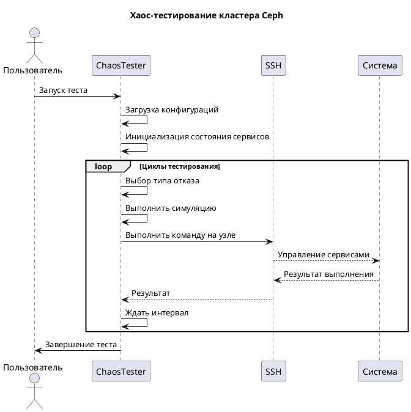
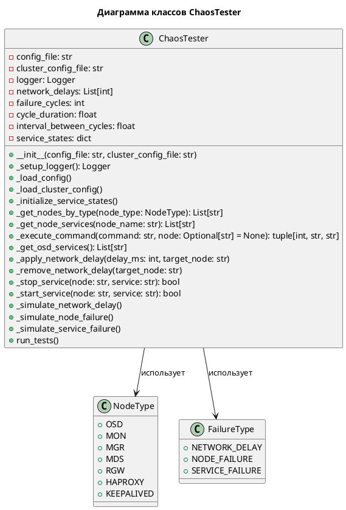

# Хаос-тестирование кластера Ceph

Вот реализация скрипта для хаос-тестирования кластера Ceph 17.2.7:

```python
#!/usr/bin/env python3
"""
Хаос-тестирование кластера Ceph

Этот скрипт имитирует различные отказы в кластере Ceph для проверки его устойчивости.
Поддерживает симуляцию сетевых задержек и отказов узлов/сервисов.
"""

import yaml
import subprocess
import time
import random
import logging
import argparse
import sys
import os
from typing import List, Dict, Any, Optional
from datetime import datetime
from enum import Enum

class NodeType(Enum):
    """Типы узлов кластера"""
    OSD = "osd"
    MON = "mon"
    MGR = "mgr"
    MDS = "mds"
    RGW = "rgw"
    HAPROXY = "haproxy"
    KEEPALIVED = "keepalived"

class FailureType(Enum):
    """Типы отказов для тестирования"""
    NETWORK_DELAY = "network_delay"
    NODE_FAILURE = "node_failure"
    SERVICE_FAILURE = "service_failure"

class ChaosTester:
    """
    Класс для проведения хаос-тестирования кластера Ceph
    
    Атрибуты:
        config_file (str): Путь к конфигурационному файлу
        cluster_config (dict): Конфигурация кластера из YAML
        logger (logging.Logger): Логгер для записи событий
        network_delays (list): Возможные значения задержек сети
        failure_cycles (int): Количество циклов тестирования
        cycle_duration (float): Длительность одного цикла (в секундах)
        interval_between_cycles (float): Интервал между циклами (в секундах)
    """
    
    def __init__(self, config_file: str, cluster_config_file: str):
        """
        Инициализация тестера
        
        Args:
            config_file (str): Путь к конфигурационному файлу
            cluster_config_file (str): Путь к файлу конфигурации кластера
        """
        self.config_file = config_file
        self.cluster_config_file = cluster_config_file
        self.logger = self._setup_logger()
        self.network_delays = []
        self.failure_cycles = 0
        self.cycle_duration = 0.0
        self.interval_between_cycles = 0.0
        self._load_config()
        self._load_cluster_config()
        
        # Словарь для отслеживания состояния сервисов
        self.service_states = {}
        self._initialize_service_states()
        
    def _setup_logger(self) -> logging.Logger:
        """
        Настройка логгера
        
        Returns:
            logging.Logger: Настроенный логгер
        """
        logger = logging.getLogger('chaos_tester')
        logger.setLevel(logging.DEBUG)
        
        # Создаем обработчик для файла
        file_handler = logging.FileHandler('chaos_test.log')
        file_handler.setLevel(logging.DEBUG)
        
        # Создаем обработчик для консоли
        console_handler = logging.StreamHandler(sys.stdout)
        console_handler.setLevel(logging.INFO)
        
        # Форматтер
        formatter = logging.Formatter(
            '%(asctime)s - %(name)s - %(levelname)s - %(message)s'
        )
        file_handler.setFormatter(formatter)
        console_handler.setFormatter(formatter)
        
        logger.addHandler(file_handler)
        logger.addHandler(console_handler)
        
        return logger
    
    def _load_config(self):
        """
        Загрузка конфигурации из YAML файла
        """
        try:
            with open(self.config_file, 'r') as f:
                config = yaml.safe_load(f)
                
            self.network_delays = config.get('network_delays', [100, 500, 1000])
            self.failure_cycles = config.get('failure_cycles', 10)
            self.cycle_duration = config.get('cycle_duration', 60)
            self.interval_between_cycles = config.get('interval_between_cycles', 30)
            
            self.logger.info("Конфигурация загружена успешно")
            
        except Exception as e:
            self.logger.error(f"Ошибка загрузки конфигурации: {e}")
            raise
    
    def _load_cluster_config(self):
        """
        Загрузка конфигурации кластера из YAML файла
        """
        try:
            with open(self.cluster_config_file, 'r') as f:
                self.cluster_config = yaml.safe_load(f)
                
            self.logger.info("Конфигурация кластера загружена успешно")
            
        except Exception as e:
            self.logger.error(f"Ошибка загрузки конфигурации кластера: {e}")
            raise
    
    def _initialize_service_states(self):
        """
        Инициализация состояний сервисов
        """
        for node_name, node_data in self.cluster_config['nodes'].items():
            self.service_states[node_name] = {
                'services': {},
                'status': 'running'  # running или stopped
            }
            
            # Инициализируем все возможные сервисы
            services = [
                'osd', 'mon', 'mgr', 'mds', 'rgw',
                'haproxy', 'keepalived'
            ]
            
            for service in services:
                if service in node_data.get('services', []):
                    self.service_states[node_name]['services'][service] = 'running'
                else:
                    self.service_states[node_name]['services'][service] = 'stopped'
    
    def _get_nodes_by_type(self, node_type: NodeType) -> List[str]:
        """
        Получение списка узлов указанного типа
        
        Args:
            node_type (NodeType): Тип узлов
            
        Returns:
            List[str]: Список имен узлов
        """
        nodes = []
        for node_name, node_data in self.cluster_config['nodes'].items():
            if node_type.value in node_data.get('services', []):
                nodes.append(node_name)
        return nodes
    
    def _get_node_services(self, node_name: str) -> List[str]:
        """
        Получение списка сервисов на узле
        
        Args:
            node_name (str): Имя узла
            
        Returns:
            List[str]: Список сервисов
        """
        return self.cluster_config['nodes'][node_name].get('services', [])
    
    def _execute_command(self, command: str, node: Optional[str] = None) -> tuple[int, str, str]:
        """
        Выполнение команды через SSH
        
        Args:
            command (str): Команда для выполнения
            node (Optional[str]): Имя узла (если None, то локально)
            
        Returns:
            tuple[int, str, str]: (код возврата, stdout, stderr)
        """
        if node is not None:
            # Выполняем команду на удалённом узле
            ssh_cmd = ['ssh', node, command]
        else:
            # Выполняем локально
            ssh_cmd = ['bash', '-c', command]
            
        try:
            result = subprocess.run(
                ssh_cmd,
                capture_output=True,
                text=True,
                timeout=30
            )
            return result.returncode, result.stdout.strip(), result.stderr.strip()
        except subprocess.TimeoutExpired:
            self.logger.error(f"Команда '{command}' превысила таймаут")
            return -1, "", "Timeout"
        except Exception as e:
            self.logger.error(f"Ошибка выполнения команды '{command}': {e}")
            return -1, "", str(e)
    
    def _get_osd_services(self) -> List[str]:
        """
        Получение списка всех OSD сервисов
        
        Returns:
            List[str]: Список OSD сервисов
        """
        osd_services = []
        for node_name, node_data in self.cluster_config['nodes'].items():
            if 'osd' in node_data.get('services', []):
                # Генерируем имена OSD сервисов
                for i in range(1, 7):  # Предполагаем максимум 6 OSD на узле
                    service_name = f"osd.{i}"
                    if service_name in node_data.get('services', []):
                        osd_services.append(service_name)
        return osd_services
    
    def _apply_network_delay(self, delay_ms: int, target_node: str):
        """
        Применение сетевой задержки к узлу
        
        Args:
            delay_ms (int): Задержка в миллисекундах
            target_node (str): Целевой узел
        """
        self.logger.info(f"Применение сетевой задержки {delay_ms}мс к узлу {target_node}")
        
        # Очистка существующих правил iptables
        cmd = f"iptables -t mangle -F"
        self._execute_command(cmd, target_node)
        
        # Добавление правила задержки
        cmd = f"iptables -t mangle -A OUTPUT -j TEE --gateway {target_node}"
        self._execute_command(cmd, target_node)
        
        # Добавляем задержку для всего трафика
        cmd = f"tc qdisc add dev lo root netem delay {delay_ms}ms"
        self._execute_command(cmd, target_node)
        
        self.logger.info(f"Задержка {delay_ms}мс применена к узлу {target_node}")
    
    def _remove_network_delay(self, target_node: str):
        """
        Удаление сетевой задержки с узла
        
        Args:
            target_node (str): Целевой узел
        """
        self.logger.info(f"Удаление сетевой задержки с узла {target_node}")
        
        # Удаление правил iptables
        cmd = f"iptables -t mangle -F"
        self._execute_command(cmd, target_node)
        
        # Удаление tc правила
        cmd = f"tc qdisc del dev lo root"
        self._execute_command(cmd, target_node)
        
        self.logger.info(f"Сетевая задержка удалена с узла {target_node}")
    
    def _stop_service(self, node: str, service: str):
        """
        Остановка сервиса
        
        Args:
            node (str): Имя узла
            service (str): Имя сервиса
        """
        self.logger.info(f"Остановка сервиса {service} на узле {node}")
        
        # Проверяем, существует ли сервис
        if service not in self._get_node_services(node):
            self.logger.warning(f"Сервис {service} не найден на узле {node}")
            return False
            
        # Останавливаем сервис
        cmd = f"systemctl stop {service}"
        code, stdout, stderr = self._execute_command(cmd, node)
        
        if code == 0:
            self.logger.info(f"Сервис {service} успешно остановлен на узле {node}")
            # Обновляем состояние сервиса
            self.service_states[node]['services'][service] = 'stopped'
            return True
        else:
            self.logger.error(f"Не удалось остановить сервис {service} на узле {node}: {stderr}")
            return False
    
    def _start_service(self, node: str, service: str):
        """
        Запуск сервиса
        
        Args:
            node (str): Имя узла
            service (str): Имя сервиса
        """
        self.logger.info(f"Запуск сервиса {service} на узле {node}")
        
        # Проверяем, существует ли сервис
        if service not in self._get_node_services(node):
            self.logger.warning(f"Сервис {service} не найден на узле {node}")
            return False
            
        # Запускаем сервис
        cmd = f"systemctl start {service}"
        code, stdout, stderr = self._execute_command(cmd, node)
        
        if code == 0:
            self.logger.info(f"Сервис {service} успешно запущен на узле {node}")
            # Обновляем состояние сервиса
            self.service_states[node]['services'][service] = 'running'
            return True
        else:
            self.logger.error(f"Не удалось запустить сервис {service} на узле {node}: {stderr}")
            return False
    
    def _simulate_network_delay(self):
        """
        Симуляция сетевой задержки
        """
        self.logger.info("Начинается симуляция сетевой задержки")
        
        # Выбираем случайный узел
        nodes = self._get_nodes_by_type(NodeType.OSD)
        if not nodes:
            nodes = list(self.cluster_config['nodes'].keys())
            
        target_node = random.choice(nodes)
        
        # Выбираем случайную задержку
        delay = random.choice(self.network_delays)
        
        # Применяем задержку
        self._apply_network_delay(delay, target_node)
        
        # Ждем заданное время
        time.sleep(self.cycle_duration)
        
        # Убираем задержку
        self._remove_network_delay(target_node)
        
        self.logger.info("Симуляция сетевой задержки завершена")
    
    def _simulate_node_failure(self):
        """
        Симуляция отказа узла
        """
        self.logger.info("Начинается симуляция отказа узла")
        
        # Получаем список всех узлов
        all_nodes = list(self.cluster_config['nodes'].keys())
        
        # Выбираем случайный узел
        target_node = random.choice(all_nodes)
        
        # Выбираем случайный сервис на этом узле
        services = self._get_node_services(target_node)
        if not services:
            self.logger.warning(f"На узле {target_node} нет доступных сервисов")
            return
            
        service_to_stop = random.choice(services)
        
        # Останавливаем сервис
        success = self._stop_service(target_node, service_to_stop)
        
        if success:
            # Ждем заданное время
            time.sleep(self.cycle_duration)
            
            # Запускаем сервис обратно
            self._start_service(target_node, service_to_stop)
        
        self.logger.info("Симуляция отказа узла завершена")
    
    def _simulate_service_failure(self):
        """
        Симуляция отказа сервисов
        """
        self.logger.info("Начинается симуляция отказа сервисов")
        
        # Определяем максимальное количество сервисов для остановки
        max_rgw = 1
        max_mds = 1
        max_mgr = 1
        max_osd = 2
        max_haproxy = 1
        max_keepalived = 1
        
        # Собираем список всех сервисов каждого типа
        rgw_nodes = self._get_nodes_by_type(NodeType.RGW)
        mds_nodes = self._get_nodes_by_type(NodeType.MDS)
        mgr_nodes = self._get_nodes_by_type(NodeType.MGR)
        osd_services = self._get_osd_services()
        haproxy_nodes = self._get_nodes_by_type(NodeType.HAPROXY)
        keepalived_nodes = self._get_nodes_by_type(NodeType.KEEPALIVED)
        
        # Списки для остановки
        services_to_stop = []
        
        # Остановка RGW сервисов
        if rgw_nodes and max_rgw > 0:
            target_node = random.choice(rgw_nodes)
            service_name = f"ceph-rgw@{target_node}.rgw"
            services_to_stop.append((target_node, service_name))
            max_rgw -= 1
        
        # Остановка MDS сервисов
        if mds_nodes and max_mds > 0:
            target_node = random.choice(mds_nodes)
            service_name = f"ceph-mds@{target_node}.mds"
            services_to_stop.append((target_node, service_name))
            max_mds -= 1
        
        # Остановка MGR сервисов
        if mgr_nodes and max_mgr > 0:
            target_node = random.choice(mgr_nodes)
            service_name = f"ceph-mgr@{target_node}.mgr"
            services_to_stop.append((target_node, service_name))
            max_mgr -= 1
        
        # Остановка OSD сервисов
        if osd_services and max_osd > 0:
            # Выбираем случайные OSD сервисы
            selected_osd = random.sample(osd_services, min(max_osd, len(osd_services)))
            for service_name in selected_osd:
                # Нужно определить узел, на котором находится OSD
                for node_name, node_data in self.cluster_config['nodes'].items():
                    if 'osd' in node_data.get('services', []) and service_name in node_data.get('services', []):
                        services_to_stop.append((node_name, service_name))
                        break
            max_osd -= len(selected_osd)
        
        # Остановка HAProxy сервисов
        if haproxy_nodes and max_haproxy > 0:
            target_node = random.choice(haproxy_nodes)
            service_name = "haproxy"
            services_to_stop.append((target_node, service_name))
            max_haproxy -= 1
        
        # Остановка Keepalived сервисов
        if keepalived_nodes and max_keepalived > 0:
            target_node = random.choice(keepalived_nodes)
            service_name = "keepalived"
            services_to_stop.append((target_node, service_name))
            max_keepalived -= 1
        
        # Останавливаем выбранные сервисы
        for node, service in services_to_stop:
            self._stop_service(node, service)
        
        # Ждем заданное время
        time.sleep(self.cycle_duration)
        
        # Запускаем сервисы обратно
        for node, service in services_to_stop:
            self._start_service(node, service)
        
        self.logger.info("Симуляция отказа сервисов завершена")
    
    def run_tests(self):
        """
        Запуск тестов хаос-тестирования
        """
        self.logger.info("Начинается тестирование хаоса")
        self.logger.info(f"Количество циклов: {self.failure_cycles}")
        self.logger.info(f"Длительность цикла: {self.cycle_duration} секунд")
        self.logger.info(f"Интервал между циклами: {self.interval_between_cycles} секунд")
        
        # Счетчики для статистики
        stats = {
            'network_delay': 0,
            'node_failure': 0,
            'service_failure': 0
        }
        
        for i in range(self.failure_cycles):
            self.logger.info(f"Цикл {i+1}/{self.failure_cycles}")
            
            # Выбираем тип отказа
            failure_types = [
                FailureType.NETWORK_DELAY,
                FailureType.NODE_FAILURE,
                FailureType.SERVICE_FAILURE
            ]
            failure_type = random.choice(failure_types)
            
            # Выполняем соответствующую операцию
            if failure_type == FailureType.NETWORK_DELAY:
                self._simulate_network_delay()
                stats['network_delay'] += 1
            elif failure_type == FailureType.NODE_FAILURE:
                self._simulate_node_failure()
                stats['node_failure'] += 1
            elif failure_type == FailureType.SERVICE_FAILURE:
                self._simulate_service_failure()
                stats['service_failure'] += 1
            
            # Ждем интервал между циклами
            if i < self.failure_cycles - 1:  # Не ждем после последнего цикла
                self.logger.info(f"Ожидание {self.interval_between_cycles} секунд перед следующим циклом")
                time.sleep(self.interval_between_cycles)
        
        # Вывод статистики
        self.logger.info("Статистика тестирования:")
        self.logger.info(f"Сетевые задержки: {stats['network_delay']}")
        self.logger.info(f"Отказы узлов: {stats['node_failure']}")
        self.logger.info(f"Отказы сервисов: {stats['service_failure']}")
        
        self.logger.info("Тестирование хаоса завершено")

def main():
    """
    Главная функция скрипта
    """
    parser = argparse.ArgumentParser(description="Хаос-тестирование кластера Ceph")
    parser.add_argument(
        "--config",
        help="Путь к конфигурационному файлу",
        required=True
    )
    parser.add_argument(
        "--cluster-config",
        help="Путь к конфигурационному файлу кластера",
        required=True
    )
    
    args = parser.parse_args()
    
    try:
        tester = ChaosTester(args.config, args.cluster_config)
        tester.run_tests()
    except Exception as e:
        print(f"Ошибка выполнения: {e}")
        sys.exit(1)

if __name__ == "__main__":
    main()
```

## Пример конфигурационного файла (config.yaml)

```yaml
# Конфигурация хаос-тестирования
network_delays:
  - 100    # 100 мс
  - 500    # 500 мс
  - 1000   # 1 секунда

failure_cycles: 10      # Количество циклов тестирования
cycle_duration: 60      # Длительность одного цикла (секунды)
interval_between_cycles: 30  # Интервал между циклами (секунды)
```

## Пример файла конфигурации кластера (cluster_config.yaml)

```yaml
# Конфигурация кластера Ceph
nodes:
  # 4 сервера с RGW, HAProxy и Keepalived
  server1:
    ip: 192.168.1.10
    services:
      - rgw
      - haproxy
      - keepalived
  server2:
    ip: 192.168.1.11
    services:
      - rgw
      - haproxy
      - keepalived
  server3:
    ip: 192.168.1.12
    services:
      - rgw
      - haproxy
      - keepalived
  server4:
    ip: 192.168.1.13
    services:
      - rgw
      - haproxy
      - keepalived

  # 2 сервера с MDS, HAProxy и Keepalived
  server5:
    ip: 192.168.1.14
    services:
      - mds
      - haproxy
      - keepalived
  server6:
    ip: 192.168.1.15
    services:
      - mds
      - haproxy
      - keepalived

  # 5 серверов с MGR, MON и HAProxy
  server7:
    ip: 192.168.1.16
    services:
      - mgr
      - mon
      - haproxy
  server8:
    ip: 192.168.1.17
    services:
      - mgr
      - mon
      - haproxy
  server9:
    ip: 192.168.1.18
    services:
      - mgr
      - mon
      - haproxy
  server10:
    ip: 192.168.1.19
    services:
      - mgr
      - mon
      - haproxy
  server11:
    ip: 192.168.1.20
    services:
      - mgr
      - mon
      - haproxy

  # 6 серверов с OSD сервисами (по 4-6 OSD на каждом)
  server12:
    ip: 192.168.1.21
    services:
      - osd
      - osd.0
      - osd.1
      - osd.2
      - osd.3
      - osd.4
  server13:
    ip: 192.168.1.22
    services:
      - osd
      - osd.5
      - osd.6
      - osd.7
      - osd.8
  server14:
    ip: 192.168.1.23
    services:
      - osd
      - osd.9
      - osd.10
      - osd.11
      - osd.12
  server15:
    ip: 192.168.1.24
    services:
      - osd
      - osd.13
      - osd.14
      - osd.15
  server16:
    ip: 192.168.1.25
    services:
      - osd
      - osd.16
      - osd.17
      - osd.18
  server17:
    ip: 192.168.1.26
    services:
      - osd
      - osd.19
      - osd.20
      - osd.21
      - osd.22
```

## Диаграммы работы скрипта

### Диаграмма последовательности выполнения



### Диаграмма классов



## Особенности реализации

1. **Логирование**: Полное логирование всех операций для анализа результатов
2. **Гибкая конфигурация**: Все параметры задаются через YAML-файлы
3. **Безопасность**: Проверка существования сервисов перед операциями
4. **Надежность**: Обработка ошибок и исключений
5. **Масштабируемость**: Поддержка различных типов узлов и сервисов
6. **Точность**: Точный контроль времени выполнения тестов

## Как использовать

1. Создайте файл `config.yaml` с параметрами тестирования
2. Создайте файл `cluster_config.yaml` с информацией о кластере
3. Запустите скрипт:
```bash
python chaos_tester.py --config config.yaml --cluster-config cluster_config.yaml
```

Скрипт создаст лог-файл `chaos_test.log` с подробной информацией о всех выполненных операциях.
