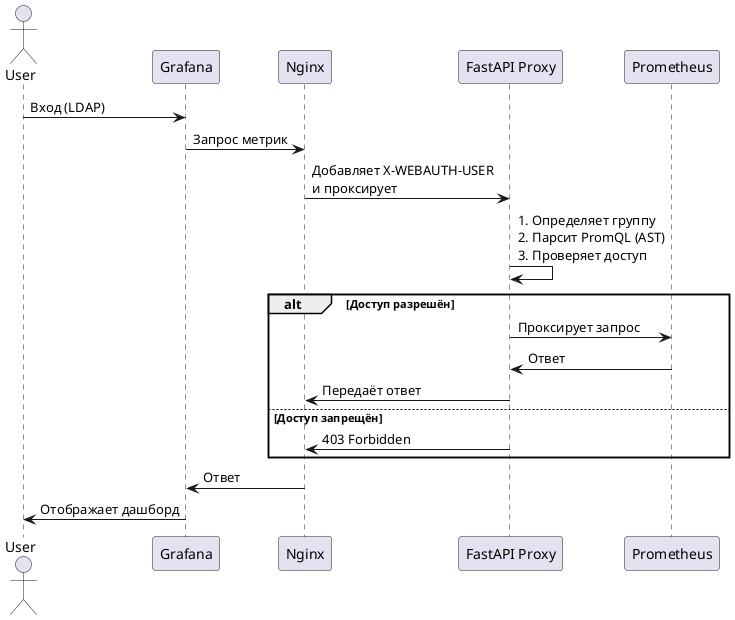
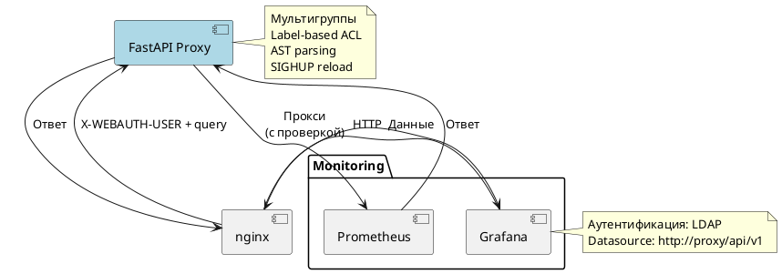
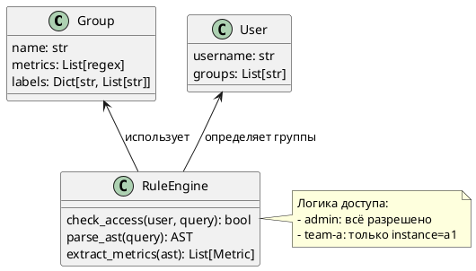

Конечно! Ниже — **подробное описание решения**, написанное так, чтобы **посторонний человек (например, руководитель, DevOps, архитектор)** понял:

- Что это за система,
- Для чего она нужна,
- Как работает,
- Какие у неё особенности и преимущества.

В конце — **диаграммы в PlantUML** для наглядности.

---

# 📚 Описание: Мультитенантный прокси для Prometheus с контролем доступа

## 1. 🔍 Что это?

Это **межуровневый прокси-сервис**, который располагается между **Grafana** и **Prometheus**, и обеспечивает **разграничение доступа к метрикам на основе пользовательских прав**.

Сервис позволяет:
- Разным пользователям видеть **только те метрики**, к которым они имеют доступ.
- Ограничивать доступ **по имени метрики** и **по значениям меток** (labels).
- Динамически обновлять правила доступа без перезапуска.
- Работать в масштабируемых и безопасных средах.

> 🎯 Цель: **обеспечить безопасный мультитенантный доступ к единому Prometheus из Grafana** при использовании **Grafana OSS** (которая не поддерживает RBAC).

---

## 2. 💡 Для чего это нужно?

### Проблема
- Prometheus **не имеет встроенной авторизации**.
- Grafana (в версии OSS) **не может ограничить доступ к данным на уровне datasource** — все пользователи видят одни и те же метрики.
- При использовании LDAP в Grafana нет возможности "отфильтровать" данные в Prometheus по пользователю.

👉 Это **угроза безопасности**: инженер одной команды может увидеть метрики другой команды.

### Решение
Разместить перед Prometheus **умный прокси**, который:
- Знает, кто делает запрос (через заголовок `X-WEBAUTH-USER`).
- Знать, какие метрики и метки разрешены для этого пользователя.
- Проверяет каждый PromQL-запрос **до того, как он достигнет Prometheus**.
- Блокирует запрос, если он пытается получить запрещённые данные.

---

## 3. 🧱 Архитектура системы

```
+----------------+     +------------------+     +-------------------+     +---------------+
|                |     |                  |     |                   |     |               |
|    Grafana     | --> |      Nginx       | --> |   FastAPI Proxy   | --> |  Prometheus   |
| (LDAP Auth)    |     | (Auth Proxy)     |     | (Access Control)  |     |               |
|                |     |                  |     |                   |     |               |
+----------------+     +------------------+     +-------------------+     +---------------+
```

### Компоненты:

| Компонент | Роль |
|---------|------|
| **Grafana** | Визуализация метрик. Аутентификация через LDAP. |
| **Nginx** | Обратный прокси. Передаёт имя пользователя в заголовке `X-WEBAUTH-USER`. |
| **FastAPI Proxy** | Ядро системы. Анализирует PromQL, проверяет права, фильтрует доступ. |
| **Prometheus** | Хранение и вычисление метрик. |

---

## 4. ⚙️ Как это работает?

### Шаг 1: Пользователь входит в Grafana
- Аутентификация через LDAP.
- Grafana начинает сессию и передаёт имя пользователя в Nginx (через механизм **Auth Proxy**).

### Шаг 2: Запрос к Prometheus
- Когда пользователь открывает дашборд, Grafana отправляет PromQL-запрос.
- Nginx добавляет заголовок:  
  `X-WEBAUTH-USER: bob`
- Направляет запрос в **FastAPI Proxy**.

### Шаг 3: Проверка доступа
Прокси:
1. Извлекает имя пользователя (`bob`).
2. Определяет его группы (например, `team-a`).
3. Считывает конфиг:  
   - Группа `team-a` может читать `http_requests_total`, но только с `instance=server-a1`.
4. Парсит PromQL-запрос с помощью **AST** (Abstract Syntax Tree).
5. Проверяет:
   - Все упомянутые метрики разрешены?
   - Все метки (например, `instance`, `job`) в разрешённых диапазонах?
6. Если всё разрешено — пропускает запрос к Prometheus.  
   Если нет — возвращает `403 Forbidden`.

### Шаг 4: Ответ
- Prometheus отвечает.
- Прокси возвращает результат обратно в Grafana.

---

## 5. 🌟 Особенности и преимущества

| Фича | Описание |
|------|--------|
| **Мультитенантность** | Разные команды/пользователи видят только свои данные. |
| **Гибкие правила доступа** | Можно ограничивать по имени метрики (`^app_.*`) и по меткам (`instance=a1`). |
| **Точный парсинг PromQL** | Используется AST, а не регулярки → нельзя обойти через сложные выражения. |
| **Горячая перезагрузка** | При изменении `config.yml` — отправьте `kill -HUP <PID>` → правила обновятся без остановки. |
| **Асинхронная работа** | На FastAPI + HTTPX → высокая производительность и масштабируемость. |
| **Логирование** | Все действия пишутся в файл: кто пытался что получить и был ли доступ разрешён. |
| **Поддержка POST/GET** | Корректно обрабатывает все типы запросов от Grafana. |
| **Работает с Grafana OSS** | Не требует платной версии Grafana Enterprise. |

---

## 6. 🛠 Техническая реализация

### Язык: Python  
### Фреймворк: FastAPI  
### Ключевые библиотеки:
- `prometheus-query-parser` — для точного разбора PromQL.
- `httpx` — асинхронный HTTP-клиент.
- `PyYAML` — чтение конфигурации.
- `lru_cache` — кэширование парсинга PromQL.
- `signal` — обработка `SIGHUP` для перезагрузки.

### Конфигурация (`config.yml`)
```yaml
groups:
  team-a:
    metrics: ["^http_requests_total$"]
    labels:
      instance: ["server-a1", "server-a2"]

users:
  bob: [team-a]
```

---

## 7. 🖼 Диаграммы (PlantUML)

### 7.1. Sequence Diagram — Поток запроса



---

### 7.2. Component Diagram — Архитектура



---

### 7.3. Config Structure — Структура правил



---

## 8. ✅ Когда использовать?

| Сценарий | Подходит? |
|--------|----------|
| Grafana + Prometheus в компании с несколькими командами | ✅ Да |
| Нужно разделить доступ к продакшен и дев средам | ✅ Да |
| Используется Grafana OSS (без RBAC) | ✅ Да |
| Требуется аудит и контроль доступа | ✅ Да |
| Есть единый Prometheus для всех | ✅ Да |

---

## 9. 🚀 Дальнейшие улучшения

- Интеграция с LDAP/AD для динамической загрузки групп.
- Web UI для просмотра логов и управления правилами.
- Поддержка JWT или OAuth2.
- Rate limiting и защита от DoS.
- Экспорт метрик самого прокси (`/metrics`).

---

## 🔚 Заключение

Этот прокси — **надёжный «страж» между Grafana и Prometheus**, который превращает **монолитный Prometheus в мультитенантную систему**.

Он позволяет:
- Безопасно делиться данными между командами.
- Соответствовать требованиям информационной безопасности.
- Работать с Grafana OSS без потери контроля.

> 💡 **Идеально подходит для сред, где важны безопасность, прозрачность и гибкость** — от стартапов до крупных предприятий.

---

Если хочешь — могу подготовить **Dockerfile**, **systemd unit**, или **документацию в формате Markdown/PDF**.
