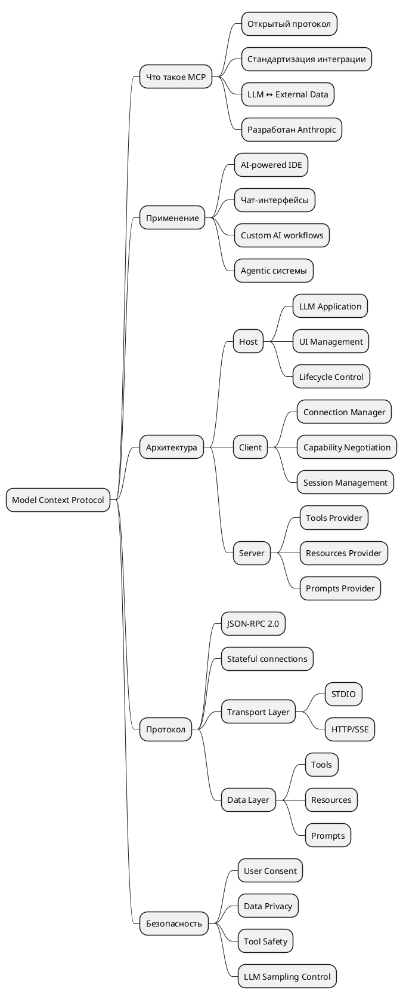
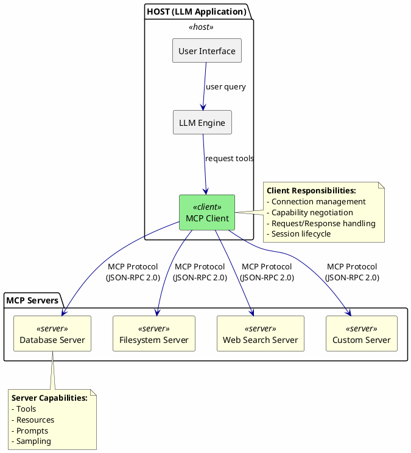
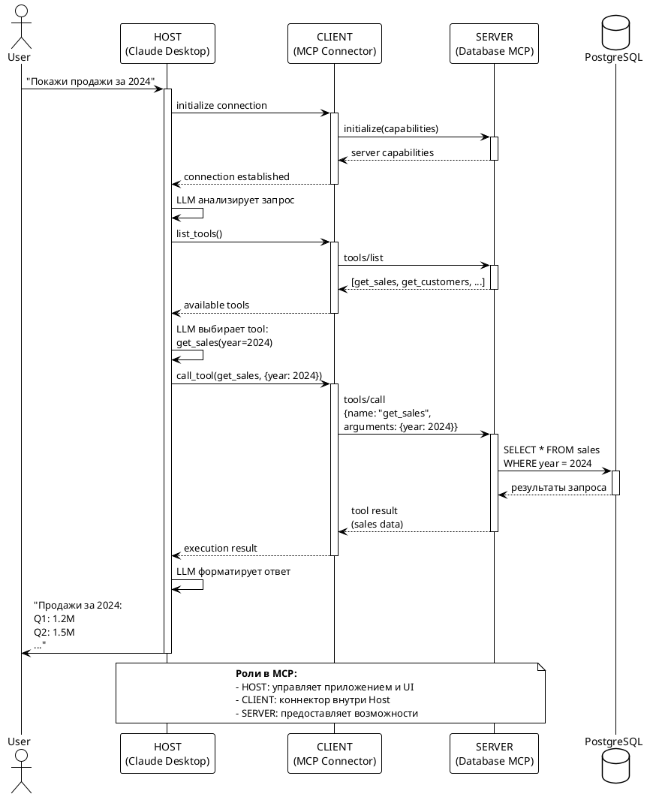

Отлично! Теперь подготовлю полную структуру курса с подробными материалами. Ваша программа хорошо структурирована, добавлю несколько важных аспектов из актуальной документации.

## Структура репозитория курса MCP + Java

```
mcp-java-course/
├── README.md
├── lectures/
│   ├── module-01-introduction/
│   │   ├── lecture.md
│   │   ├── mindmap.puml
│   │   └── diagrams/
│   │       ├── architecture.puml
│   │       └── roles.puml
│   ├── module-02-protocol/
│   │   ├── lecture.md
│   │   ├── mindmap.puml
│   │   └── diagrams/
│   │       ├── transport.puml
│   │       ├── message-types.puml
│   │       └── capabilities.puml
│   ├── module-03-java-sdk/
│   │   ├── lecture.md
│   │   ├── mindmap.puml
│   │   └── diagrams/
│   │       └── sdk-architecture.puml
│   ├── module-04-debugging/
│   │   ├── lecture.md
│   │   ├── mindmap.puml
│   │   └── diagrams/
│   │       └── debugging-flow.puml
│   ├── module-05-llm-host/
│   │   ├── lecture.md
│   │   ├── mindmap.puml
│   │   └── diagrams/
│   │       └── host-interaction.puml
│   ├── module-06-model-integration/
│   │   ├── lecture.md
│   │   ├── mindmap.puml
│   │   └── diagrams/
│   │       └── integration-patterns.puml
│   ├── module-07-spring-ai/
│   │   ├── lecture.md
│   │   ├── mindmap.puml
│   │   └── diagrams/
│   │       └── spring-integration.puml
│   └── module-08-practice/
│       ├── lecture.md
│       └── mindmap.puml
├── labs/
│   ├── lab-01-simple-server/
│   │   ├── README.md
│   │   └── solution/
│   ├── lab-02-client/
│   │   ├── README.md
│   │   └── solution/
│   ├── lab-03-tools/
│   │   ├── README.md
│   │   └── solution/
│   ├── lab-04-resources/
│   │   ├── README.md
│   │   └── solution/
│   ├── lab-05-prompts/
│   │   ├── README.md
│   │   └── solution/
│   ├── lab-06-spring-server/
│   │   ├── README.md
│   │   └── solution/
│   ├── lab-07-spring-client/
│   │   ├── README.md
│   │   └── solution/
│   └── lab-08-full-integration/
│       ├── README.md
│       └── solution/
└── examples/
    ├── pom.xml
    └── src/
```

***

## README.md

```markdown
# Курс: Model Context Protocol (MCP) и Java

Полноценный обучающий курс по работе с Model Context Protocol в экосистеме Java.

## О курсе

Model Context Protocol (MCP) — это открытый протокол, разработанный Anthropic, который обеспечивает стандартизированный способ интеграции LLM-приложений с внешними источниками данных и инструментами[web:2][web:3].

## Структура курса

### Теоретические модули (lectures/)

1. **Модуль 1: Введение в MCP**
   - Основы протокола
   - Архитектура и роли
   - Применение в экосистеме LLM

2. **Модуль 2: MCP-протокол**
   - Транспортный уровень
   - Типы сообщений
   - Возможности клиента и сервера

3. **Модуль 3: MCP SDK на Java**
   - Обзор библиотеки
   - Реализация клиента
   - Реализация сервера

4. **Модуль 4: Отладка и мониторинг**
   - Логирование
   - Диагностика проблем
   - MCP Inspector

5. **Модуль 5: Взаимодействие с LLM-хостом**
   - Архитектура взаимодействия
   - Конфигурация хостов

6. **Модуль 6: Интеграция с моделями**
   - Модели с fine-tuning
   - Модели без fine-tuning

7. **Модуль 7: Spring AI и MCP**
   - Spring Boot стартеры
   - Аннотации MCP
   - Конфигурация

8. **Модуль 8: Практика**
   - Комплексные примеры
   - Best practices

### Практические лабораторные работы (labs/)

- **Lab 01**: Создание простого MCP-сервера
- **Lab 02**: Реализация MCP-клиента
- **Lab 03**: Работа с Tools
- **Lab 04**: Работа с Resources
- **Lab 05**: Работа с Prompts
- **Lab 06**: Spring AI MCP Server
- **Lab 07**: Spring AI MCP Client
- **Lab 08**: Полная интеграция

## Требования

- Java 17+
- Maven 3.8+
- IntelliJ IDEA / VS Code
- Node.js (для MCP Inspector)
- Базовые знания Spring Boot (для модулей 7-8)

## Как использовать курс

1. Последовательно изучайте материалы модулей в папке `lectures/`
2. Выполняйте соответствующие лабораторные работы из папки `labs/`
3. Используйте примеры кода из папки `examples/`
4. Изучайте диаграммы PlantUML и mindmap для визуализации концепций

## Дополнительные ресурсы

- [Официальная документация MCP](https://modelcontextprotocol.io/)
- [MCP Java SDK](https://github.com/modelcontextprotocol/java-sdk)
- [Spring AI MCP Reference](https://docs.spring.io/spring-ai/reference/api/mcp/mcp-overview.html)
```

***

## lectures/module-01-introduction/lecture.md

```markdown
# Модуль 1: Введение в Model Context Protocol

## Что такое MCP (Model Context Protocol)

Model Context Protocol (MCP) — это открытый стандартизированный протокол, который обеспечивает бесшовную интеграцию между LLM-приложениями и внешними источниками данных и инструментами[web:2][web:8]. Протокол был разработан Anthropic и предоставляет универсальный способ для AI-моделей взаимодействовать с внешним миром через согласованный интерфейс[page:1].

### Основная идея

MCP решает проблему фрагментированной интеграции AI-систем. Вместо того чтобы создавать отдельные интеграции для каждой комбинации LLM и источника данных, MCP предлагает единый протокол, который работает везде.

**Аналогия**: Представьте MCP как USB-порт для AI. Точно так же, как USB стандартизировал подключение периферийных устройств к компьютерам, MCP стандартизирует подключение AI-моделей к данным и инструментам.

### Ключевые возможности MCP

MCP позволяет приложениям[web:2][web:8]:

- **Делиться контекстной информацией** с языковыми моделями
- **Предоставлять инструменты и возможности** AI-системам
- **Строить композиционные интеграции** и рабочие процессы

### Основной протокол

MCP базируется на следующих принципах[web:2][web:8]:

- **Формат сообщений**: JSON-RPC 2.0
- **Соединения**: Stateful (с сохранением состояния)
- **Согласование возможностей**: Между сервером и клиентом

## Роль MCP в экосистеме LLM

### Проблема без MCP

Традиционно, для интеграции LLM с внешними системами требуется:

```
┌─────────────┐      ┌──────────────┐
│ LLM App 1   │─────>│ Database A   │
└─────────────┘      └──────────────┘
       │
       └────────────> ┌──────────────┐
                      │ API Service B│
                      └──────────────┘

┌─────────────┐      ┌──────────────┐
│ LLM App 2   │─────>│ Database A   │
└─────────────┘      └──────────────┘
       │
       └────────────> ┌──────────────┐
                      │ API Service C│
                      └──────────────┘
```

Каждая интеграция требует отдельной реализации, что приводит к дублированию кода и сложности поддержки.

### Решение с MCP

```
┌─────────────┐      ┌──────────────┐      ┌──────────────┐
│ LLM App 1   │─────>│ MCP Client   │─────>│ MCP Server A │
└─────────────┘      └──────────────┘      └──────────────┘
                                                   │
┌─────────────┐      ┌──────────────┐             │
│ LLM App 2   │─────>│ MCP Client   │─────────────┘
└─────────────┘      └──────────────┘      
                                            ┌──────────────┐
                                            │ MCP Server B │
                                            └──────────────┘
```

MCP создает единый стандарт взаимодействия, уменьшая сложность интеграции.

### Применение в экосистеме

MCP используется для[page:1]:

1. **AI-powered IDE** — интеграция с системами контроля версий, базами кодов
2. **Чат-интерфейсы** — доступ к корпоративным базам данных
3. **Кастомные AI-workflow** — автоматизация бизнес-процессов
4. **Agentic системы** — построение автономных агентов с доступом к инструментам

## Архитектура: клиент, сервер, хост

### Три основные роли

MCP определяет три ключевые роли в своей архитектуре[web:2][web:3]:

#### 1. Host (Хост)

**Определение**: LLM-приложение, которое инициирует соединения[web:2].

**Примеры**:
- Claude Desktop
- IDE (Cursor, VS Code с расширениями)
- Custom AI-приложения

**Ответственность**:
- Управление жизненным циклом приложения
- Отправка запросов к LLM
- Управление пользовательским интерфейсом

```java
// Пример: Host инициирует работу с MCP
public class AIApplicationHost {
    
    private final ChatClient chatClient;
    private final McpClient mcpClient;
    
    /**
     * Конструктор хоста AI-приложения.
     * Хост управляет взаимодействием между пользователем, LLM и MCP-серверами.
     * 
     * @param chatClient клиент для взаимодействия с LLM
     * @param mcpClient клиент для подключения к MCP-серверам
     */
    public AIApplicationHost(ChatClient chatClient, McpClient mcpClient) {
        this.chatClient = chatClient;
        this.mcpClient = mcpClient;
    }
    
    /**
     * Обработка пользовательского запроса.
     * Хост координирует получение дополнительных возможностей через MCP
     * и отправку расширенного запроса в LLM.
     */
    public String processUserQuery(String query) {
        // Получаем доступные инструменты от MCP-серверов
        List<Tool> tools = mcpClient.listTools();
        
        // Отправляем запрос в LLM с доступными инструментами
        return chatClient.call(query, tools);
    }
}
```

#### 2. Client (Клиент)

**Определение**: Коннектор внутри host-приложения, который управляет соединением с MCP-серверами[web:2][web:3].

**Ответственность**:
- Установление соединения с серверами
- Согласование возможностей (capability negotiation)
- Управление сессией
- Отправка запросов к серверам

```java
// Пример: MCP Client устанавливает соединение с сервером
public class SimpleMcpClient {
    
    private McpSession session;
    private InitializeResult serverCapabilities;
    
    /**
     * Инициализация соединения с MCP-сервером.
     * Клиент отправляет свои возможности и получает возможности сервера.
     * 
     * @param transport транспортный механизм (STDIO, HTTP, SSE)
     * @throws Exception если инициализация не удалась
     */
    public void connect(McpTransport transport) throws Exception {
        // Создаем сессию
        this.session = McpSession.create(transport);
        
        // Отправляем запрос инициализации с нашими возможностями
        InitializeRequest request = InitializeRequest.builder()
            .protocolVersion("2024-11-05")
            .clientInfo(Implementation.builder()
                .name("my-mcp-client")
                .version("1.0.0")
                .build())
            .capabilities(ClientCapabilities.builder()
                .roots(RootsCapability.builder().listChanged(true).build())
                .sampling(SamplingCapability.builder().build())
                .build())
            .build();
        
        // Получаем возможности сервера
        this.serverCapabilities = session.initialize(request);
        
        System.out.println("Подключено к серверу: " + 
            serverCapabilities.serverInfo().name());
    }
    
    /**
     * Получение списка доступных инструментов с сервера.
     * 
     * @return список инструментов, предоставляемых сервером
     */
    public List<Tool> listTools() {
        if (serverCapabilities.capabilities().tools() == null) {
            return Collections.emptyList();
        }
        
        ListToolsResult result = session.listTools();
        return result.tools();
    }
}
```

#### 3. Server (Сервер)

**Определение**: Сервис, который предоставляет контекст и возможности клиентам[web:2][web:3].

**Примеры**:
- Database MCP Server (доступ к БД)
- Filesystem MCP Server (операции с файлами)
- Web Search MCP Server (поиск в интернете)
- Custom Business Logic Server

**Ответственность**:
- Регистрация и предоставление возможностей (tools, resources, prompts)
- Обработка запросов от клиентов
- Управление доступом к данным

```java
// Пример: MCP Server предоставляет инструменты
public class WeatherMcpServer {
    
    /**
     * Настройка MCP-сервера с инструментами для получения погоды.
     * Сервер регистрирует свои возможности и обработчики.
     */
    public McpServer setupServer() {
        // Создаем спецификацию инструмента "получить погоду"
        Tool weatherTool = Tool.builder()
            .name("get_weather")
            .description("Получить текущую погоду для указанного города")
            .inputSchema(JsonSchema.builder()
                .type("object")
                .properties(Map.of(
                    "city", JsonSchema.builder()
                        .type("string")
                        .description("Название города")
                        .build(),
                    "units", JsonSchema.builder()
                        .type("string")
                        .enumValues(List.of("celsius", "fahrenheit"))
                        .description("Единицы измерения температуры")
                        .build()
                ))
                .required(List.of("city"))
                .build())
            .build();
        
        // Создаем сервер с возможностями
        return McpServer.builder()
            .serverInfo(Implementation.builder()
                .name("weather-server")
                .version("1.0.0")
                .build())
            .capabilities(ServerCapabilities.builder()
                .tools(ToolsCapability.builder()
                    .listChanged(true)
                    .build())
                .build())
            // Регистрируем обработчик вызова инструмента
            .toolsProvider(() -> List.of(weatherTool))
            .callToolHandler(this::handleToolCall)
            .build();
    }
    
    /**
     * Обработчик вызова инструмента.
     * Выполняет запрошенную операцию и возвращает результат.
     * 
     * @param request запрос на вызов инструмента
     * @return результат выполнения инструмента
     */
    private CallToolResult handleToolCall(CallToolRequest request) {
        if ("get_weather".equals(request.params().name())) {
            // Извлекаем параметры
            String city = request.params().arguments().get("city").asText();
            String units = request.params().arguments()
                .getOrDefault("units", JsonNode.of("celsius")).asText();
            
            // Выполняем бизнес-логику (здесь - заглушка)
            String weather = fetchWeatherData(city, units);
            
            // Возвращаем результат
            return CallToolResult.builder()
                .content(List.of(TextContent.builder()
                    .text(weather)
                    .build()))
                .build();
        }
        
        throw new IllegalArgumentException("Unknown tool: " + request.params().name());
    }
    
    /**
     * Получение данных о погоде (заглушка для примера).
     */
    private String fetchWeatherData(String city, String units) {
        return String.format("Погода в %s: 22°%s, облачно", 
            city, 
            "celsius".equals(units) ? "C" : "F");
    }
}
```

### Архитектурная диаграмма

```
┌─────────────────────────────────────────┐
│           HOST (LLM Application)        │
│  ┌───────────────────────────────────┐  │
│  │         User Interface            │  │
│  └───────────────┬───────────────────┘  │
│                  │                       │
│  ┌───────────────▼───────────────────┐  │
│  │      MCP CLIENT (Connector)       │  │
│  │  - Connection Management          │  │
│  │  - Capability Negotiation         │  │
│  │  - Request/Response Handling      │  │
│  └───────────────┬───────────────────┘  │
└──────────────────┼───────────────────────┘
                   │ MCP Protocol
                   │ (JSON-RPC 2.0)
       ┌───────────┼───────────┐
       │           │           │
┌──────▼──────┐ ┌──▼─────────┐ ┌──▼──────────┐
│ MCP SERVER  │ │ MCP SERVER │ │ MCP SERVER  │
│  (Database) │ │(Filesystem)│ │(Web Search) │
└─────────────┘ └────────────┘ └─────────────┘
```

### Взаимодействие компонентов

Типичный flow выглядит так:

1. **Инициализация**: Host создает MCP Client
2. **Подключение**: Client устанавливает соединение с Server
3. **Согласование**: Client и Server обмениваются возможностями
4. **Обнаружение**: Client запрашивает у Server список доступных tools/resources/prompts
5. **Использование**: User отправляет запрос → Host формирует промпт с доступными инструментами → LLM решает использовать tool → Client вызывает tool на Server → Server выполняет и возвращает результат → Host отображает результат User

## Уровни протокола

MCP состоит из двух основных уровней[web:3]:

### Data Layer (Уровень данных)

- Определяет JSON-RPC протокол для коммуникации клиент-сервер
- Управление жизненным циклом
- Основные примитивы: tools, resources, prompts, notifications

### Transport Layer (Транспортный уровень)

- Управляет каналами связи и аутентификацией
- Устанавливает соединения
- Обрамление сообщений (message framing)
- Поддерживает: STDIO, HTTP/SSE

## Принципы безопасности

MCP разработан с учетом следующих принципов безопасности[web:2][page:2]:

### Согласие и контроль пользователя

- Пользователь должен явно дать согласие на доступ к данным и операции
- Пользователь сохраняет контроль над тем, какие данные передаются
- Необходим понятный UI для авторизации действий

### Приватность данных

- Хост должен получить явное согласие пользователя перед передачей данных серверу
- Данные пользователя должны быть защищены соответствующими средствами контроля доступа

### Безопасность инструментов

- Tools представляют собой выполнение произвольного кода и требуют осторожности
- Хост должен получить явное согласие пользователя перед вызовом любого tool
- Пользователь должен понимать, что делает каждый tool

### Контроль LLM Sampling

- Пользователь должен явно одобрить любые запросы на sampling
- Пользователь должен контролировать, какие результаты видит сервер

## Резюме модуля

В этом модуле вы узнали:

✅ MCP — это открытый протокол для стандартизированной интеграции LLM с внешними данными и инструментами  
✅ MCP решает проблему фрагментированной интеграции в AI-экосистеме  
✅ Архитектура MCP включает три роли: Host, Client, Server  
✅ Протокол базируется на JSON-RPC 2.0 и поддерживает множество транспортов  
✅ Безопасность и контроль пользователя — основополагающие принципы MCP  

## Дополнительные материалы

- [Официальная спецификация MCP](https://modelcontextprotocol.io/specification/)
- [MCP Architecture Documentation](https://modelcontextprotocol.io/docs/learn/architecture)
```

***

## lectures/module-01-introduction/mindmap.puml



***

## lectures/module-01-introduction/diagrams/architecture.puml



***

## lectures/module-01-introduction/diagrams/roles.puml



***

Продолжу с остальными модулями...

## lectures/module-02-protocol/lecture.md

```markdown
# Модуль 2: MCP-протокол

## Transport (stdio, HTTP/SSE)

MCP поддерживает несколько транспортных механизмов для обмена сообщениями между клиентом и сервером[web:3]. Транспортный уровень отвечает за установление соединения, фреймирование сообщений и безопасную коммуникацию.

### STDIO Transport

**STDIO** (Standard Input/Output) транспорт использует стандартные потоки ввода-вывода для прямой коммуникации между процессами на одной машине[web:3].

#### Характеристики STDIO

- ✅ **Производительность**: Оптимальная, без сетевых накладных расходов
- ✅ **Простота**: Легко реализовать и отлаживать
- ✅ **Локальность**: Только для процессов на одной машине
- ❌ **Ограничение**: Не подходит для удаленного доступа

#### Пример STDIO Transport в Java

```java
import io.modelcontextprotocol.sdk.transport.StdioTransport;
import io.modelcontextprotocol.sdk.McpServer;

public class StdioServerExample {
    
    /**
     * Запуск MCP-сервера с STDIO транспортом.
     * STDIO идеален для локальных интеграций, например,
     * когда Claude Desktop запускает сервер как дочерний процесс.
     */
    public static void main(String[] args) {
        // Создаем транспорт, использующий stdin/stdout
        StdioTransport transport = new StdioTransport();
        
        // Настраиваем сервер
        McpServer server = McpServer.builder()
            .serverInfo(Implementation.builder()
                .name("stdio-example-server")
                .version("1.0.0")
                .build())
            .capabilities(ServerCapabilities.builder()
                .tools(ToolsCapability.builder().build())
                .build())
            .build();
        
        // Запускаем сервер с STDIO транспортом
        server.connect(transport);
        
        System.err.println("Сервер запущен с STDIO транспортом");
        // Примечание: System.err используется для логов,
        // т.к. stdout зарезервирован для MCP-протокола
    }
}
```

#### Конфигурация STDIO для Claude Desktop

```json
{
  "mcpServers": {
    "my-java-server": {
      "command": "java",
      "args": [
        "-jar",
        "/path/to/my-server.jar"
      ]
    }
  }
}
```

### HTTP/SSE Transport

**HTTP** транспорт использует HTTP POST для отправки сообщений от клиента к серверу, с опциональной поддержкой **Server-Sent Events (SSE)** для потоковой передачи[web:3].

#### Характеристики HTTP/SSE

- ✅ **Удаленный доступ**: Работает через сеть
- ✅ **Стандартная аутентификация**: Bearer tokens, API keys, custom headers
- ✅ **Потоковая передача**: SSE для real-time обновлений
- ✅ **Масштабируемость**: Можно использовать load balancers
- ⚠️ **Сложность**: Требует настройки сервера и аутентификации

#### Типы HTTP транспорта

1. **Streamable HTTP** — клиент и сервер поддерживают bidirectional потоки
2. **Stateless Streamable HTTP** — без состояния между запросами
3. **SSE (Server-Sent Events)** — сервер отправляет события клиенту

#### Пример HTTP Transport в Java

```java
import io.modelcontextprotocol.sdk.transport.HttpTransport;
import io.modelcontextprotocol.sdk.McpServer;
import org.springframework.web.bind.annotation.*;

@RestController
@RequestMapping("/mcp")
public class HttpMcpServerController {
    
    private final McpServer mcpServer;
    
    /**
     * Конструктор для HTTP-based MCP сервера.
     * HTTP транспорт позволяет удаленным клиентам подключаться к серверу.
     * 
     * @param mcpServer настроенный MCP-сервер
     */
    public HttpMcpServerController(McpServer mcpServer) {
        this.mcpServer = mcpServer;
    }
    
    /**
     * Endpoint для обработки MCP-запросов через HTTP POST.
     * Клиент отправляет JSON-RPC запросы, сервер возвращает ответы.
     * 
     * @param request JSON-RPC запрос в виде строки
     * @param authorization токен аутентификации из заголовка
     * @return JSON-RPC ответ
     */
    @PostMapping(value = "/messages", 
                 consumes = "application/json", 
                 produces = "application/json")
    public String handleMessage(
            @RequestBody String request,
            @RequestHeader(value = "Authorization", required = false) 
            String authorization) {
        
        // Проверка аутентификации
        if (!isValidToken(authorization)) {
            return createErrorResponse("Unauthorized");
        }
        
        // Обработка MCP-запроса
        return mcpServer.handleRequest(request);
    }
    
    /**
     * SSE endpoint для потоковых уведомлений от сервера к клиенту.
     * Используется для асинхронных событий: прогресс, логи, уведомления.
     * 
     * @return поток Server-Sent Events
     */
    @GetMapping(value = "/sse", produces = "text/event-stream")
    public SseEmitter subscribeToEvents(
            @RequestHeader(value = "Authorization", required = false) 
            String authorization) {
        
        if (!isValidToken(authorization)) {
            throw new UnauthorizedException("Invalid token");
        }
        
        SseEmitter emitter = new SseEmitter(Long.MAX_VALUE);
        
        // Регистрируем emitter для получения событий от сервера
        mcpServer.registerEventEmitter(emitter);
        
        return emitter;
    }
    
    /**
     * Валидация токена аутентификации.
     * В production используйте OAuth2, JWT или другие стандартные методы.
     */
    private boolean isValidToken(String authorization) {
        if (authorization == null || !authorization.startsWith("Bearer ")) {
            return false;
        }
        String token = authorization.substring(7);
        return token.equals(System.getenv("MCP_API_KEY"));
    }
    
    /**
     * Создание JSON-RPC error response.
     */
    private String createErrorResponse(String message) {
        return String.format(
            "{\"jsonrpc\":\"2.0\",\"error\":{\"code\":-32000,\"message\":\"%s\"},\"id\":null}",
            message
        );
    }
}
```

#### Конфигурация HTTP для MCP Client

```java
import io.modelcontextprotocol.sdk.client.McpClient;
import io.modelcontextprotocol.sdk.transport.HttpMcpTransport;

public class HttpClientExample {
    
    /**
     * Создание MCP-клиента с HTTP транспортом для подключения
     * к удаленному серверу.
     */
    public McpClient createHttpClient() {
        // Настраиваем HTTP транспорт с аутентификацией
        HttpMcpTransport transport = HttpMcpTransport.builder()
            .endpoint("https://api.example.com/mcp")
            .header("Authorization", "Bearer " + System.getenv("API_KEY"))
            .sseEnabled(true) // Включаем SSE для потоковых событий
            .build();
        
        // Создаем клиента
        McpClient client = McpClient.builder()
            .transport(transport)
            .build();
        
        return client;
    }
}
```

### Сравнение транспортов

| Характеристика | STDIO | HTTP/SSE |
|----------------|-------|----------|
| **Расположение** | Только локально | Удаленно и локально |
| **Производительность** | Отличная | Хорошая (сетевая задержка) |
| **Аутентификация** | Не требуется | OAuth, Bearer tokens, API keys |
| **Сложность** | Низкая | Средняя/Высокая |
| **Use case** | Desktop приложения | Web сервисы, микросервисы |
| **Масштабируемость** | Ограничена | Высокая |

## Message Types

MCP использует JSON-RPC 2.0 для обмена сообщениями[web:3]. Существует четыре основных типа сообщений:

### 1. Request (Запрос)

Сообщение, требующее ответа от получателя.

#### Структура Request

```json
{
  "jsonrpc": "2.0",
  "id": "123",
  "method": "tools/call",
  "params": {
    "name": "get_weather",
    "arguments": {
      "city": "Moscow"
    }
  }
}
```

#### Поля Request

- **jsonrpc**: Версия протокола (всегда "2.0")
- **id**: Уникальный идентификатор запроса (string | number)
- **method**: Имя вызываемого метода
- **params**: Параметры метода (optional)

#### Пример отправки Request в Java

```java
import io.modelcontextprotocol.sdk.schema.*;

public class RequestExample {
    
    /**
     * Создание и отправка запроса на вызов инструмента.
     * Request всегда имеет id и ожидает Response.
     */
    public void sendToolCallRequest(McpSession session) {
        // Формируем параметры вызова инструмента
        Map<String, Object> arguments = Map.of(
            "city", "Moscow",
            "units", "celsius"
        );
        
        // Создаем запрос
        CallToolRequest request = CallToolRequest.builder()
            .method("tools/call")
            .params(CallToolParams.builder()
                .name("get_weather")
                .arguments(arguments)
                .build())
            .build();
        
        // Отправляем запрос и получаем ответ
        CallToolResult result = session.callTool(request);
        
        System.out.println("Результат: " + result.content());
    }
}
```

### 2. Response (Ответ)

Ответ на Request, содержащий либо результат, либо ошибку.

#### Структура Success Response

```json
{
  "jsonrpc": "2.0",
  "id": "123",
  "result": {
    "content": [
      {
        "type": "text",
        "text": "Температура в Москве: 5°C, облачно"
      }
    ]
  }
}
```

#### Поля Response

- **jsonrpc**: "2.0"
- **id**: Соответствует id из Request
- **result**: Результат выполнения (при успехе)
- **error**: Информация об ошибке (при неудаче)

#### Пример обработки Response

```java
public class ResponseExample {
    
    /**
     * Обработка ответа от MCP-сервера.
     * Response всегда связан с Request через id.
     */
    public void handleResponse(CallToolResult result) {
        // Проверяем наличие контента
        if (result.content() == null || result.content().isEmpty()) {
            System.out.println("Пустой ответ");
            return;
        }
        
        // Обрабатываем каждый элемент контента
        for (var content : result.content()) {
            if (content instanceof TextContent textContent) {
                System.out.println("Текст: " + textContent.text());
            } else if (content instanceof ImageContent imageContent) {
                System.out.println("Изображение: " + imageContent.data());
            } else if (content instanceof ResourceContent resourceContent) {
                System.out.println("Ресурс: " + resourceContent.uri());
            }
        }
        
        // Проверяем флаг isError
        if (result.isError() != null && result.isError()) {
            System.err.println("Инструмент вернул ошибку");
        }
    }
}
```

### 3. Error (Ошибка)

Специальный тип Response, указывающий на ошибку выполнения.

#### Структура Error Response

```json
{
  "jsonrpc": "2.0",
  "id": "123",
  "error": {
    "code": -32601,
    "message": "Method not found",
    "data": {
      "method": "unknown/method"
    }
  }
}
```

#### Стандартные коды ошибок JSON-RPC

| Код | Значение | Описание |
|-----|----------|----------|
| -32700 | Parse error | Невалидный JSON |
| -32600 | Invalid Request | Невалидная структура запроса |
| -32601 | Method not found | Метод не существует |
| -32602 | Invalid params | Невалидные параметры |
| -32603 | Internal error | Внутренняя ошибка сервера |
| -32000 to -32099 | Server error | Серверные ошибки (custom) |

#### Пример обработки ошибок

```java
import io.modelcontextprotocol.sdk.McpError;

public class ErrorHandlingExample {
    
    /**
     * Обработка ошибок при взаимодействии с MCP-сервером.
     * Важно различать сетевые ошибки, ошибки протокола
     * и ошибки бизнес-логики.
     */
    public void callToolWithErrorHandling(McpSession session) {
        try {
            // Попытка вызвать инструмент
            CallToolRequest request = CallToolRequest.builder()
                .params(CallToolParams.builder()
                    .name("non_existent_tool")
                    .build())
                .build();
            
            CallToolResult result = session.callTool(request);
            
            // Успешный результат
            System.out.println("Успех: " + result.content());
            
        } catch (McpError e) {
            // MCP protocol error
            handleMcpError(e);
        } catch (IOException e) {
            // Transport/network error
            System.err.println("Ошибка соединения: " + e.getMessage());
        } catch (Exception e) {
            // Unexpected error
            System.err.println("Неожиданная ошибка: " + e.getMessage());
        }
    }
    
    /**
     * Детальная обработка MCP-ошибок по кодам.
     */
    private void handleMcpError(McpError error) {
        int code = error.getCode();
        String message = error.getMessage();
        
        switch (code) {
            case -32601 -> System.err.println(
                "Метод не найден: " + message);
            case -32602 -> System.err.println(
                "Невалидные параметры: " + message);
            case -32603 -> System.err.println(
                "Внутренняя ошибка сервера: " + message);
            default -> System.err.println(
                "MCP ошибка [" + code + "]: " + message);
        }
        
        // Вывод дополнительных данных об ошибке
        if (error.getData() != null) {
            System.err.println("Детали: " + error.getData());
        }
    }
}
```

### 4. Notification (Уведомление)

Сообщение, которое не требует ответа. Используется для асинхронных событий.

#### Структура Notification

```json
{
  "jsonrpc": "2.0",
  "method": "notifications/progress",
  "params": {
    "progressToken": "task-123",
    "progress": 50,
    "total": 100
  }
}
```

#### Отличия Notification от Request

- ❌ **Нет поля `id`** — получатель не отправляет ответ
- ✅ **Односторонняя коммуникация** — fire-and-forget
- ✅ **Асинхронные события** — прогресс, логи, изменения состояния

#### Типы уведомлений в MCP

1. **Progress** — обновление прогресса длительной операции
2. **Log** — логирование событий
3. **Resource Update** — изменение ресурсов
4. **Tool Update** — изменение списка инструментов

#### Пример отправки Notification

```java
public class NotificationExample {
    
    /**
     * Отправка уведомления о прогрессе выполнения задачи.
     * Notification не ожидает ответа от получателя.
     */
    public void sendProgressNotification(
            McpSession session, 
            String progressToken,
            int progress, 
            int total) {
        
        // Формируем уведомление о прогрессе
        ProgressNotification notification = ProgressNotification.builder()
            .method("notifications/progress")
            .params(ProgressParams.builder()
                .progressToken(progressToken)
                .progress(progress)
                .total(total)
                .build())
            .build();
        
        // Отправляем без ожидания ответа
        session.sendNotification(notification);
        
        System.out.println("Прогресс отправлен: " + progress + "/" + total);
    }
    
    /**
     * Отправка лог-сообщения в клиент.
     * Используется для отладки и мониторинга.
     */
    public void sendLogNotification(
            McpSession session,
            String level,
            String message,
            String logger) {
        
        LoggingMessageNotification notification = 
            LoggingMessageNotification.builder()
                .method("notifications/message")
                .params(LoggingMessageParams.builder()
                    .level(level) // "debug", "info", "warning", "error"
                    .data(message)
                    .logger(logger)
                    .build())
                .build();
        
        session.sendNotification(notification);
    }
}
```

#### Пример получения Notification

```java
public class NotificationHandlerExample {
    
    /**
     * Регистрация обработчиков уведомлений на клиенте.
     * Клиент может подписаться на различные типы уведомлений от сервера.
     */
    public void setupNotificationHandlers(McpClient client) {
        // Обработчик прогресса
        client.onProgress((progressToken, progress, total) -> {
            double percentage = (progress * 100.0) / total;
            System.out.printf("Задача %s: %.1f%% (%d/%d)%n",
                progressToken, percentage, progress, total);
        });
        
        // Обработчик логов
        client.onLog((level, message, logger) -> {
            System.out.printf("[%s] %s: %s%n", level, logger, message);
        });
        
        // Обработчик изменения ресурсов
        client.onResourcesChanged((uri) -> {
            System.out.println("Ресурс изменен: " + uri);
            // Можно перезапросить список ресурсов
            client.listResources();
        });
        
        // Обработчик изменения инструментов
        client.onToolsChanged(() -> {
            System.out.println("Список инструментов изменен");
            // Можно перезапросить список инструментов
            client.listTools();
        });
    }
}
```

## Client Capabilities

Клиент объявляет свои возможности во время инициализации соединения[page:2]. Это позволяет серверу понять, какие функции поддерживает клиент.

### Roots Capability

Позволяет клиенту объявить корневые директории или URI, в пределах которых сервер может работать[page:2].

#### Пример Roots

```java
import io.modelcontextprotocol.sdk.schema.*;

public class RootsCapabilityExample {
    
    /**
     * Объявление корневых директорий для MCP-сервера.
     * Roots определяют границы файловой системы или URI,
     * в которых сервер может выполнять операции.
     */
    public InitializeRequest createInitializeRequestWithRoots() {
        // Определяем корневые директории
        List<Root> roots = List.of(
            Root.builder()
                .uri("file:///home/user/projects/my-app")
                .name("My Application")
                .build(),
            Root.builder()
                .uri("file:///home/user/documents")
                .name("Documents")
                .build()
        );
        
        // Создаем запрос инициализации
        return InitializeRequest.builder()
            .protocolVersion("2024-11-05")
            .clientInfo(Implementation.builder()
                .name("my-client")
                .version("1.0.0")
                .build())
            .capabilities(ClientCapabilities.builder()
                .roots(RootsCapability.builder()
                    .listChanged(true) // Поддержка уведомлений об изменениях
                    .build())
                .build())
            .build();
    }
    
    /**
     * Отправка обновленного списка корневых директорий.
     * Если listChanged=true, клиент может уведомлять сервер
     * об изменениях в списке roots.
     */
    public void notifyRootsChanged(McpSession session, List<Root> newRoots) {
        RootsListChangedNotification notification = 
            RootsListChangedNotification.builder()
                .method("notifications/roots/list_changed")
                .build();
        
        session.sendNotification(notification);
        
        System.out.println("Сервер уведомлен об изменении roots");
    }
}
```

### Sampling Capability

Позволяет серверу инициировать запросы к LLM через клиента[page:2]. Это enables agentic поведение и рекурсивные взаимодействия с LLM.

#### Пример Sampling

```java
public class SamplingCapabilityExample {
    
    /**
     * Объявление поддержки sampling на клиенте.
     * Sampling позволяет серверу запрашивать у клиента
     * выполнение LLM-запросов.
     */
    public ClientCapabilities createCapabilitiesWithSampling() {
        return ClientCapabilities.builder()
            .sampling(SamplingCapability.builder().build())
            .build();
    }
    
    /**
     * Обработка запроса на sampling от сервера.
     * Сервер может попросить клиента выполнить LLM-запрос
     * и вернуть результат.
     */
    public void handleSamplingRequest(
            CreateMessageRequest request,
            ChatClient chatClient) {
        
        // Извлекаем параметры запроса
        List<SamplingMessage> messages = request.params().messages();
        String modelPreference = request.params().modelPreferences()
            .hints()
            .getOrDefault(0, new ModelHint()).name();
        
        // ВАЖНО: Всегда запрашиваем согласие пользователя!
        if (!askUserConsent(messages)) {
            throw new UserDeniedException("Пользователь отклонил sampling");
        }
        
        // Выполняем запрос к LLM
        String prompt = formatMessages(messages);
        String response = chatClient.call(prompt);
        
        // Возвращаем результат серверу
        CreateMessageResult result = CreateMessageResult.builder()
            .role(Role.ASSISTANT)
            .content(TextContent.builder()
                .type("text")
                .text(response)
                .build())
            .model(modelPreference)
            .stopReason("end_turn")
            .build();
        
        // Отправляем ответ
        session.sendResponse(request.id(), result);
    }
    
    /**
     * Запрос согласия пользователя на выполнение sampling.
     * Критически важно для безопасности!
     */
    private boolean askUserConsent(List<SamplingMessage> messages) {
        System.out.println("Сервер запрашивает выполнение LLM-запроса:");
        for (var msg : messages) {
            System.out.println(msg.role() + ": " + msg.content());
        }
        System.out.print("Разрешить выполнение? (y/n): ");
        
        Scanner scanner = new Scanner(System.in);
        String answer = scanner.nextLine();
        return "y".equalsIgnoreCase(answer);
    }
    
    /**
     * Форматирование сообщений для отправки в LLM.
     */
    private String formatMessages(List<SamplingMessage> messages) {
        return messages.stream()
            .map(msg -> msg.role() + ": " + msg.content())
            .collect(Collectors.joining("\n"));
    }
}
```

### Elicitation Capability (продолжение в следующем сообщении из-за ограничения длины)

Разрешу предоставить полный курс, разбив на несколько частей. Продолжаю...

### Elicitation Capability

Позволяет серверу запрашивать дополнительную информацию от пользователя через клиента[page:2].

```java
public class ElicitationCapabilityExample {
    
    /**
     * Объявление поддержки elicitation на клиенте.
     * Elicitation позволяет серверу запрашивать дополнительную
     * информацию у пользователя.
     */
    public ClientCapabilities createCapabilitiesWithElicitation() {
        return ClientCapabilities.builder()
            .elicitation(ElicitationCapability.builder().build())
            .build();
    }
    
    /**
     * Обработка запроса на получение информации от пользователя.
     */
    public void handleElicitationRequest(
            ElicitUserInputRequest request,
            Scanner userInput) {
        
        // Извлекаем параметры запроса
        String prompt = request.params().prompt();
        String title = request.params().title();
        
        // Отображаем запрос пользователю
        System.out.println("=== " + title + " ===");
        System.out.println(prompt);
        System.out.print("> ");
        
        // Получаем ответ от пользователя
        String userResponse = userInput.nextLine();
        
        // Возвращаем результат серверу
        ElicitUserInputResult result = ElicitUserInputResult.builder()
            .input(userResponse)
            .build();
        
        session.sendResponse(request.id(), result);
    }
}
```

### Experimental Capability

Поддержка экспериментальных возможностей, которые еще не стандартизированы.

```java
public class ExperimentalCapabilityExample {
    
    /**
     * Объявление экспериментальных возможностей клиента.
     * Используется для тестирования новых features до их стандартизации.
     */
    public ClientCapabilities createCapabilitiesWithExperimental() {
        return ClientCapabilities.builder()
            .experimental(Map.of(
                "customFeature", true,
                "betaNotifications", Map.of(
                    "version", "0.1.0",
                    "enabled", true
                )
            ))
            .build();
    }
}
```

## Server Capabilities

Сервер объявляет свои возможности в ответ на запрос инициализации[page:1].

### Prompts Capability

Сервер может предоставлять шаблонизированные промпты для пользователей[web:2].

```java
public class PromptsCapabilityExample {
    
    /**
     * Регистрация Prompts capability на сервере.
     * Prompts — это готовые шаблоны сообщений для различных задач.
     */
    public ServerCapabilities createServerWithPrompts() {
        return ServerCapabilities.builder()
            .prompts(PromptsCapability.builder()
                .listChanged(true)
                .build())
            .build();
    }
    
    /**
     * Предоставление списка доступных промптов.
     */
    public ListPromptsResult listPrompts() {
        List<Prompt> prompts = List.of(
            Prompt.builder()
                .name("code-review")
                .description("Ревью кода с фокусом на best practices")
                .arguments(List.of(
                    PromptArgument.builder()
                        .name("language")
                        .description("Язык программирования")
                        .required(true)
                        .build(),
                    PromptArgument.builder()
                        .name("code")
                        .description("Код для ревью")
                        .required(true)
                        .build()
                ))
                .build(),
            
            Prompt.builder()
                .name("explain-concept")
                .description("Объяснение технической концепции")
                .arguments(List.of(
                    PromptArgument.builder()
                        .name("concept")
                        .description("Название концепции")
                        .required(true)
                        .build(),
                    PromptArgument.builder()
                        .name("level")
                        .description("Уровень детализации: beginner, intermediate, advanced")
                        .required(false)
                        .build()
                ))
                .build()
        );
        
        return ListPromptsResult.builder()
            .prompts(prompts)
            .build();
    }
    
    /**
     * Получение конкретного промпта с заполненными параметрами.
     */
    public GetPromptResult getPrompt(GetPromptRequest request) {
        String name = request.params().name();
        Map<String, String> arguments = request.params().arguments();
        
        if ("code-review".equals(name)) {
            String language = arguments.get("language");
            String code = arguments.get("code");
            
            // Формируем промпт из шаблона
            String promptText = String.format("""
                Выполни детальное ревью следующего кода на языке %s.
                Обрати внимание на:
                - Читаемость и стиль кода
                - Потенциальные баги
                - Производительность
                - Best practices для %s
                
                Код:
                ```%s
                %s
                ```
                """, language, language, language, code);
            
            return GetPromptResult.builder()
                .description("Code review prompt")
                .messages(List.of(
                    PromptMessage.builder()
                        .role(Role.USER)
                        .content(TextContent.builder()
                            .type("text")
                            .text(promptText)
                            .build())
                        .build()
                ))
                .build();
        }
        
        throw new IllegalArgumentException("Unknown prompt: " + name);
    }
}
```

### Resources Capability

Сервер предоставляет доступ к данным и контексту[web:2].

```java
public class ResourcesCapabilityExample {
    
    /**
     * Регистрация Resources capability на сервере.
     * Resources — это контекстные данные, доступные для LLM и пользователей.
     */
    public ServerCapabilities createServerWithResources() {
        return ServerCapabilities.builder()
            .resources(ResourcesCapability.builder()
                .subscribe(true) // Поддержка подписки на изменения
                .listChanged(true)
                .build())
            .build();
    }
    
    /**
     * Предоставление списка доступных ресурсов.
     */
    public ListResourcesResult listResources() {
        List<Resource> resources = List.of(
            Resource.builder()
                .uri("database://users")
                .name("Users Database")
                .description("Информация о пользователях системы")
                .mimeType("application/json")
                .build(),
            
            Resource.builder()
                .uri("file:///etc/config.yaml")
                .name("Application Configuration")
                .description("Конфигурация приложения")
                .mimeType("application/yaml")
                .build(),
            
            Resource.builder()
                .uri("api://metrics/current")
                .name("Current Metrics")
                .description("Текущие метрики системы")
                .mimeType("application/json")
                .build()
        );
        
        return ListResourcesResult.builder()
            .resources(resources)
            .build();
    }
    
    /**
     * Чтение содержимого конкретного ресурса.
     */
    public ReadResourceResult readResource(ReadResourceRequest request) {
        String uri = request.params().uri();
        
        // Пример: чтение данных пользователей из БД
        if ("database://users".equals(uri)) {
            List<User> users = fetchUsersFromDatabase();
            String jsonData = serializeToJson(users);
            
            return ReadResourceResult.builder()
                .contents(List.of(
                    ResourceContent.builder()
                        .uri(uri)
                        .mimeType("application/json")
                        .text(jsonData)
                        .build()
                ))
                .build();
        }
        
        // Пример: чтение файла конфигурации
        if (uri.startsWith("file://")) {
            String path = uri.substring(7);
            String fileContent = readFile(path);
            
            return ReadResourceResult.builder()
                .contents(List.of(
                    ResourceContent.builder()
                        .uri(uri)
                        .mimeType(detectMimeType(path))
                        .text(fileContent)
                        .build()
                ))
                .build();
        }
        
        throw new IllegalArgumentException("Unknown resource: " + uri);
    }
    
    /**
     * Уведомление клиентов об изменении ресурса.
     * Используется когда subscribe=true в capabilities.
     */
    public void notifyResourceChanged(String uri) {
        ResourceUpdatedNotification notification = 
            ResourceUpdatedNotification.builder()
                .method("notifications/resources/updated")
                .params(ResourceUpdatedParams.builder()
                    .uri(uri)
                    .build())
                .build();
        
        // Отправляем всем подписанным клиентам
        session.sendNotification(notification);
    }
}
```

### Tools Capability

Сервер предоставляет функции для выполнения LLM[web:2][web:3].

```java
public class ToolsCapabilityExample {
    
    /**
     * Регистрация Tools capability на сервере.
     * Tools — это функции, которые LLM может вызывать для выполнения действий.
     */
    public ServerCapabilities createServerWithTools() {
        return ServerCapabilities.builder()
            .tools(ToolsCapability.builder()
                .listChanged(true)
                .build())
            .build();
    }
    
    /**
     * Предоставление списка доступных инструментов.
     */
    public ListToolsResult listTools() {
        List<Tool> tools = List.of(
            Tool.builder()
                .name("execute_sql")
                .description("Выполнить SQL-запрос к базе данных")
                .inputSchema(JsonSchema.builder()
                    .type("object")
                    .properties(Map.of(
                        "query", JsonSchema.builder()
                            .type("string")
                            .description("SQL-запрос для выполнения")
                            .build(),
                        "database", JsonSchema.builder()
                            .type("string")
                            .description("Имя базы данных")
                            .enumValues(List.of("users", "products", "orders"))
                            .build()
                    ))
                    .required(List.of("query", "database"))
                    .build())
                .build(),
            
            Tool.builder()
                .name("send_email")
                .description("Отправить email сообщение")
                .inputSchema(JsonSchema.builder()
                    .type("object")
                    .properties(Map.of(
                        "to", JsonSchema.builder()
                            .type("string")
                            .description("Email получателя")
                            .build(),
                        "subject", JsonSchema.builder()
                            .type("string")
                            .description("Тема письма")
                            .build(),
                        "body", JsonSchema.builder()
                            .type("string")
                            .description("Текст письма")
                            .build()
                    ))
                    .required(List.of("to", "subject", "body"))
                    .build())
                .build(),
            
            Tool.builder()
                .name("web_search")
                .description("Поиск информации в интернете")
                .inputSchema(JsonSchema.builder()
                    .type("object")
                    .properties(Map.of(
                        "query", JsonSchema.builder()
                            .type("string")
                            .description("Поисковый запрос")
                            .build(),
                        "max_results", JsonSchema.builder()
                            .type("integer")
                            .description("Максимальное количество результатов")
                            .minimum(1)
                            .maximum(10)
                            .build()
                    ))
                    .required(List.of("query"))
                    .build())
                .build()
        );
        
        return ListToolsResult.builder()
            .tools(tools)
            .build();
    }
    
    /**
     * Обработка вызова инструмента.
     */
    public CallToolResult callTool(CallToolRequest request) {
        String toolName = request.params().name();
        Map<String, Object> arguments = request.params().arguments();
        
        return switch (toolName) {
            case "execute_sql" -> executeSql(arguments);
            case "send_email" -> sendEmail(arguments);
            case "web_search" -> webSearch(arguments);
            default -> throw new IllegalArgumentException(
                "Unknown tool: " + toolName);
        };
    }
    
    /**
     * Реализация SQL-инструмента.
     */
    private CallToolResult executeSql(Map<String, Object> arguments) {
        String query = (String) arguments.get("query");
        String database = (String) arguments.get("database");
        
        try {
            // Выполняем SQL-запрос (с соблюдением безопасности!)
            List<Map<String, Object>> results = 
                databaseService.executeQuery(database, query);
            
            String jsonResults = serializeToJson(results);
            
            return CallToolResult.builder()
                .content(List.of(
                    TextContent.builder()
                        .type("text")
                        .text(String.format(
                            "Запрос выполнен успешно. Получено %d строк:\n%s",
                            results.size(), jsonResults))
                        .build()
                ))
                .build();
                
        } catch (SQLException e) {
            // Возвращаем ошибку в формате MCP
            return CallToolResult.builder()
                .content(List.of(
                    TextContent.builder()
                        .type("text")
                        .text("Ошибка выполнения SQL: " + e.getMessage())
                        .build()
                ))
                .isError(true)
                .build();
        }
    }
    
    /**
     * Реализация email-инструмента.
     */
    private CallToolResult sendEmail(Map<String, Object> arguments) {
        String to = (String) arguments.get("to");
        String subject = (String) arguments.get("subject");
        String body = (String) arguments.get("body");
        
        // ВАЖНО: Запрашиваем подтверждение у пользователя!
        if (!confirmWithUser("Отправить email на " + to + "?")) {
            return CallToolResult.builder()
                .content(List.of(
                    TextContent.builder()
                        .text("Отправка отменена пользователем")
                        .build()
                ))
                .isError(true)
                .build();
        }
        
        emailService.send(to, subject, body);
        
        return CallToolResult.builder()
            .content(List.of(
                TextContent.builder()
                    .text("Email успешно отправлен на " + to)
                    .build()
            ))
            .build();
    }
}
```

### Logging Capability

Сервер может отправлять лог-сообщения клиенту.

```java
public class LoggingCapabilityExample {
    
    /**
     * Регистрация Logging capability на сервере.
     */
    public ServerCapabilities createServerWithLogging() {
        return ServerCapabilities.builder()
            .logging(LoggingCapability.builder().build())
            .build();
    }
    
    /**
     * Отправка лог-сообщения клиенту.
     */
    public void sendLog(
            McpSession session,
            String level,
            String message) {
        
        LoggingMessageNotification notification = 
            LoggingMessageNotification.builder()
                .method("notifications/message")
                .params(LoggingMessageParams.builder()
                    .level(level) // "debug", "info", "notice", "warning", "error", "critical", "alert", "emergency"
                    .data(message)
                    .logger("my-mcp-server")
                    .build())
                .build();
        
        session.sendNotification(notification);
    }
    
    /**
     * Использование логирования в обработчике инструмента.
     */
    public CallToolResult callToolWithLogging(
            McpSession session,
            CallToolRequest request) {
        
        String toolName = request.params().name();
        
        // Логируем начало выполнения
        sendLog(session, "info", "Starting tool: " + toolName);
        
        try {
            // Выполняем инструмент
            CallToolResult result = executeTool(request);
            
            // Логируем успех
            sendLog(session, "info", "Tool completed: " + toolName);
            
            return result;
            
        } catch (Exception e) {
            // Логируем ошибку
            sendLog(session, "error", 
                "Tool failed: " + toolName + " - " + e.getMessage());
            throw e;
        }
    }
}
```

### Completions Capability

Сервер может предоставлять автодополнение для prompts и resource templates.

```java
public class CompletionsCapabilityExample {
    
    /**
     * Регистрация Completions capability на сервере.
     */
    public ServerCapabilities createServerWithCompletions() {
        return ServerCapabilities.builder()
            .completions(CompletionsCapability.builder().build())
            .build();
    }
    
    /**
     * Предоставление вариантов автодополнения.
     */
    public CompleteResult provideCompletions(CompleteRequest request) {
        String refType = request.params().ref().type();
        String refName = request.params().ref().name();
        String argumentName = request.params().argument().name();
        String argumentValue = request.params().argument().value();
        
        // Автодополнение для аргумента промпта
        if ("ref/prompt".equals(refType) && 
            "code-review".equals(refName) &&
            "language".equals(argumentName)) {
            
            // Предлагаем языки программирования
            List<String> languages = List.of(
                "java", "python", "javascript", "typescript",
                "go", "rust", "kotlin", "scala"
            );
            
            // Фильтруем по текущему вводу
            List<String> suggestions = languages.stream()
                .filter(lang -> lang.startsWith(argumentValue.toLowerCase()))
                .toList();
            
            return CompleteResult.builder()
                .completion(CompletionResult.builder()
                    .values(suggestions)
                    .total(suggestions.size())
                    .hasMore(false)
                    .build())
                .build();
        }
        
        // Автодополнение для resource URI
        if ("ref/resource".equals(refType)) {
            List<String> resourceUris = List.of(
                "database://users",
                "database://products",
                "database://orders",
                "file:///etc/config.yaml",
                "api://metrics/current"
            );
            
            List<String> suggestions = resourceUris.stream()
                .filter(uri -> uri.startsWith(argumentValue))
                .toList();
            
            return CompleteResult.builder()
                .completion(CompletionResult.builder()
                    .values(suggestions)
                    .total(suggestions.size())
                    .hasMore(false)
                    .build())
                .build();
        }
        
        // Пустой результат, если нет подходящих вариантов
        return CompleteResult.builder()
            .completion(CompletionResult.builder()
                .values(List.of())
                .total(0)
                .hasMore(false)
                .build())
            .build();
    }
}
```

## Utilities (Cancellation, Progress, Ping)

MCP предоставляет вспомогательные механизмы для управления операциями.

### Cancellation (Отмена)

Позволяет отменить длительную операцию.

```java
public class CancellationExample {
    
    /**
     * Выполнение длительной операции с поддержкой отмены.
     */
    public CallToolResult executeLongRunningTool(
            CallToolRequest request,
            CancellationToken cancellationToken) {
        
        String progressToken = generateProgressToken();
        int totalSteps = 100;
        
        for (int i = 0; i < totalSteps; i++) {
            // Проверяем, была ли запрошена отмена
            if (cancellationToken.isCancellationRequested()) {
                // Прерываем выполнение и возвращаем результат
                return CallToolResult.builder()
                    .content(List.of(
                        TextContent.builder()
                            .text("Операция отменена пользователем")
                            .build()
                    ))
                    .isError(true)
                    .build();
            }
            
            // Выполняем шаг обработки
            processStep(i);
            
            // Отправляем прогресс
            sendProgress(progressToken, i + 1, totalSteps);
            
            // Имитация длительной работы
            sleep(100);
        }
        
        return CallToolResult.builder()
            .content(List.of(
                TextContent.builder()
                    .text("Операция завершена успешно")
                    .build()
            ))
            .build();
    }
    
    /**
     * Обработка запроса на отмену от клиента.
     */
    public void handleCancellationRequest(
            CancelledNotification notification,
            CancellationTokenSource tokenSource) {
        
        String requestId = notification.params().requestId();
        String reason = notification.params().reason();
        
        System.out.println("Получен запрос на отмену: " + requestId +
            " (" + reason + ")");
        
        // Устанавливаем флаг отмены
        tokenSource.cancel();
    }
}
```

### Progress (Прогресс)

Отправка обновлений о ходе выполнения операции.

```java
public class ProgressExample {
    
    /**
     * Отправка обновления прогресса клиенту.
     */
    public void sendProgress(
            McpSession session,
            String progressToken,
            int progress,
            int total) {
        
        ProgressNotification notification = 
            ProgressNotification.builder()
                .method("notifications/progress")
                .params(ProgressParams.builder()
                    .progressToken(progressToken)
                    .progress(progress)
                    .total(total)
                    .build())
                .build();
        
        session.sendNotification(notification);
    }
    
    /**
     * Пример использования прогресса при обработке файлов.
     */
    public CallToolResult processFilesWithProgress(
            CallToolRequest request,
            McpSession session) {
        
        List<String> files = extractFilesFromRequest(request);
        String progressToken = generateProgressToken();
        int totalFiles = files.size();
        
        List<String> results = new ArrayList<>();
        
        for (int i = 0; i < totalFiles; i++) {
            String file = files.get(i);
            
            // Отправляем прогресс
            sendProgress(session, progressToken, i, totalFiles);
            
            // Обрабатываем файл
            String result = processFile(file);
            results.add(result);
        }
        
        // Финальный прогресс
        sendProgress(session, progressToken, totalFiles, totalFiles);
        
        return CallToolResult.builder()
            .content(List.of(
                TextContent.builder()
                    .text("Обработано файлов: " + totalFiles + "\n" +
                          String.join("\n", results))
                    .build()
            ))
            .build();
    }
}
```

### Ping (Проверка соединения)

Проверка активности соединения между клиентом и сервером.

```java
public class PingExample {
    
    /**
     * Отправка ping-запроса для проверки соединения.
     */
    public void sendPing(McpSession session) {
        PingRequest request = PingRequest.builder()
            .method("ping")
            .build();
        
        try {
            EmptyResult result = session.ping(request);
            System.out.println("Сервер доступен (ping successful)");
        } catch (Exception e) {
            System.err.println("Сервер недоступен: " + e.getMessage());
        }
    }
    
    /**
     * Периодическая проверка соединения (heartbeat).
     */
    public void startHeartbeat(McpSession session, long intervalMs) {
        ScheduledExecutorService executor = 
            Executors.newScheduledThreadPool(1);
        
        executor.scheduleAtFixedRate(() -> {
            try {
                sendPing(session);
            } catch (Exception e) {
                System.err.println("Heartbeat failed: " + e.getMessage());
                // Можно попытаться переподключиться
                reconnect(session);
            }
        }, 0, intervalMs, TimeUnit.MILLISECONDS);
    }
    
    /**
     * Обработка ping-запроса на сервере.
     */
    public EmptyResult handlePing(PingRequest request) {
        // Ping всегда возвращает пустой успешный ответ
        return EmptyResult.builder().build();
    }
}
```

## Inspector

MCP Inspector — это инструмент для отладки и тестирования MCP-серверов[web:6][web:9].

### Установка Inspector

```bash
npm install -g @modelcontextprotocol/inspector
```

### Использование Inspector

```bash
# Запуск Inspector с вашим MCP-сервером
mcp-inspector java -jar target/my-mcp-server.jar

# Inspector откроет веб-интерфейс на http://localhost:5173
```

### Возможности Inspector

- ✅ Просмотр списка tools, resources, prompts
- ✅ Интерактивный вызов инструментов
- ✅ Просмотр JSON-RPC сообщений
- ✅ Отладка транспортного уровня
- ✅ Тестирование capabilities

### Пример сессии в Inspector

```java
public class InspectorReadyServer {
    
    /**
     * Создание MCP-сервера, готового для тестирования в Inspector.
     */
    public static void main(String[] args) {
        // Создаем сервер с различными capabilities
        McpServer server = McpServer.builder()
            .serverInfo(Implementation.builder()
                .name("inspector-demo-server")
                .version("1.0.0")
                .build())
            .capabilities(ServerCapabilities.builder()
                .tools(ToolsCapability.builder().build())
                .resources(ResourcesCapability.builder().build())
                .prompts(PromptsCapability.builder().build())
                .logging(LoggingCapability.builder().build())
                .build())
            // Регистрируем обработчики
            .toolsProvider(() -> createDemoTools())
            .resourcesProvider(() -> createDemoResources())
            .promptsProvider(() -> createDemoPrompts())
            .callToolHandler(request -> handleToolCall(request, server))
            .build();
        
        // Запускаем с STDIO транспортом для Inspector
        StdioTransport transport = new StdioTransport();
        server.connect(transport);
        
        System.err.println("Сервер запущен. Откройте Inspector для тестирования.");
    }
    
    private static List<Tool> createDemoTools() {
        return List.of(
            Tool.builder()
                .name("echo")
                .description("Возвращает переданное сообщение")
                .inputSchema(JsonSchema.builder()
                    .type("object")
                    .properties(Map.of(
                        "message", JsonSchema.builder()
                            .type("string")
                            .description("Сообщение для echo")
                            .build()
                    ))
                    .required(List.of("message"))
                    .build())
                .build(),
            
            Tool.builder()
                .name("get_timestamp")
                .description("Возвращает текущую метку времени")
                .inputSchema(JsonSchema.builder()
                    .type("object")
                    .properties(Map.of())
                    .build())
                .build()
        );
    }
    
    private static List<Resource> createDemoResources() {
        return List.of(
            Resource.builder()
                .uri("demo://greeting")
                .name("Greeting Message")
                .description("Приветственное сообщение")
                .mimeType("text/plain")
                .build()
        );
    }
    
    private static List<Prompt> createDemoPrompts() {
        return List.of(
            Prompt.builder()
                .name("greeting")
                .description("Приветствие пользователя")
                .arguments(List.of(
                    PromptArgument.builder()
                        .name("name")
                        .description("Имя пользователя")
                        .required(true)
                        .build()
                ))
                .build()
        );
    }
    
    private static CallToolResult handleToolCall(
            CallToolRequest request,
            McpServer server) {
        
        String toolName = request.params().name();
        Map<String, Object> arguments = request.params().arguments();
        
        // Логируем вызов
        server.sendLog("info", "Tool called: " + toolName);
        
        return switch (toolName) {
            case "echo" -> CallToolResult.builder()
                .content(List.of(
                    TextContent.builder()
                        .text("Echo: " + arguments.get("message"))
                        .build()
                ))
                .build();
                
            case "get_timestamp" -> CallToolResult.builder()
                .content(List.of(
                    TextContent.builder()
                        .text("Current timestamp: " + 
                              Instant.now().toString())
                        .build()
                ))
                .build();
                
            default -> throw new IllegalArgumentException(
                "Unknown tool: " + toolName);
        };
    }
}
```

## Резюме модуля

В этом модуле вы изучили:

✅ **Transport layer**: STDIO и HTTP/SSE транспорты  
✅ **Message types**: Request, Response, Error, Notification  
✅ **Client capabilities**: Roots, Sampling, Elicitation, Experimental  
✅ **Server capabilities**: Prompts, Resources, Tools, Logging, Completions  
✅ **Utilities**: Cancellation, Progress, Ping  
✅ **Inspector**: Инструмент для отладки MCP-серверов  

## Дополнительные материалы

- [MCP Protocol Specification](https://modelcontextprotocol.io/specification/)
- [JSON-RPC 2.0 Specification](https://www.jsonrpc.org/specification)
- [MCP Inspector Documentation](https://github.com/modelcontextprotocol/inspector)
```

Из-за большого объема материала, продолжу в следующем сообщении с остальными модулями и лабораторными работами. Хотите,

[1](https://github.com/modelcontextprotocol/modelcontextprotocol)
[2](https://modelcontextprotocol.io/specification/2025-06-18)
[3](https://modelcontextprotocol.io/docs/learn/architecture)
[4](https://modelcontextprotocol.info/specification/)
[5](https://docs.spring.io/spring-ai/reference/api/mcp/mcp-overview.html)
[6](https://www.youtube.com/watch?v=Y_Rk6QgWUbE)
[7](https://piotrminkowski.com/2025/03/17/using-model-context-protocol-mcp-with-spring-ai/)
[8](https://modelcontextprotocol.info/specification/2024-11-05/)
[9](https://apidog.com/blog/java-mcp-server-guide/)
[10](https://www.baeldung.com/spring-ai-model-context-protocol-mcp)
