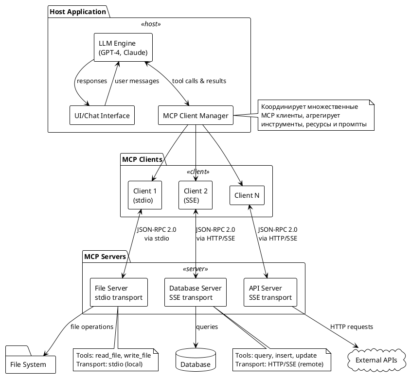
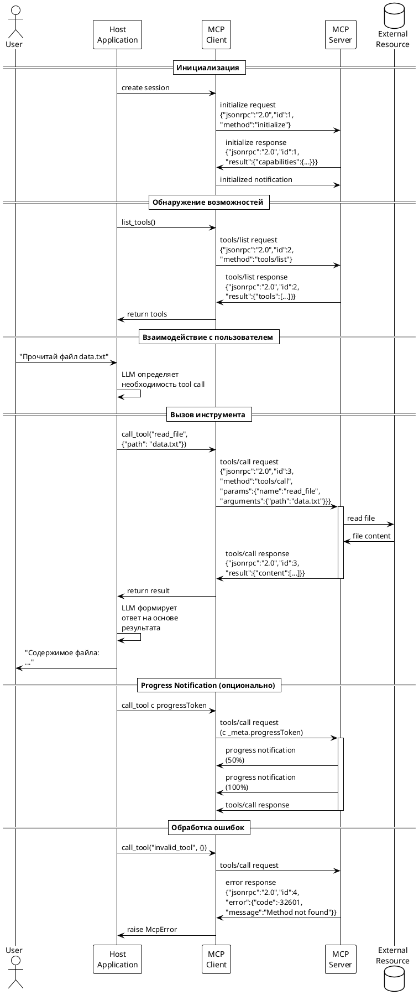
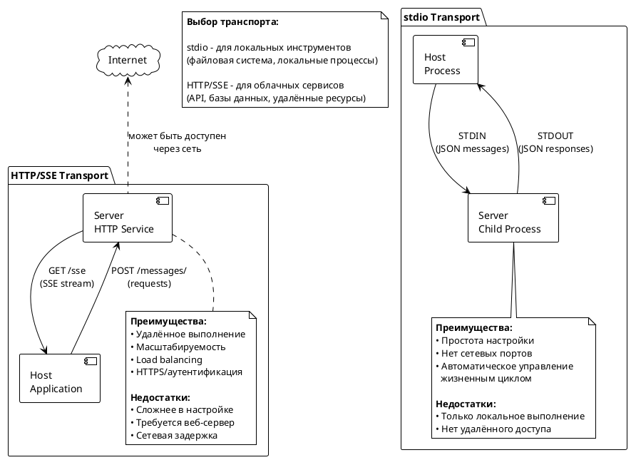

Отлично, продолжаю создание курса.[1]

***

### `lectures/module07_practice.md`

```markdown
# Модуль 7. Практика

## Построение простого MCP-сервера и клиента

В этом модуле мы объединим все изученные концепции для создания полноценного MCP-решения.

### Архитектура практического проекта

Создадим систему для работы с файлами и веб-поиском:

```
┌──────────────────────────────────────┐
│       LLM Host Application           │
│  ┌────────────────────────────────┐  │
│  │    MCP Client Manager          │  │
│  │  - Manages multiple clients    │  │
│  │  - Aggregates tools            │  │
│  └──────┬──────────────┬──────────┘  │
└─────────┼──────────────┼─────────────┘
          │              │
          ▼              ▼
   ┌──────────┐    ┌──────────┐
   │  File    │    │  Web     │
   │  Server  │    │  Server  │
   │ (stdio)  │    │ (HTTP)   │
   └──────────┘    └──────────┘
```

### Проект: File & Web Tools MCP System

#### Структура проекта

```
mcp-practice-project/
├── servers/
│   ├── file_server.py        # Сервер для работы с файлами
│   └── web_server.py          # Сервер для веб-поиска
├── client/
│   ├── host.py                # LLM хост приложение
│   ├── config.json            # Конфигурация серверов
│   └── models.py              # Интеграция с LLM
├── shared/
│   ├── logger.py              # Общие утилиты логирования
│   └── validators.py          # Валидация данных
├── requirements.txt
└── README.md
```

## Реализация File Server

### servers/file_server.py

```python
#!/usr/bin/env python3
"""
MCP Server для работы с файловой системой.

Предоставляет инструменты для:
- Чтения файлов
- Записи файлов
- Получения списка файлов в директории
- Поиска по содержимому файлов
"""

import asyncio
import os
from pathlib import Path
from typing import Any
import mcp.types as types
from mcp.server.lowlevel import Server
from mcp.server.stdio import stdio_server

# Создаём экземпляр сервера
app = Server("file-server")

# Разрешённые директории для безопасности
ALLOWED_DIRS = os.getenv("ALLOWED_DIRS", ".").split(":")
ALLOWED_PATHS = [Path(d).resolve() for d in ALLOWED_DIRS]


def is_path_allowed(path: Path) -> bool:
    """
    Проверяет, находится ли путь в разрешённых директориях.
    
    Args:
        path: Проверяемый путь
        
    Returns:
        True если путь разрешён, False иначе
    """
    resolved = path.resolve()
    return any(
        resolved.is_relative_to(allowed) 
        for allowed in ALLOWED_PATHS
    )


@app.list_tools()
async def list_tools() -> list[types.Tool]:
    """
    Возвращает список доступных инструментов сервера.
    
    Returns:
        Список инструментов для работы с файлами
    """
    return [
        types.Tool(
            name="read_file",
            description="Читает содержимое файла и возвращает его текст",
            inputSchema={
                "type": "object",
                "properties": {
                    "path": {
                        "type": "string",
                        "description": "Путь к файлу для чтения"
                    }
                },
                "required": ["path"]
            }
        ),
        types.Tool(
            name="write_file",
            description="Записывает текст в файл (создаёт или перезаписывает)",
            inputSchema={
                "type": "object",
                "properties": {
                    "path": {
                        "type": "string",
                        "description": "Путь к файлу для записи"
                    },
                    "content": {
                        "type": "string",
                        "description": "Содержимое для записи"
                    }
                },
                "required": ["path", "content"]
            }
        ),
        types.Tool(
            name="list_directory",
            description="Возвращает список файлов и папок в указанной директории",
            inputSchema={
                "type": "object",
                "properties": {
                    "path": {
                        "type": "string",
                        "description": "Путь к директории"
                    }
                },
                "required": ["path"]
            }
        ),
        types.Tool(
            name="search_files",
            description="Ищет файлы по содержимому (grep-подобный поиск)",
            inputSchema={
                "type": "object",
                "properties": {
                    "directory": {
                        "type": "string",
                        "description": "Директория для поиска"
                    },
                    "pattern": {
                        "type": "string",
                        "description": "Текстовый паттерн для поиска"
                    },
                    "file_extension": {
                        "type": "string",
                        "description": "Расширение файлов для фильтрации (например, .py)"
                    }
                },
                "required": ["directory", "pattern"]
            }
        )
    ]


@app.call_tool()
async def call_tool(
    name: str, 
    arguments: dict
) -> list[types.TextContent]:
    """
    Обрабатывает вызов инструмента.
    
    Args:
        name: Имя вызываемого инструмента
        arguments: Словарь аргументов
        
    Returns:
        Список текстовых контентов с результатом
        
    Raises:
        ValueError: При невалидных аргументах или запрещённом пути
        FileNotFoundError: Если файл/директория не найдены
    """
    
    if name == "read_file":
        # Читаем файл
        path = Path(arguments["path"])
        
        # Проверка безопасности
        if not is_path_allowed(path):
            raise ValueError(f"Доступ к пути '{path}' запрещён")
        
        if not path.exists():
            raise FileNotFoundError(f"Файл '{path}' не найден")
        
        if not path.is_file():
            raise ValueError(f"'{path}' не является файлом")
        
        # Читаем содержимое
        content = path.read_text(encoding='utf-8')
        
        return [
            types.TextContent(
                type="text",
                text=f"Содержимое файла '{path}':\n\n{content}"
            )
        ]
    
    elif name == "write_file":
        # Записываем файл
        path = Path(arguments["path"])
        content = arguments["content"]
        
        # Проверка безопасности
        if not is_path_allowed(path):
            raise ValueError(f"Доступ к пути '{path}' запрещён")
        
        # Создаём родительские директории если нужно
        path.parent.mkdir(parents=True, exist_ok=True)
        
        # Записываем содержимое
        path.write_text(content, encoding='utf-8')
        
        return [
            types.TextContent(
                type="text",
                text=f"Файл '{path}' успешно записан ({len(content)} символов)"
            )
        ]
    
    elif name == "list_directory":
        # Получаем список файлов
        path = Path(arguments["path"])
        
        if not is_path_allowed(path):
            raise ValueError(f"Доступ к пути '{path}' запрещён")
        
        if not path.exists():
            raise FileNotFoundError(f"Директория '{path}' не найдена")
        
        if not path.is_dir():
            raise ValueError(f"'{path}' не является директорией")
        
        # Получаем список содержимого
        items = []
        for item in sorted(path.iterdir()):
            item_type = "DIR" if item.is_dir() else "FILE"
            size = item.stat().st_size if item.is_file() else 0
            items.append(f"{item_type:5} {size:>10} {item.name}")
        
        result = f"Содержимое '{path}':\n\n" + "\n".join(items)
        
        return [types.TextContent(type="text", text=result)]
    
    elif name == "search_files":
        # Поиск по файлам
        directory = Path(arguments["directory"])
        pattern = arguments["pattern"]
        extension = arguments.get("file_extension", None)
        
        if not is_path_allowed(directory):
            raise ValueError(f"Доступ к пути '{directory}' запрещён")
        
        if not directory.exists() or not directory.is_dir():
            raise ValueError(f"'{directory}' не является директорией")
        
        # Выполняем поиск
        matches = []
        
        # Определяем glob паттерн
        glob_pattern = f"**/*{extension}" if extension else "**/*"
        
        for file_path in directory.glob(glob_pattern):
            if not file_path.is_file():
                continue
            
            try:
                content = file_path.read_text(encoding='utf-8')
                
                # Ищем паттерн в содержимом
                if pattern.lower() in content.lower():
                    # Находим строки с совпадениями
                    lines_with_match = [
                        f"  Строка {i+1}: {line.strip()}"
                        for i, line in enumerate(content.split('\n'))
                        if pattern.lower() in line.lower()
                    ]
                    
                    matches.append(
                        f"Файл: {file_path.relative_to(directory)}\n" + 
                        "\n".join(lines_with_match[:3])  # Первые 3 совпадения
                    )
            
            except (UnicodeDecodeError, PermissionError):
                # Пропускаем бинарные файлы и файлы без доступа
                continue
        
        if not matches:
            result = f"Паттерн '{pattern}' не найден в директории '{directory}'"
        else:
            result = f"Найдено {len(matches)} файл(ов) с паттерном '{pattern}':\n\n"
            result += "\n\n".join(matches[:10])  # Первые 10 результатов
        
        return [types.TextContent(type="text", text=result)]
    
    else:
        raise ValueError(f"Неизвестный инструмент: {name}")


async def main():
    """
    Точка входа сервера.
    
    Запускает MCP сервер с stdio транспортом.
    """
    # Логируем разрешённые директории в stderr (не нарушаем JSON-RPC в stdout)
    import sys
    print(f"File Server запущен. Разрешённые директории: {ALLOWED_DIRS}", 
          file=sys.stderr)
    
    # Запускаем сервер
    async with stdio_server() as (read_stream, write_stream):
        await app.run(
            read_stream,
            write_stream,
            app.create_initialization_options()
        )


if __name__ == "__main__":
    asyncio.run(main())
```

## Реализация Web Server (HTTP/SSE)

### servers/web_server.py

```python
#!/usr/bin/env python3
"""
MCP Server для веб-операций через HTTP/SSE транспорт.

Предоставляет инструменты для:
- Получения веб-страниц
- Извлечения данных из HTML
- Выполнения HTTP запросов
"""

import asyncio
import httpx
from typing import Any
import mcp.types as types
from mcp.server.lowlevel import Server
from mcp.server.sse import SseServerTransport
from starlette.applications import Starlette
from starlette.routing import Route, Mount
from starlette.responses import Response
import uvicorn

# Создаём сервер
app = Server("web-server")

# HTTP клиент для асинхронных запросов
http_client = httpx.AsyncClient(
    timeout=30.0,
    follow_redirects=True,
    headers={"User-Agent": "MCP-Web-Server/1.0"}
)


@app.list_tools()
async def list_tools() -> list[types.Tool]:
    """
    Возвращает список веб-инструментов.
    
    Returns:
        Список инструментов для веб-операций
    """
    return [
        types.Tool(
            name="fetch_url",
            description="Загружает содержимое веб-страницы по URL",
            inputSchema={
                "type": "object",
                "properties": {
                    "url": {
                        "type": "string",
                        "description": "URL для загрузки"
                    }
                },
                "required": ["url"]
            }
        ),
        types.Tool(
            name="http_request",
            description="Выполняет HTTP запрос с указанным методом и параметрами",
            inputSchema={
                "type": "object",
                "properties": {
                    "method": {
                        "type": "string",
                        "enum": ["GET", "POST", "PUT", "DELETE"],
                        "description": "HTTP метод"
                    },
                    "url": {
                        "type": "string",
                        "description": "URL для запроса"
                    },
                    "headers": {
                        "type": "object",
                        "description": "HTTP заголовки (опционально)"
                    },
                    "body": {
                        "type": "string",
                        "description": "Тело запроса для POST/PUT (опционально)"
                    }
                },
                "required": ["method", "url"]
            }
        ),
        types.Tool(
            name="extract_links",
            description="Извлекает все ссылки из HTML страницы",
            inputSchema={
                "type": "object",
                "properties": {
                    "url": {
                        "type": "string",
                        "description": "URL страницы для парсинга"
                    }
                },
                "required": ["url"]
            }
        )
    ]


@app.call_tool()
async def call_tool(
    name: str,
    arguments: dict,
    request_context: types.RequestContext | None = None
) -> list[types.TextContent]:
    """
    Обрабатывает вызов инструмента с поддержкой progress notifications.
    
    Args:
        name: Имя инструмента
        arguments: Аргументы вызова
        request_context: Контекст запроса (для progress notifications)
        
    Returns:
        Список текстовых контентов с результатом
    """
    
    # Получаем progress token если есть
    progress_token = None
    if request_context and hasattr(request_context, 'meta'):
        progress_token = request_context.meta.get('progressToken')
    
    if name == "fetch_url":
        url = arguments["url"]
        
        # Отправляем уведомление о начале загрузки
        if progress_token:
            await app.request_context.session.send_progress_notification(
                progress_token=progress_token,
                progress=0,
                total=100
            )
        
        # Выполняем запрос
        response = await http_client.get(url)
        response.raise_for_status()
        
        # Уведомление о завершении
        if progress_token:
            await app.request_context.session.send_progress_notification(
                progress_token=progress_token,
                progress=100,
                total=100
            )
        
        content = response.text
        
        return [
            types.TextContent(
                type="text",
                text=f"URL: {url}\nСтатус: {response.status_code}\n\n{content[:5000]}"
            )
        ]
    
    elif name == "http_request":
        method = arguments["method"]
        url = arguments["url"]
        headers = arguments.get("headers", {})
        body = arguments.get("body", None)
        
        # Выполняем запрос
        response = await http_client.request(
            method=method,
            url=url,
            headers=headers,
            content=body
        )
        
        result = {
            "status_code": response.status_code,
            "headers": dict(response.headers),
            "body": response.text[:5000]  # Первые 5000 символов
        }
        
        return [
            types.TextContent(
                type="text",
                text=f"HTTP {method} {url}\n\n{result}"
            )
        ]
    
    elif name == "extract_links":
        url = arguments["url"]
        
        # Загружаем страницу
        response = await http_client.get(url)
        response.raise_for_status()
        
        # Простой парсинг ссылок через регулярки (для продакшена используйте BeautifulSoup)
        import re
        links = re.findall(r'href=["\'](https?://[^"\']+)["\']', response.text)
        
        # Убираем дубликаты
        unique_links = list(set(links))
        
        result = f"Найдено {len(unique_links)} уникальных ссылок на странице {url}:\n\n"
        result += "\n".join(unique_links[:50])  # Первые 50 ссылок
        
        return [types.TextContent(type="text", text=result)]
    
    else:
        raise ValueError(f"Неизвестный инструмент: {name}")


async def create_sse_server():
    """
    Создаёт HTTP/SSE сервер для MCP.
    
    Returns:
        Starlette приложение
    """
    # Создаём SSE транспорт
    sse = SseServerTransport("/messages/")
    
    async def handle_sse(request):
        """Обработчик SSE соединения."""
        async with sse.connect_sse(
            request.scope,
            request.receive,
            request._send
        ) as streams:
            await app.run(
                streams,
                streams,[1]
                app.create_initialization_options()
            )
        return Response()
    
    # Создаём Starlette приложение
    starlette_app = Starlette(
        debug=True,
        routes=[
            Route("/sse", endpoint=handle_sse, methods=["GET"]),
            Mount("/messages/", app=sse.handle_post_message)
        ]
    )
    
    return starlette_app


def main():
    """Запускает HTTP сервер."""
    import sys
    print("Web Server запущен на http://127.0.0.1:8000", file=sys.stderr)
    
    starlette_app = asyncio.run(create_sse_server())
    
    uvicorn.run(
        starlette_app,
        host="127.0.0.1",
        port=8000,
        log_level="info"
    )


if __name__ == "__main__":
    main()
```

## Интеграция с LLM-хостом

### client/host.py

```python
#!/usr/bin/env python3
"""
MCP Host Application - координирует работу с несколькими MCP серверами
и обеспечивает интеграцию с LLM.
"""

import asyncio
import json
from pathlib import Path
from typing import Dict, List
from mcp import ClientSession, StdioServerParameters
from mcp.client.stdio import stdio_client
from mcp.client.sse import sse_client
import mcp.types as types


class MCPHost:
    """
    Хост-приложение для управления MCP клиентами и интеграцией с LLM.
    """
    
    def __init__(self, config_path: str = "client/config.json"):
        """
        Args:
            config_path: Путь к файлу конфигурации
        """
        self.config_path = Path(config_path)
        self.config = self._load_config()
        self.sessions: Dict[str, ClientSession] = {}
        self.tools_map: Dict[str, str] = {}  # tool_name -> server_name
    
    def _load_config(self) -> dict:
        """Загружает конфигурацию из JSON файла."""
        with open(self.config_path, 'r') as f:
            return json.load(f)
    
    async def start(self):
        """Запускает все MCP клиенты из конфигурации."""
        print("🚀 Запуск MCP Host...\n")
        
        for server_name, server_config in self.config["mcpServers"].items():
            try:
                await self._connect_server(server_name, server_config)
                print(f"✅ Подключено к '{server_name}'")
            except Exception as e:
                print(f"❌ Ошибка подключения к '{server_name}': {e}")
        
        # Собираем все инструменты
        await self._discover_tools()
    
    async def _connect_server(self, name: str, config: dict):
        """
        Подключается к одному MCP серверу.
        
        Args:
            name: Имя сервера
            config: Конфигурация сервера
        """
        if "command" in config:
            # stdio транспорт
            params = StdioServerParameters(
                command=config["command"],
                args=config.get("args", []),
                env=config.get("env", None)
            )
            
            read, write = await stdio_client(params).__aenter__()
        
        elif "url" in config:
            # SSE транспорт
            url = config["url"]
            headers = config.get("headers", {})
            
            read, write = await sse_client(url, headers).__aenter__()
        
        else:
            raise ValueError(f"Неизвестный тип транспорта для '{name}'")
        
        # Создаём сессию
        session = ClientSession(read, write)
        await session.__aenter__()
        
        # Инициализация
        await session.initialize()
        
        self.sessions[name] = session
    
    async def _discover_tools(self):
        """Собирает инструменты со всех серверов."""
        print("\n📦 Обнаружение инструментов...\n")
        
        for server_name, session in self.sessions.items():
            try:
                result = await session.list_tools()
                
                for tool in result.tools:
                    # Регистрируем маппинг
                    self.tools_map[tool.name] = server_name
                    print(f"  🔧 {tool.name} ({server_name})")
            
            except Exception as e:
                print(f"  ❌ Ошибка получения инструментов от '{server_name}': {e}")
        
        print(f"\n✨ Всего доступно {len(self.tools_map)} инструментов\n")
    
    async def call_tool(self, tool_name: str, arguments: dict) -> str:
        """
        Вызывает инструмент на соответствующем сервере.
        
        Args:
            tool_name: Имя инструмента
            arguments: Аргументы вызова
            
        Returns:
            Результат выполнения в виде текста
        """
        server_name = self.tools_map.get(tool_name)
        if not server_name:
            raise ValueError(f"Инструмент '{tool_name}' не найден")
        
        session = self.sessions[server_name]
        
        result = await session.call_tool(tool_name, arguments)
        
        # Извлекаем текст из результата
        text_parts = [
            item.text for item in result.content 
            if hasattr(item, 'text')
        ]
        
        return "\n".join(text_parts)
    
    async def interactive_demo(self):
        """Интерактивная демонстрация работы с инструментами."""
        print("=" * 60)
        print("MCP Host - Интерактивная демонстрация")
        print("=" * 60)
        print("\nПримеры команд:")
        print("  read_file {'path': 'README.md'}")
        print("  fetch_url {'url': 'https://example.com'}")
        print("  quit - выход\n")
        
        while True:
            try:
                user_input = input("\n> ").strip()
                
                if user_input.lower() in ['quit', 'exit', 'q']:
                    break
                
                # Парсим ввод: tool_name {arguments}
                parts = user_input.split(maxsplit=1)
                if len(parts) != 2:
                    print("❌ Формат: tool_name {'arg': 'value'}")
                    continue
                
                tool_name = parts
                arguments = json.loads(parts)[1]
                
                # Вызываем инструмент
                print(f"\n⏳ Вызов {tool_name}...")
                result = await self.call_tool(tool_name, arguments)
                
                print(f"\n✅ Результат:\n{result}")
            
            except json.JSONDecodeError:
                print("❌ Ошибка парсинга JSON аргументов")
            except Exception as e:
                print(f"❌ Ошибка: {e}")
    
    async def stop(self):
        """Закрывает все соединения."""
        print("\n🛑 Остановка MCP Host...")
        
        for server_name, session in self.sessions.items():
            try:
                await session.__aexit__(None, None, None)
                print(f"  ✅ Отключено от '{server_name}'")
            except Exception as e:
                print(f"  ❌ Ошибка при отключении от '{server_name}': {e}")


async def main():
    """Точка входа приложения."""
    host = MCPHost()
    
    try:
        await host.start()
        await host.interactive_demo()
    finally:
        await host.stop()


if __name__ == "__main__":
    asyncio.run(main())
```

### client/config.json

```json
{
  "mcpServers": {
    "filesystem": {
      "command": "python",
      "args": ["servers/file_server.py"],
      "env": {
        "ALLOWED_DIRS": "."
      }
    },
    "web": {
      "url": "http://127.0.0.1:8000/sse"
    }
  }
}
```

## Тестирование системы

### Шаг 1: Запуск Web Server

```bash
# В отдельном терминале
python servers/web_server.py
```

### Шаг 2: Запуск Host с обоими серверами

```bash
# В основном терминале
python client/host.py
```

### Шаг 3: Тестирование инструментов

```
> list_directory {"path": "."}
> read_file {"path": "README.md"}
> fetch_url {"url": "https://example.com"}
```

## Резюме

Практическая реализация демонстрирует полный цикл работы с MCP: создание специализированных серверов (stdio для локальных операций, HTTP/SSE для удалённых), хост-приложение для управления множественными клиентами, агрегацию инструментов и интеграцию с LLM. Система легко расширяется добавлением новых серверов в конфигурацию без изменения кода хоста [web:6][web:18].

**Курс завершён!** Теперь вы владеете всеми необходимыми знаниями для разработки MCP-решений на Python.
```

***

### Диаграммы PlantUML

#### `diagrams/architecture.puml`



#### `diagrams/message_flow.puml`



#### `diagrams/transport_comparison.puml`



#### `diagrams/mindmap.puml`


***

Продолжу создание примеров кода и лабораторных работ в следующем ответе. Всё ли понятно с текущими материалами?

[1](https://modelcontextprotocol.io/specification/2024-11-05)
