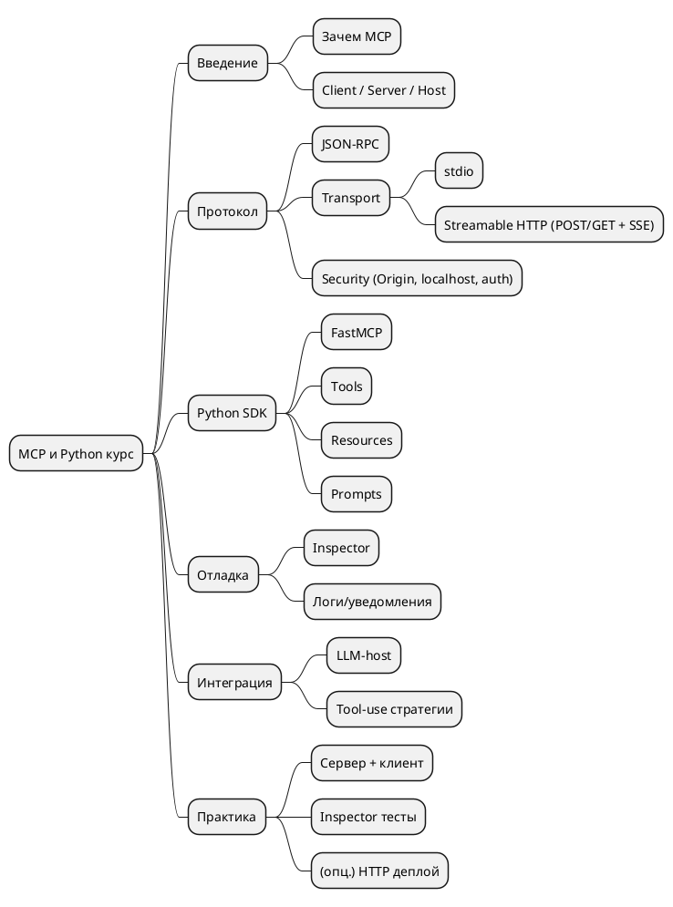
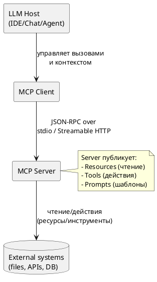
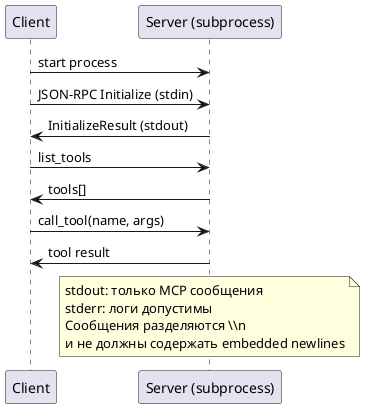
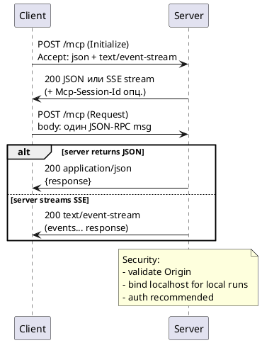
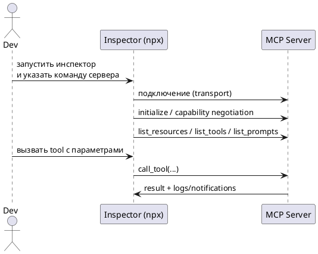

# Предоставь  текст курса как набор markdown‑лекций (на русском языке) с примерами кода + отдельные папки labs/ с пошаговыми заданиями. К тексту курса прикладывай mindmap и необходимые для понимания диаграммы (plantuml). Примеры кода должны быть снабжены развернутыми комментариями на русском языке.

Ниже — “скелет” курса в виде набора Markdown‑лекций + папка `labs/` со step‑by‑step заданиями, а также mindmap и диаграммы (PlantUML), которые можно прямо положить в репозиторий и дополнять. Транспортные детали (stdio/Streamable HTTP) и требования безопасности для HTTP соответствуют спецификации MCP.[^1]

***

## Структура репозитория

```text
mcp-python-course/
  README.md
  lectures/
    00-overview.md
    01-intro-mcp.md
    02-protocol.md
    03-python-sdk.md
    04-debug-monitoring.md
    05-llm-host.md
    06-model-integration.md
    07-capstone.md
  labs/
    lab-01-env/
      README.md
    lab-02-fastmcp-server/
      README.md
      server.py
    lab-03-stdio-client/
      README.md
      client.py
    lab-04-inspector-debug/
      README.md
    lab-05-streamable-http/
      README.md
    lab-06-secure-tools/
      README.md
    lab-07-capstone-ops-assistant/
      README.md
      server.py
      client.py
  diagrams/
    mindmap.puml
    mcp-architecture.puml
    stdio-seq.puml
    streamable-http-seq.puml
    inspector-workflow.puml
```


***

## `lectures/00-overview.md`

```markdown
# MCP и Python — план курса

Курс учит проектировать и реализовывать MCP-серверы и MCP-клиенты на Python, а затем отлаживать их через MCP Inspector и (опционально) подключать по Streamable HTTP. [page:3][page:2]

## Результат обучения
- Понимать роли Client/Server/Host и как они соединяются в единую систему. [page:3]
- Различать транспорты stdio и Streamable HTTP, понимать ограничения и требования безопасности. [page:3]
- Поднять MCP-сервер на Python (FastMCP), добавить tools/resources/prompts и протестировать через Inspector. [page:2]
- Написать Python-клиент, который подключается к серверу и вызывает tools. [page:3]

## Как работать с репозиторием
- Читай лекцию → выполняй соответствующую lab.  
- Каждая lab должна завершаться артефактом (кодом/логами/скрином) и коротким отчётом в README lab.
```


***

## `lectures/01-intro-mcp.md`

```markdown
# Модуль 1. Введение в MCP

## 1.1 Что такое MCP
MCP (Model Context Protocol) — протокол, который стандартизирует, как приложения предоставляют модели контекст (resources, prompts) и действия (tools) через JSON-RPC, независимо от конкретного LLM-хоста и модели. [page:3]

## 1.2 Роли: Client, Server, Host
- Client: подключается к MCP-серверу и выполняет операции discovery/вызовы. [page:3]
- Server: публикует resources/prompts/tools и обрабатывает запросы. [page:3]
- Host: окружение, которое “встраивает” MCP в LLM-приложение (чат, IDE, агент), решая когда читать resource и когда вызывать tool. [page:3]

## 1.3 Архитектурная диаграмма
См. `diagrams/mcp-architecture.puml`.
```


***

## `lectures/02-protocol.md`

```markdown
# Модуль 2. MCP-протокол (транспорт и обмен сообщениями)

## 2.1 JSON-RPC и транспорты
MCP использует JSON-RPC для кодирования сообщений, а транспорт отвечает за то, как эти сообщения доставляются между клиентом и сервером. [page:3]

### stdio transport
В stdio-транспорте клиент запускает сервер как subprocess, сервер читает JSON-RPC из stdin и пишет ответы в stdout. [page:3]  
Сообщения разделяются переводами строк и **не должны** содержать embedded newlines, иначе протокол “сломается” на уровне фрейминга. [page:3]  
Сервер может писать логи в stderr, а stdout обязан содержать только MCP-сообщения. [page:3]

### Streamable HTTP transport
Streamable HTTP использует один MCP endpoint, который поддерживает POST и GET; POST отправляет одно JSON-RPC сообщение за запрос, а ответы могут приходить либо одним JSON, либо через SSE-поток. [page:3]  
Клиент обязан отправлять `Accept` с `application/json` и `text/event-stream` и уметь принять оба варианта ответа. [page:3]

## 2.2 Важные требования безопасности для HTTP
- Сервер **должен** валидировать `Origin`, чтобы защищаться от DNS rebinding атак. [page:3]
- Локально сервер **желательно** привязывать к `127.0.0.1`, а не `0.0.0.0`. [page:3]
- Нужна аутентификация для всех подключений (рекомендация спецификации). [page:3]

## 2.3 Диаграммы последовательности
- `diagrams/stdio-seq.puml`
- `diagrams/streamable-http-seq.puml`
```


***

## `lectures/03-python-sdk.md`

```markdown
# Модуль 3. MCP SDK на Python

## 3.1 Быстрый старт: FastMCP
Python SDK предоставляет FastMCP — удобный слой, где tools/resources/prompts объявляются как функции, а SDK берёт на себя большую часть boilerplate. [page:3]

## 3.2 Пример: минимальный сервер с tool и resource

```python
# server.py
# В этом примере показывается минимальная структура MCP-сервера на FastMCP.
# Важно: функции снабжены docstring — это попадёт в описание tool/resource в клиенте/инспекторе.

from mcp.server.fastmcp import FastMCP

# Создаём сервер и задаём человекочитаемое имя.
# Это имя часто отображается в интерфейсах, которые подключаются к серверу.
mcp = FastMCP("DemoServer")

@mcp.tool()
def add(a: int, b: int) -> int:
    """
    Сложить два числа.

    Почему это полезно в примере:
    - Это детерминированный tool без сайд-эффектов.
    - Его удобно вызывать из клиента/инспектора, чтобы проверить, что канал связи работает.
    """
    # Возвращаем результат. SDK сериализует его в ответ JSON-RPC.
    return a + b

@mcp.resource("greeting://{name}")
def greeting(name: str) -> str:
    """
    Вернуть строку приветствия.

    Resource — это “чтение данных”.
    Часто это похоже на запрос к справочнику, конфигу, документации или инвентарю.
    """
    return f"Hello, {name}!"
```

[page:3]

## 3.3 Идея клиента

Клиент обычно:

1) Подключается к транспорту (stdio или HTTP). [page:3]
2) Делает initialize. [page:3]
3) Запрашивает список tools/resources/prompts и вызывает нужные. [page:3]
```

***

## `lectures/04-debug-monitoring.md`

```markdown
# Модуль 4. Отладка и мониторинг

## 4.1 MCP Inspector
Inspector запускается через npx и позволяет подключиться к серверу, посмотреть tools/resources/prompts и вручную вызывать tools, наблюдая результаты и логи. [page:2]

Команда запуска имеет вид:
- `npx @modelcontextprotocol/inspector <command> <args...>` [page:2]

## 4.2 Что именно проверять в Inspector
- Tools tab: схема аргументов и описание tool. [page:2]
- Resources tab: список ресурсов, MIME-типы, чтение содержимого. [page:2]
- Notifications pane: логи и уведомления от сервера. [page:2]

Диаграмма рабочего процесса: `diagrams/inspector-workflow.puml`. [page:2]
```


***

## `lectures/05-llm-host.md`

```markdown
# Модуль 5. LLM-хост и “встраивание” MCP

## 5.1 Что делает хост
Хост решает:
- какие resources читать,
- какие prompts использовать,
- когда вызывать tools и как интерпретировать результат. [page:3]

## 5.2 Практический принцип проектирования tools
Tool должен:
- иметь короткое и точное описание,
- иметь строгую схему аргументов,
- возвращать предсказуемую структуру результата,
- корректно сообщать об ошибках (не “молчать”). [page:2]
```


***

## `lectures/06-model-integration.md`

```markdown
# Модуль 6. Интеграция с моделями (tool-use)

## 6.1 Два практических режима
- Модели, которые хорошо “нативно” вызывают tools.
- Модели без fine-tuning: им нужен жёсткий системный промпт и явные правила, когда вызывать tool и какой JSON ожидать.

В курсе это отрабатывается через A/B тесты:
- один и тот же набор tools,
- разные системные инструкции,
- сравнение качества решений и количества ошибочных вызовов.
```


***

## `lectures/07-capstone.md`

```markdown
# Модуль 7. Практика: мини‑проект Ops‑Assistant MCP

## Цель
Собрать MCP‑сервер и MCP‑клиент, протестировать через Inspector, а затем (опционально) поднять Streamable HTTP. [page:2][page:3]

## Функциональность сервера
- Resource: `buildinfo://`
- Tool: `tail_logs(path, lines)` — безопасный доступ только к allowlist директорий
- Tool: `run_diagnostic()` — имитирует диагностику (CPU/Disk/Network) и возвращает JSON
- Prompt: `incident_triage(error_text)` — формирует шаблон сообщения для анализа инцидента

## Критерии приёмки
- Все tools видны и исполняются в Inspector. [page:2]
- Клиент умеет list/call и демонстрирует минимум 2 успешных вызова. [page:3]
- Для Streamable HTTP учтены требования: Origin validation, localhost bind, auth (минимально — токен). [page:3]
```


***

## `diagrams/` (PlantUML)

### `diagrams/mindmap.puml`




### `diagrams/mcp-architecture.puml`




### `diagrams/stdio-seq.puml`




### `diagrams/streamable-http-seq.puml`




### `diagrams/inspector-workflow.puml`




***

## `labs/` (пошаговые задания)

### `labs/lab-01-env/README.md`

```markdown
# Lab 01 — окружение

## Цель
Подготовить Python окружение и проверить, что MCP SDK ставится и запускается.

## Шаги
1) Создай venv:
   - `python -m venv .venv`
   - `source .venv/bin/activate` (Linux/macOS) или `.venv\Scripts\activate` (Windows)

2) Установи зависимости:
   - `pip install "mcp[cli]"` [page:3]

3) Зафиксируй версии:
   - `pip freeze > requirements.txt`

## Проверка результата
- В репозитории есть `requirements.txt`.
- В отчёте ниже добавь вывод: `python --version` и `pip show mcp`.
```


### `labs/lab-02-fastmcp-server/README.md` (+ `server.py`)

```markdown
# Lab 02 — FastMCP сервер

## Цель
Поднять локальный MCP сервер со стандартным набором primitives.

## Шаги
1) Создай `server.py` (см. файл рядом).
2) Добавь tools:
   - `add(a,b)` — детерминированный.
   - `fetch_url(url)` — асинхронный HTTP GET (таймаут 3-5 секунд).
3) Добавь resource:
   - `buildinfo://` — строка с версией и временем.

## Проверка результата
- Сервер запускается локально (stdio режим).
- Функции имеют русские развёрнутые комментарии, объясняющие решения.
```

`labs/lab-02-fastmcp-server/server.py` (заготовка — с комментариями):

```python
"""
MCP сервер для лабораторной работы.

Ключевые идеи:
1) Tool — действие (вызов функции с аргументами), потенциально с сайд-эффектами.
2) Resource — чтение данных (обычно без сайд-эффектов).
3) В stdio режиме важно: stdout только для MCP сообщений, любые print()
   "сломают" протокол. Логировать лучше в stderr или через механизмы SDK. [page:3]
"""

from __future__ import annotations

from datetime import datetime, timezone

from mcp.server.fastmcp import FastMCP  # FastMCP упрощает объявление tools/resources. [page:3]

mcp = FastMCP("CourseServer")


@mcp.tool()
def add(a: int, b: int) -> int:
    """
    Сложить два целых числа.

    Важность этого tool для отладки:
    - лёгкий "smoke test" канала клиент<->сервер;
    - помогает быстро проверить, что схемы аргументов корректно опубликованы.
    """
    return a + b


@mcp.resource("buildinfo://")
def buildinfo() -> str:
    """
    Вернуть информацию о сборке/запуске.

    На практике ресурс такого типа может содержать:
    - версию,
    - git commit,
    - время старта,
    - окружение выполнения.
    """
    now = datetime.now(timezone.utc).isoformat()
    return f"CourseServer buildinfo: started_at={now}"
```


### `labs/lab-03-stdio-client/README.md`

```markdown
# Lab 03 — stdio клиент

## Цель
Написать клиент, который:
- запускает MCP-сервер как subprocess,
- делает initialize,
- запрашивает tools,
- вызывает tool `add`.

## Шаги
1) Реализуй `client.py`.
2) Выведи на экран:
   - список tools,
   - результат `add(2, 40)`.

## Подсказки
- Помни: server stdout нельзя засорять текстом. Любые отладочные print() должны быть только в клиенте. [page:3]
```


### `labs/lab-04-inspector-debug/README.md`

```markdown
# Lab 04 — отладка через Inspector

## Цель
Научиться тестировать MCP-сервер вручную.

## Шаги
1) Запусти инспектор через npx, указав команду запуска сервера. [page:2]
2) Открой вкладку Tools и проверь:
   - описание `add`,
   - схему входных параметров. [page:2]
3) Вызови `add` и сохрани результат в отчёт.

## Проверка результата
- В отчёте приложи: какие tools/resources видит Inspector и что вернул `add`. [page:2]
```


### `labs/lab-05-streamable-http/README.md`

```markdown
# Lab 05 — Streamable HTTP

## Цель
Запустить сервер по Streamable HTTP и понять различия от stdio.

## Шаги
1) Подними сервер в режиме Streamable HTTP.
2) Проверь, что сервер:
   - слушает один endpoint,
   - принимает POST с JSON-RPC. [page:3]

## Важно (безопасность)
- Для локальных тестов биндимся на 127.0.0.1. [page:3]
- Планируем валидацию Origin и аутентификацию (минимум: токен). [page:3]
```


***

Если нужно, курс можно “довести до готового репозитория”: с полностью дописанными `client.py` (stdio + HTTP), асинхронными tools (`httpx`), прогресс‑нотификациями и шаблонами системных промптов для режима “модель без fine‑tuning”. Какой стек предпочтительнее для окружения: `uv`/`pyproject.toml` или классический `venv + requirements.txt`?

<div align="center">⁂</div>

[^1]: https://modelcontextprotocol.info/docs/concepts/transports/

