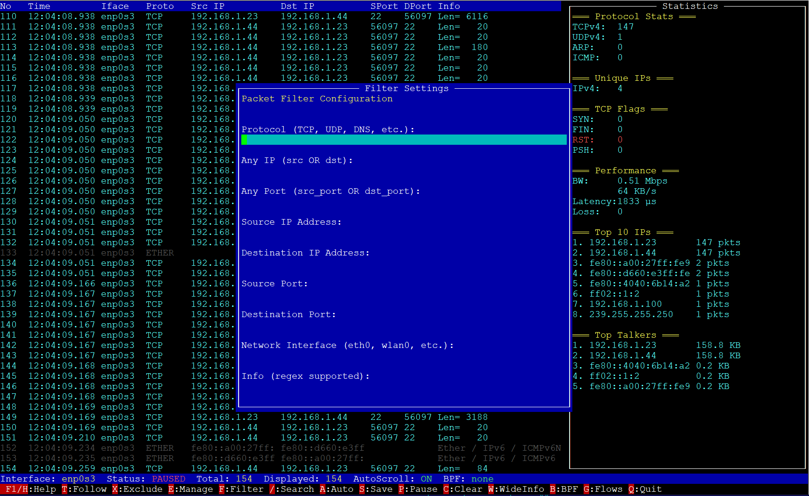

# packet-monitor

[](https://www.python.org/)
[](LICENSE)
[](CHANGELOG.md)

`packet-monitor` is a terminal packet monitor and analyzer written in Python with Scapy and Urwid.

It supports:
- live capture from a selected interface or `any`
- offline analysis of `pcap` and `pcapng`
- packet list and flows/conversations view
- UI filtering, exclusions, and profiles
- Follow Stream for TCP/TLS-oriented inspection
- packet export for all packets or only currently filtered packets

> Use this tool only on systems and traffic you own or are authorized to inspect.

## Screenshot



## Requirements

- Python 3.8+
- `scapy`
- `urwid`
- root/admin privileges for live capture on most systems

Example packages for Debian/Ubuntu:
- `python3`
- `python3-scapy`
- `python3-urwid`

## Quick Start

### Live capture

```bash
sudo python3 packet-monitor.py
```

Capture on a specific interface:

```bash
sudo python3 packet-monitor.py -i eth0
```

Capture with a BPF filter:

```bash
sudo python3 packet-monitor.py -i eth0 -f "tcp port 443"
```

### Offline analysis

Open a capture file:

```bash
python3 packet-monitor.py -r capture.pcap
```

or:

```bash
python3 packet-monitor.py -r capture.pcapng
```

### CLI parameters

- `-i`, `--interface` - capture interface
- `-r`, `--read` - open `pcap` / `pcapng`
- `-f`, `--filter` - BPF filter in `tcpdump` syntax
- `--ipv6` - enable extended IPv6 statistics
- `--version` - print the version

## Main Capabilities

### Packet list

- timestamp, interface, protocol, endpoints, ports, and `Info`
- compact and wide `Info` modes
- packet details with parsed fields and hexdump

### Flows / Conversations

- 5-tuple aggregation
- drill-down from flow to matching packets
- flow exclusion and flow details

### Filtering

- UI filters by protocol, IP, port, interface, `Info`, and payload
- payload search dialog
- exclusions by protocol or stream

### Follow Stream

- TCP payload reassembly with retransmission deduplication and gap placeholders
- TLS handshake summary without decryption
- export of stream text/raw data

### Export and profiles

- save all captured packets or only filtered packets
- save/load/delete profiles
- profiles can store current filters, exclusions, and BPF

## Keybindings

Common keys:
- `F1` / `H` - help
- `Q` - quit
- `P` - pause/resume capture in live mode
- `S` - save/export packets
- `F` - open UI filters
- `/` - payload search
- `G` - toggle packets / flows
- `O` - profiles
- `W` - toggle compact / wide `Info`

In packets view:
- `Enter` - packet details
- `T` - follow stream
- `X` - exclude current stream or protocol
- `B` - set capture BPF in live mode

In flows view:
- `Enter` - drill down to packets
- `D` - flow details
- `T` - follow stream
- `X` - exclude selected flow
- `V` - switch flow source: filtered / all

## Documentation

Detailed guides:
- [UserGuide.md](UserGuide.md) - English user guide
- [UserGuide-ru.md](UserGuide-ru.md) - Russian user guide

Architecture diagrams:
- [diagamms/README.md](diagamms/README.md)

## Notes

- `-i any` on Linux usually produces Linux cooked capture (`SLL` / `SLL2`) rather than Ethernet.
- BPF is a capture-time filter and is not available in offline mode.
- TLS decryption is not performed; only metadata and handshake structure are analyzed.

## Contributing

When reporting issues, include:
- OS and Python version
- live or offline mode
- reproduction steps
- sample `pcap` / `pcapng` if possible

## License

MIT. See [LICENSE](LICENSE).

## Author

**Tarasov Dmitry**
- Email: dtarasov7@gmail.com

## Attribution

Parts of this code were generated with assistance.
