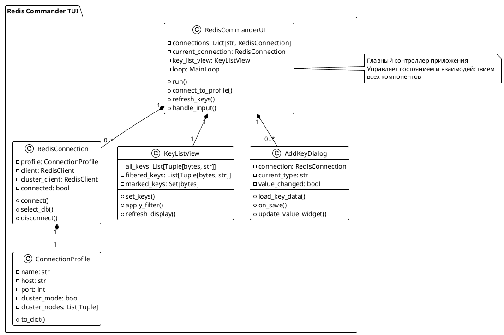
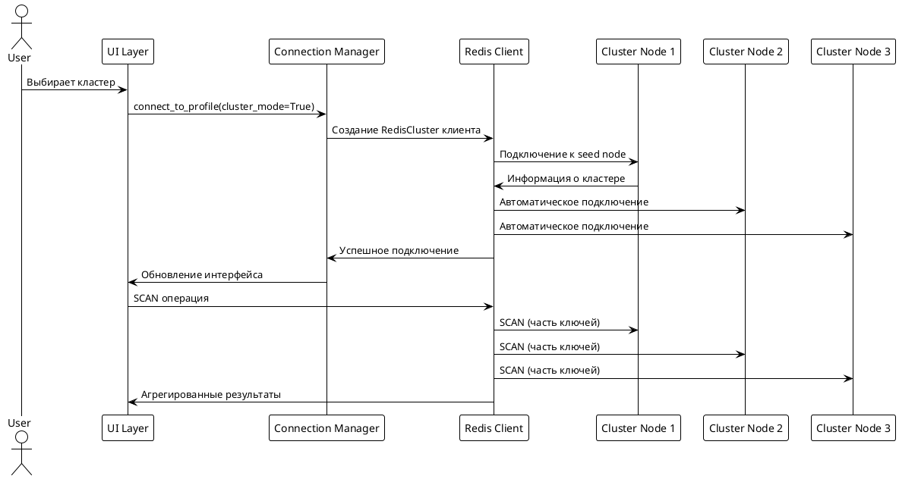
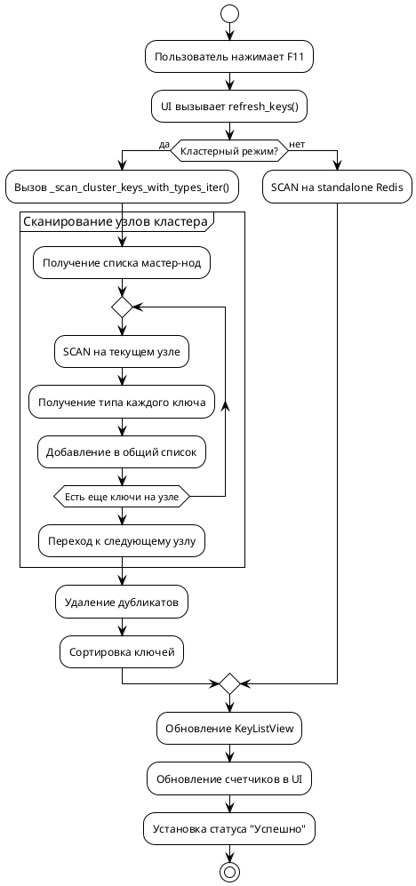

# Redis Commander TUI - Документация

## 1. Документация для пользователя

### 1.1 Общее описание
**Redis Commander TUI** - терминальный клиент для работы с Redis в стиле Redis Commander с поддержкой как standalone Redis, так и Redis Cluster. Программа предоставляет удобный интерфейс для управления ключами, выполнения команд и мониторинга состояния Redis.

**Версия**: 1.1.0  
**Автор**: Тарасов Дмитрий

### 1.2 Основные возможности
- 📊 Поддержка Redis Cluster и standalone Redis
- 🔑 Управление ключами всех типов (String, Hash, List, Set, ZSet, Stream, Bitmap)
- 🖥️ Консоль для выполнения произвольных Redis команд
- 🔐 Три режима хранения конфигурации (обычный JSON, зашифрованный, HashiCorp Vault)
- 📝 Редактирование и добавление ключей через удобные диалоги
- 🎯 Фильтрация и массовые операции с ключами
- 📄 Подробный просмотр деталей ключа
- 📜 История команд с автодополнением

### 1.3 Установка и запуск

#### Требования
```bash
python3 -m pip install urwid cryptography simple_redis_client
```

#### Запуск
```bash
# Режим 1: Обычный конфиг (по умолчанию)
python redis_commander_tui-v1.1.0.py

# Режим 2: Зашифрованный конфиг
python redis_commander_tui-v1.1.0.py -e encrypted_config.bin

# Режим 3: HashiCorp Vault
python redis_commander_tui-v1.1.0.py --vault-url http://127.0.0.1:8200 --vault-path secret/data/redis
```

### 1.4 Настройка подключений

#### Формат конфигурационного файла (JSON)
```json
{
  "production": {
    "host": "redis.example.com",
    "port": 6379,
    "password": "secret",
    "cluster_mode": false
  },
  "cluster": {
    "host": "cluster-node1.example.com",
    "port": 7000,
    "cluster_mode": true,
    "cluster_nodes": [
      ["cluster-node1.example.com", 7000],
      ["cluster-node2.example.com", 7001],
      ["cluster-node3.example.com", 7002]
    ]
  }
}
```

#### Параметры подключения:
- `name`: Имя профиля (обязательно)
- `host`: Хост Redis (по умолчанию: localhost)
- `port`: Порт Redis (по умолчанию: 6379)
- `password`: Пароль (опционально)
- `username`: Имя пользователя (опционально, для Redis 6+)
- `ssl`: Использовать SSL/TLS (true/false)
- `ssl_ca_certs`, `ssl_certfile`, `ssl_keyfile`: SSL сертификаты
- `cluster_mode`: Режим кластера (true/false)
- `cluster_nodes`: Список узлов кластера в формате [["host", port], ...]

### 1.5 Интерфейс пользователя

#### 1.5.1 Основной интерфейс
```
┌─────────────────────────────────────────────────────────────────┐
│ ● Redis Commander TUI                                           │
├─────────────────────────────────────────────────────────────────┤
│ F1: Help  F2: Commands  F3: Add New Key  F4: Edit  F8: Delete  │
├──────────────┬──────────────────────────────────────────────────┤
│ Connections  │ Details                                          │
│ ● server1    │ Key: user:12345                                 │
│   ▪ DB0 (10) │ Type: hash                                      │
│   ▫ DB1 (5)  │ TTL: 3600s                                      │
│ ● cluster1   │ Size: 3 fields                                   │
│   ▪ DB0 (50) │ Value:                                          │
│              │   name: John                                     │
│              │   email: john@example.com                       │
│              │   age: 30                                        │
└──────────────┴──────────────────────────────────────────────────┘
```

#### 1.5.2 Горячие клавиши

**Основные операции:**
- **F1** / **?** - Справка
- **F2** - Переключение консоли Redis
- **F3** - Добавить новый ключ
- **F4** - Редактировать выбранный ключ
- **F8** - Удалить отмеченные ключи
- **F9** - Отключиться от сервера
- **F10** / **q** - Выход
- **F11** - Обновить список ключей

**Работа со списком ключей:**
- **↑/↓** - Навигация по ключам
- **Enter** - Просмотр деталей ключа
- **Пробел** - Отметить/снять отметку с ключа
- **/** - Фильтрация ключей по паттерну
- **Ctrl+A** - Отметить ключи по паттерну
- **Ctrl+U** - Снять все отметки

**Консоль Redis (F2):**
- **Ввод команды** + **Enter** - Выполнить команду
- **↑/↓** / **Page Up/Down** - Навигация по истории команд
- **Tab** - Переключение между панелями
- **Esc** - Закрыть консоль
- **clear** - Очистить историю консоли

### 1.6 Использование

#### 1.6.1 Подключение к серверу
1. Настройте профили в `redis_profiles.json`
2. Запустите программу
3. Выберите сервер из списка в левой панели (нажмите Enter)
4. Выберите базу данных (для standalone Redis)

#### 1.6.2 Работа с ключами
1. **Просмотр**: Выберите ключ из списка → Enter
2. **Добавление**: F3 → заполните форму → F7 (Save)
3. **Редактирование**: Выберите ключ → F4 → внесите изменения → F7
4. **Удаление**: Отметьте ключи (Пробел) → F8 → подтвердите
5. **Фильтрация**: / → введите паттерн (например, `user:*`)

#### 1.6.3 Консоль Redis
1. Нажмите F2 для открытия консоли
2. Вводите команды Redis в формате:
   ```
   GET user:12345
   SET counter 100
   HSET user:12345 name "John"
   ```
3. Используйте историю команд (↑/↓)
4. Нажмите Esc или F2 для закрытия консоли

### 1.7 Особенности Redis Cluster
- Поддерживаются все основные команды Redis
- Автоматическое определение узлов кластера
- Отображение hash slot и узла для каждого ключа
- Специальная обработка команд, требующих обхода всех узлов (KEYS, SCAN, DBSIZE)
- Ограничение: только DB0 доступен в кластере

### 1.8 Безопасность
Программа поддерживает три режима хранения конфигурации:

1. **Режим 1**: Обычный JSON файл (по умолчанию)
2. **Режим 2**: Зашифрованный файл (использует cryptography)
3. **Режим 3**: HashiCorp Vault (требует настройки Vault)

**Рекомендации**:
- Для продакшена используйте режим 2 или 3
- Храните конфигурационные файлы с ограниченными правами доступа
- Регулярно обновляйте пароли

### 1.9 Логирование
- Все операции логируются в `redis_tui_audit.log`
- Формат: `дата - уровень - сообщение`
- Уровни: INFO (обычные операции), WARNING, ERROR

### 1.10 Устранение неполадок

#### Проблема: Не удается подключиться к Redis
**Решение:**
1. Проверьте доступность Redis: `redis-cli -h host -p port ping`
2. Убедитесь, что пароль правильный
3. Для SSL: проверьте сертификаты
4. Для кластера: убедитесь, что все узлы доступны

#### Проблема: Ключи не отображаются
**Решение:**
1. Проверьте, выбрана ли правильная база данных (для standalone)
2. Нажмите F11 для обновления
3. Для кластера: может потребоваться время для сканирования всех узлов

#### Проблема: Ошибки при выполнении команд в кластере
**Решение:**
1. Для multi-key операций: используйте hash tags (`{user}:12345`, `{user}:profile`)
2. Команды SELECT, MOVE не поддерживаются в кластере
3. Используйте `CLUSTER INFO` для диагностики

### 1.11 Примеры использования

#### Пример 1: Работа с пользователями
```bash
# Добавление пользователя
HSET user:12345 name "John Doe" email "john@example.com" age 30
EXPIRE user:12345 3600

# Поиск пользователей
KEYS user:*
```

#### Пример 2: Мониторинг
```bash
# Информация о сервере
INFO
INFO memory
INFO clients

# Статистика кластера
CLUSTER INFO
CLUSTER NODES
```

#### Пример 3: Массовые операции
```bash
# Удаление старых сессий
DEL session:expired:*
DEL cache:temp:*

# Обновление TTL
EXPIRE important:key 86400
```

---

## 2. Документация для разработчика

### 2.1 Архитектура приложения

#### 2.1.1 Общая структура
```
@startmindmap
* Redis Commander TUI v1.1.0
** Core Components
*** RedisCommanderUI (Main)
**** Connection Management
**** UI Rendering
**** Event Handling
** Data Models
*** ConnectionProfile
*** RedisConnection
*** KeyListItem
** UI Components
*** KeyListView
*** AddKeyDialog
*** ScrollBar
*** CommandPromptWrapper
** External Dependencies
*** urwid (TUI framework)
*** simple_redis_client
*** cryptography (optional)
@endmindmap
```

#### 2.1.2 Диаграмма классов


### 2.2 Модули и компоненты

#### 2.2.1 Основные модули

**1. `redis_commander_tui.py`** - Главный файл
```python
class RedisCommanderUI:
    """
    Основной класс приложения.
    Реализует паттерн MVC (Model-View-Controller).
    """
```

**2. Подключения и профили**
```python
class ConnectionProfile:
    """
    Модель профиля подключения.
    Сериализуется/десериализуется в JSON.
    Поддерживает оба режима: standalone и cluster.
    """

class RedisConnection:
    """
    Менеджер активного подключения.
    Инкапсулирует логику подключения и переключения БД.
    """
```

**3. UI компоненты**
```python
class KeyListView(urwid.WidgetWrap):
    """
    Виртуализированный список ключей с фильтрацией.
    Использует кеширование для производительности.
    """

class AddKeyDialog(urwid.WidgetWrap):
    """
    Универсальный диалог добавления/редактирования ключей.
    Динамически изменяет интерфейс в зависимости от типа ключа.
    """

class ScrollBar(urwid.WidgetWrap):
    """
    Кастомный скроллбар для ListBox.
    Автоматически обновляет позицию при прокрутке.
    """
```

### 2.3 Архитектурные решения

#### 2.3.1 Паттерны проектирования
- **MVC (Model-View-Controller)**: разделение логики, данных и представления
- **Observer**: сигналы urwid для обработки событий
- **Strategy**: различные стратегии подключения (standalone/cluster)
- **Factory**: создание диалогов и виджетов по типу ключа

#### 2.3.2 Обработка событий
```python
# Пример использования сигналов urwid
urwid.connect_signal(self.key_list_view, 'key_selected', self.on_key_select)
urwid.connect_signal(dialog, 'close', self.close_dialog)
```

#### 2.3.3 Виртуализация списка
```python
# Кеширование виджетов для производительности
self.key_cache = {}  # {key: KeyListItem}

# Ленивая загрузка
if key in self.key_cache:
    item = self.key_cache[key]
else:
    item = KeyListItem(key, key_type)
    self.key_cache[key] = item
```

### 2.4 Поддержка Redis Cluster

#### 2.4.1 Архитектура кластера


#### 2.4.2 Особенности реализации
```python
def _scan_cluster_keys_with_types_iter(self, client) -> List[Tuple[bytes, str]]:
    """
    Сканирование всех узлов кластера.
    Использует параллельный SCAN на каждом мастер-узле.
    """
    
def execute_console_command(self):
    """
    Выполнение команд с учетом особенностей кластера:
    1. CROSSSLOT проверка
    2. Распределение команд по узлам
    3. Агрегация результатов
    """
```

### 2.5 Система конфигурации

#### 2.5.1 Три режима загрузки
```python
def load_profiles(self) -> Dict[str, ConnectionProfile]:
    """
    1. Режим: Обычный JSON
    2. Режим: Зашифрованный файл (AES)
    3. Режим: HashiCorp Vault
    """
```

#### 2.5.2 Шифрование конфигурации
```python
# Генерация ключа из пароля
kdf = PBKDF2HMAC(
    algorithm=hashes.SHA256(),
    length=32,
    salt=salt,
    iterations=100000,
    backend=default_backend()
)
key = base64.urlsafe_b64encode(kdf.derive(password.encode('utf-8')))
```

### 2.6 Производительность и оптимизации

#### 2.6.1 Оптимизации для больших баз данных
1. **Лимит ключей**: максимум 5000 ключей при сканировании
2. **Кеширование типов**: один запрос TYPE на ключ
3. **Виртуализация**: создание виджетов только для видимых элементов
4. **Пакетная обработка**: batch операции для массовых действий

#### 2.6.2 Асинхронные операции
```python
# Обновление ключей после модифицирующих команд
if cmd in modifying_commands:
    try:
        self.refresh_keys()  # Асинхронное обновление
    except Exception as e:
        logger.error(f"Failed to refresh keys: {e}")
```

### 2.7 Расширяемость

#### 2.7.1 Добавление нового типа ключа
1. Расширьте `ConnectionProfile` при необходимости
2. Добавьте обработку в `AddKeyDialog.update_value_widget()`
3. Реализуйте логику сохранения в `AddKeyDialog.on_save()`
4. Добавьте отображение в `RedisCommanderUI.display_key_details()`

#### 2.7.2 Пример добавления типа "HyperLogLog"
```python
# В AddKeyDialog.__init__()
urwid.RadioButton(self.type_group, 'HyperLogLog',
                  on_state_change=lambda btn, state: self.on_type_changed(btn, state, 'hll'))

# В update_value_widget()
elif key_type == 'hll':
    help_text = urwid.Text('Enter elements to add to HyperLogLog (one per line)')

# В on_save()
elif key_type == 'hll':
    items = [item.strip() for item in value.split('\n') if item.strip()]
    if not items:
        self.show_error("At least one element required")
        return
    client.pfadd(key, *items)
```

### 2.8 Тестирование

#### 2.8.1 Модульные тесты
```python
# Пример теста для ConnectionProfile
def test_connection_profile_serialization():
    profile = ConnectionProfile(
        name="test",
        host="localhost",
        port=6379,
        cluster_mode=True,
        cluster_nodes=[("node1", 7000), ("node2", 7001)]
    )
    
    data = profile.to_dict()
    assert data['name'] == 'test'
    assert data['cluster_mode'] == True
```

#### 2.8.2 Интеграционные тесты
```python
# Пример теста подключения к кластеру
@pytest.mark.integration
def test_cluster_connection():
    profile = ConnectionProfile(
        name="test-cluster",
        host="localhost",
        port=7000,
        cluster_mode=True
    )
    
    conn = RedisConnection(profile)
    success, message = conn.connect()
    
    assert success == True
    assert conn.is_cluster == True
    assert conn.connected == True
```

### 2.9 Логирование и отладка

#### 2.9.1 Структура логов
```python
logging.basicConfig(
    filename='redis_tui_audit.log',
    level=logging.INFO,
    format='%(asctime)s - %(levelname)s - %(message)s'
)

# Уровни логирования:
# INFO: Обычные операции (подключение, команды)
# WARNING: Нестандартные ситуации
# ERROR: Критические ошибки
```

#### 2.9.2 Отладка кластера
```python
def debug_cluster_info(self):
    """
    Сбор отладочной информации о кластере.
    Полезно для диагностики проблем с подключением.
    """
```

### 2.10 Безопасность

#### 2.10.1 Защита конфиденциальных данных
1. **Пароли**: никогда не логируются
2. **Шифрование**: AES для конфигурационных файлов
3. **Vault integration**: безопасное хранение секретов
4. **Input validation**: проверка всех пользовательских данных

#### 2.10.2 Аудит операций
```python
# Логирование всех операций с ключами
logger.info(f"{action} key: {key} (type: {key_type})")

# Аудит подключений
logger.info(f"Connected to {self.profile.host}:{self.profile.port}")
```

### 2.11 Рекомендации по разработке

#### 2.11.1 Стиль кода
- Соблюдайте PEP 8
- Используйте type hints
- Документируйте публичные методы
- Разделяйте ответственность между классами

#### 2.11.2 Производительность
- Используйте кеширование для повторяющихся операций
- Ограничивайте размер выборок (SCAN с COUNT)
- Избегайте блокирующих операций в основном потоке

#### 2.11.3 Совместимость
- Поддерживайте Python 3.7+
- Тестируйте с разными версиями Redis (5.x, 6.x, 7.x)
- Проверяйте работу как с standalone, так и с cluster

### 2.12 Известные ограничения и планы развития

#### Текущие ограничения:
1. Максимум 5000 ключей при отображении
2. Нет поддержки транзакций (MULTI/EXEC) в UI
3. Ограниченная поддержка Lua scripting

#### Планы развития:
1. Поддержка Redis Modules (JSON, Search, Graph)
2. Мониторинг в реальном времени
3. Экспорт/импорт данных
4. Плагинная архитектура

### 2.13 Контрибьютинг

#### Процесс разработки:
1. Форк репозитория
2. Создайте feature branch
3. Напишите тесты
4. Сделайте PR с описанием изменений

#### Требования к коду:
- 90%+ покрытие тестами
- Документация на английском и русском
- Обратная совместимость при возможности

---

## 3. Приложения

### 3.1 PlantUML диаграммы

#### 3.1.1 Полная архитектура приложения
```plantuml
@startuml
!theme plain

package "Application Layer" {
  [RedisCommanderUI] as UI
  [MainLoop]
}

package "Business Logic" {
  [Connection Manager]
  [Key Manager]
  [Command Processor]
}

package "Data Layer" {
  [RedisConnection]
  [ConnectionProfile]
  [Key Cache]
}

package "UI Layer" {
  [KeyListView]
  [AddKeyDialog]
  [Console Panel]
  [ScrollBar]
}

package "External Services" {
  [Redis Standalone]
  [Redis Cluster]
  [HashiCorp Vault]
}

UI --> MainLoop
UI --> Connection Manager
UI --> Key Manager
UI --> Command Processor

Connection Manager --> RedisConnection
Key Manager --> Key Cache
Command Processor --> RedisConnection

RedisConnection --> Redis Standalone
RedisConnection --> Redis Cluster

Connection Manager --> ConnectionProfile
ConnectionProfile --> HashiCorp Vault : Mode 3

UI --> KeyListView
UI --> AddKeyDialog
UI --> Console Panel
KeyListView --> ScrollBar

note right of UI
  Координирует взаимодействие
  всех компонентов системы
end note

@enduml
```

#### 3.1.2 Поток данных при сканировании кластера


### 3.2 Справочник API

#### Основные классы и методы:

**RedisCommanderUI**
- `__init__(args)`: Инициализация приложения
- `run()`: Запуск главного цикла
- `connect_to_profile(profile)`: Подключение к Redis
- `refresh_keys()`: Обновление списка ключей
- `execute_console_command()`: Выполнение команды из консоли

**ConnectionProfile**
- `to_dict()`: Сериализация в словарь
- Конструктор поддерживает все параметры подключения

**RedisConnection**
- `connect()` -> Tuple[bool, str]: Установка соединения
- `select_db(db)` -> Tuple[bool, str]: Переключение БД
- `disconnect()`: Закрытие соединения

**KeyListView**
- `set_keys(keys_with_types)`: Установка списка ключей
- `apply_filter(pattern)`: Фильтрация по паттерну
- `get_marked_keys()` -> List[bytes]: Получение отмеченных ключей

### 3.3 Чеклист развертывания

- [ ] Установить зависимости: `pip install -r requirements.txt`
- [ ] Настроить конфигурацию подключений
- [ ] Проверить доступность Redis серверов
- [ ] Настроить логирование (опционально)
- [ ] Протестировать все режимы подключения
- [ ] Настроить бэкап конфигурации
- [ ] Документировать процедуру восстановления

### 3.4 Часто задаваемые вопросы (FAQ)

**Q: Как добавить поддержку нового типа данных Redis?**  
A: См. раздел 2.7.1 "Добавление нового типа ключа"

**Q: Программа тормозит при большом количестве ключей**  
A: Используйте фильтрацию (/), лимит отображаемых ключей - 5000

**Q: Не отображаются ключи в кластере**  
A: Проверьте доступность всех узлов, используйте `CLUSTER INFO` для диагностики

**Q: Как мигрировать с обычного на зашифрованный конфиг?**  
A: Используйте утилиту encryptor.py (должна быть в комплекте)
