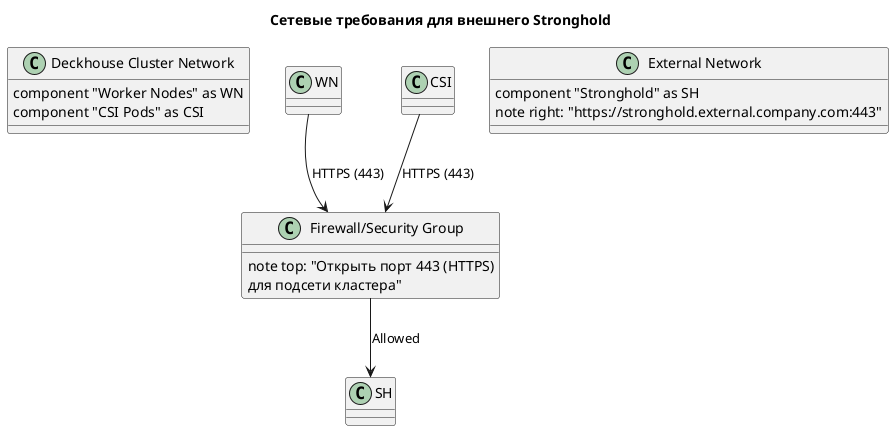

Я помогу вам разобрать решения для интеграции секретов из Stronghold в приложения Deckhouse. Сначала найду актуальную информацию о secrets-store-integration в Deckhouse.Теперь мне нужно найти информацию конкретно о Stronghold и его интеграции с secrets-store-integration в различных вариантах развертывания.Теперь мне нужно найти информацию о том, как настроить Stronghold для работы с внешним кластером.Отлично! Теперь у меня есть достаточная информация для подготовки полного ответа. Основываясь на найденной документации, я могу описать оба варианта интеграции Stronghold с приложениями в Deckhouse через secrets-store-integration.

# Интеграция секретов из Stronghold в приложения Deckhouse с использованием secrets-store-integration

## Общая архитектура

Модуль secrets-store-integration позволяет доставлять секреты в pod'ы приложений в кластере Kubernetes путем монтирования нескольких секретов, ключей и сертификатов, хранящихся во внешних хранилищах секретов. Секреты монтируются в pod'ы как тома с использованием реализации CSI драйвера. Для работы модуля требуется предварительно настроенное хранилище секретов, совместимое с HashiCorp Vault. В хранилище предварительно должен быть настроен путь аутентификации.

## Вариант 1: Stronghold развернут в том же кластере

### Архитектурная схема

```plantuml
@startuml
!define RECTANGLE class

title "Stronghold в том же кластере Deckhouse"

cloud "Deckhouse Cluster" {
    RECTANGLE "Master Nodes" {
        component "Stronghold" as SH {
            database "Secrets Storage" as SS
        }
    }
    
    RECTANGLE "Application Namespace" {
        component "Application Pod" as APP {
            folder "/mnt/secrets" as MNT
            component "App Container" as AC
        }
        component "CSI Driver Pod" as CSI
        component "ServiceAccount" as SA
    }
    
    RECTANGLE "D8 System" {
        component "Secrets Store\nIntegration Module" as SSI
        component "CSI Provider" as CSIP
    }
}

SH --> SSI : "Auto Discovery\n(DiscoverLocalStronghold)"
SSI --> CSIP : "Configuration"
SA --> SH : "K8s Auth\n(kubernetes_local)"
CSIP --> CSI : "Mount Request"
CSI --> SH : "Retrieve Secrets"
CSI --> MNT : "Mount Secrets"
AC --> MNT : "Read Files"

@enduml
```

### Конфигурация

В автоматическом режиме Stronghold после инициализации хранилища создается роль deckhouse_administrators, которой предоставляется доступ к веб-интерфейсу через OIDC аутентификацию Dex. Дополнительно настраивается автоматическое подключение текущего кластера Deckhouse к Stronghold. Это необходимо для работы модуля secrets-store-integration.

#### 1. Включение модуля Stronghold

```yaml
apiVersion: deckhouse.io/v1alpha1
kind: ModuleConfig
metadata:
  name: stronghold
spec:
  enabled: true
  version: 1
  settings:
    management:
      mode: Automatic
    administrators:
      - type: Group
        name: admins
```

#### 2. Включение модуля secrets-store-integration

Для автоматической настройки работы модуля secrets-store-integration в связке с модулем Deckhouse Stronghold потребуется ранее включенный и настроенный Stronghold. Далее достаточно применить следующий ресурс: apiVersion: deckhouse.io/v1alpha1 kind: ModuleConfig metadata: name: secrets-store-integration spec: enabled: true version: 1. Параметр connectionConfiguration можно опустить, поскольку он стоит в значении DiscoverLocalStronghold по умолчанию.

```yaml
apiVersion: deckhouse.io/v1alpha1
kind: ModuleConfig
metadata:
  name: secrets-store-integration
spec:
  enabled: true
  version: 1
  # connectionConfiguration по умолчанию: DiscoverLocalStronghold
```

#### 3. Создание секрета в Stronghold

```bash
# Создаем KV хранилище
d8 stronghold secrets enable -path=demo-kv kv-v2

# Создаем секрет
d8 stronghold kv put demo-kv/myapp-secret \
  DB_USER="username" \
  DB_PASS="secret-password"
```

#### 4. Создание политики и роли в Stronghold

```bash
# Создаем политику для чтения секрета
d8 stronghold policy write myapp-ro-policy - <<EOF
path "demo-kv/data/myapp-secret" {
  capabilities = ["read"]
}
EOF

# Создаем роль для ServiceAccount
d8 stronghold write auth/kubernetes_local/role/myapp-role \
  bound_service_account_names=myapp-sa \
  bound_service_account_namespaces=myapp-namespace \
  policies=myapp-ro-policy \
  ttl=24h
```

#### 5. Создание SecretsStoreImport

Для доставки секретов в приложение нужно использовать CustomResource "SecretStoreImport". apiVersion: deckhouse.io/v1alpha1 kind: SecretsStoreImport metadata: name: python-backend namespace: my-namespace1 spec: type: CSI role: my-namespace1_backend files: - name: "db-password" source: path: "secret/data/database-for-python-app" key: "password"

```yaml
apiVersion: deckhouse.io/v1alpha1
kind: SecretsStoreImport
metadata:
  name: myapp-secrets
  namespace: myapp-namespace
spec:
  type: CSI
  role: myapp-role
  files:
    - name: "db-username"
      source:
        path: "demo-kv/data/myapp-secret"
        key: "DB_USER"
    - name: "db-password"
      source:
        path: "demo-kv/data/myapp-secret"
        key: "DB_PASS"
```

#### 6. Deployment приложения

Create a test deployment with the name "backend", which starts a pod that will be able to access the needed vault's secret: apiVersion: apps/v1 kind: Deployment metadata: name: backend namespace: my-namespace1 labels: app: backend spec: selector: matchLabels: app: backend template: metadata: labels: app: backend spec: serviceAccountName: backend-sa containers: - image: some/app:0.0.1 name: backend volumeMounts: - name: secrets mountPath: "/mnt/secrets" volumes: - name: secrets csi: driver: secrets-store.csi.deckhouse.io volumeAttributes: secretsStoreImport: "python-backend"

```yaml
apiVersion: v1
kind: ServiceAccount
metadata:
  name: myapp-sa
  namespace: myapp-namespace
---
apiVersion: apps/v1
kind: Deployment
metadata:
  name: myapp
  namespace: myapp-namespace
spec:
  selector:
    matchLabels:
      app: myapp
  template:
    metadata:
      labels:
        app: myapp
    spec:
      serviceAccountName: myapp-sa
      containers:
      - name: app
        image: myapp:latest
        volumeMounts:
        - name: secrets
          mountPath: "/mnt/secrets"
          readOnly: true
        env:
        - name: DB_USERNAME
          value: "file:///mnt/secrets/db-username"
        - name: DB_PASSWORD
          value: "file:///mnt/secrets/db-password"
      volumes:
      - name: secrets
        csi:
          driver: secrets-store.csi.deckhouse.io
          volumeAttributes:
            secretsStoreImport: "myapp-secrets"
```

### Плюсы варианта 1

1. **Автоматическая конфигурация** - автоматическое подключение текущего кластера Deckhouse к Stronghold настраивается для работы модуля secrets-store-integration
2. **Простота настройки** - минимальная конфигурация, большинство параметров определяются автоматически
3. **Высокая производительность** - нет сетевых задержек между кластерами
4. **Автоматическое обновление секретов** - функция авторотации модуля secret-store-integration включена по умолчанию. Каждые две минуты модуль опрашивает Stronghold и синхронизирует секреты в смонтированном файле, если он был изменен
5. **Безопасность** - трафик не выходит за пределы кластера

### Минусы варианта 1

1. **Single Point of Failure** - если кластер недоступен, секреты тоже недоступны
2. **Нагрузка на master-узлы** - Stronghold работает на master-узлах кластера
3. **Отсутствие централизации** - для нескольких кластеров потребуется несколько экземпляров Stronghold

## Вариант 2: Stronghold развернут вне кластера

### Архитектурная схема

```plantuml
@startuml
!define RECTANGLE class

title "Stronghold во внешнем кластере"

cloud "External Infrastructure" {
    RECTANGLE "Stronghold Cluster" as EXT {
        component "Stronghold API" as SHAPI {
            database "Secrets Storage" as SS
        }
        component "K8s Auth Backend" as KAUTH
    }
}

cloud "Deckhouse Cluster" {
    RECTANGLE "Application Namespace" {
        component "Application Pod" as APP {
            folder "/mnt/secrets" as MNT
            component "App Container" as AC
        }
        component "CSI Driver Pod" as CSI
        component "ServiceAccount" as SA
    }
    
    RECTANGLE "D8 System" {
        component "Secrets Store\nIntegration Module" as SSI
        component "CSI Provider" as CSIP
    }
}

EXT --> SSI : "HTTPS (Manual Config)"
SSI --> CSIP : "Configuration"
SA --> KAUTH : "JWT Token\n(remote-kube-1)"
KAUTH --> SHAPI : "Validate & Authorize"
CSIP --> CSI : "Mount Request"
CSI --> SHAPI : "Retrieve Secrets"
CSI --> MNT : "Mount Secrets"
AC --> MNT : "Read Files"

@enduml
```

### Конфигурация

#### 1. Настройка Stronghold для удаленного доступа

По умолчанию включен и настроен метод аутентификации в Stronghold через Kubernetes API кластера, на котором работает сам Stronghold, под названием kubernetes_local. Если вы хотите настроить доступ через удаленные кластеры, установите путь аутентификации (authPath) и включите аутентификацию и авторизацию в Stronghold через Kubernetes API для каждого кластера: d8 stronghold auth enable -path=remote-kube-1 kubernetes

```bash
# Включаем аутентификацию Kubernetes для удаленного кластера
d8 stronghold auth enable -path=remote-kube-1 kubernetes

# Настраиваем Kubernetes API endpoint
d8 stronghold write auth/remote-kube-1/config \
  kubernetes_host="https://api.kube.my-deckhouse.com" \
  disable_local_ca_jwt=true
```

#### 2. Конфигурация модуля secrets-store-integration

Ниже приведен пример конфигурации модуля для использования Vault-совместимого хранилища секретов, работающего на "secretstoreexample.com" на обычном порту (443 TLS). Обратите внимание, что вам нужно будет заменить значения параметров в конфигурации на значения, соответствующие вашей среде. Настоятельно рекомендуется установить переменную caCert.

```yaml
apiVersion: deckhouse.io/v1alpha1
kind: ModuleConfig
metadata:
  name: secrets-store-integration
spec:
  version: 1
  enabled: true
  settings:
    connectionConfiguration: Manual
    connection:
      url: "https://stronghold.external.company.com"
      authPath: "remote-kube-1"
      caCert: |
        -----BEGIN CERTIFICATE-----
        MIIFoTCCA4mgAwIBAgIUX9kFz7OxlBlALMEj8WsegZloXTowDQYJKoZIhvcNAQEL
        # ... полный CA сертификат ...
        o2SYzqM=
        -----END CERTIFICATE-----
```

#### 3. Создание политики и роли во внешнем Stronghold

```bash
# Подключаемся к внешнему Stronghold
export VAULT_ADDR=https://stronghold.external.company.com
export VAULT_TOKEN=<root-token>

# Создаем политику
vault policy write remote-app-policy - <<EOF
path "secret/data/remote-app/*" {
  capabilities = ["read"]
}
EOF

# Создаем роль для удаленного кластера
vault write auth/remote-kube-1/role/remote-app-role \
  bound_service_account_names=remote-app-sa \
  bound_service_account_namespaces=remote-app-namespace \
  policies=remote-app-policy \
  ttl=24h
```

#### 4. Создание SecretsStoreImport в удаленном кластере

```yaml
apiVersion: deckhouse.io/v1alpha1
kind: SecretsStoreImport
metadata:
  name: remote-app-secrets
  namespace: remote-app-namespace
spec:
  type: CSI
  role: remote-app-role
  files:
    - name: "api-key"
      source:
        path: "secret/data/remote-app/config"
        key: "API_KEY"
    - name: "db-connection"
      source:
        path: "secret/data/remote-app/database"
        key: "CONNECTION_STRING"
```

#### 5. Deployment приложения

```yaml
apiVersion: v1
kind: ServiceAccount
metadata:
  name: remote-app-sa
  namespace: remote-app-namespace
---
apiVersion: apps/v1
kind: Deployment
metadata:
  name: remote-app
  namespace: remote-app-namespace
spec:
  replicas: 3
  selector:
    matchLabels:
      app: remote-app
  template:
    metadata:
      labels:
        app: remote-app
    spec:
      serviceAccountName: remote-app-sa
      containers:
      - name: app
        image: remote-app:latest
        volumeMounts:
        - name: secrets
          mountPath: "/etc/secrets"
          readOnly: true
        env:
        - name: API_KEY_PATH
          value: "/etc/secrets/api-key"
        - name: DB_CONNECTION_PATH
          value: "/etc/secrets/db-connection"
      volumes:
      - name: secrets
        csi:
          driver: secrets-store.csi.deckhouse.io
          volumeAttributes:
            secretsStoreImport: "remote-app-secrets"
```

### Требования к сетевой связности



### Плюсы варианта 2

1. **Централизованное управление** - один Stronghold для множества кластеров
2. **Независимость** - секреты доступны даже при проблемах с конкретным кластером
3. **Масштабируемость** - легко добавлять новые кластеры
4. **Разделение ответственности** - управление секретами отделено от управления кластерами
5. **Соответствие compliance** - централизованный аудит и управление доступом

### Минусы варианта 2

1. **Сложность настройки** - требуется ручная конфигурация аутентификации для каждого кластера
2. **Сетевая задержка** - дополнительная латентность при получении секретов
3. **Зависимость от сети** - требуется стабильное сетевое соединение между кластерами
4. **Необходимость в CA сертификате** - требуется действительный публичный сертификат Certificate Authority (CA), используемый хранилищем секретов. Вам необходимо использовать такой публичный CA-сертификат в формате PEM в качестве переменной caCert в конфигурации модуля
5. **Безопасность сети** - необходимо обеспечить безопасность канала связи

## Требования к приложениям

### Для обоих вариантов:

1. **ServiceAccount** - приложение должно использовать ServiceAccount для аутентификации
2. **Права доступа** - ServiceAccount должен иметь соответствующие права в Stronghold
3. **Монтирование томов** - приложение должно уметь работать с файлами, смонтированными через CSI

### Способы использования секретов в приложении:

Если нет возможности изменить код приложения, вы можете реализовать безопасную инъекцию секретов в качестве переменной окружения, которую может использовать приложение. Для этого прочитайте все файлы, смонтированные CSI в контейнер, и определите переменные окружения так, чтобы их имена соответствовали именам файлов, а значения — содержимому файлов. После этого запустите приложение. bash -c "for file in $(ls /mnt/secrets); do export $file=$(cat /mnt/secrets/$file); done ; exec my_original_file_to_startup"

#### 1. Прямое чтение файлов:
```python
# Python пример
with open('/mnt/secrets/db-password', 'r') as f:
    db_password = f.read().strip()
```

#### 2. Через переменные окружения (wrapper script):
```bash
#!/bin/bash
# entrypoint.sh
for file in $(ls /mnt/secrets); do
  export $file=$(cat /mnt/secrets/$file)
done
exec /app/main
```

#### 3. Отслеживание изменений:
```python
import os
import time

def watch_secret_changes(secret_path):
    last_mtime = os.path.getmtime(secret_path)
    while True:
        current_mtime = os.path.getmtime(secret_path)
        if current_mtime != last_mtime:
            reload_config()
            last_mtime = current_mtime
        time.sleep(60)  # Проверка каждую минуту
```

## Рекомендации по выбору варианта

### Используйте Вариант 1 (Stronghold в том же кластере), если:
- У вас один кластер или несколько независимых кластеров
- Требуется максимальная производительность
- Нет строгих требований к централизации управления секретами
- Хотите минимизировать сложность настройки

### Используйте Вариант 2 (Внешний Stronghold), если:
- У вас множество кластеров, требующих доступ к общим секретам
- Необходима централизованная система управления секретами
- Есть требования compliance к аудиту и управлению доступом
- Готовы инвестировать время в настройку и поддержку
- Есть стабильная сетевая инфраструктура между кластерами
