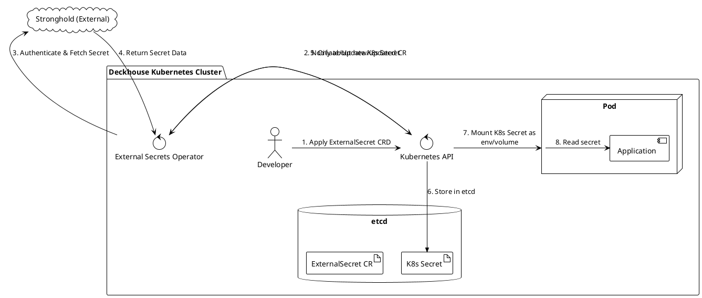
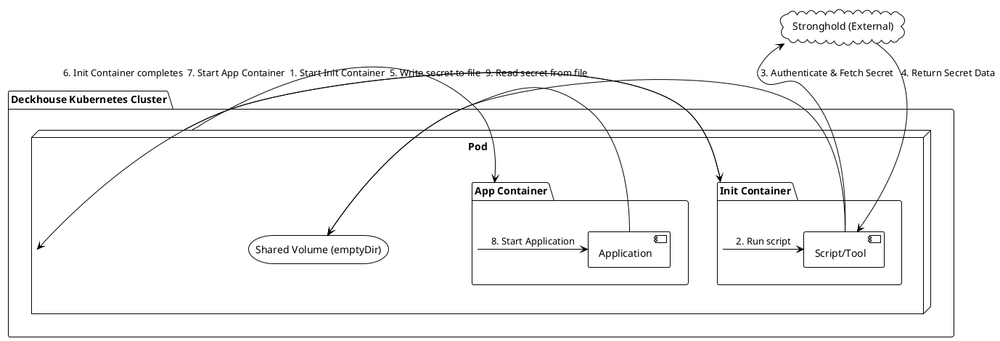
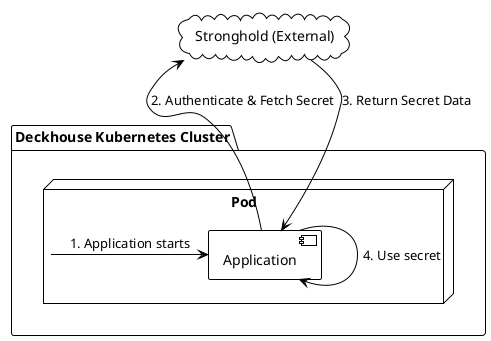

Конечно, давайте подробно разберем задачу инъекции секретов из внешнего хранилища Stronghold в приложение, развернутое в Kubernetes-кластере под управлением Deckhouse.

Deckhouse является Kubernetes-платформой, поэтому все стандартные подходы для работы с секретами в Kubernetes будут применимы и здесь. Основная задача сводится к тому, как безопасно доставить секрет из Stronghold в Pod вашего приложения.

Для этого мы рассмотрим четыре основных архитектурных подхода.

### Предварительная настройка Stronghold

Перед выбором способа инъекции, необходимо настроить Stronghold для взаимодействия с Kubernetes. Поскольку Stronghold совместим с API HashiCorp Vault, шаги будут аналогичными.

1.  **Включить аутентификацию Kubernetes:** В Stronghold должен быть включен и настроен метод аутентификации через Kubernetes. Это позволит подам аутентифицироваться в Stronghold с помощью своего ServiceAccount токена.
2.  **Создать политику (Policy):** Определите политику в Stronghold, которая разрешает чтение конкретных секретов (например, `secret/data/myapp/db`).
3.  **Создать роль (Role):** Свяжите политику с ServiceAccount'ом вашего приложения в определенном namespace. Это гарантирует, что только поды с этим ServiceAccount'ом смогут запрашивать секреты, разрешенные политикой.

---

### Решение 1: Синхронизация через External Secrets Operator (Рекомендуемый)

Это самый современный и "Kubernetes-нативный" подход. Он заключается в использовании специального оператора, который работает в кластере, следит за кастомными ресурсами (CRD), извлекает секреты из Stronghold и автоматически создает или обновляет стандартные Kubernetes `Secret`.

**Схема работы:**


**Примеры конфигов:**

1.  **`SecretStore` (CRD):** Описывает, как подключиться к Stronghold. Создается один раз.
    ```yaml
    # secret-store.yaml
    apiVersion: external-secrets.io/v1beta1
    kind: SecretStore
    metadata:
      name: stronghold-store
    spec:
      provider:
        vault:
          server: "https://stronghold.example.com" # URL вашего Stronghold
          path: "secret" # Префикс для KV-хранилища
          version: "v2" # Версия KV-хранилища
          auth:
            # Указываем, что поды будут аутентифицироваться через K8s SA
            kubernetes:
              mountPath: "/var/run/secrets/kubernetes.io/serviceaccount"
              role: "my-app-role" # Роль, созданная в Stronghold
    ```

2.  **`ExternalSecret` (CRD):** Описывает, какой секрет из Stronghold и как синхронизировать в Kubernetes `Secret`.
    ```yaml
    # external-secret.yaml
    apiVersion: external-secrets.io/v1beta1
    kind: ExternalSecret
    metadata:
      name: my-app-db-credentials
    spec:
      secretStoreRef:
        name: stronghold-store # Ссылка на SecretStore
        kind: SecretStore
      target:
        # Имя создаваемого Kubernetes Secret
        name: my-app-db-secret
        creationPolicy: Owner
      data:
      - secretKey: DB_PASSWORD # Ключ в Kubernetes Secret
        remoteRef:
          key: myapp/db # Путь к секрету в Stronghold
          property: password # Поле в секрете Stronghold
    ```

3.  **`Deployment` приложения:** Использует созданный Kubernetes `Secret`.
    ```yaml
    # deployment.yaml
    apiVersion: apps/v1
    kind: Deployment
    metadata:
      name: my-application
    spec:
      replicas: 1
      template:
        metadata:
          labels:
            app: my-application
        spec:
          serviceAccountName: my-app-sa # SA, привязанный к роли в Stronghold
          containers:
          - name: my-app-container
            image: my-app:1.0.0
            env:
            - name: DATABASE_PASSWORD
              valueFrom:
                secretKeyRef:
                  name: my-app-db-secret # Имя созданного K8s Secret
                  key: DB_PASSWORD
    ```

**Требования к приложению:**
*   Никаких. Приложение работает со стандартными Kubernetes `Secret` (переменные окружения или файлы), как будто секреты были созданы вручную.

**Плюсы:**
*   **Безопасность:** Приложение не имеет доступа к токенам Stronghold, оно работает только с K8s `Secret`.
*   **Разделение ответственности:** DevOps настраивают синхронизацию, разработчики используют стандартные `Secret`.
*   **Централизованное управление:** Легко управлять всеми синхронизируемыми секретами.
*   **Автоматическое обновление:** Оператор может периодически обновлять K8s `Secret` при изменении в Stronghold.

**Минусы:**
*   **Дополнительный компонент:** Требуется установка и поддержка External Secrets Operator в кластере.
*   **Дублирование секрета:** Секрет хранится и в Stronghold, и в etcd (в виде K8s `Secret`).

---

### Решение 2: Init Container

Этот подход использует `init-контейнер`, который запускается перед основным контейнером приложения. Его задача — сходить в Stronghold, забрать секрет и записать его в общедоступный для всех контейнеров пода `Volume` (обычно `emptyDir`).

**Схема работы:**


**Пример конфига (`Deployment`):**
```yaml
apiVersion: apps/v1
kind: Deployment
metadata:
  name: my-application
spec:
  replicas: 1
  template:
    metadata:
      labels:
        app: my-application
    spec:
      serviceAccountName: my-app-sa
      volumes:
      - name: secret-volume
        emptyDir: {} # Временный том на время жизни пода
      
      # Init-контейнер для получения секрета
      initContainers:
      - name: stronghold-injector
        image: appropriate/curl # Или любой образ с нужными утилитами
        command: ["/bin/sh", "-c"]
        args:
          - |
            set -e
            # 1. Получаем токен Stronghold через K8s Auth
            K8S_TOKEN=$(cat /var/run/secrets/kubernetes.io/serviceaccount/token)
            VAULT_TOKEN=$(curl --request POST \
              --data '{"jwt": "'"$K8S_TOKEN"'", "role": "my-app-role"}' \
              https://stronghold.example.com/v1/auth/kubernetes/login | jq -r .auth.client_token)
            
            # 2. Получаем секрет
            SECRET_VALUE=$(curl --header "X-Vault-Token: $VAULT_TOKEN" \
              https://stronghold.example.com/v1/secret/data/myapp/db | jq -r .data.data.password)
              
            # 3. Записываем в общий том
            echo -n "$SECRET_VALUE" > /secrets/db_password
        volumeMounts:
        - name: secret-volume
          mountPath: /secrets

      # Основной контейнер приложения
      containers:
      - name: my-app-container
        image: my-app:1.0.0
        # Приложение должно уметь читать секрет из файла
        volumeMounts:
        - name: secret-volume
          mountPath: /etc/secrets
          readOnly: true
```

**Требования к приложению:**
*   Приложение должно быть настроено на чтение секрета из файла по определенному пути (например, `/etc/secrets/db_password`).

**Плюсы:**
*   **Простота:** Не требует установки дополнительных операторов в кластер.
*   **Нет дублирования в etcd:** Секрет не сохраняется в виде объекта Kubernetes `Secret`.

**Минусы:**
*   **Сложность для разработчиков:** Логика получения секрета "размазывается" по всем `Deployment`.
*   **Нет ротации:** Секрет получается только один раз при старте пода. Для обновления секрета требуется перезапуск пода.
*   **Безопасность:** Секрет находится на файловой системе пода (хоть и во временной `emptyDir`).

---

### Решение 3: Sidecar Container

Этот паттерн является развитием идеи Init Container. Вместо контейнера, который запускается один раз, рядом с основным приложением запускается дополнительный `sidecar-контейнер`. Этот контейнер периодически опрашивает Stronghold и обновляет файл с секретом в общем томе.

**Схема работы:**
```plantuml
@startuml
!theme plain

cloud "Stronghold (External)" as SH
package "Deckhouse Kubernetes Cluster" {
  node "Pod" as AppPod {
    storage "Shared Volume (emptyDir)" as Vol
    package "Sidecar Container" as Sidecar {
      component "Agent" as Agent
    }
    package "App Container" as AppCont {
       component "Application" as App
    }
  }
}

AppPod -> AppCont : 1. Start App Container
AppPod -> Sidecar : 1. Start Sidecar Container
Sidecar -> Agent : 2. Run agent
loop Periodically
  Agent -> SH : 3. Authenticate & Fetch Secret
  SH --> Agent : 4. Return Secret Data
  Agent -> Vol : 5. Write/Update secret in file
end
AppCont -> App : 6. Start Application
App -> Vol : 7. Read/Re-read secret from file

@enduml
```

**Пример конфига (`Deployment`):**
Конфигурация очень похожа на Init Container, но `stronghold-injector` помещается в основной список `containers`, а не `initContainers`. Часто для этой цели используют готовые решения, например, `vault-agent-injector`.

```yaml
apiVersion: apps/v1
kind: Deployment
# ... metadata ...
spec:
  template:
    metadata:
      # Аннотации для автоматической инъекции sidecar'а (если используется vault-agent-injector)
      annotations:
        vault.hashicorp.com/agent-inject: 'true'
        vault.hashicorp.com/role: 'my-app-role'
        vault.hashicorp.com/agent-inject-secret-dbpass: 'secret/data/myapp/db'
        vault.hashicorp.com/agent-inject-template-dbpass: |
          {{- with secret "secret/data/myapp/db" -}}
          {{ .Data.data.password }}
          {{- end -}}
    spec:
      serviceAccountName: my-app-sa
      containers:
      - name: my-app-container
        image: my-app:1.0.0
        volumeMounts:
        - name: vault-secrets # Том, создаваемый инжектором
          mountPath: /etc/secrets
          readOnly: true
      # Sidecar-контейнер будет добавлен сюда автоматически инжектором
```

**Требования к приложению:**
*   Приложение должно уметь читать секрет из файла.
*   **Критически важно:** Для поддержки ротации приложение должно уметь "на лету" перечитывать файл с секретом при его изменении.

**Плюсы:**
*   **Поддержка ротации:** Секреты могут обновляться без перезапуска приложения.
*   **Нет дублирования в etcd:** Секрет не хранится в Kubernetes `Secret`.

**Минусы:**
*   **Сложность приложения:** Требуется реализация логики "горячей" перезагрузки конфигурации.
*   **Дополнительные ресурсы:** Постоянно работающий sidecar-контейнер потребляет ресурсы.
*   **Сложность настройки:** Требует либо ручной настройки sidecar'а, либо развертывания системы автоматической инъекции (mutating webhook).

---

### Решение 4: Прямая интеграция в приложении

Самый прямолинейный, но наименее предпочтительный способ. Приложение самостоятельно, используя SDK или HTTP-клиент, обращается к Stronghold для получения секрета.

**Схема работы:**


**Пример конфига (`Deployment`):**
В этом случае конфигурация Kubernetes минимальна. Нужно лишь передать приложению адрес Stronghold и роль.
```yaml
apiVersion: apps/v1
kind: Deployment
# ...
spec:
  template:
    # ...
    spec:
      serviceAccountName: my-app-sa
      containers:
      - name: my-app-container
        image: my-app-with-stronghold-sdk:1.0.0
        env:
        - name: STRONGHOLD_ADDR
          value: "https://stronghold.example.com"
        - name: STRONGHOLD_ROLE
          value: "my-app-role"
        # Токен ServiceAccount'а монтируется по умолчанию
```

**Требования к приложению:**
*   Приложение должно содержать логику для аутентификации в Stronghold (через K8s Auth) и получения секрета.
*   Необходимо включить в приложение соответствующие библиотеки/SDK.

**Плюсы:**
*   **Максимальная простота с точки зрения K8s:** Не нужны операторы, sidecar'ы или init-контейнеры.

**Минусы:**
*   **Нарушение принципа разделения ответственности:** Приложение тесно связывается с инфраструктурой секретов.
*   **Сложность разработки:** Логику работы с секретами нужно реализовывать и поддерживать в каждом приложении.
*   **Риски безопасности:** Ошибки в реализации могут привести к уязвимостям.

### Сравнительная таблица и рекомендации

| Критерий | External Secrets Operator | Init Container | Sidecar Container | Прямая интеграция |
| :--- | :--- | :--- | :--- | :--- |
| **Сложность K8s** | Средняя (нужен оператор) | Низкая | Высокая (нужен инжектор) | **Очень низкая** |
| **Сложность приложения** | **Очень низкая** | Низкая (читать файл) | Средняя (перечитывать файл) | Высокая (SDK, логика) |
| **Поддержка ротации** | **Да (автоматически)** | Нет (нужен рестарт) | **Да (требует поддержки)** | Да (требует реализации) |
| **Безопасность** | **Высокая** | Средняя | Средняя | Низкая |
| **Дублирование в etcd** | Да | **Нет** | **Нет** | **Нет** |
| **Рекомендуется для** | Большинства сценариев | Простых задач, разовых скриптов | Приложений с требованием к динамическим секретам | Не рекомендуется |

**Итоговая рекомендация:**

Для большинства задач в Deckhouse **настоятельно рекомендуется использовать подход №1 (External Secrets Operator)**. Он обеспечивает наилучший баланс между безопасностью, удобством для разработчиков и гибкостью управления, полностью соответствуя декларативной природе Kubernetes.
