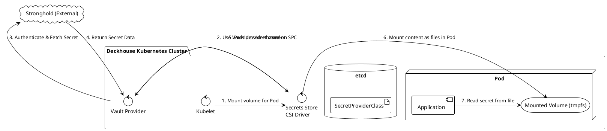
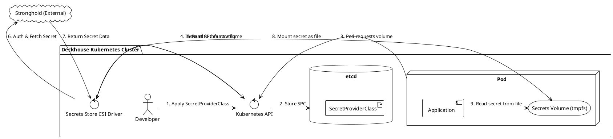
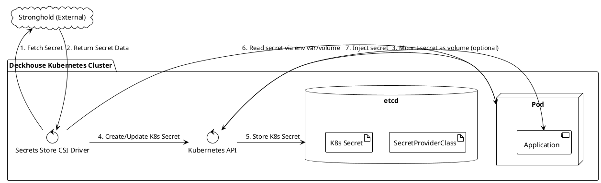

Отлично, давайте разберем задачу инъекции секретов из Stronghold с использованием модуля `secrets-store-integration` в Deckhouse.

Этот модуль является ключевым отличием от предыдущего ответа. Он интегрирует в кластер **Secrets Store CSI Driver** — стандартный механизм для предоставления секретов подам через монтирование томов (volumes).

### Ключевая концепция: Secrets Store CSI Driver

В отличие от `External Secrets Operator`, который синхронизирует секреты в объекты Kubernetes `Secret`, CSI-драйвер работает на более низком уровне. Он позволяет монтировать секреты из внешних хранилищ (таких как Stronghold/Vault) напрямую в файловую систему пода как `tmpfs` (в памяти). Это основной и самый безопасный способ его использования.

Поскольку Stronghold совместим с API HashiCorp Vault, мы будем использовать провайдер `vault` для CSI-драйвера.

**Общая схема работы:**


### Предварительные шаги

1.  **Включение модуля в Deckhouse:** Убедитесь, что модуль `secrets-store-integration` включен в конфигурации Deckhouse (`DeckhouseClusterConfiguration`).

2.  **Настройка Stronghold:** Как и в других сценариях, в Stronghold должны быть настроены:
    *   **Kubernetes Auth Method:** Для аутентификации подов.
    *   **Policy:** Разрешающая чтение нужных секретов.
    *   **Role:** Связывающая ServiceAccount пода, неймспейс и политику.

---

### Решение 1: Монтирование секрета напрямую в файловую систему пода (Рекомендуемый)

Это основной и самый безопасный сценарий использования Secrets Store CSI Driver. Секрет никогда не сохраняется в `etcd` в виде объекта Kubernetes `Secret`.

**Схема работы:**


**Примеры конфигов:**

1.  **`SecretProviderClass` (CRD):** Этот ресурс описывает, *как* подключиться к Stronghold и *какие* секреты извлечь.
    ```yaml
    # secret-provider-class.yaml
    apiVersion: secrets-store.csi.x-k8s.io/v1
    kind: SecretProviderClass
    metadata:
      name: my-app-stronghold-db
    spec:
      provider: vault # Указываем провайдер для Stronghold/Vault
      parameters:
        roleName: "my-app-role" # Роль, созданная в Stronghold
        vaultAddress: "https://stronghold.example.com" # URL вашего Stronghold
        objects: |
          - objectName: "db.password" # Имя файла, который будет создан в томе
            secretPath: "secret/data/myapp/db" # Путь к секрету в Stronghold (KV v2)
            secretKey: "password" # Ключ внутри секрета
          - objectName: "db.username"
            secretPath: "secret/data/myapp/db"
            secretKey: "username"
    ```

2.  **`Deployment` приложения:** Конфигурация пода для монтирования тома.
    ```yaml
    # deployment.yaml
    apiVersion: apps/v1
    kind: Deployment
    metadata:
      name: my-application
    spec:
      replicas: 1
      template:
        metadata:
          labels:
            app: my-application
        spec:
          serviceAccountName: my-app-sa # SA, привязанный к роли в Stronghold
          containers:
          - name: my-app-container
            image: my-app:1.0.0
            volumeMounts:
            - name: secrets-store-inline
              mountPath: "/mnt/secrets-store" # Путь, куда будут смонтированы секреты
              readOnly: true
          volumes:
            - name: secrets-store-inline
              csi:
                driver: secrets-store.csi.k8s.io
                readOnly: true
                volumeAttributes:
                  secretProviderClass: "my-app-stronghold-db" # Ссылка на SecretProviderClass
    ```
    После запуска пода в контейнере по пути `/mnt/secrets-store/` появятся файлы `db.password` и `db.username`.

**Требования к приложению:**
*   Приложение **обязано** уметь читать конфигурацию/секреты из файлов. Например, при старте оно должно прочитать файл `/mnt/secrets-store/db.password`, чтобы получить пароль от базы данных.

**Плюсы:**
*   **Максимальная безопасность:** Секреты не хранятся в `etcd`, что исключает целый вектор атак. Они существуют только в памяти Stronghold и в памяти пода (`tmpfs`).
*   **Атомарность:** Под не запустится, если CSI-драйвер не сможет получить секреты.
*   **Поддержка ротации:** Драйвер может периодически обновлять смонтированные секреты. Приложению нужно уметь их перечитывать.

**Минусы:**
*   **Требования к приложению:** Не все приложения "из коробки" умеют читать секреты из файлов. Это может потребовать доработки.
*   **Невозможность использовать переменные окружения:** Секреты доступны только как файлы.

---

### Решение 2: Синхронизация в Kubernetes `Secret`

Secrets Store CSI Driver имеет дополнительную функцию: после монтирования секрета в под он может автоматически создать или обновить стандартный Kubernetes `Secret`. Это гибридный подход, который полезен для обратной совместимости.

**Схема работы:**


**Примеры конфигов:**

1.  **`SecretProviderClass` (с опцией синхронизации):**
    К предыдущему конфигу добавляется секция `secretObjects`.
    ```yaml
    # secret-provider-class-sync.yaml
    apiVersion: secrets-store.csi.x-k8s.io/v1
    kind: SecretProviderClass
    metadata:
      name: my-app-stronghold-db-sync
    spec:
      provider: vault
      parameters:
        roleName: "my-app-role"
        vaultAddress: "https://stronghold.example.com"
        objects: |
          - objectName: "db.password"
            secretPath: "secret/data/myapp/db"
            secretKey: "password"
      # Новая секция для синхронизации в K8s Secret
      secretObjects:
      - secretName: "my-app-db-secret" # Имя создаваемого Kubernetes Secret
        type: Opaque
        data:
        - key: DB_PASSWORD # Ключ в Kubernetes Secret
          objectName: "db.password" # Имя объекта из секции 'objects' выше
    ```

2.  **`Deployment` приложения:**
    Теперь приложение может использовать стандартный механизм `valueFrom` для получения секрета, как будто он был создан вручную.
    ```yaml
    # deployment-sync.yaml
    apiVersion: apps/v1
    kind: Deployment
    # ...
    spec:
      template:
        # ...
        spec:
          serviceAccountName: my-app-sa
          containers:
          - name: my-app-container
            image: my-app:1.0.0
            env:
            - name: DATABASE_PASSWORD
              valueFrom:
                secretKeyRef:
                  name: "my-app-db-secret" # Имя созданного K8s Secret
                  key: DB_PASSWORD
          # Том все еще нужен для запуска процесса синхронизации!
          volumes:
            - name: secrets-store-inline
              csi:
                driver: secrets-store.csi.k8s.io
                readOnly: true
                volumeAttributes:
                  secretProviderClass: "my-app-stronghold-db-sync"
    ```
    **Важно:** Даже если вы не монтируете том в контейнер (`volumeMounts`), секция `volumes` в поде обязательна. Именно она триггерит работу CSI-драйвера.

**Требования к приложению:**
*   Никаких. Приложение работает со стандартными Kubernetes `Secret` через переменные окружения или файлы, как обычно.

**Плюсы:**
*   **Совместимость:** Позволяет использовать переменные окружения, что идеально для приложений, которые не могут быть изменены.
*   **Удобство:** Разработчикам не нужно менять привычные паттерны работы с секретами.

**Минусы:**
*   **Снижение безопасности:** Секрет снова оказывается в `etcd` (хоть и в зашифрованном виде), что нивелирует главное преимущество CSI-драйвера.
*   **Сложность:** Конфигурация становится немного сложнее.
*   **Задержка:** Kubernetes `Secret` будет создан только после того, как под, использующий `SecretProviderClass`, будет запущен. Другие поды не смогут использовать этот секрет до его создания.

### Сравнение и итоговые рекомендации

| Критерий | Решение 1 (Только том) | Решение 2 (Синхронизация в K8s Secret) |
| :--- | :--- | :--- |
| **Безопасность (хранение в etcd)** | **Высокая (секрета нет в etcd)** | Средняя (секрет есть в etcd) |
| **Совместимость с приложением** | Низкая (требует чтения из файлов) | **Высокая (поддерживает env vars)** |
| **Сложность настройки** | Низкая | Средняя |
| **Поддержка ротации** | Да (требует перечитывания файла) | Да (обновляет K8s Secret, под может требовать перезапуска) |
| **Использование ресурсов** | Минимальное (только при старте пода) | Минимальное + хранение в etcd |

**Рекомендации:**

1.  **Выбирайте Решение 1 (монтирование в том)**, если вы можете модифицировать свое приложение для чтения секретов из файлов. Это самый безопасный и "cloud-native" способ, который полностью соответствует философии "нулевого доверия".

2.  **Выбирайте Решение 2 (синхронизация в K8s Secret)**, если у вас есть легаси-приложения, которые жестко завязаны на переменные окружения, или если созданный Kubernetes `Secret` должен использоваться другими компонентами системы, а не только этим подом. Это отличный компромисс между безопасностью и удобством.
