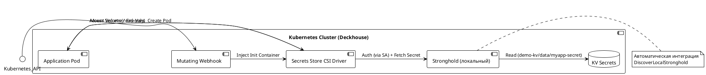
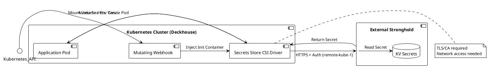

### Инжекция секретов из Stronghold в приложение, развернутое в Deckhouse, с использованием secrets-store-integration

Deckhouse — это платформа на базе Kubernetes, которая включает модуль **secrets-store-integration** для интеграции с внешними или внутренними хранилищами секретов через CSI Driver (Secrets Store CSI Driver). **Stronghold** — это встроенный модуль Deckhouse для управления секретами, совместимый с API HashiCorp Vault (KV v2). Он позволяет хранить секреты (пароли, ключи API, сертификаты и т.д.) и инжектировать их в поды приложений без хранения в Kubernetes Secrets.

Инжекция секретов происходит двумя основными способами:
- **Через environment variables** (с использованием аннотаций в Pod для автоматической подстановки).
- **Через монтирование как volumes** (с использованием Custom Resource `SecretsStoreImport` для CSI-монтирования файлов с секретами).

В Deckhouse secrets-store-integration использует mutating webhook для автоматической инъекции init-контейнера в поды, который извлекает секреты на основе ServiceAccount, роли и пути в Stronghold. Автоматическая ротация секретов включена по умолчанию (поллинг каждые 2 минуты).

Рассмотрим два варианта: Stronghold развернут в том же кластере Deckhouse или вне его. Для обоих вариантов предполагается, что модуль secrets-store-integration включен (через `ModuleConfig`).

#### Требования к самому приложению
- Приложение должно быть развернуто как Deployment/StatefulSet/DaemonSet в Kubernetes (Deckhouse).
- Под (Pod) приложения должен использовать ServiceAccount с привязкой к роли в Stronghold (для аутентификации через Kubernetes auth backend).
- Приложение должно читать секреты из:
  - Environment variables (e.g., `process.env.DB_PASS` в Node.js/Python).
  - Файлов в mounted volume (e.g., `/mnt/secrets/db-password`).
- Не hardcode секреты в коде или образах; приложение должно быть idempotent к изменениям секретов (для ротации).
- Namespace: Секреты инжектируются в конкретный namespace; приложение должно быть в том же namespace, где настроен `SecretsStoreImport`.
- Версия Kubernetes: Deckhouse поддерживает 1.25+, CSI Driver v1.0+.
- Дополнительно: Для бинарных секретов (e.g., keytabs) хранить их base64-encoded в Stronghold и указывать `decodeBase64: true` в конфиге.

### Вариант 1: Stronghold развернут в том же кластере Deckhouse
В этом случае Stronghold развертывается как часть Deckhouse (модуль `stronghold` включен). Интеграция автоматическая: secrets-store-integration обнаруживает локальный Stronghold через `DiscoverLocalStronghold` (default). Аутентификация использует Kubernetes API path `kubernetes_local`. Нет нужды в сетевых настройках (URL/CA), так как все внутри кластера.

#### Описание решения
1. Включите модуль Stronghold (если не включен): `kubectl apply -f - <<EOF` с `ModuleConfig` для `stronghold` (enabled: true).
2. Включите secrets-store-integration: Примените `ModuleConfig` ниже.
3. Настройте в Stronghold: Создайте KV v2 secret (e.g., `demo-kv/data/myapp-secret` с ключами `DB_USER`, `DB_PASS`), политику (e.g., `myapp-ro-policy` для read), роль (e.g., `myapp-role` bound to SA `myapp-sa` в namespace `myapp-namespace`).
4. Создайте namespace и ServiceAccount.
5. Инжектируйте секреты в Pod: Через аннотации (env vars) или `SecretsStoreImport` + CSI volume.

#### Примеры конфигов
1. **Включение модуля secrets-store-integration** (автоматическая настройка для локального Stronghold):
   ```yaml
   apiVersion: deckhouse.io/v1alpha1
   kind: ModuleConfig
   metadata:
     name: secrets-store-integration
   spec:
     enabled: true
     version: 1
     # connectionConfiguration: DiscoverLocalStronghold (default, опционально)
   ```

2. **Пример инжекции через environment variables** (все ключи из пути как env vars):
   ```yaml
   apiVersion: v1
   kind: Pod
   metadata:
     name: myapp-pod
     namespace: myapp-namespace
     annotations:
       secrets-store.deckhouse.io/role: "myapp-role"  # Роль в Stronghold
       secrets-store.deckhouse.io/env-from-path: "demo-kv/data/common-secret,demo-kv/data/myapp-secret"  # Пути к секретам
   spec:
     serviceAccountName: myapp-sa  # SA с bound ролью
     containers:
     - image: alpine:3.20
       name: myapp
       command:
       - sh
       - -c
       - while printenv; do sleep 5; done  # Выводит env vars с секретами
   ```

3. **Пример инжекции через монтирование как file (CSI)**:
   - Сначала `SecretsStoreImport`:
     ```yaml
     apiVersion: deckhouse.io/v1alpha1
     kind: SecretsStoreImport
     metadata:
       name: myapp-ssi
       namespace: myapp-namespace
     spec:
       type: CSI
       role: myapp-role
       files:
       - name: "db-password"  # Имя файла
         source:
           path: "demo-kv/data/myapp-secret"
           key: "DB_PASS"  # Ключ в секрете
     ```
   - Затем Pod:
     ```yaml
     apiVersion: v1
     kind: Pod
     metadata:
       name: myapp-pod-csi
       namespace: myapp-namespace
     spec:
       serviceAccountName: myapp-sa
       containers:
       - image: alpine:3.20
         name: myapp
         command:
         - sh
         - -c
         - while cat /mnt/secrets/db-password; do echo; sleep 5; done  # Читает файл
         volumeMounts:
         - name: secrets
           mountPath: "/mnt/secrets"
       volumes:
       - name: secrets
         csi:
           driver: secrets-store.csi.deckhouse.io
           volumeAttributes:
             secretsStoreImport: "myapp-ssi"
     ```

#### Схема и диаграмма в формате PlantUML
Схема: Kubernetes API → Mutating Webhook → Init Container (CSI Driver) → Stronghold (локальный) → Pod (app).



#### Плюсы и минусы
| Аспект | Плюсы | Минусы |
|--------|-------|--------|
| **Настройка** | Автоматическая конфигурация (без URL/CA); простая интеграция через Deckhouse модули. | Зависит от включения модуля Stronghold; требует начальной настройки ролей/политик в Stronghold. |
| **Безопасность и доступность** | Высокая безопасность (внутри кластера, без внешнего трафика); секреты доступны только локально. | Если кластер down, секреты недоступны; нет изоляции от кластерных уязвимостей. |
| **Производительность** | Низкая задержка (локальный доступ); автоматическая ротация без сетевых вызовов. | Ограничено одним кластером; масштабирование только внутри Deckhouse. |
| **Общее** | Идеально для монолитных/локальных развертываний; совместимо с Vault API для миграции. | Менее гибко для multi-cluster сценариев. |

### Вариант 2: Stronghold развернут вне кластера Deckhouse
Stronghold (или Vault-совместимый store) развернут externally (e.g., в другом кластере, managed service как Yandex Stronghold или внешний Vault). Интеграция manual: Укажите URL, authPath и CA в `ModuleConfig`. Аутентификация через remote Kubernetes auth backend (e.g., `remote-kube-1`). Требует сетевого доступа (e.g., через Ingress/VPN) и TLS.

#### Описание решения
1. Разверните external Stronghold/Vault и настройте auth backend (e.g., `kubernetes` с `kubernetes_host: https://api.your-cluster.com`).
2. В Deckhouse: Примените `ModuleConfig` с manual connection.
3. Настройте в external Stronghold: Аналогично варианту 1, но с custom authPath; создайте политику/роль для remote SA.
4. В Pod: Добавьте аннотации для override (e.g., `secrets-store.deckhouse.io/addr: https://external-stronghold.com`, `secrets-store.deckhouse.io/auth-path: remote-kube-1`).
5. Инжекция аналогична варианту 1, но с сетевыми вызовами.

#### Примеры конфигов
1. **Включение модуля с manual connection**:
   ```yaml
   apiVersion: deckhouse.io/v1alpha1
   kind: ModuleConfig
   metadata:
     name: secrets-store-integration
   spec:
     enabled: true
     version: 1
     settings:
       connection:
         url: "https://external-stronghold.example.com"  # URL external Stronghold
         authPath: "remote-kube-1"  # Custom auth path
         caCert: |  # PEM CA для TLS (опционально)
           -----BEGIN CERTIFICATE-----
           MIID... (full cert)
           -----END CERTIFICATE-----
     connectionConfiguration: Manual
   ```

2. **Пример инжекции через environment variables** (с override аннотациями для external):
   ```yaml
   apiVersion: v1
   kind: Pod
   metadata:
     name: myapp-pod-external
     namespace: myapp-namespace
     annotations:
       secrets-store.deckhouse.io/role: "myapp-role"
       secrets-store.deckhouse.io/env-from-path: "demo-kv/data/myapp-secret"
       secrets-store.deckhouse.io/addr: "https://external-stronghold.example.com"  # Override URL
       secrets-store.deckhouse.io/auth-path: "remote-kube-1"  # Override auth
   spec:
     serviceAccountName: myapp-sa
     containers:
     - image: alpine:3.20
       name: myapp
       command:
       - sh
       - -c
       - while printenv; do sleep 5; done
   ```

3. **Пример инжекции через CSI** (аналогично варианту 1, но с `SecretsStoreImport` и аннотациями в Pod для external):
   - `SecretsStoreImport` такой же, как в варианте 1.
   - В Pod добавьте аннотации override, как выше.

#### Схема и диаграмма в формате PlantUML
Схема: Kubernetes API → Webhook → Init Container → External Stronghold (over network) → Pod.



#### Плюсы и минусы
| Аспект | Плюсы | Минусы |
|--------|-------|--------|
| **Настройка** | Гибкость: Поддержка multi-cluster; central management секретов для нескольких Deckhouse. | Сложнее: Требует manual config (URL, CA, authPath); настройка сетевого доступа и TLS. |
| **Безопасность и доступность** | Высокая доступность (external HA); секреты изолированы от кластера; поддержка ротации без downtime. | Риск сетевых атак (нужен firewall/VPN); зависимость от external сервиса (downtime external → app down). |
| **Производительность** | Масштабируемо для distributed систем; секреты доступны из любого кластера. | Задержки от сетевых вызовов; overhead на TLS/auth. |
| **Общее** | Идеально для enterprise/multi-tenant; совместимо с external Vault. | Больше overhead на мониторинг/логи; потенциальные compliance issues с данными в транзите. |
