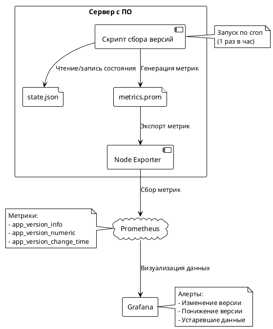
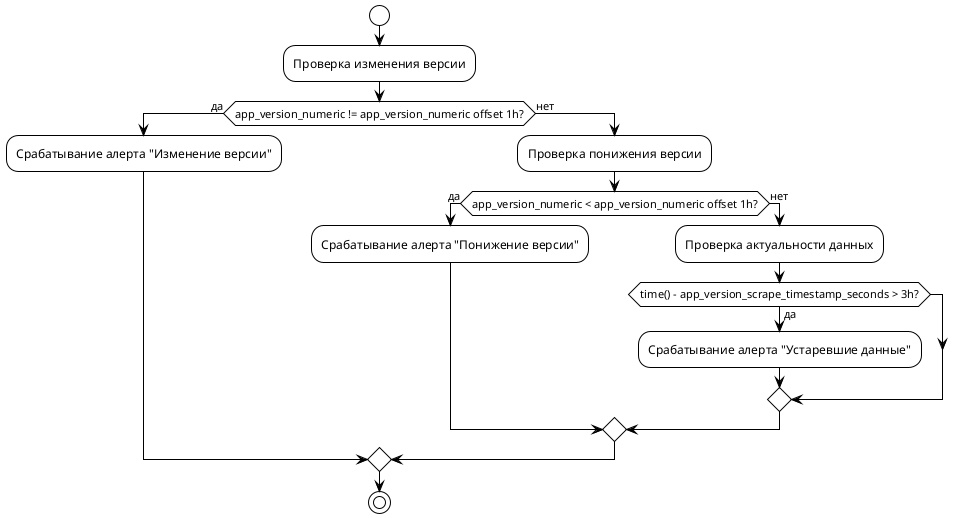
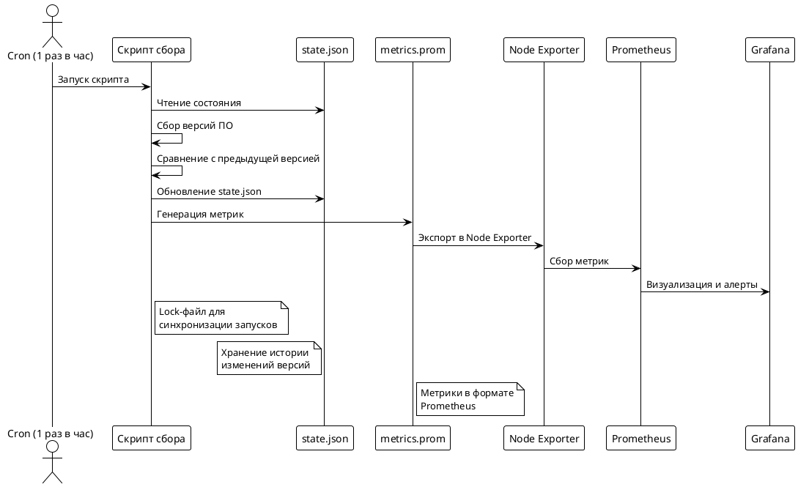

### Структурированное описание решения

---

#### **1. Общее описание**
Решение предназначено для мониторинга версий open-source ПО на серверах, отслеживания изменений версий и визуализации данных. Ключевые компоненты:
- **Скрипт сбора данных** (Bash) — запускается по расписанию через cron, обрабатывает версии ПО.
- **Prometheus** — хранит метрики и обеспечивает обнаружение изменений.
- **Grafana** — визуализирует данные и управляет алертами.
- **Node Exporter** — промежуточный слой для передачи метрик в Prometheus.

---

#### **2. Архитектура решения**


---

#### **3. Подробности скрипта сбора данных**
**Логика работы:**
1. **Блокировка** — предотвращение параллельных запусков через lock-файл.
2. **Чтение состояния** — загрузка `state.json` с историей версий.
3. **Сбор версий** — выполнение команд (e.g., `nginx -v`, `openssl version`).
4. **Сравнение версий** — обнаружение изменений через сравнение с `state.json`.
5. **Обновление состояния** — инкремент `changes_total`, обновление `change_time`.
6. **Генерация метрик** — запись в `metrics.prom` для Node Exporter.
7. **Сохранение состояния** — атомарная запись обновленного `state.json`.

**Структура `state.json`:**
```json
{
  "apps": {
    "nginx": {
      "current": "1.25.4",
      "previous": "1.24.0",
      "changes_total": 3,
      "change_time": 1728624005
    }
  }
}
```

---

#### **4. Структура метрик**
**Метрики Prometheus:**

| Тип метрики          | Имя                              | Метки                     | Значение                                                                 | Назначение                             |
|----------------------|----------------------------------|---------------------------|--------------------------------------------------------------------------|----------------------------------------|
| Информационная       | `app_version_info`              | `nodename`, `appname`, `version`, `prev_version` | `1` (всегда)                                                          | Отображение версии в Grafana          |
| Числовая (основная)  | `app_version_numeric`           | `nodename`, `appname`     | Число (e.g., `1.25.4` → `10025000400000`)                              | Сравнение версий, обнаружение изменений |
| Числовая (временная) | `app_version_change_time_seconds` | `nodename`, `appname`     | Время последнего изменения (Unix-время)                                  | Определение времени смены версии      |
| Служебная            | `app_version_scrape_timestamp_seconds` | `instance`, `appname` | Время последнего сканирования                                           | Алерт на устаревшие данные           |
| Служебная            | `app_version_collector_success` | `instance`                | `1` (успех) / `0` (ошибка)                                             | Мониторинг работы скрипта            |

**Кодирование версий:**
```bash
# Пример: 1.25.4 → 10025000400000
printf "%d%04d%04d%04d" 1 25 4 0
```

---

#### **5. Визуализация в Grafana**
**Дашборды:**
- **Текущие версии**: 
  ```promql
  app_version_info{appname="nginx"}
  ```
  Отображает метки `version` через `label_replace()`.

- **История изменений**:
  ```promql
  app_version_numeric{appname="nginx"}
  ```
  График показывает числовые значения версий. Предыдущая версия:
  ```promql
  last_over_time(app_version_numeric[1d] offset 1h)
  ```

- **Время последнего изменения**:
  ```promql
  time() - last_over_time(timestamp(app_version_numeric != app_version_numeric offset 1h)[1d:])
  ```

---

#### **6. Алерты**


**Правила алертов:**
- **Изменение версии**: `changes(app_version_numeric[2h]) > 0`
- **Понижение версии**: `delta(app_version_numeric[2h]) < 0`
- **Устаревшие данные**: `time() - app_version_scrape_timestamp_seconds > 3h`

---

#### **7. Преимущества решения**
- **Низкая кардинальность**: Метрика `app_version_info` гарантирует 1 активную серию на `{nodename, appname}`.
- **Точное сравнение версий**: Числовое представление (`app_version_numeric`) позволяет использовать математические операции.
- **Отслеживание истории**: Хранение `state.json` фиксирует все изменения версий.
- **Надежность**: Lock-файл предотвращает конфликты при параллельных запусках.
- **Гибкость**: Настройка интервала сканирования через cron (по умолчанию — 1 час).

---

#### **8. Диаграмма потока данных**


---

### Итог
Решение обеспечивает:
- **Прозрачность** — визуализация текущих и прошлых версий в Grafana.
- **Автоматизацию** — обнаружение изменений версий без ручного вмешательства.
- **Надежность** — отслеживание аномалий (понижение версии, устаревшие данные).
- **Масштабируемость** — подходит для любого числа серверов и ПО через Ansible-роль.
