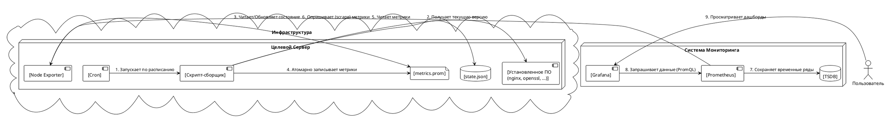
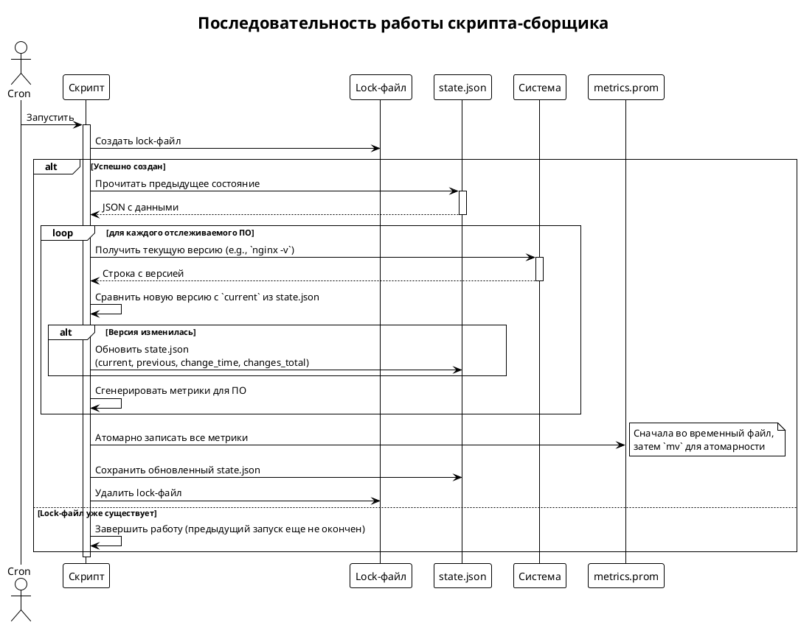

Отлично, это очень продуманное и полное решение. Ниже представлено структурированное описание и архитектурные диаграммы, которые помогут любому быстро понять его суть, принципы работы и преимущества.

---

## Мониторинг версий ПО на серверах с помощью Prometheus и Grafana

### 1. Введение

#### 1.1. Решаемая задача
Централизованное отслеживание версий программного обеспечения (ПО), установленного на множестве серверов. Решение позволяет в реальном времени видеть текущие версии, отслеживать историю их изменений (обновлений и откатов), а также оперативно получать уведомления о любых изменениях.

#### 1.2. Ключевые преимущества (Профит)
*   **Централизованный обзор:** Единый дашборд в Grafana для просмотра версий ПО со всех серверов.
*   **Аудит и история:** Хранение истории изменений версий, что полезно для анализа инцидентов и отслеживания развертываний.
*   **Проактивная безопасность:** Возможность быстро находить серверы с уязвимыми версиями ПО.
*   **Автоматизация:** Полностью автоматизированный сбор данных с минимальной нагрузкой на целевые системы.
*   **Гибкость и расширяемость:** Легко добавлять мониторинг нового ПО и настраивать сложные правила оповещений.
*   **Надежность:** Использование стандартных и проверенных инструментов (Prometheus, Grafana, Node Exporter).

### 2. Архитектура решения

#### 2.1. Компоненты
1.  **Целевой сервер:** Сервер, на котором установлено ПО, версии которого необходимо отслеживать.
2.  **Скрипт-сборщик (Collector Script):** `bash`-скрипт, запускаемый по `cron` на целевом сервере. Отвечает за сбор данных и формирование метрик.
3.  **Node Exporter:** Стандартный экспортер Prometheus, который с помощью модуля `textfile collector` читает сгенерированные скриптом метрики и отдает их по HTTP.
4.  **Prometheus:** Система мониторинга, которая периодически опрашивает (scrape) Node Exporter, собирает и хранит метрики.
5.  **Grafana:** Платформа для визуализации данных. Используется для построения дашбордов и настройки оповещений на основе данных из Prometheus.

#### 2.2. Диаграмма потока данных (Data Flow)

На диаграмме показано, как данные о версиях ПО проходят путь от целевого сервера до дашборда в Grafana.

#### 2.3. Диаграмма последовательности работы скрипта

Эта диаграмма детально описывает логику работы скрипта-сборщика при каждом запуске.

### 3. Детальное описание компонентов

#### 3.1. Модель данных в Prometheus (Метрики)

Для решения задачи используются несколько типов метрик, каждая из которых решает свою специфическую задачу.

| Имя метрики                            | Тип        | Описание                                                                                                                                                              | Метки (Labels)                 | Пример                                                                             |
| -------------------------------------- | ---------- | --------------------------------------------------------------------------------------------------------------------------------------------------------------------- | ------------------------------ | ---------------------------------------------------------------------------------- |
| `app_version_info`                     | Info-Gauge | **Информационная метрика.** Хранит версию в виде строки в метке `version`. Значение всегда `1`. Используется для наглядного отображения в Grafana.                         | `nodename`, `appname`, `version`, `prev_version` | `app_version_info{nodename="srv-1", appname="nginx", version="1.25.4", prev_version="1.20.4"} 1`           |
| `app_version_numeric`                  | Gauge      | **Числовая метрика.** Хранит версию, закодированную в число. Идеальна для математических операций, сравнений (>, <, !=) и построения графиков истории.                      | `nodename`, `appname`          | `app_version_numeric{nodename="srv-1", appname="nginx"} 10025000400000`            |
| `app_version_change_time_seconds`      | Gauge      | **Временная метрика.** Unix timestamp последнего обнаруженного изменения версии. Полезна для вычисления времени, прошедшего с последнего обновления.                          | `nodename`, `appname`          | `app_version_change_time_seconds{nodename="srv-1", appname="nginx"} 1728624005`      |
| `app_version_scrape_timestamp_seconds` | Gauge      | **Мета-метрика.** Unix timestamp последнего успешного запуска скрипта. Помогает отслеживать, не устарели ли данные.                                                       | `nodename`, `appname`          | `app_version_scrape_timestamp_seconds{nodename="srv-1", appname="nginx"} 1728627605` |
| `app_version_collector_success`        | Gauge      | **Метрика здоровья.** `1` если скрипт отработал успешно, `0` в случае ошибки.                                                                                               | `nodename`                     | `app_version_collector_success{nodename="srv-1"} 1`                                  |
| `app_version_collector_duration_seconds`| Gauge      | **Метрика производительности.** Длительность выполнения скрипта в секундах. Помогает отслеживать деградацию производительности.                                            | `nodename`                     | `app_version_collector_duration_seconds{nodename="srv-1"} 0.12`                      |

**Примечание о кодировании версии:**
Используется улучшенная функция кодирования, которая поддерживает до 4-х компонентов версии (Major.Minor.Patch.Build) и корректно обрабатывает pre-release суффиксы, что делает ее более универсальной.

#### 3.2. Скрипт-сборщик
*   **Логика:** Реализует последовательность, описанную в диаграмме выше.
*   **Состояние:** Использует локальный файл `state.json` для хранения информации между запусками, что позволяет ему обнаруживать изменения.
*   **Атомарность:** Запись метрик в `.prom` файл происходит атомарно через перемещение (`mv`) временного файла. Это гарантирует, что Node Exporter никогда не прочитает частично записанный файл.
*   **Блокировка:** Механизм `lock`-файла предотвращает параллельный запуск скрипта, если предыдущее выполнение еще не завершилось.
*   **Развертывание:** Распространяется на целевые серверы с помощью Ansible, что обеспечивает консистентность конфигурации и простоту управления.

#### 3.3. Визуализация и оповещения в Grafana

##### Дашборд
*   **Текущие версии:** Таблица, отображающая текущие версии ПО на всех хостах. Используется метрика `app_version_info`. Запрос: `last_over_time(app_version_info[5m])`.
*   **История изменений:** График (тип "State timeline" или "Status history"), который показывает изменение числового представления версии со временем. Используется метрика `app_version_numeric`.
*   **Время с последнего обновления:** Статистика, показывающая, как давно обновлялось ПО. Запрос: `time() - last_over_time(app_version_change_time_seconds[5m])`.

##### Правила оповещений (Alerts)

1.  **Обнаружено любое изменение версии ПО:**
    *   **Выражение:** `delta(app_version_numeric[2h]) != 0`
    *   **Описание:** Срабатывает при любом повышении или понижении версии.

2.  **Обнаружено понижение версии (Downgrade):**
    *   **Выражение:** `delta(app_version_numeric[2h]) < 0` или `app_version_numeric < app_version_numeric offset 1h`
    *   **Описание:** Срабатывает, когда новая версия меньше предыдущей. Это может быть признаком ошибки развертывания или злонамеренных действий.

3.  **Данные о версиях устарели:**
    *   **Выражение:** `time() - app_version_scrape_timestamp_seconds > 3 * 3600`
    *   **Описание:** Срабатывает, если скрипт-сборщик не отработал успешно в течение 3-х часов (настраиваемый порог). Это сигнализирует о проблеме на целевом сервере (cron сломался, скрипт завершается с ошибкой и т.д.).
