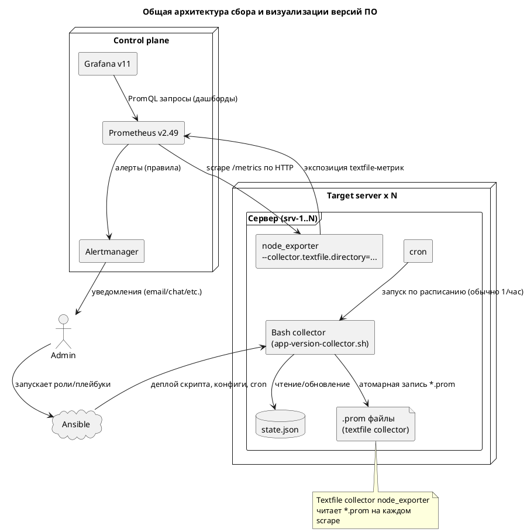
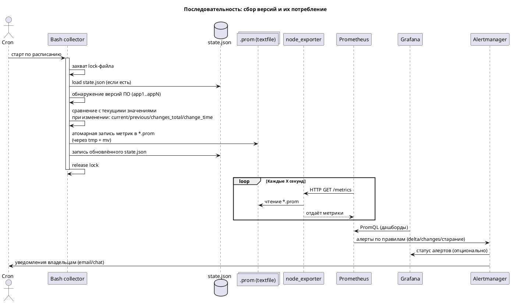
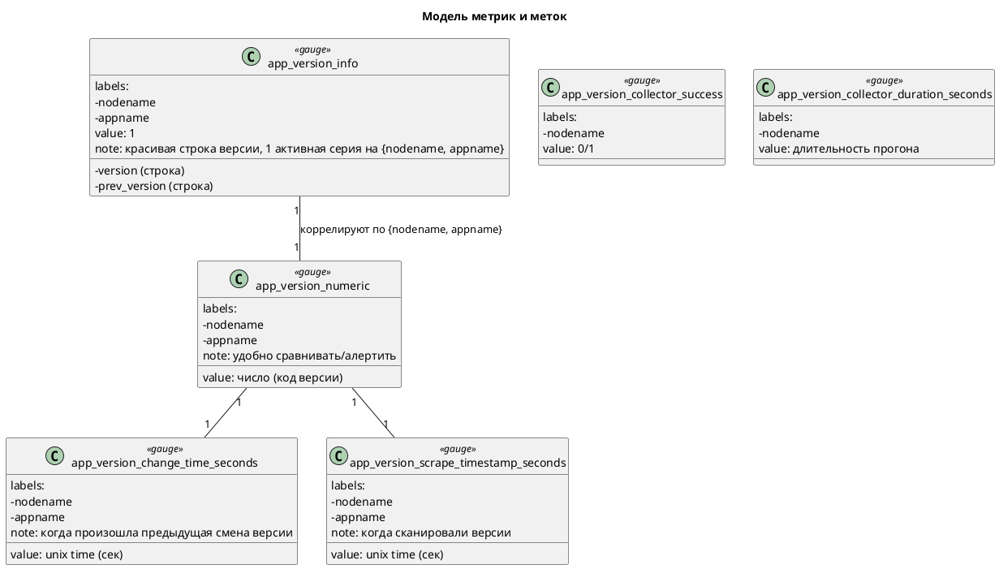

Ниже — компактное, но полное описание решения и три архитектурные диаграммы на PlantUML, чтобы любой быстро понял, как это работает, где что находится и какой от этого профит.

Обзор
- Задача: отслеживать версии установленного OSS ПО на серверах, фиксировать моменты смены версий и визуализировать историю/события.
- Хранилище: Prometheus v2.49 (pull-модель, хранит метрики).
- Визуализация: Grafana v11 (дашборды, графики, алерты).
- Сборщик: bash-скрипт по cron на целевых серверах, пишет метрики в .prom (textfile collector node_exporter) и ведет state.json.
- Ключевые идеи:
  - Две метрики на версию: info (красиво показать строку версии) + numeric (удобно сравнивать/алертить).
  - Третья метрика — момент смены версии.
  - Мало активной кардинальности: в каждый момент для {nodename, appname} активна 1 серия info.
  - Атомарные записи .prom и state.json, lock-файл, метрики здоровья сборщика.

Что даёт решение (профит)
- Прозрачное соответствие версий ПО на всех серверах.
- История и время смен версий (аудит/комплаенс).
- Простые и надежные алерты на изменение/понижение версий.
- Низкая активная кардинальность, дешево по ресурсам.
- Легкое масштабирование и автодеплой через Ansible.

Компоненты и роли
- Target server (N штук): cron → bash-collector → state.json → .prom → node_exporter(textfile).
- Prometheus: скрейпит node_exporter, хранит временные ряды, оценивает правила.
- Grafana: строит таблицы и графики, показывает текущую/предыдущую версию и историю.
- Alertmanager (опционально): доставка алертов.
- Ansible: доставляет скрипт и конфигурацию на сервера.

Диаграмма 1. Общая архитектура (PlantUML)


Диаграмма 2. Последовательность выполнения (PlantUML)


Диаграмма 3. Модель метрик (PlantUML)


Спецификация метрик
- Информационная:
  - app_version_info{nodename, appname, version} 1
  - Пример: app_version_info{nodename="srv-1", appname="nginx", version="1.22.1", prev_version="1.20.1"} 1
  - Назначение: вывод «красивой» версии (строка), низкая активная кардинальность.

- Числовая (сравнение/история):
  - app_version_numeric{nodename, appname} <код_версии>
  - Кодирование версии в число:
    - Удаляем суффиксы (-, +, ~ и т.п.), нормализуем до 4 компонент: v1.v2.v3.v4
    - Формула: v1*10^12 + v2*10^8 + v3*10^4 + v4
    - Эквивалентный printf: printf "%d%04d%04d%04d" v1 v2 v3 v4
    - Примеры (13 знаков):
      - 1.22.1 -> 1002200010000
      - 2.4.54.3 -> 2000400540003
      - 1.25 -> 1002500000000
  - Пример строки: app_version_numeric{nodename="srv-1", appname="nginx"} 1002500000000

- Числовая (время последней смены):
  - app_version_change_time_seconds{nodename, appname} <unix_time>
  - Пример: app_version_change_time_seconds{nodename="srv-1", appname="nginx"} 1728624005

- Метрики сборщика:
  - app_version_scrape_timestamp_seconds{nodename, appname} <unix_time>
  - app_version_collector_success{nodename} 0/1
  - app_version_collector_duration_seconds{nodename} <сек>

Поток данных и алгоритм скрипта
1) Читает state.json (если нет — инициализирует).
2) Определяет текущие версии ПО (команды pkg mgr, бинарники — зависит от приложения).
3) Для каждого appname:
   - Если версия изменилась: previous := current; current := новая; changes_total++; change_time := now().
   - Кодирует версию в число для app_version_numeric.
4) Генерирует .prom (временный файл + mv для атомарности).
5) Обновляет state.json (временный файл + mv).
6) Пишет метрики здоровья (success, duration, scrape_timestamp_seconds).
7) Защита от гонок: lock-файл (flock).

Grafana — запросы и панели
- Текущие версии (таблица):
  - Запрос: app_version_info == 1
  - В таблице используйте labels nodename, appname, version, prev_version.

- История изменения версий (график):
  - Запрос: app_version_numeric
  - Отображение: Stairs/Step.

- Предыдущая версия (число):
  - Пример: last_over_time(app_version_numeric[2h] offset 1h)
  - Либо показывать просто time-series обе кривые: текущую и смещенную на offset 1h.

- Время последней смены (в секундах/датой):
  - Из метрики: app_version_change_time_seconds
  - «Сколько времени прошло с последней смены»: time() - app_version_change_time_seconds

Примеры алертов (Prometheus rule files)
- Любое изменение версии:
```yaml
groups:
- name: app-version
  rules:
  - alert: AppVersionChanged
    expr: delta(app_version_numeric[2h]) != 0
    for: 0m
    labels:
      severity: info
    annotations:
      summary: "Версия {{ $labels.appname }} изменилась на {{ $labels.nodename }}"
      description: "Версия изменилась за последние 2 часа."
```
- Понижение версии:
```yaml
  - alert: AppVersionDowngrade
    expr: delta(app_version_numeric[2h]) < 0
    for: 0m
    labels:
      severity: warning
    annotations:
      summary: "Понижение версии {{ $labels.appname }} на {{ $labels.nodename }}"
```
- Сборщик «завис»/данные устарели:
```yaml
  - alert: AppVersionCollectorStale
    expr: time() - app_version_scrape_timestamp_seconds > 3*60*60
    for: 10m
    labels:
      severity: warning
    annotations:
      summary: "Сборщик версий устарел на {{ $labels.nodename }}"
      description: "Нет свежих данных > 3ч по {{ $labels.appname }}."
```

Развёртывание и конфигурация
- node_exporter:
  - Убедиться, что включен textfile collector.
  - Директория, например: /var/src/node_exporter/textfile_collector
- Скрипт:
  - Права на запись в textfile_collector dir и рядом лежащий state.json (например, /home/sys_app_finder/state.json).
  - Cron по умолчанию каждый час (настраивается).
  - Атомарная запись: mktemp; write; mv.
  - Lock: flock /home/sys_app_finder/app-version-collector.lock
- Prometheus:
  - Обычный джоб для node_exporter; instance добавляется самим Prometheus (не дублируйте instance в метриках).
- Ansible:
  - Роль: раскладка скрипта, юнита/cron, директории, переменных (список приложений, команды/шаблоны детекции версий).

Рекомендации и тонкости
- Кардинальность:
  - Активная кардинальность низкая: 1 серия info на {nodename, appname}. Исторические версии будут «стареть» и удаляться по retention.
- Окна для offset и range:
  - Делайте окно range в PromQL больше периода запуска cron, чтобы не пропустить изменения.
- Кодирование версии:
  - Нормализуйте «шумные» версии (nginx/1.25, v1.2.3, 1.2.3-1ubuntu1~20.04) перед разбором:
    - убрать префиксы до первой цифры,
    - отсечь суффиксы по [-+~],
    - дополнять до 4 компонент нулями,
    - ограничить каждую компоненту 0..9999.
- Типы метрик:
  - Все указанные — gauge (значение может как увеличиваться, так и уменьшаться).
- Надёжность:
  - Используйте временные файлы + mv и lock-файл.
  - На ошибках ставьте app_version_collector_success=0 и не перезаписывайте прошлые хорошие .prom.
- Масштабирование:
  - O(N*M) серий (N — узлы, M — приложения). При M до десятков и N до тысяч — безопасно.

Пример улучшенной функции кодирования (bash)
```bash
encode_version() {
  local version="$1"
  # Оставляем только первый «семвероподобный» фрагмент: числа и точки
  version=$(echo "$version" | sed -E 's/^[^0-9]*//' | sed 's/[-+~].*$//')
  # Разбор до 4 компонент
  local IFS='.'; read -ra parts <<< "$version"
  while [ ${#parts[@]} -lt 4 ]; do parts+=("0"); done
  # Ограничение компоненты и защита от пустых
  for i in {0..3}; do
    parts[$i]=$(echo "${parts[$i]}" | sed -E 's/[^0-9].*$//' )
    [ -z "${parts[$i]}" ] && parts[$i]=0
    if [ ${parts[$i]} -gt 9999 ]; then parts[$i]=9999; fi
  done
  printf "%d%04d%04d%04d\n" "${parts[0]}" "${parts[1]}" "${parts[2]}" "${parts[3]}"
}
```

Примеры использования метрик
- Показать текущие версии как таблицу:
  - app_version_info == 1
- Показать время с момента последней смены:
  - time() - app_version_change_time_seconds
- Отобразить «предыдущую» как смещенную в прошлое:
  - last_over_time(app_version_numeric[2h] offset 1h)

